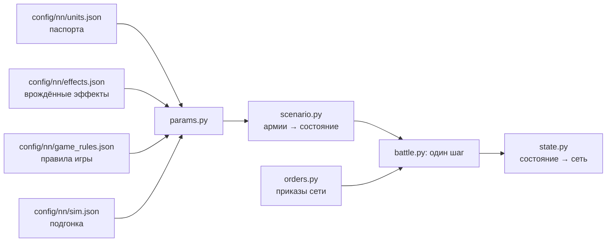

# Симулятор боя

[← Назад](README.md) · [Документация](../README.md) › [Данные для обучения](README.md) › Симулятор боя · [English](../../en/training/simulator.md)

Шаг 3 пути ([модель сети](network.md)): симулятор боя игры, в котором учится сеть.
Он играет тысячи боёв сразу на видеокарте. Каждый отряд — один объект (бойцы, здоровье,
место, направление, мораль, усталость, снаряды), а не каждый солдат. Числа взяты из
[паспортов отрядов](units.md) и [правил игры](../game/database.md); где игра ведёт себя
иначе, они подогнаны под [замеры](measurements.md). Он охватывает отряды пулов обучения на
ровной пустой карте.

## Как запустить

```bash
bash tools/nn/dock.sh tools.nn.sim.check                     # все сверки с игрой (процессор и видеокарта)
bash tools/nn/dock.sh tools.nn.sim.check --device cuda --only battles
.venv/Scripts/python -m pytest -q tests/tools/test_sim_layout.py   # без torch
```

- Код — `tools/nn/sim/` (PyTorch). Нужен torch: он есть в контейнере `snake-ai-trainer`, а в
  `.venv` проекта его нет, поэтому `tests/tools/test_sim.py` там пропускается. В образе нет
  pytest: чтобы запустить тесты в нём, положите копию pytest (из `.venv`) в `PYTHONPATH` и
  выполните `python -m pytest -q tests/tools/test_sim.py`.
- Сверка пишет `build/nn-sim/check.json` (не в Git).

```python
from tools.nn.sim import battle, replay, scenario

st = scenario.build([scenario.from_arena("whole_emp_v_skv", "attack")] * 1024, device="cuda")
battle.run(st, replay.nearest_attack)        # policy(состояние) -> приказы, пока все бои не кончатся
st.winner, st.t, st.observation()            # [B], [B], словарь [B, N]
```

## Что хранит симулятор



**Состояние** (`tools/nn/sim/state.py`, единственный источник правды): тензоры `[B, N]` —
B боёв, N мест под отряды обеих сторон (сторона 1 в первой половине, сторона 2 во второй,
лорд стороны первым; `side` = 0 — пустое место). Три группы:

- *наблюдаемые* — те же поля и имена, что в записи `nn_sample`
  ([что в записи](README.md#что-в-записи)): `x`, `z`, `b`, `men`, `hp`, `mp`, `ms`, `r`, `s`,
  `w`, `m`, `mv`, `f`, `a`, `fire`, `target` (это `t` записи), `fat` (состояние усталости
  0–5), `k`, `ox`, `oz`, `lf`, `rf`, `bf`, `vis`; время боя — `t` `[B]`. Поэтому записанные
  бои и симулятор кормят сеть одинаково;
- *постоянные* — паспорт: бойцы, здоровье, скорости, атака, защита, оружие, броня, щит,
  лидерство, снаряды, дальность, перезарядка, цена; врождённые эффекты отряда (`fx` — битовая маска
  по порядку `config/nn/effects.json`; `fxt0`, `fxt1` — его эффекты с временем) и их флаги правил;
- *внутренние* — то, что нужно только симулятору: очки морали и усталости, таймеры (способностей и
  эффектов с временем), `fx_on` (врождённые эффекты, действующие на конец шага).

**Приказы** (`tools/nn/sim/orders.py`): на каждый отряд и шаг решения `kind` — держать (0),
идти (1), атаковать (2), отойти (3), продолжать (4: нового приказа нет, действующий идёт
дальше; отряд без приказа стоит); точка `x`, `z` для «идти» и «отойти» (центр отряда); `target` —
место врага для атаки; `run` — бегом или шагом; `ability` — слот способности отряда, которую
применить сейчас (−1 — нет; необязательно: у приказов без него −1; не зависит от `kind`). Всё
`[B, N]`. Отряд выходит из рукопашной по приказу «отойти» или «идти» к точке в 10 м и дальше
(`contact.leave_m`, любой отряд): он никого не бьёт и не удерживается на месте, а враги в контакте
продолжают его бить. Стрелка сначала держат: он стоит на месте, в контакте и под ударами,
`contact.pin_s` 5 с, потом выходит (в игре наши пойманные стрелки под приказом уйти выходят через
6–7 с, через 3 с всё ещё в рукопашной 0,85; симулятор выводил их за ~2 с; отряды ближнего боя и так
держатся столько же, сколько в игре: враги идут за ними). Как в игре: отряд ближнего боя, уходящий из схватки, наносит ~6 % своего
темпа атаки и получает ~1,7× урона ([замеры](measurements.md#выход-из-рукопашной)); раньше
симулятор давал такому отряду драться в полную силу, и сеть научилась этим пользоваться. Отряд без
стрелкового оружия, стоящий в рукопашной под приказом «стоять» (без приказа атаки), бьёт с долей
`contact.hold_rate` 0,5 своего темпа — каждого врага, которого касается: в игре у такого отряда дерутся
только бойцы в контакте (отряды сети, сверка по ключам своего и вражеского отряда: 0,80 убийств того же
отряда в атаке; с учётом того, что в боях ворот такой отряд касается 2,3 вражеских, — подгонка по
убийствам). Раньше «стоять» в рукопашной било в полную силу, и сеть стояла в 76 % своих секунд
рукопашной. Приказ способности применяет готовую способность на
себя один раз (не пассивную, не действующую, перезаряженную); иначе ничего не происходит. Таймеры
способностей сеть читает из `State.observation()` (`ab{k}_on`, `ab{k}_cd` [B, N], с), а действующие
врождённые эффекты — оттуда же (`fx_on`).

## Один шаг (0,5 с)

1. Принять приказы (бегущие отряды их не слушают).
2. Контакты: прямоугольники отрядов (фронт × глубина рядов, которые заполняют бойцы) касаются.
3. Врождённые эффекты (свойства, пассивные, включаемые игрой с временем) и применённые
   способности: их статы и флаги правил держатся на этот шаг.
4. Удары в рукопашной и выстрелы.
5. Здоровье, бойцы, убитые.
6. Мораль: колебание, бегство, сбор, разгром.
7. Усталость.
8. Движение: к точке приказа или к цели, бегущие — прочь; край карты.
9. Кончен ли бой: сторона без стоящих отрядов проигрывает; через 60 минут побеждает защитник.

## Механика и откуда числа

«БД» — правила игры или паспорт; «замер» — [замеры](measurements.md) и записи; «подгонка» —
число, подобранное так, чтобы симулятор повторял игру (все они в `config/nn/sim.json` с
причиной).

| Механика | Как | Откуда |
|---|---|---|
| Скорость | шаг, бег, разгон, торможение из паспорта; бегущие с поля — 0,86 от бега (до врождённых эффектов: бегство скавенов ×1,1 от «Удирай!») | БД; скорость бегства — замер (Империя 0,865; скавены 0,945 ниже половины здоровья, 0,866 выше: [врождённые эффекты](#врождённые-эффекты)) |
| Строй | фронт заданной ширины, ряды через 1,5 м; лорд — круг своего радиуса | замер: 120 копейщиков, 30 м, 6 рядов |
| Контакт | края ближе 1 м (у уже дерущихся — ещё на 2 м); отряд выходит из рукопашной по «отойти» или по «идти» к точке в 10 м и дальше (никого не бьёт, враги в контакте бьют его) | замер: расстояние центров в первом контакте; выход — бои сети ([замеры](measurements.md#выход-из-рукопашной)) |
| Разворот | идущий отряд смотрит, куда идёт, но шаг меньше 10 м к своей точке делает не разворачиваясь; строй в рукопашной поворачивается не быстрее 2° в секунду (лорд — сразу); вне рукопашной стоящий отряд разворачивается на месте не быстрее `turn.formation_deg_s` 80°/с (лорд, одиночная сущность — `turn.single_deg_s` 40°/с) | замер: пехота в рукопашной поворачивается на 1°/с (медиана; среднее 2,3), свободный отряд, ударенный во фланг, — на 8° за 5 с (медиана); стоящие стрелки вне рукопашной, у которых цель движка появилась в 60° и больше от их направления, смотрят на неё (в пределах 20°) через 1 с (медиана; в среднем 1,6 с при 60–120°, 1,7 с при 120–180°; ≥ 64°/с при посекундных замерах), развороты стоящих лордов — 40°/с (медиана 440) |
| Точка приказа | игра пишет центр фронта; симулятор ведёт к центру отряда, на полглубины позади | замер (копейщики 3,3–4,8 м, рабы 6,5–6,9 м) |
| Сколько бьют | 0,75 рядов фронта в контакте; на каждую сторону строя (фронт, левый и правый фланг, тыл) отряд выставляет не больше, чем она вмещает; лорда бьют всего не больше 9 бойцов, сколько бы ни было отрядов, их темпы складываются; когда на нём и вражеский лорд, пехота с долей 0,35; отряд, атакующий другого врага, бьёт лорда, которого касается, с долей 0,4; отряд ближнего боя под приказом «стоять» — с долей 0,5 | подгонка; «стоять» — подгонка по убийствам отрядов сети в боях ворот (выше, «Приказы»); по сторонам — замер: уже дерущийся отряд бьёт новичка на своём фланге в 2,2 раза сильнее правила за первые 15 с (симулятор с одним общим фронтом давал 1,2); 9 и сумма — замер ([лорд в окружении](../game/units/lord-swarm.md)); 0,35, 0,4 — целые бои (ниже, «Лорда бьют несколько отрядов») |
| Шанс попасть | 35 + 0,1 × (атака − защита), в пределах 8–90 %; защита ×0,6 с фланга, ×0,3 с тыла; потерянная защита идёт с весом 2,0 от правила с фланга и 0,25 с тыла (против лорда — нет, замер) | числа БД; веса — подгонка (см. ниже и [фланги](#фланг-тыл-и-натиск-в-целых-боях)) |
| Урон удара | бронебойный + обычный × (1 − 0,75 × броня/100), не больше здоровья бойца | БД (броня держит случайные 50–100 %) |
| Время между ударами | `attack_interval_s` паспорта | БД |
| Удар лорда | задевает до `splash` (4) бойцов | БД; сходится с замеренными 0,36 убитых в секунду |
| Натиск | бонус натиска к атаке и урону, спадает за 13 с; отряд, встретивший врага на бегу, бьёт ×(1 + 1,5 × доля его скорости) эти 13 с; не бежавший вводит бойцов в бой за 20 с. Упор: отряд с `charge_reflection` (копейщики, клановые крысы), стоящий на месте (медленнее 0,5 м/с), встречает натиск пехоты в пределах `bracing_attack_angle` (80°) от фронта как натиск той же скорости | БД (13 с, 80°, свойство); 1,5 — подгонка по первым 15 с целых боёв и пар, 20 с — по парам; упор — замер (целые бои: стоящий отряд под натиском в лоб теряет 0,8 от потерь атакующего) |
| Потери бойцов | не убивший удар ранит: доля бойцов = max(1 − g × (1 − доля здоровья), доля здоровья), g = (ударов до смерти)^−0,5 | подгонка: бойцы против здоровья в парах |
| Стрельба | только стоя; первый выстрел через 3,3 с (стрелы) / 4,3 с (праща) после остановки; новый приказ (другой вид или другая цель атаки) заставляет целиться заново (`missile.aim_reset_on_order`); стоя отряд стреляет только по целям в пределах `missile.stand_fire_arc_deg` 45° от своего направления: к цели дальше он сначала разворачивается (Разворот) и целится, только когда она в этих пределах; без приказанной цели берёт ближнюю в пределах, иначе разворачивается к ближней вне их; бойцы перезаряжаются всё время (и на ходу), а отряд стреляет, когда заряжены все (`missile.volley_load` 1): залпы всего отряда раз в 11,0 / 11,5 с (когда отряд стреляет, перезаряжаться начинают все заряженные, и те, чья линия закрыта; флаг `fire` между залпами горит); дальность от края строя | замер (стрельбище; в боях остановка даёт 0,55–0,76 снаряда на бойца за 12 с, прежний «залп, потом ручеёк» — 1,5–1,7, залпы — 1,0; стреляющий отряд, получивший новый приказ, следующие 10 с стреляет в 0,6–0,75 раза меньше; пределы: 99 % залпов стоящих стрелков в игре — в пределах 45° от направления на цель, 95 % — в пределах 31°; новая цель в 60–180° — первый залп через 3 с против 2 с при 0–40°) |
| Попадания | 0,42 стрелы, 0,47 праща на краю дальности; ×1,29 на 70 м, ×1,12 на 90 м | замер; множитель по дальности — с полигона |
| Щит, стойкость | щит держит свою долю в пределах 60° от фронта; стойкость к стрелам из паспорта | БД |
| Лорд как цель | 0,43 от правила отряда | замер: ~33 тыс. выстрелов по лордам, пока лорд весь полёт вне рукопашной (генерал от стрел ~0,5, от пращи ~0,37, военачальник от стрел ~0,32) |
| Огонь по своим | из попаданий, пущенных в отряд в рукопашной, 0,26 (стрелы) / 0,56 (праща) достаются своим отрядам стрелка в контакте с ним, по числу их бойцов (лорду среди них ×0,43, как одиночной цели) | замер: HP, которые эти отряды теряют сверх правила рукопашной, пока их сторона стреляет (1,5 тыс. + 1,3 тыс. секунд) |
| Разлёт | из попаданий, пущенных в отряд, каждый отряд его стороны вне рукопашной получает 0,115 ближе 30 м, 0,034 на 30–60 м, 0,015 на 60–90 м | замер: HP отрядов, в которые никто не стреляет, рядом с обстреливаемым (15,6 тыс. секунд) |
| Разлёт в рукопашной | из попаданий, пущенных в отряд в рукопашной, каждый отряд его стороны, тоже в рукопашной, получает 0,19 ближе 15 м, 0,047 на 15–30 м, 0,035 на 30–60 м (между центрами) | замер (`build/nn-sim/flank/spill_melee.py`): HP отрядов в рукопашной, в которые не стреляют и чья сторона не стреляет в их противников, регрессия на правило рукопашной и на попадания, пущенные в их соседей в рукопашной (74 тыс. секунд, 15 тыс. с обстреливаемым соседом; 28 боёв с ИИ игры 0,23 / 0,09, запуски сети 0,19 / 0,05) |
| Цель «по своему выбору» | цель приказа, если в дальности, иначе ближайший стоящий враг | как в игре ([урон стрелами](../game/units/missile-damage.md)) |
| Линия огня (настильный огонь) | только для настильного (прямого) огня, `missile.direct` паспорта (траектория `low`: пистоли Free Company Militia); люди стрелка целят в центр цели, свой отряд между ними (ближе края цели) перекрывает линии, проходящие через его ширину поперёк линии, расширенную на 1,2 радиуса человека (свои считаются в 2,2 раза шире); перекрытые люди не стреляют; при 75 % перекрытых отряд берёт следующую цель в дальности или не стреляет. Стрелы и пращи бьют навесом через своих; враги на линии не мешают; стрельбы через своих с возвышенности нет (карта ровная) | БД (`projectile_friendly_fire_man_radius_coefficient` 2,2, `unit_firing_line_of_sight_considered_obstructed_ratio` 0,75, траектория); база знаний ([стрельба](../game/mechanics/missiles.md)); геометрия наша, не замерена |
| Стрельба на ходу | отряд с `mounted_fire_move` (ополчение) целится и стреляет на ходу — по целям в пределах `missile.move_fire_arc_deg` 90° от направления движения | атрибут БД; сектор — замер (наше ополчение на ходу: 0,52 полного темпа к врагу, 0,31 вбок, 0,16 от врага) |
| Пистоли (оценка) | попадание 0,5 на краю дальности (×1,12–1,29 на 60–90 м), перезарядка 10,8 с, первый выстрел 3,8 с | оценка по зоне калибровки снаряда (2,0 м на 65 м против 3,7 м на 95 м у стрелы), не замер: `sim.json` missile.musket_why |
| Мораль | очки: лидерство + эффекты; MoralePercent = очки / лидерство; сдвиг — 1 очко или 15 % разрыва за 0,5 с | БД; шаг — замер (+2 очка в секунду во всех записях) |
| Эффекты морали | лорд +4 ближе 70 м, угасая до 0 к 105 м; лорд погиб или сломлен: только его аура (`lord_fall` 0 / 0); сосед ближе 120 м +5; потери −2…−74; недавние потери −6…−80 (за 30 с, от всего здоровья); выигрывает / проигрывает рукопашную +3/+6/+8, −3/−8 (отношение урона 1,5 / 2,5 / 4); первый удар во фланг −6, в тыл −14 на один тик 0,5 с; армия разбита целиком (сила врага ≥ 2,6× своей, своя ≤ 0,22 начальной) −120; открытые фланги (враг угрожает слева, справа или сзади: `lf`, `rf`, `bf`) −3, два и больше −6; бегущие свои −3 каждый; бегущие враги +2,5 каждый; под обстрелом −5; очень устал −2, измотан −6; более сильный враг ближе 70 м −3 | очки БД; окно и отношения — подгонка; удар во фланг и тыл — замер ([фланги](#фланг-тыл-и-натиск-в-целых-боях)); падение лорда замерено по 75 записанным падениям ([лорды](#лорды)) |
| Состояния | колебание ниже 16 очков, бегство при 0, разгром на третьем бегстве или ниже −50 очков при разгроме армии; 10 с после сбора без обычного бегства | БД; разгром ниже −50 при потерях армии — измерение |
| Сбор | если нет разгрома армии и ни одного стоящего врага ближе 90 м, бегущий получает 2 очка в секунду; собирается при MoralePercent 0,23 | замер: 0,23 и 90 м (365 сборов); 2 очка — подгонка (медиана сбора 44 с) |
| Усталость | Калибровка включена (`fatigue.calibration.on=true`): 10 тиков/с, пороги БД; рукопашная утомляет только по приказу атаки (одиночка +19 за тик, отряд 13,7), движение по флагу бега приказа (бег +4, шаг −1), бегство +4, стрельба 7,5, отдых −18 без стоящего врага ближе 80 м, иначе готовность −7 | Подгонка по занятиям отрядов в 204 записях; доли измотанных как в игре ([ниже](#калибровка-усталости)) |
| Умения лордов | сторона, за которую играет ИИ игры (`ai`, по умолчанию сторона 2), применяет активные умения своего лорда по правилу; сторона сети — по приказу (`Orders.ability`; у стороны сети `ai` должен быть false); пассивные — врождённые эффекты (ниже). Все числа — паспорт способности (`config/nn/abilities.json`, база; `sim.json` abilities — какие моделируются и когда их применяет ИИ); эффекты на владельца (цель фазы — сам), на своих в радиусе и на врагов в радиусе: скорость, скорость натиска, атака и защита, урон, бронебойный урон, бонус натиска, мораль. Вождь: «Смертельный натиск» (31 с, снова готов через 90 с после: урон и бронебойный урон ×1,25, бонус натиска ×1,6) в рукопашной; «Крысиная доблесть» (17 с / 60 с: скорость ×1,25, +8 очков морали; её взрыв 25 м без урона) при враге ближе 60 м; «Сплотиться» (14 с / 60 с: +16 своим в 35 м), когда там кто-то дрогнул. Генерал: «Стоять насмерть» (18 с / 90 с: защита +24, +16 в 35 м) в рукопашной; «Искатель врага» (25 с / 60 с: скорость ×1,25) при враге ближе 60 м | база (`config/nn/sim.json` abilities; чем владеют — по снимку ростера игры); когда ИИ их применяет — предположение |
| Врождённые эффекты | каждое свойство и пассивная или включаемая игрой способность отряда (`config/nn/effects.json`), один механизм: действует, пока выполнены условия; его статы на владельце (у ауры ещё на своих в радиусе), его правила на шаг. Несокрушимые (флагелланты: мораль не ниже лидерства, не колеблются и не бегут), Расходные (их бегство никого не пугает), Воодушевление (аура лорда), Отражение натиска (упор), Стрельба на ходу; «Сила в числе» (пехота скавенов: +6 лидерства, +8 к защите, скорость ×0,9, пока здоровья ≥ 50 %), «Удирай!» (скорость ×1,1 при колебании и бегстве), «Держать строй!» (+5 к защите, +4 лидерства в 35 м от стоящего Генерала), Frenzy (+10 к атаке, ×1,1 урон, бронебойность и натиск, пока мораль ≥ половины лидерства), Strength of the Penitent (игра включает, когда отряд проигрывает рукопашную: 20 с +14 к защите, +15 % физической стойкости, кончается вне рукопашной, снова готово через 3 с). Только схема (сеть их видит): защита от натиска больших, авангард, укрытие в лесу, Immune to Psychology; отключён `sim.json` effects.off: Single Entity (лорды: скорость ×0,9, урон ×0,8 ниже 25 % здоровья; в записях такого падения скорости нет) | БД: паспорта, `special_ability_to_auto_deactivate_flags`, `special_ability_to_recharge_contexts`; правила свойств — база знаний; замер: скорость бегства и бега, падение морали на 50 % здоровья ([ниже](#врождённые-эффекты)) |
| Карта | квадрат ±1020 м; бегущий отряд, пересёкший край, уходит из боя | замер |
| Видимость | видно всё (`vis` оставлен на будущее) | ровная пустая карта |

**Почему шанс попасть почти плоский.** По правилу БД четырём парам нужно от 13 до 43 бойцов,
бьющих разом, а лорду ~38 ([замеры](measurements.md)). С плоскими ~35 % те же потери дают
12–17 бойцов на фронте 30 м во всех парах и ~8 вокруг лорда: одно число подходит всем. Поэтому
атака − защита идёт с весом 0,1 от правила. Фланг и тыл, которые пары не проверяют, подогнаны
по целым боям (ниже).

## Калибровка усталости

Усталость считается по калибровке `fatigue.calibration` (включена, `on=true`): доли измотанных отрядов как в игре. Прежняя модель (5 тиков/с, очки БД, рукопашная +19 у каждого отряда в рукопашной, готовность −7 как отдых, мёртвые и ушедшие слоты тоже считаются) осталась только для `on=false`. Пороги и эффекты БД — в обеих. Геометрия угроз включена (`threat.calibration.on=true`).

Правило (10 тиков/с, каждый отряд в одном занятии):
- рукопашная стоит очков только при приказе атаки: одиночный персонаж (`men0` ≤ 1) +19 за тик, отряд 13,7; в рукопашной без приказа атаки — шаг, если движется, иначе отдых −18;
- натиск +34 только с приказом атаки;
- движение стоит по флагу бега приказа, какой бы ни была скорость: бег +4, шаг −1 (БД); бегущий с поля +4;
- стрельба 7,5; стоящий без незавершённого движения, атаки и прицеливания — отдых −18, если ни один стоящий враг не ближе 80 м, иначе готовность −7; мёртвые и ушедшие заморожены.

Откуда числа. Занятие каждого отряда в каждую секунду 204 честных записей разложено по классам, и очки классов подобраны так, чтобы накопление по тем же занятиям давало записанные состояния игры (`build/fat/opus/classes.py`). Рукопашная отряда с целью — 13,86 за тик, стрельба 7,15; бутстрэп 25 выборок: 13,6–14,5 / 6,5–7,6. Лорд в рукопашной соответствует +19 БД; отряды в рукопашной без цели восстанавливаются; бегство — 5,1 за тик (бег +4). Шаг: в чистых отрезках шага отрядов ИИ игры под приказом шага (2925 с) 0 переходов вверх и 6 вниз — шаг восстанавливает на −1 БД; подогнанные прежде +3,4 давали движения под приказом бега на малой скорости (`build/fat/opus/gate_check/walk_noflag.py`). Отдых рядом с врагом: стоящие отряды сети в игре восстанавливаются на 0,48 / 0,62 / 0,79 / 1,00 от отдыха −18 при ближайшем стоящем враге в 40 / 40–80 / 80–150 / 150–300 м, в симуляторе без этого правила — на 0,9–1,1 (`build/agent_fatv3/near2.py`); граница 80 м — по этому замеру, в БД её нет.

Повтор в симуляторе: оба потока записанных приказов, одна копия, без сдвига, конец на времени игры (`build/agent_fatv3`).

| Доля измотанных, % | Игра | Калибровка (сейчас) | Прежняя ×5 |
|---|---:|---:|---:|
| свои, все 204 записи | 17,34 | 17,06 | 5,66 |
| враг, все 204 записи | 28,61 | 29,05 | 9,17 |
| свои, ≥240 с | 30,29 | 29,07 | 10,05 |

Поздно в бою (ворота 20261005-161910: сеть `s6_fatigue/m20` против `ai_like` с четырёх стартов ворот, 4 копии; живые свои отряды) измотанных меньше, чем в игре, и часть успевает отдохнуть до свежих. Доли, % (измотаны / свежие):

| Время | Игра | Калибровка | Шаг +3,4, без бегства и близкого врага |
|---|---:|---:|---:|
| 0–120 с | 0,0 / 60,5 | 0,0 / 55,0 | 0,0 / 55,0 |
| 120–240 с | 2,0 / 1,6 | 5,6 / 0,5 | 6,5 / 0,1 |
| 240–360 с | 51,8 / 0,1 | 37,0 / 3,6 | 43,8 / 1,9 |
| 360+ с | 79,8 / 0,0 | 59,8 / 7,4 | 56,8 / 11,3 |

Скорость отдыха стоящих отрядов в симуляторе та же, что в игре (переходов вниз за 100 с при начальном состоянии 2–5: 2,0–2,6 против игровых 1,9–2,8), но поздно в бою наши отряды в симуляторе стоят дольше: 23 % секунд после 180 с против 13 % в записях сети из игры (отрезки стояния 120 с и дольше: в симуляторе начинаются в среднем с состояния 3,4, в игре — с 1,2). Это разница траекторий боя (кто и сколько ждёт), а не правила усталости. Повтор записанных приказов тех же четырёх боёв даёт 24,1 / 25,8 % измотанных в 240–360 / 360+ с против игровых 51,8 / 79,8 % (до правила 23,4 / 22,5 %).

Копейщики пары `pair_warlord_v_spear` изматываются на 231/232/232 с (игра 226/229/230 с; прежняя модель их не изматывала).

Сверка с игрой сейчас (замороженный набор записей, больше — лучше): механика 51/54, победители ИИ игры 23/26, бои сети 96/132 (с шагом +3,4 по скорости: 51/54, 22/26, 96/132); у прежней модели было 51/54, 20/26, 100/132. В боях сети 6 исходов потеряно и 2 получено; у большинства изменившихся доля большинства копий 0,5–0,75. Обмен на конце игры на всех четырёх воротах чуть дальше от игры (таблица ниже). Это цена калибровки; взамен усталость теперь копится как в игре (прежняя модель изматывала втрое реже).

При прежнем испытании усталости (контактная доля, «Пробовали и отказались») и включённых угрозах доли флагов в рукопашной в автономной игре сети (левый/правый/тыл): свои 0,205/0,189/0,054, противник 0,213/0,200/0,050; игра 0,181/0,259/0,072 и 0,154/0,190/0,044. Те же три контрольные точки и 18 стартов, одна копия на старт; знаменатель — стоящие не-лорды своей траектории, взвешенные временем.

Доли измотанных, %. Первый столбец — все свои входы 204 записей; второй — ещё стоящие в игре отряды `sol56` (18 боёв ворот 230630/031306/071054). Именно второй знаменатель даёт 16,7%; для стоящих во всех 204 записях игра даёт 11,5%.

| Модель | Все входы | Стоящие sol56 |
|---|---:|---:|
| game | 17.34 | 16.66 |
| final | 6.21 | 5.26 |
| incoming10 | 42.35 | 29.44 |
| contact_ready | 10.54 | 13.04 |
| contact_walk | 14.74 | 16.72 |
| clock6 | 13.45 | 9.25 |
| clock7 | 21.66 | 14.94 |
| приказ атаки, шаг +3,4 по скорости | 16.83 | — |
| приказ атаки, движение по флагу бега (калибровка) | 17.06 | — |

Распределение по состояниям во времени, %. В ячейке **игра / входящий ×10 / контакт+шаг / итоговый ×5**. Повтор обоих потоков приказов, одна копия, без сдвига, конец на времени игры; маски и секунды одинаковы, завершённый повтор сохраняет последний кадр.

| Время | Свежий | Активный | Запыхался | Устал | Очень устал | Измотан |
|---|---:|---:|---:|---:|---:|---:|
| <120 s | 76.8 / 58.9 / 59.7 / 73.9 | 19.2 / 18.1 / 22.3 / 21.1 | 3.9 / 16.9 / 17.3 / 5.0 | 0.1 / 6.1 / 0.7 / 0.0 | 0.0 / 0.1 / 0.0 / 0.0 | 0.0 / 0.0 / 0.0 / 0.0 |
| 120–240 s | 28.1 / 4.7 / 6.4 / 6.8 | 19.5 / 3.2 / 9.1 / 16.3 | 23.0 / 14.0 / 53.9 / 52.6 | 17.7 / 21.9 / 17.9 / 22.3 | 10.3 / 38.4 / 10.1 / 1.9 | 1.4 / 17.8 / 2.7 / 0.0 |
| ≥240 s | 17.0 / 4.2 / 5.7 / 3.3 | 8.8 / 1.2 / 3.4 / 2.6 | 10.4 / 3.7 / 15.2 / 14.3 | 13.5 / 5.0 / 20.0 / 29.0 | 20.0 / 17.5 / 30.5 / 39.6 | 30.3 / 68.4 / 25.1 / 11.0 |
| all | 32.5 / 16.3 / 17.7 / 19.6 | 13.4 / 5.3 / 8.8 / 9.7 | 11.7 / 8.8 / 24.1 / 20.6 | 11.5 / 8.9 / 15.3 / 21.2 | 13.5 / 18.2 / 19.4 / 22.7 | 17.3 / 42.4 / 14.7 / 6.2 |

Замороженная проверка, больше — лучше. Входящий ×10 без контактного взвешивания: 49/54, 22/26, 101/132; исходный ×5: 51/54, 23/26, 99/132. Для contact_walk отдельно проверены механика и игровой ИИ; для выбранной геометрии угроз дополнительно проверены 132 боя сети. Совместное включение описано выше.

| Модель | Механика | Игровой ИИ | Сеть |
|---|---:|---:|---:|
| contact_walk | 49/54 | 22/26 | — |
| угрозы ON, прежняя усталость | 51/54 | 20/26 | 100/132 |
| угрозы OFF, прежняя усталость | 51/54 | 23/26 | 99/132 |
| приказ атаки, шаг +3,4 по скорости | 51/54 | 22/26 | 96/132 |
| приказ атаки, движение по флагу бега (калибровка, сейчас) | 51/54 | 23/26 | 96/132 |

Обмен на момент конца игры: положительный лучше для нашей стороны; четыре копии, seed 1, оба потока записанных приказов.

| Ворота | Игра | Входящий ×10 | Контакт+шаг | Угрозы ON, прежняя усталость | Итог OFF | Приказ атаки (сейчас) |
|---|---:|---:|---:|---:|---:|---:|
| 20261004-230630 | -0.306 | -0.075 | -0.081 | -0.067 | -0.069 | -0.047 |
| 20261004-071805 | -0.260 | -0.092 | -0.090 | -0.083 | -0.091 | -0.052 |
| 20261003-204730 | -0.407 | -0.289 | -0.276 | -0.271 | -0.255 | -0.243 |
| 20261005-031306 | -0.329 | -0.097 | -0.120 | -0.093 | -0.100 | -0.088 |

## Калибровка флагов угрозы

`lf/rf/bf` — нативные `is_left_flank_threatened/is_right_flank_threatened/is_rear_flank_threatened`, переданные без изменений через companion. Симулятор использует те же три входа и те же флаги для −3/−6 за открытые фланги. События удара во фланг/тыл −6/−14 отдельно зависят от направления первого контакта, а не от флагов угрозы.

Проверены 48 сочетаний радиуса, секторов и направления врага на 18 записанных боях и исходных траекториях повтора. Кандидат: 45 м, передняя граница 60°, задняя 150°, враг смотрит на отряд в пределах 60°; геометрия после движения и поворота. Никакого случайного прореживания наблюдений. Включение не меняет адаптер игры.

Доли флагов в автономной игре сети: **левый / правый / тыл**. Исходные 108 повторов (6 на старт), кандидат 18 (1 на старт), те же три контрольные точки и 18 стартов, CPU.

| Сторона / рукопашная | Игра | До | Кандидат ON |
|---|---|---|---|
| 1/1 | 0.181 / 0.259 / 0.072 | 0.370 / 0.347 / 0.319 | 0.250 / 0.196 / 0.049 |
| 2/1 | 0.154 / 0.190 / 0.044 | 0.327 / 0.340 / 0.306 | 0.195 / 0.187 / 0.047 |
| 1/0 | 0.036 / 0.035 / 0.034 | 0.024 / 0.019 / 0.061 | 0.010 / 0.008 / 0.025 |
| 2/0 | 0.031 / 0.037 / 0.018 | 0.026 / 0.022 / 0.093 | 0.016 / 0.015 / 0.038 |

Включена только геометрия угроз: она устраняет основную ошибку тыловых входов (0,319/0,306 → 0,049/0,047 при игре 0,072/0,044). Это выбор по прямому измерению, а не утверждение о полной калибровке: механика остаётся 51/54, победители ИИ 23 → 20/26. Порог «в пределах шума» не достигнут: на исходных траекториях наш правый фланг в рукопашной 0,177 против игрового 95% интервала 0,226–0,291; вне рукопашной левый/правый 0,011/0,008 против 0,029–0,041 / 0,025–0,049. Интервалы получены бутстрэпом по боям. Артефакты: `build/agent-fatigue2`, совместная проверка и разбор ошибок — `build/agent-fatigue3`. Неизвестное поведение отдельных бойцов и вывод цели при отсутствии записанной цели остаются ограничениями; протокол повтора не изменён.

## Разгром армии

`morale.army_collapse` применяет −120 очков `ume_concerned_army_destruction`, когда
сила врага ≥ 2,6× своей и своя ≤ 0,22 начальной силы. Оба порога взяты из БД.
Сила приближает записанный `unit:strategic_value()`: стоимость × доля HP; лорд
стоит ×1,65, у стрелков множитель зависит от оставшихся боеприпасов. Бегущие
учитываются с весом 0,5; сломленные, погибшие и ушедшие с карты — нет. У стрелков
нормированная сигмоида (наклон 14, середина 0,25 запаса) меняет множитель от 1
до 0,32 без снарядов; для прямой стрельбы — до 0,57. Последнее измерено на
вольной роте; другие стрелковые классы не проверены. Параметры и обоснование —
`sim.json morale.collapse`; время конца записи и победитель в правиле не участвуют.

Источник: 175 завершённых честных боёв (28 ИИ–ИИ, 147 сети), из них 69 с новыми
CCO-полями. В 65 сторонах `MoraleGreatestEffect` показывает «Потери армии».
На всех 350 сторонах падение MoralePercent ≥0,4 у 60% стоящих отрядов за 3 с
найдено в 135 случаях; фактическое бегство/разгром 60% за 3 с — в 80.
Детектор требует хотя бы два стоящих отряда и полное трёхсекундное окно.
Сумма strategic_value с весом бегущих 0,5 воспроизводит BalanceOfPowerPercent
со средней абсолютной ошибкой 0,00041 (полный вес: 0,0121). Пороги БД на этой силе
находят 64/65 начал в пределах 5 с, медиана ошибки 0 с; приближение симулятора —
58/65, без пропущенных начал, медиана 0 с. Три дополнительных срабатывания —
только в последнем кадре после бегства последнего стоящего отряда.
Среди 275 стоявших перед началом отрядов 271 получает этот эффект, медиана задержки
0 с. Медиана числа бегущих нерасходных друзей в 100 м — 0: это общий эффект
армии, а не распространение через соседей. Локальное бегство сохраняет свои −3
за друга, максимум четыре, радиус 100 м.

Бегущие продолжают терять мораль при разгроме армии и не собираются вдали от
врага. При разгроме армии и морали ниже −50 очков (`ums_broken_threshold_lower`) отряд становится
сломленным независимо от числа бегств: этот порог пересекли все 274 записанных
разгрома от «Потерь армии» до третьего бегства. Несокрушимость сохраняется.
`lord_fall` остаётся 0 / 0: потеря лорда снимает его ауру, но не заменяет разгром армии.

**Проверка на воротах** (`build/collapse`, CPU, 4 копии, seed 1, сдвиг до 2 м,
оба записанных потока приказов, состояние на времени конца игры). Потери золота —
наихудшее состояние каждого отряда до этого времени, делённое на бюджет; trade =
потери ИИ минус свои. В каждой ячейке: **игра / до / после**.

| Ворота | Trade | Свои потери | Потери ИИ |
|---|---:|---:|---:|
| 20261004-230630 | -0.306 / -0.090 / -0.094 | 0.941 / 0.747 / 0.751 | 0.635 / 0.657 / 0.657 |
| 20261004-071805 | -0.260 / -0.080 / -0.088 | 0.920 / 0.787 / 0.794 | 0.660 / 0.707 / 0.706 |
| 20261003-204730 | -0.407 / -0.252 / -0.246 | 0.957 / 0.856 / 0.857 | 0.550 / 0.604 / 0.611 |

Средняя абсолютная ошибка trade по трём воротам 0,18356 → 0,18137, но третьи
ворота ухудшились: требование сближения на всех трёх **не выполнено**. Одновременное
бегство ≥60% стоящих отрядов за 3 с (минимум два стоящих): игра 52/176 сторон,
симулятор 8/176 → 10/176. Средняя абсолютная ошибка времени среди пар с обнаруженным
событием 55,8 → 28,1 с; таких пар лишь 6 → 8, поэтому это не полная оценка времени.
По более широкому признаку падения MoralePercent ≥0,4: игра 64/176, симулятор
11/176 → 11/176. 176 — 22 боя × 4 копии × 2 стороны, записи игры повторены по копиям.
Уже к концу игры сила симулятора часто иная: в первых копиях только 3/22 своих
армий достигают найденных условий. Правильный триггер на записанном состоянии не
устраняет накопленное расхождение боя. Новое правило не использует время конца игры.
`tools.nn.sim.check` на неизменном наборе записей прежней проверки, CPU, 8 копий,
seed 0, сдвиг до 2 м:

| Проверка | До | После |
|---|---:|---:|
| Тот же победитель: ИИ игры | 23/26 | 23/26 |
| Тот же победитель: сеть | 98/132 | 99/132 |
| Механика в пределах 20% | 51/54 | 51/54 |

CPU-обвязка пропускает уже завершённые строки батча: равенство всех полей проверено
на каждом из 400 шагов, все 28 строк базовой проверки ИИ совпали с обычным исполнением.
Записи и начальные сдвиги одинаковы до/после; новые записи текущего gate не добавлялись.
105 тестов симулятора прошли. Изменение морали меняет версию симулятора и ключ кеша базовых оценок.

## Врождённые эффекты

`tools/nn/sim/effects.py`: один механизм для каждого свойства и каждой пассивной или включаемой
самой игрой способности отряда. Каталог — `config/nn/effects.json` (`python -m tools.nn.effects`,
из паспортов; [паспорта отрядов](units.md#врождённые-эффекты)): у каждого эффекта его статы,
правила, условия, таймеры и действует ли он в симуляторе (`modelled`). Ничто в симуляторе не знает
отряд или эффект по ключу.

- **Чем владеет.** `params.static` даёт каждому отряду `fx` — битовую маску эффектов, которые
  каталог связывает с ним, `fxt0` / `fxt1` (его эффекты с временем) и флаги правил его безусловных
  эффектов.
- **Условия** (каждый шаг, по состоянию на его начало): `in_melee` / `out_of_melee` (в контакте со
  стоящим врагом), `losing_melee` (в рукопашной и получил урона ≥ 1,5 × нанесённого за последнее
  время: порог правила морали), `morale_below_half` (очков < половины лидерства), `not_wavering`,
  `hp_below_half` (< 50 % начального), `hp_below_quarter`. Эффект действует, пока выполнены все его
  `needs` и ни одно из `off_when`; свойство — всегда.
- **С временем** (Strength of the Penitent): включается сам у стоящего отряда, когда выполнено его
  `fires_when` и он готов, длится `active_s`, сразу кончается, пока выполнено `off_when`, снова готов
  через `recharge_s` после конца. Слот панели способностей с его способностью (`ab{k}_on`,
  `ab{k}_cd`) показывает те же таймеры, так что наблюдение читает его как раньше.
- **Действие.** Пока эффект действует: множители умножаются, добавки складываются (атака, защита,
  урон, бронебойный урон, натиск, скорость и скорость натиска, очки морали, физическая стойкость до
  предела 90 %) на владельце, а у ауры (`range_m` > 0, статы на своих: «Держать строй!») — на своих в
  радиусе стоящего владельца. Флаги правил (`unbreakable`, `expendable`, `encourages`, `reflect`,
  `fire_move`, `fatigue_immune`) держатся на шаг; их читают мораль, аура, упор, стрельба и усталость.
  Эффект лежит на живом отряде, бегущем тоже («Удирай!» ускоряет бегство). В конце шага всё
  снимается, как у применяемых способностей и усталости.
- **`fx_on`** (вход сети): эффекты, чьи условия выполнены сейчас, действуют они в симуляторе или нет
  (укрытие в лесу считается действующим: в игре так). Шаг действует по условиям на своё начало, а
  `fx_on` считается заново по итоговому состоянию шага (в рукопашной = `m`), так что сеть видит то
  же, что дают поля записи в тот же момент (отряд, дрогнувший на этом шаге, показывает «Удирай!»
  сразу, а не шагом позже).
- **Только схема** (`modelled` false, причина в файле): защита от натиска больших (больших отрядов в
  пулах нет), авангард (места даёт генератор армий), укрытие в лесу (лесов нет), Immune to
  Psychology (страха и ужаса нет). `sim.json` effects.off отключает эффект, который каталог мог бы
  моделировать (переключатель подгонки с причиной): Single Entity, чьих «скорость ×0,9, урон ×0,8
  ниже 25 % здоровья» (наше прочтение его контекста перезарядки) в записях не видно (лорды бегом вне
  рукопашной — 0,84–0,85 от бега в каждой полосе здоровья). Новый эффект, чьи статы, правила и условия у симулятора есть,
  работает без кода (тест даёт копейщикам Perfect Vigour одним каталогом).

**Замер** (все честные записи с ключами отрядов; скорость по шагам в 1 с, не раньше
3 с бегства): бегущие отряды Империи бегут на 0,865 от бега (115 тыс. с), скавены — на 0,945 ниже
половины здоровья (186 тыс. с) и на 0,866 выше (14 тыс. с); бег по приказу без колебания выше
половины здоровья: Империя 0,97, скавены 0,88. ×1,1 «Удирай!» и ×0,9 «Силы в числе» (выше половины
здоровья) дают ровно эти отношения, поэтому `morale.rout_speed` — имперские 0,86. Переходя 50 %
здоровья, отряды скавенов теряют за следующие 3 с на 2,3 очка морали больше, чем отряды Империи
(7,7 против 5,5 на 1 039 и 951 переходах; на 40 % и 60 % одинаково): там отключаются +6 «Силы в
числе». Прежний стартовый бонус скавенов (`morale.faction_bonus` +6, подогнанный) и был «Силой в
числе»: теперь он 0.

## Фланг, тыл и натиск в целых боях

Замер по 28 целым боям (18 зеркальных, 10 Империи со скавенами) и по их переигровкам в симуляторе
без обратной связи тем же кодом (`build/nn-sim/flank/flank.py`, не в Git). Контакт — стоящий в
рукопашной враг, край строя которого (прямоугольники симулятора по записанным местам,
направлениям и бойцам) ближе 3 м; его сторона — угол его центра от направления отряда (фронт до
60°, тыл за 120°), как считает симулятор. Потеря здоровья сравнивается с правилом рукопашной
симулятора для того же контакта в лоб.

| Пехота в рукопашной, один контакт, не под обстрелом | Игра | Симулятор |
|---|---:|---:|
| Секунды, где худший контакт в лоб / во фланг / в тыл | 58 / 31 / 11 % | 72 / 23 / 6 % |
| Потеря HP с фланга, × от потери в лоб (10–90 % по боям) | 1,74 (1,56–1,89) | 1,55 |
| Потеря HP с тыла, × от потери в лоб | 1,31 (1,19–1,42) | 1,50 |
| Очки морали, пока бьют с фланга / с тыла (регрессия*) | −1,0 / −1,8 | −0,8 / −4,0 |
| … поднят один / два и больше из `lf`, `rf`, `bf` | −3,9 / −8,1 | −4,3 / −7,0 |

\* Очки − лидерство против потерянного здоровья (и его квадрата), фланга, тыла, 2+ контактов,
признаков угрозы, обстрела; секунды пехоты в рукопашной (игра 30 тыс., симулятор 97 тыс.).

Новые контакты (пехоту i бьёт пехота j): HP, которые i теряет за первые 15 с, к HP, которые теряет j.

| | Контактов в игре | Игра | Симулятор |
|---|---:|---:|---:|
| j бежит, i стоит, в лоб | 102 | 0,82 | 1,44 |
| j бежит, i бежит навстречу | 104 | 0,90 | 0,91 |
| j бежит во фланг или тыл свободному i | 206 | 1,11 | 1,65 |
| j бежит во фланг или тыл уже дерущемуся i | 24 | 1,30 | 2,22 |
| j входит шагом во фланг или тыл уже дерущемуся i | 77 | 1,23 | 1,34 |
| Очки морали i через 15 с после натиска на стоящего | 102 | −6,5 | −11,3 |

- **В игре натиск даёт мало.** Отряд, принявший натиск стоя, теряет не больше атакующего
  (0,82); копейщики в упоре (`charge_reflection`, 87 из 102) — 0,80, отряды без него — примерно
  так же (1,02, 15 контактов). Отсюда упор и удар натиска 1,5.
- **В игре строй в рукопашной не разворачивается** (1°/с): враг на фланге или в тылу там и
  остаётся. Симулятор поворачивает отряд в рукопашной на 2°/с.
- **По этому счёту фланг дороже тыла** (1,74 против 1,31), вопреки защите ×0,6 / ×0,3 из БД;
  симулятор подогнан под него (`flank_slope` 2,0, `rear_slope` 0,25).
- **Одиночный атакующий с фланга или с тыла, отдельно**
  ([замеры](measurements.md#фланг-и-тыл-одиночный-атакующий): только пехота, никто не стреляет,
  контакту больше 10 с) снимает 1,53× (фланг) и 1,92× (тыл) от одиночного лобового; симулятор даёт
  0,94× / 0,99× (атакующий во фланг выставляет бойцов по короткой стороне цели, её глубине: ~4,5
  бойца против 15 при фронте 30 м). Исправление [ожидает](#ожидающие-изменения).
- **«Удар во фланг / в тыл» в записях мал**: −1 / −2 очка за контакт; −6 / −14 из БД — это один
  тик 0,5 с при первом ударе с этой стороны (так его и даёт симулятор). «Открытые фланги» — как в
  БД: −3,9 / −8,1 против −3 / −6.
- Ещё сильнее, чем в игре: натиск во фланг или тыл (1,65–2,22 против 1,1–1,3) и падение морали
  после натиска (−11 против −6,5). `lf` / `rf` / `bf` поднимаются в 1,3–3 раза чаще признаков
  игры (у игры они шумные: 0,3–0,7 при враге ближе 60 м с той стороны).

Перебор тактик против `nearest` (скрипты обучения, `build/nn-sim/flank/scan.py`: 48 боёв на
армию, роль и сторону; победы тактики; Империя / скавены — тактика играет этой армией в бою
Империи со скавенами):

| Тактика | Зеркало | Империя | Скавены |
|---|---:|---:|---:|
| сам `nearest` | 49 % | 26 % | 82 % |
| все отряды на одну цель | 32 % | 1 % | 65 % |
| стрелки стоят и стреляют | 1 % | 1 % | 88 % |
| полководец ждёт 2 минуты | 18 % | 1 % | 80 % |
| атака шагом | 0 % | 0 % | 0 % |
| сначала враги, уже занятые рукопашной | 32 % | 3 % | 46 % |
| запас ждёт, пока враг ввяжется | 3 % | 0 % | 7 % |
| `hold_shoot` | 34 % | 5 % | 70 % |
| **фланг**: пехота идёт на врага, уже дерущегося с нашими, через точку сбоку от его фланга | **69 %** | 17 % | 79 % |
| фланг с запасом | 15 % | 1 % | 51 % |

Бой Империи со скавенами выигрывают скавены (`nearest` против `nearest`: 26 % у Империи, 82 % у
скавенов; в игре скавены выиграли все 10 записанных). Фланговая тактика бьёт `nearest` в зеркале
(69 %). Ожидание (запас, шаг) проигрывает: ждущая сторона дерётся в меньшинстве.

## Лорды

- **Лорда бьют несколько отрядов** ([проба роя вокруг лорда](../game/units/lord-swarm.md), 3 боя в
  игре). Лорд в кольце из 1–4 отрядов копейщиков теряет одинаково HP/с, сколько бы их ни было
  (генерал 7,8 / 8,3 / 8,7 / 7,4, военачальник 6,2 / 5,8 / 5,1 / 4,8); в 2,5 м от него стоят 4–5
  вражеских бойцов; спина и фланги ничего не добавляют. Поэтому лорда бьют всего не больше
  `lord_max_attackers` (9) бойцов, с суммой; `lord_direction` 0; вражеский лорд среди атакующих
  сохраняет свой удар; когда на лорде вражеский лорд, пехота идёт с `lord_rival_others` 0,35;
  отряд, которому велено атаковать другого врага, бьёт лорда, которого только касается, с
  `lord_incidental` 0,4 (целые бои: 1,7 HP/с против 4,1, когда лорд его цель), а вражеский отряд,
  которого только касается, — с `unit_incidental` 1,0. Коэффициент выбран заново с
  синхронизацией фаз контакта (проверки ниже); прежняя подгонка 0,3 отклонена. Переигровка проб (`python -m tools.nn.lord_swarm --sim`; игра /
  симулятор): один отряд копейщиков 7,8 / 7,7 и 6,2 / 6,1; четыре 7,4 / 8,0 и 4,8 / 6,3; алебарды
  21,5 / 17,1 и 11,2 / 11,7; другой лорд и три отряда 29,8 / 21,8 и 27,6 / 22,4; средняя ошибка по
  24 раскладкам 18 %.
- **Лорд против лорда** (`contact.lord_v_lord` 0,73): лорд, которого бьёт один вражеский лорд,
  теряет в игре 14,6 HP/с (генерал) и 10,0 (военачальник), в симуляторе без множителя 19,4 / 15,0.
- **Падение лорда** (`morale.lord_fall` 0 / 0: только его аура): во всех 75 записанных падениях лорд
  был сломлен при 2–50 % здоровья (ни один не убит), и его стоящие отряды теряли −3 / −4,7 / −4,8
  очка через 2 / 6 / 10 с (среднее по 167 отрядо-падениям) — примерно его ауру. Обвал армии — дело
  [правила разгрома армии](#разгром-армии), а не лорда.
- **Умения лордов** (`tools/nn/sim/abilities.py`). Когда их применяет ИИ игры, принято, а не
  замерено (только скорость военачальника в записях, 5–6,5 м/с, показывает «Мерзкую доблесть»);
  планировщик CA на стороне 1 записанных целых боёв активных умений не получает. Сторона сети
  применяет их по приказу.
- **Выстрелы по лорду в толпе.** Пращники ИИ игры стреляют в генерала, дерущегося среди своих
  копейщиков, и промахи падают на этих копейщиков: разлёт достаётся и отрядам цели в рукопашной
  (таблица выше). Один записанный рой, переигранный 8 раз: наши потеряли 12,2 тыс. HP (в игре
  14,7 тыс.), военачальник 2,5 тыс. (в игре 1,6 тыс.).

## Сверка с игрой

Сравнение вариантов синхронизации ниже выполнено до добавления стратегической силы армии.
Проверка коллапса до изменения усталости — [«Разгром армии»](#разгром-армии);
текущая сверка — [«Калибровка усталости»](#калибровка-усталости).

`python -m tools.nn.sim.check`: каждый записанный бой переигрывается в симуляторе с записанного
начала по записанным приказам (`tools/nn/sim/replay.py`: цель, с которой дрался
или по которой стрелял, → атаковать её; в рукопашной без записанной цели → атаковать ближайшего
врага (планировщик CA оставляет цель пустой в ~70 % секунд рукопашной, ИИ игры — в ~6 %), а отряд сети —
стоять (у её приказа атаки цель движка записана в 97 % секунд рукопашной, так что без цели он под её
«стоять»); иначе →
идти в точку приказа), записывается раз в секунду как запись игры и меряется тем же кодом, что и
игра (`tools/nn/measure.py`). Переигровка пары или стрельбы идёт по последним записанным приказам,
пока отряд не побежит; целый бой останавливается, когда кончилась его запись, и сравнивается в
этот момент (если он не кончился, победителем считается сторона, у которой больше здоровья в
стоящих отрядах). Каждый записанный бой играется 8 раз с начал, сдвинутых до 2 м; победитель
симулятора — по большинству. Отряд в рукопашной без записанной цели, чья записанная точка в 10 м и
дальше, идёт туда (выходит из боя), только если эта точка — действующий приказ «идти»: отряды сети
и стрелки; отряды ближнего боя планировщика CA и ИИ игры дерутся дальше. Бои сети против ИИ игры
(ворота: созданные армии) считаются отдельно; нападающий записанного боя берётся из ролей манифеста
(`scenario.attacker_of`).

**Синхронизация контакта.** У каждого отряда и каждой копии боя свои часы записи. Бег или
атака перед записанным контактом продолжаются до фактической рукопашной в симуляторе; после
начала бега его признак не снимается до контакта. До ожидаемого контакта сохраняется записанный
маршрут. Если контакт опаздывает, отряд идёт к противнику, определённому по записанной схватке,
вместо остановки у его прежнего места. Цель атаки сохраняется на протяжении этой фазы и
записанной схватки, пока противник стоит. Обычная стрельба не ждёт рукопашной.

Записанный выход удерживается до фактического разделения. Правило `leave_m` не меняется:
далёкая точка в записанной рукопашной означает выход только для отрядов сети и стрелков;
для прочей пехоты ИИ это всё ещё атака. Приказ идти, впервые записанный после выхода,
тоже ждёт разделения, но не пропускает дальнейший маршрут. Отменённый до выхода приказ
движения не считается фазой выхода. Бегство или потеря отряда, недоступность цели снимают
фиксацию. Контакт здесь — признак `m` симулятора, включая случайного противника; положения,
здоровье и результаты из игры в состояние симулятора не подставляются.

Обычные приказы сохраняют длительность относительно этих часов. Для сравнения используется
исходное время конца игры; в длинной переигровке через 120 с после конца записи включается
атака ближайшего врага, даже если фаза застряла. `check` по-прежнему обрывает целые бои в конце
записи; пары продолжаются по последним приказам. Старые массивы приказов без метаданных фаз
читаются по общим часам, как раньше.

Контроль на трёх воротах (`build/gap5/replay_task`): обе стороны по записи, по 4 копии боя,
одинаковые смещения начала до 2 м, seed 1, прежние правила способностей и 120 с до атаки
ближайшего после конца записи. Размен — потерянное золото врага минус наше, делённое на бюджет;
потеря каждого отряда берётся по худшему состоянию до измеряемого момента (включая бегство),
как в воротах. Положительный размен выгоднее нам; для точности нужна близость к игре.
В ячейках **на времени конца игры / на конце симуляции**:

| Ворота | Игра | Прежний replay, 0,3 | Фазы, 0,3 | Фазы, 0,6 | Фазы, 1,0 |
|---|---:|---:|---:|---:|---:|
| 20261004-230630, 6 боёв | −0,306 | −0,010 / −0,043 | −0,036 / −0,081 | −0,057 / −0,095 | −0,090 / −0,152 |
| 20261004-071805, 8 боёв | −0,260 | −0,060 / −0,032 | +0,054 / +0,089 | −0,034 / −0,038 | −0,080 / −0,086 |
| 20261003-204730, 8 боёв | −0,407 | −0,190 / −0,254 | −0,156 / −0,174 | −0,209 / −0,235 | −0,252 / −0,280 |

На первых шести боях ИИ игры: входы с разбега / контакты на секунду рукопашной (суммарные
числитель и знаменатель по всем боям): игра **97,8 % / 0,0300**; прежний replay
**86,1 % / 0,0241**; фазы при 0,3 **86,2 % / 0,0275**, при 0,6 **87,1 % / 0,0298**,
при 1,0 **85,1 % / 0,0300**. При 1,0 на времени конца игры — **84,2 % / 0,0308**.
Среднее превышение длительности на этих боях: прежде 243 с, при фазах и 0,3 — 263 с,
при 0,6 — 267 с, при 1,0 — 238 с. Требование 98 % входов с разбега **не выполнено**:
при 1,0 из 165 входов без разбега 114 уже имели приказ бежать, 85 были встречены стоя.
Одной фиксации приказа недостаточно; это не подтверждение устранения расхождения с игрой.

Текущий коэффициент `contact.unit_incidental` — **1,0**: он ближе к игровому размену на
всех трёх воротах и проходит общую проверку лучше прежнего. Сравнение через `sim.check`:
по 8 копий, seed 0, смещения до 2 м, бои на CUDA, механика на CPU. Выборка сети зафиксирована
по `build/p3/check_after_battles.json` (132 решённых боя); последующие записи не добавлены.
Контроль старого replay воспроизводит исходные 22/26 и 81/132.

| Replay / unit_incidental | Тот же победитель: ИИ | Сеть | Механика в пределах 20 % |
|---|---:|---:|---:|
| Прежний / 0,3 | 22/26 | 81/132 | 51/54 |
| Фазы / 0,3 | 22/26 | 78/132 | 51/54 |
| Фазы / 0,6 | 22/26 | 91/132 | 51/54 |
| **Фазы / 1,0** | **23/26** | **98/132** | **51/54** |

Средняя абсолютная ошибка размена по трём воротам на конце игры / симуляции:
прежний replay 0,238 / 0,215; фазы при 0,3 — 0,278 / 0,269, при 0,6 — 0,225 / 0,202,
при 1,0 — **0,184 / 0,151**. Это выбор коэффициента по совокупности проверок, а не
подтверждение восстановления игрового движения или выполнения требования 98 %.
Изменение replay и коэффициента меняет версию симулятора и кеш базовых оценок.

### Механика: пары и стрельба

Подробности за счётом механики (замерено до правила залпа; залп сдвигает колебание мишени лучников
после первого выстрела на 22 с):

| Случай | Игра | Симулятор |
|---|---|---|
| Копейщики — рабы: бой, с | 232 (208–252) | 260 |
| … рабы теряют HP/с / копейщики | 22,7 / 12,4 | 23,3 / 14,1 |
| … рабы колеблются / бегут, с | 195 / 232 | 181 / 260 |
| Копейщики — клановые крысы: бой, с | 275 (219–353) | 290 |
| … копейщики теряют / крысы HP/с | 25,7 / 20,6 | 22,1 / 19,5 |
| … копейщики колеблются / бегут, с | 251 / 275 | 269 / 290 |
| Генерал — клановые крысы: бой, с | 348 (340–357) | 335 |
| … генерал / крысы теряют HP/с | 8,2 / 21,8 | 6,9 / 22,9 |
| … крысы колеблются / бегут, с | 254 / 348 | 254 / 335 |
| Военачальник — копейщики: бой, с | 309 (264–338) | 264 |
| … военачальник / копейщики теряют HP/с | 5,5 / 21,2 | 5,4 / 25,3 |
| … копейщики колеблются / бегут, с | 277 / 309 | 229 / 264 |
| Победитель каждой пары | 12 из 12 | 12 из 12 |
| Лучники → рабы: перезарядка, с / попадания / HP/с | 11,0 / 0,42 / 66 | 11,6 / 0,43 / 62 |
| … первый выстрел после остановки, с | 3,3 | 3,7 |
| … цель колеблется / бежит после первого выстрела, с | 39 / 71 | 41 / 74 |
| Пращники → копейщики: перезарядка, с / попадания / HP/с | 11,5 / 0,47 / 36 | 11,5 / 0,47 / 37 |
| … цель колеблется / бежит, с | 154 / 177 | 160 / 183 |

Вне 20 %: потеря HP за первые 15 с контакта (натиск) — клановые крысы против генерала (−28 %) и
против копейщиков (−33 %), военачальник (−22 %): натиск шумный и в игре; и в паре копейщики —
клановые крысы крысы колеблются на последнем тике одной переигровки, когда копейщики бегут (их +6
«Силы в числе» ниже половины здоровья выключены; в игре крысы опускались там до 13 очков, ниже
порога колебания 16, не колеблясь).

### Целые бои

| | Игра | Симулятор |
|---|---|---|
| Империя потеряла HP через 60 / 120 / 180 с после первого контакта | 0,25 / 0,41 / 0,53 | 0,29 / 0,49 / 0,63 |
| Скавены потеряли HP через 60 / 120 / 180 с после первого контакта | 0,21 / 0,34 / 0,42 | 0,20 / 0,34 / 0,44 |
| Зеркальная арена: потеря HP стороны 1 / стороны 2 к концу | 0,74 / 0,75 | 0,83 / 0,72 |
| Бегств / сборов за бой | 22,5 / 13,0 | 22,2 / 14,8 |
| Сбор длится (медиана), с | 44 | 44 |
| Бой длится (среднее), с | 613 | 579 (остановлен в конце записи) |

(Замер с правилами флангов, до правил выхода из рукопашной и залпа.)

**Огонь по своим и разлёт** — причина, почему целые бои обходятся скавенам дороже, чем обещают
пары. Правило рукопашной, приложенное к записанным секундам, показывает: в целых боях пехота
скавенов теряет в 2–3 раза больше правила, пехота Империи — около 1×, а в парах обе ~1×. Пехота
скавенов в рукопашной теряет 3,2× правила в секунды, когда свои пращники стреляют во врага, с
которым она дерётся, и 1,5× в остальные (пехота Империи в зеркале — 2,2× и 1,15×); выстрелы по
отряду задевают соседей (пехотный отряд в целом бою теряет за выстрел в него ~1,3× того, что
одинокая мишень на арене стрельбы). С обоими эффектами кривые потерь обеих сторон сходятся с игрой
в пределах ~10 %.

### Скорость

| Где | Боёв сразу | Боёв в секунду |
|---|---:|---:|
| Видеокарта RTX 5070 Ti (`torch.compile`) | 4096 | ~590 |
| Процессор в контейнере (без компиляции) | 1024 | 8 |

Бой здесь — бой Империи со скавенами (40 мест) до конца, 430–620 с времени игры. На
видеокарте шаг компилирует `torch.compile` (примерно в 10 раз быстрее); для компиляции на
процессоре в контейнере нет компилятора C++.

## Ожидающие изменения

Замерено, готово как переключатель, но не в `config/nn/sim.json`:

- **Атакующий во фланг / тыл по своему фронту** (`melee.flank_face` "striker", `flank_slope` 3,8,
  `rear_slope` 5,5; значения в `build/sim-pending/flank.json`, переключатель и его тест — в коде, по
  умолчанию "min": старое правило). Отряд, бьющий через фланг цели, выставляет бойцов по своему
  фронту, а не по глубине цели; переигровка даёт тогда 1,62× / 1,94× для одиночного атакующего с
  фланга / тыла (в игре 1,53× / 1,92×). Поверх нынешних правил: бои с ИИ игры 22 → 20 из 26 (зеркало
  12 → 10), бои сети 47 → 52 из 93, механика 51 → 51, но потеря HP через 60 с после контакта стала
  на ~40 % менее точной (бои сети 0,043 → 0,061, бои с ИИ игры 0,049 → 0,071: симулятор из
  медленнее на 0,01 стал быстрее на 0,02–0,03), а учение `counter` перестало держаться (наивная игра
  выигрывала 0,66). Не взято, пока с ним не поправлен ранний размен; оно нужно учению `pincer`.

## Чего нет

- **Армия штатного ИИ бежит чаще, чем в игре.** На 8 боях ворот 20261004-071805 отряд ИИ бежит в игре
  0,92 раза, в симуляторе — 1,9 (обе стороны повторяют приказы из игры) и 1,65 (против сети n3). Не
  мораль: надбавки морали ИИ на Нормальной нет (ИИ против ИИ при равном здоровье сторона 2 держит
  мораль на 0,15–0,2 выше, и симулятор без всякой надбавки даёт то же; на воротах мораль ИИ при равном
  здоровье в симуляторе как в игре: 0,73 / 0,91 против 0,72 / 0,90 при здоровье 0,4–0,6 / 0,6–0,8).
  Лишнее — здоровье: за время записи ИИ теряет в рукопашной 0,45 своего здоровья против 0,38 в игре
  (24,5 против 21,3 HP за секунду рукопашной; в боях планировщика CA 20,2 против 22,9) — больше всего
  один на один с нашим отрядом (+77 %) и когда его же стрелки бьют в эту рукопашную (+30–55 %; дружеский
  огонь и разлёт в рукопашной). При этом наших бойцов симулятор убивает на четверть меньше, чем игра, при
  том же здоровье (раненых больше).
- **Стрелки в бою стреляют медленнее, чем на стрельбище.** Стоя в зоне досягаемости 20 с и дольше,
  стрелки игры дают 0,05–0,07 снаряда на бойца в секунду (стрелы 0,06–0,074, праща ~0,06), симулятор —
  стрельбищные 0,087–0,091; первый выстрел после остановки в бою — через 4–6 с (на стрельбище 2–3 с при
  том же посекундном счёте). Не моделируется: числа стрельбища остаются. ai_like не охотится за
  стрелками, как штатный ИИ (в игре вдвое чаще), а ополчение штатного ИИ на ходу не стреляет вовсе
  (наше стреляет; симулятор даёт обоим).
- **Вражеский лорд ломается слишком легко:** в симуляторе в 97% этих боёв (в игре 25%); стрелков
  догоняют в 57% случаев (в игре 32%).
- **Задержка приказов** в игре 0,6–0,8 с игрового времени в малых боях; в симуляторе фиксировано 0,36 с.
- **Вторая волна Империи и волна скавенов не сверены с игрой.** Флагелланты, двуручники, ополчение
  Free Company, скавенрабы, кланкрысы со щитами и ночные бегуны работают по своим паспортам и правилам БД;
  меткость пистолетов — оценка; линия огня — наша геометрия; отряд, которому закрыли линию, не
  отходит в сторону ради чистого выстрела; враг на пути выстрелов не ловит; меткость при стрельбе на
  ходу не падает. Нужны записи: [отряды](units.md#флагелланты-двуручники-ополчение-free-company).
- **Лорды падают слишком рано** (бои сети: на 130–145 с раньше, при 4 % здоровья против 16 % в игре,
  в рукопашной 53 % своего времени против 45 %: лорды игры выходят из боя и ломаются с запасом
  здоровья). В боях сети на воротах лорд, которого бьют вражеский лорд и один отряд, теряет 20,9 HP/с
  против 13,5 в игре: не пехота, отчасти разлёт стрельбы; остальное не найдено.
- **Обвал армии.** [Правило разгрома](#разгром-армии) использует приближение стратегической силы
  игры и пороги БД. На записанном состоянии оно находит 58 из 65 начал «Потерь армии» в пределах
  5 с; остальные наступают с большей ошибкой времени. В свободном воспроизведении время зависит также от уже накопленной
  ошибки HP, расхода снарядов и предыдущих бегств.
- **Мораль у контакта**: отряды, вбегающие в контакт, в игре набирают ~3 очка за последние 6 с и
  быстро теряют их после; симулятор там продолжает падать (−2). До контакта отряды симулятора стоят
  на 6–10 очков ниже, чем в игре (его признаки открытого фланга срабатывают в 1,5–3 раза чаще: в
  рукопашной `lf` / `rf` / `bf` 0,33 / 0,34 / 0,25 против 0,22 / 0,25 / 0,09; ни одно простое правило
  по расстоянию и сектору не повторяет признаки игры, F1 ≤ 0,46).
- **Зеркальные бои**: в игре защитник выигрывает 15 из 16; симулятор угадывает 10 из 16. Его сторона
  1 (планировщик CA) теряет слишком много: её лучники застревают в рукопашной на 70 с за бой (в игре
  21 с).
- **В игре бои прерываются, в симуляторе нет.** В целых боях отряд в рукопашной выходит из неё (на
  4 с и дольше, оба стоят) 0,013 раза в секунду (пехота), 0,030 (лорды), 0,033 (стрелки); схватки
  короткие (медиана 17 с, у генерала 9 с; в симуляторе 21–112 с). В парах один на один такого почти
  нет. Приказ «идти» у пехоты не причина (0,013 против 0,011 в секунду у тех, кому велено стоять);
  что запускает выход — неизвестно.
- **Бои в симуляторе кончаются позже**: 54–72 % не кончились к концу своей записи.
- **Переигровка без обратной связи**: записанные приказы не отвечают на бой, пошедший иначе.
- **Усталость:** калибровка (×10, рукопашная по приказу атаки) повторяет доли измотанных игры, но в
  сверке боёв сети даёт 96/132 против 100/132 у прежней модели, а обмен на воротах чуть дальше от игры
  ([выше](#калибровка-усталости)). Подъём в гору не моделируется.
- **Не моделируется**: рельеф, разворот на ходу (идущий отряд сразу смотрит, куда
  идёт), кавалерия, монстры, магия, полёт, артиллерия, ранги опыта, шкала «сильный враг рядом»
  (только −3: его боевой силы нет в данных), таймер сбора из БД (смысл неясен).
- `vis` всегда истина: линия видимости не моделируется.

## Пробовали и отказались

| Что | Результат | Почему нет |
|---|---|---|
| Калибровка с шагом −1 и стрельбой +18 из БД | Измотаны свои/враг 20,26/35,19% против 17,34/28,61% | слишком много измотанных |
| Шаг +3,4 по скорости (движение медленнее бега) | подгонка по занятиям; в чистых отрезках шага ИИ игры под приказом шага 0 переходов вверх и 6 вниз; поздно на воротах 20261005-161910 свежих 1,9 / 11,3 % в 240–360 / 360+ с против игровых 0,1 / 0,0 | +3,4 давали движения под приказом бега на малой скорости; движение теперь по флагу бега |
| Рукопашная утомляет и без приказа атаки (отряд 13,7, одиночка +19) | повтор 204 записей: измотаны свои/враг 29,83/35,29% против 17,34/28,61% | слишком много измотанных |
| Контактная доля ×10 (`F.sum / men` бойцов +19, остальные готовы / идут) | Измотаны 10,54/14,74% против 17,34%; стоящие sol56 13,04/16,72% против 16,66%; с угрозами: механика 49/54, ИИ 22/26, сеть 100/132; копейщики пары с лордом остаются активными (игра: измотаны на 226–230 с), потери лорда 7,13 HP/с против игровых 5,50; зеркальный бой `20260930-131314` переворачивается | предел девяти бьющих — не доля устающих |
| Общие ×6 / ×7 с отдыхом | Все входы 13,45/21,66%; стоящие sol56 9,25/14,94% | обе доли одновременно не совпадают; чистые режимы требуют ×10 |
| Считать ×10 достаточной калибровкой усталости формаций | Все свои входы: измотаны 42,4% против игровых 17,3%; поздний sol56 55,3% против 54,8% | совпадение суммарной доли ворот не проходит проверку всего набора |
| Задержка конца боя ради дополнительного разгрома бегущих | у всех 172 измеренных проигравших сторон конец записи совпадает с первым состоянием без стоящих отрядов: задержка 0 с | дополнительные послебоевые тики не подтверждены записями |
| Разгром ниже −50 вне потерь армии | trade трёх gate −0.09397/−0.08826/−0.24554 против −0.09411/−0.08814/−0.24649 при ограничении потерями армии | затрагивает обычное бегство за рамками терминального коллапса и ухудшает третий gate |
| Полный вес бегущих в стратегической силе | ошибка полоски сил 0,0121 вместо 0,00041 при весе 0,5; trade ворот −0,090/−0,081/−0,244 вместо исходных −0,090/−0,080/−0,252 | попадание в 59/65 времён зачастую следовало за разгромом, а не предсказывало его |
| Линейная потеря силы с расходом боеприпасов | средняя ошибка strategic_value / начальное значение 0,0240 против 0,00186 у сигмоиды (точные начальные значения) | записанный strategic_value нелинеен по боеприпасам |
| Сила = стоимость × HP, без стоимости лорда и боеприпасов | 41/65 начал в пределах 5 с, 2 ложных срабатывания, 11 пропусков | стратегическая сила учитывает оба вклада |
| `unit_incidental` 0,3 / 0,6 с синхронизацией контакта | средняя ошибка размена на конце игры 0,278 / 0,225 против 0,184 при 1,0; на конце симуляции 0,269 / 0,202 против 0,151; сеть 78 / 91 против 98 из 132 | выбран 1,0; прежние 19,6 HP/с в игре против 33,9 при 1 и 22,3 при 0,3 получены с несинхронизированным replay и могли компенсировать его ошибки |
| Атакующий во фланг / тыл по своему фронту (ожидает, выше) | одиночный атакующий с фланга / тыла верен (1,62× / 1,94×), бои сети 47 → 52 из 93 | ранний размен на ~40 % менее точен (0,043 → 0,061), бои с ИИ игры 22 → 20, учение `counter` сломано |
| Выход из рукопашной с замеренной частотой, с 10 с неуязвимости из БД (`melee_breakoff_total_immunity_secs`) | схватки в парах вдвое длиннее | сломал пары, зеркалу не помог; что запускает выход — неизвестно |
| Окна потерь из БД: недавние 4 с и долгие 60 с | 4 с: мишень лучников колебалась на 90 % позже, мишень пращников — никогда; 30 с + 60 с: пары колебались слишком рано | остаётся подогнанное одно окно 30 с |
| +15 морали за натиск (БД `charge_bonus` 15 / `charge_timeout` 60) | после 3343 записанных натисков мораль в следующие 1–4 с падает так же, как после 1500 контактов, встреченных стоя | +15 в игре не видно |
| Наклон попадания 1 из БД, фланг ×0,6 / тыл ×0,3, секторы 45° / 135°, интервал 1,8 м, упор ×2 | хуже и на парах, и на целых боях | оставлены замеренные числа (наклон 0,1: парам нужно одно плоское число; фланг 2,0 / тыл 0,25; 60° / 120°; 1,5 м) |
| Мораль падения лорда из БД (−16, потом −10 каждому отряду) | симулятор обращал в бегство 39 % армии за 10 с после падения (игра 21 %); отряды игры теряют −3…−4,8 очка | падение — только аура (`lord_fall` 0 / 0) |
| Постоянный «удар во фланг / в тыл» −1 / −2 | записи показывают падение на 1,5 / 1,9 очка за 1–2 с | один тик 0,5 с с −6 / −14 из БД при первом ударе |
| Удар натиска 2,5 и мгновенный разворот в рукопашной | отряд, принявший натиск стоя, терял 2,7× атакующего (игра 0,82), удар во фланг свободному отряду длился один шаг | проигрывал любой отряд, оставшийся стоять под натиском; теперь 1,5, упор и 2°/с |
| Правило лорда «темп сильнейшего атакующего + 0,35 остальных» (выведено из сумм по отрядам) | лорд, лорд и три отряда снимали половину того, что один лорд | замеренный предел в 9 бойцов |
| Стартовый бонус морали скавенов (`faction_bonus` +6, подгонка) | это была «Сила в числе» под видом бонуса (скавены теряют на 2,3 очка больше, переходя 50 % здоровья) | её моделирует эффект; бонус 0 |
| «Скорость ×0,9, урон ×0,8 ниже 25 % здоровья» одиночки (Single Entity) | лорды, бегущие из рукопашной, держат 0,84–0,85 своего бега при любом здоровье | не взято (`effects.off`) |
| Лорд как мишень с 0,9 от правила отряда | его 2-секундные окна потерь перекрывались и считали каждую потерю дважды | 0,43 по ~33 тыс. выстрелов |
| Выход из рукопашной только для стрелков | отряды сети под приказом «идти прочь» дрались в полную силу (в игре: ~6 % темпа атаки) | `contact.leave_m` 10 м для любого отряда |
| «Стоять» в рукопашной с замеренной долей 0,75 (один на один: 0,66–0,80) | n3 против ai_like на 8 боях ворот +0,19 → +0,07 (игра −0,27), но удерживаемые отряды всё ещё убивали 0,26–0,27 в секунду против 0,17 в игре (касаются 2,3 врагов и бьют каждого), повтор обеих сторон −0,100 → −0,065 | 0,5: убийства 0,18, n3 −0,08, повтор −0,089 (тот же победитель 7 из 8 и там и там) |
| Удерживать 5 с любой отряд, выходящий из рукопашной (и отряды ближнего боя) | отряды ближнего боя через 3 с ещё в рукопашной 0,94 (в игре 0,81; без удержания 0,82), выход 0,029 в секунду (в игре 0,041, без удержания 0,048) | только стрелки (`contact.pin_s`) |

## Неожиданности

- Лорд теряет ~0,43 от правила отряда (его броня, щит, стойкость) за снаряд, пущенный в него,
  пока он весь полёт вне рукопашной (~33 тыс. выстрелов).
- Стрелки бьют своих: из попаданий, пущенных во врага, который дерётся с их пехотой, 0,26
  (стрелы) и 0,56 (праща) достаются своим. Пращники скавенов, стреляющие через свою линию, —
  причина, почему скавены в целых боях теряют больше, чем обещают пары.
- Урон стрелы вблизи на арене (~25 HP на 34 м) больше всего урона стрелы (19): туда
  примешаны потери в рукопашной; множитель по дальности симулятор берёт с полигона.
- Бегущие отряды бегут медленнее своего бега: у Империи 0,80–0,86, у скавенов 0,85–0,96.
