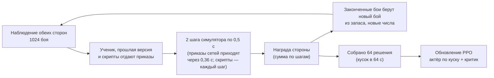

# Обучение сети

[← Назад](README.md) · [Документация](../README.md) › [Данные для обучения](README.md) › Обучение · [English](../../en/training/training.md)

Шаг 3 пути ([модель сети](network.md)): обучение [сети](model.md) методом PPO в
[симуляторе боя](simulator.md) на [случайных армиях](armies.md) — против себя, своих прошлых версий,
скриптовых противников и учений. Код — `tools/nn/train/` (PyTorch, работает в контейнере
`snake-ai-trainer` через `tools/nn/dock.sh`). Эта страница говорит, как всё устроено сейчас; что
пробовали и бросили — в конце ([пробовали и отказались](#пробовали-и-отказались)).

## Как запустить

```bash
# стандартная проверка изменения (ниже): до -> обучение -> после, в build/nn-train/test5/<метка>/
DOCK_NAME=t2-test5 bash tools/nn/dock.sh tools.nn.train.test5 --label mychange [-- параметры run.py]
# прогон цепочки с трендом: 15 минут от последней сети, полная проверка каждые 5 минут
DOCK_NAME=orch-x bash tools/nn/dock.sh tools.nn.train.test5 --label x --init <последний m*.pt> \
  --updates 0 --minutes 15 --every 5 -- <параметры цепочки, ниже>
# простой прогон: PPO, затем итоговая проверка и записи боёв
bash tools/nn/dock.sh tools.nn.train.run --name r1 --minutes 30 --init <чекпойнт>
# только проверка: случайные бои EVAL_SEEDS на каждого противника, парами с обменом сторон и базой скрипта
bash tools/nn/dock.sh tools.nn.train.evaluate --checkpoint build/nn-train/latest.pt --generated 512 \
  --opponents ai_like,nearest,hold_shoot
bash tools/nn/dock.sh tools.nn.train.checkpoint                  # записать необученную random.pt
```

Первые шаги компилируются 1–3 минуты (секунды, если прогон тех же размеров их уже компилировал:
[скорость обучения](#скорость-обучения)); во время обучения они не входят.

### Параметры `run.py`

| Группа | Параметры (умолчание) |
|---|---|
| прогон | `--name` (папка в `build/nn-train/runs/`), `--init` (начальный чекпойнт; по умолчанию `random.pt`), `--minutes` (5; время обучения), `--updates` (0; если задано — учиться столько обновлений, а `--minutes` только ограничивает время; расписания идут по обновлениям), `--seed`, `--device`, `--no-eval`, `--print-every` (5), `--snapshot-every` (20) |
| бои | `--battles` (1024 сразу), `--steps` (64 решения на обновление), `--max-units` (19 отрядов на сторону), `--small доля:отряды` (такая доля каждого запаса — не больше `отряды` на сторону), `--bank` (2048 готовых боёв), `--bank-refresh` (5 мин), `--limit` (3600 с) |
| темп | `--decide-s` (1,0 с боя между решениями), `--order-latency` (0,36 с): [решения](#решения) |
| PPO | `--lr` (1e-4), `--gamma` (0,9997 на 0,5 с), `--epochs` (1), `--minibatch` (4096 решений), `--adv-norm` (`batch` или `role`), `--critic-warmup` (0 обновлений, где учится только критик), `--critic-init` (критик из другого чекпойнта) |
| поиск | `--entropy` (0,01) и `--entropy-end` (линейно за прогон), `--entropy-target` (0: выкл.), `--entropy-max` (0,1), `--entropy-rate` (1,25) |
| поводок | `--anchor` (0: вес KL к опорной сети) и `--anchor-end`, `--reference` (по умолчанию `--init`), `--anchor-roll` (0 с: секунд обучения между обновлениями опоры), `--anchor-ema` (0 с: вместо этого опора идёт за актёром с таким полупериодом) |
| награда | `--gold` (1,0), `--rout-share` (0,5), `--lord` (0,3), `--lord-rout` (0), `--idle` (2e-4), `--idle-tau` (150 с), `--idle-pause` (30 с), `--idle-step` (0,5), `--idle-cap` (20), `--idle-rate` (0), `--idle-window` (30 с), `--order-cost` (0,001), `--retarget` (0,003): [награда](#награда) |
| противники | `--mix` (доли в json), `--pool` (8 прошлых версий), `--pool-extra` (ещё чекпойнты в пул), `--eval-past`, `--eval-generated` (512) |
| учения | `--drills` (0: доля боёв), `--drill-weights` (json; по умолчанию учения `READY` поровну), `--drill-bank` (256 на учение): [учения](#учения) |

### Настройки цепочки

Обучение идёт цепочкой: каждый прогон начинается с последнего чекпойнта предыдущего (его
`m<минута>.pt`, с критиком из его `runs/test5_<метка>/latest.pt`). Параметры, которые цепочка
передаёт после `--`:

```bash
--critic-init <предыдущий runs/test5_<метка>/latest.pt> --critic-warmup 3 \
--reference <init> --anchor 0.03 --anchor-end 0.03 --anchor-roll 600 --adv-norm role \
--idle-rate 0.05 --lord-rout 0.5 --entropy-target 0.05 --entropy-max 0.03 \
--drills 0.1 --drill-weights '{"counter": 1}' \
--mix '{"self": 0.05, "past": 0.1, "nearest": 0.35, "hold_shoot": 0.15, "hold": 0.05, "ai_like": 0.3}'
```

Почему так: небольшой KL к начальной сети прогона, опора сдвигается вперёд каждые 10 минут
(обучение совсем без поводка разваливается: [пробовали и отказались](#без-поводка-и-поводок-только-для-новых-сетей));
преимущества нормируются по ролям (у нападающего они шире из-за цены простоя и иначе перевешивают
защитника); часы продвижения на 0,05 бюджета в минуту (сеть их видит: [модель](model.md));
рассеянный полководец считается погибшим; учения — 10 % (при 30 % маленькая сеть забывала старое:
[учения](#учения)).

### Обучение расширенной сети

Сеть, расширенная `tools/nn/model/widen.py` ([расширение](model.md#расширение)), продолжает цепочку
той же командой с теми же параметрами; меняются только `--init`, `--critic-init` и `--reference` —
на файлы широкой сети:

```bash
DOCK_NAME=orch-w2 bash tools/nn/dock.sh tools.nn.train.test5 --label w2_wide --init build/nn-train/wide/w0.pt \
  --updates 0 --minutes 25 --every 5 -- \
  --critic-init build/nn-train/wide/w0_critic.pt --critic-warmup 3 \
  --reference build/nn-train/wide/w0.pt --anchor 0.03 --anchor-end 0.03 --anchor-roll 600 --adv-norm role \
  --idle-rate 0.05 --lord-rout 0.5 --entropy-target 0.05 --entropy-max 0.03 \
  --drills 0.1 --drill-weights '{"counter": 1}' \
  --mix '{"self": 0.05, "past": 0.1, "nearest": 0.35, "hold_shoot": 0.15, "hold": 0.05, "ai_like": 0.3}'
```

`run.py` видит ширину (ширина токена / 128 у маленькой сети) и делает две вещи, чтобы обновление
сдвигало широкую сеть настолько же, насколько маленькую:

- **Столько же шагов оптимизатора за обновление.** Мини-пакет широкой сети не влезает в 16 ГБ,
  поэтому он считается в `ceil(ширина)` частей, градиенты которых складываются (накопление
  градиента, `PPOConfig.accum`; `run.sized`); мини-пакет и число шагов Adam — как у маленькой сети
  (31 за обновление при 40 местах).
- **Скорость обучения / ширина у весов, читающих скопированный поток** (`widen.stream_readers`:
  q/k/v внимания, вход прямого слоя, GRU, головы, ценность критика). Каждая копия получает тот же
  градиент, что получал вес маленькой сети, и Adam сдвигает каждую копию примерно на lr, так что их
  сумма — то, что сеть считает, — сдвигалась в «ширину» раз дальше (как в muP: скорость ~ 1 / fan-in).

Почему (03.10). Первый прогон широкой сети (`w1_wide`, до исправления) делил мини-пакет пополам,
чтобы влезть в память: 63 шага Adam за обновление вместо 31. Шаг Adam — около lr при любом
градиенте, поэтому политика уходила примерно вдвое дальше, а KL, квадратичный по шагу, — примерно
вчетверо. На одном и том же пакете (первое обновление политики, по всем его строкам): маленькая сеть
0,0073, широкая с половинным мини-пакетом 0,033 (указатель цели 0,027 против 0,003), с накоплением
0,010, с накоплением и читателями на lr / 2 0,0093; после второго прохода 0,0082 / 0,016 / 0,015 /
0,010. В прогоне KL за обновление был втрое больше, чем у маленькой сети, хотя его среднее в журнале
(по мини-пакетам) выглядело обычным; остановка по KL (0,05) обрезала 30–90 % обновлений; KL к опоре
вырос до 0,08 за 25 обновлений (у маленькой 0,02), и рейтинг упал +0,05 → −2,48 за 5 минут — ещё до
первого сдвига опоры; сдвиг на 10-й минуте затем привязал поводок к развалившейся политике. С
исправлением, той же командой: 31 шаг в каждом обновлении, ни одной остановки по KL, KL 0,003 за
обновление и к опоре не больше 0,033 (как у маленькой сети: `wfix_small5`, +0,05 → +0,08 за 5 минут),
рейтинг +0,05 → +0,02 (5 мин) → +0,18 ± 0,11 (10 мин), парное золото против `ai_like` +0,018 →
+0,032 (`wfix_wide10`). Широкая сеть учится примерно вдвое медленнее (4 900 против 9 000 с боя в секунду).

**Медленный поводок, `--anchor-ema S`** (вместо `--anchor-roll`): после каждого обновления опора
сдвигается к актёру на долю, которая уполовинивает расстояние между ними за S секунд обучения
(усреднение весов по Поляку; `run.follow`): внезапный развал сдвигает опору лишь немного, а
устойчивый рост она догоняет. Один замер на широкой сети, та же команда с `--anchor-ema 450`: рейтинг
+0,05 → +0,12 → +0,05 ± 0,11 (5 и 10 мин), KL к опоре не больше 0,029 (`wfix_ema10`) против +0,02 →
+0,18 с неподвижной опорой: оба устойчивы, разница в пределах шума; сдвиг, который он заменяет,
наступает только на 10-й минуте, так что выбирать нужно по паре более длинных прогонов. Цепочка
остаётся на `--anchor-roll 600`.

## Что пишет

Всё — в `build/nn-train/` (не в Git):

| Файл | Что |
|---|---|
| `random.pt` | необученная сеть (случайные веса), необученный противник |
| `latest.pt` | сеть последнего `run.py` (её по умолчанию берёт компаньон) |
| `runs/<имя>/latest.pt`, `best.pt` | последняя сеть прогона; сеть с лучшим окном боёв обучения против скриптов (худшая доля побед по противнику и роли при ≥ 20 боях, не меньше чем по 5 таким) |
| `runs/<имя>/pool/v*.pt` | прошлые версии: противники в игре с собой |
| `runs/<имя>/log.jsonl` | строка на обновление: потери, энтропия, KL, действующие веса энтропии и KL, `start_kl` (расстояние от начала), `anchor_rolls`, награда и она же по слагаемым за минуту боя по роли (`reward_parts`), качество критика (`ev`, по ролям), доля побед по противнику и роли, смены приказов, виды приказов, гибель полководцев, смены целей, способности, скорость |
| `runs/<имя>/eval.json`, `replays/*/` | итоговая проверка; бои итоговой сети, записанные как записи из игры |
| `test5/<метка>/` | `report.json`, `before.json`, `after.json`, у тренда `m<минута>.pt`, `eval_m<минута>.json`, `trend.md` |
| `baselines/<противник>_<отряды>u_<предел>s_<версия>.json` | базы скриптов для проверки ([честные метрики](#оценка-сети-честные-метрики)) |

**Чекпойнт** (`tools/nn/train/checkpoint.py`) — один файл, словарь, сохранённый `torch.save`:
`format` (2), `kinds` (виды приказов по порядку кодов), `preset`, `config` (размеры сети: по нему
собирается актёр), `actor` (всё, что нужно игре), `critic` (только для обучения), `meta` (с темпом
`cadence`, на котором учили). `load_policy(path)` отдаёт актёра, готового играть; так его загружает
[компаньон](../apps/bridge.md).

**Записи боёв** — папки как у записанного прогона: `manifest.json` и `events.jsonl` с `nn_sample`
каждую секунду и `result`. `tools.nn.gamedata.load(папка)` читает их как бой из игры.

## Как идёт шаг обучения



Модули: `scenes.py` (откуда бои: запас готовых начал), `league.py` (кто с кем играет, пул),
`opponents.py` (скрипты), `drills/` (рамки учений, их запасы и проверки), `randomise.py`,
`reward.py`, `rollout.py` (бои и одно решение), `cadence.py` (как часто решают сети), `ppo.py`,
`evaluate.py` (проверка и записи боёв), `skill.py` (рейтинг), `behaviour.py` (поведение и живость),
`capacity.py`, `matchups.py`, `checkpoint.py`, `run.py`, `test5.py`.

## Бои и противники

**Бои.** Случайные армии [генератора армий](armies.md): равный бюджет, полководец и до
`--max-units` отрядов на сторону, в половине запаса нападает сторона 1. Только зёрна обучения;
запас (`--bank` боёв) обновляется каждые `--bank-refresh` минут; проверка берёт `EVAL_SEEDS`, на
которых не учат. `--small 0.35:6` держит 35 % каждого запаса с ≤ 6 отрядами на сторону. Законченный
бой берёт из запаса новый, с новыми разбросанными числами. Ученик играет в одних боях за сторону 1,
в других — за 2: каждой армией в обеих ролях. Сеть видит карту так, как её показывает игра (рамка
мини-карты Crossroads, как у компаньона), а не квадрат симулятора. Постоянные арены
(`config/nn/arenas.json`) остались только сценами `evaluate --per-scene`.

**Разброс чисел** (`randomise.py`): в каждом бою урон, скорость и лидерство умножаются на 1 ± 15 %
(одинаково для обеих сторон) и на 1 ± 5 % для каждой стороны; места начала сдвигаются до 5 м. Сеть
этих множителей не видит.

**Противники** (`league.py`; доли `--mix`; в таблице — умолчание `MIX`, доли цепочки — выше):

| Противник | Доля по умолчанию | Что делает |
|---|---:|---|
| `self` | 10 % | ученик с обеих сторон; обе дают данные для обучения |
| `past` | 15 % | одна сеть из пула (`--pool` 8, необученная всегда в нём, `--pool-extra` — ещё), перевыбирается каждые 2 обновления |
| `ai_like` | 40 % | по образцу ИИ игры ([ниже](#противник-ai_like)) |
| `nearest` | 20 % | каждый отряд бегом атакует ближайшего стоящего врага |
| `hold_shoot` | 10 % | стоит и стреляет; отряд ближнего боя бьёт навстречу врагу ближе 80 м; нападающим через 5 минут атакуют все |
| `hold` | 5 % | стоит (стреляет по своему выбору, отбивается); только защитником |
| `drill_<имя>` | `--drills` | враг учения на боях этого учения ([учения](#учения)) |

Внутри доли каждого противника раскладка чередует сторону ученика, так что каждый противник
встречает каждую армию в обеих ролях. ИИ игры в обучении не участвует: он остаётся независимой
проверкой ([модель сети](network.md#готовность)).

### Противник `ai_like`

`tools/nn/train/opponents.py`, числа — в `Line`, подогнаны под ИИ игры по 110 записанным боям сети
против ИИ игры на воротах («пул»; скрипты разбора в `build/ail/`, не в Git):

| Правило | Число | Откуда |
|---|---|---|
| линия нападающего идёт вместе бегом (точка в 30 м впереди); отряд, ушедший больше чем на 15 м вперёд от самого заднего свободного отряда ближнего боя своей линии, ждёт (марш идёт шагом самого медленного); после первой схватки стороны никто не ждёт | бег, 15 м | пул: нападающая линия игры шла 2,8–2,9 м/с, глубиной 16–17 м |
| защитник без стрелков тоже идёт вперёд | — | бои на воротах |
| когда свои уже дрались, свободные отряды идут вперёд и вступают на врагов ближе 150 м, стрелки — до своей дальности | 150 м | пул: после первого контакта отряды игры стоят без дела 1,6 % (ближний бой) / 8,7 % (стрелки) времени |
| нападающий бросается в атаку с | 95 м | пул: первая цель нападающего отряда ближнего боя — на 87 м (медиана, q10–q90 68–105 м) |
| защитник бьёт навстречу с | 100 м | пул: первые цели на ~100 м |
| на дрогнувшего врага — с | 150 м | наше |
| стрелки встают на доле дальности и стреляют; сначала по вражескому полководцу, если он на дальности, и в рукопашной тоже | 0,9 | бои на воротах: когда наш полководец на дальности, стрелки игры били по нему 89 % своих секунд стрельбы |
| стрелки отходят на 50 м от вражеского отряда ближнего боя ближе | 50 м | пул: свободный стрелковый отряд уходит от подходящего отряда ближнего боя в 52–58 % секунд ближе 40 м, 42 % на 40–60 м |
| стрелки, попавшие в рукопашную, выходят из неё (отход) первые | 15 с | пул: стрелки игры в рукопашной движутся 52 % первых 5 с |
| полководец позади центра своей линии, никогда не первым: идёт, когда идёт линия, на свою цель ближе 90 м, или на врага ближе 50 м, уже занятого боем; ниже 30 % здоровья отходит | 20 м, 90 м | пул: 20–22 м позади центра до контакта, первая цель на 90 м |
| цели ближнего боя: оценка = расстояние − 20 м, если враг в рукопашной (+30 м обратно, если отряд стоит ближе 40 м к своей схватке) + 25 м за вражеского полководца + 6 м за каждый другой свой отряд, уже идущий на него (до 3) − 10 м × cos(вперёд стороны, враг) + 15 м, если он дрогнул − 27 м × постоянная выборка Гумбеля на (строку боя, отряд, врага); побеждает наименьшая, новая цель должна быть лучше на 15 м | см. слева | условный логит, подогнанный на 3397 новых целях отрядов ближнего боя ИИ игры вне рукопашной (`build/ail/choice.py`); гистерезис — наш |
| свободный отряд идёт на уже дерущегося врага через точку в 12 м сбоку от его фланга | 12 м | разбор тактик симулятора |

Случайная часть — целочисленный хэш (строки боя, места отряда, места врага): одна и та же каждый
шаг, повторять нечего. Сверено с игрой на тех же 8 началах боёв ворот (поведение стороны 2; ИИ игры
/ `ai_like` с этими правилами): доля времени стрелков в рукопашной 0,11 / 0,10; расстояние до цели
ближнего боя (медиана) 91 / 93 м, взят ближайший враг 0,48 / 0,49; новых целей ближнего боя за бой
27 / 33; простой после контакта 0,045 / 0,031; полководец позади центра 22 / 27 м. Предсказание
симулятором обмена сети в игре на этих боях: −0,245 (в игре −0,333). Осталось: `ai_like`
наваливается двумя и больше отрядами на одного нашего 0,26 времени (игра 0,10), и его полководец
вступает раньше (6 с после первого контакта против 12 с).

## Решения

**Темп: решение в секунду, приказы через 0,36 с, как в игре** (`cadence.py`; `--decide-s 1
--order-latency 0.36`, одинаково в `run.py`, `test5` и `evaluate.py`). Компаньон решает раз в
секунду времени боя (`decide_ms` моста 1000), и его приказы доходят до отрядов позже: в записях
ворот (`nn_orders` `wait_model_ms`, 9251 решение) медиана 0,3 с, среднее 0,36 с, p10–p90 0,2–0,6 с
времени боя.

- Шаг симулятора остаётся 0,5 с (такт морали игры); одно решение (`Battles.step`) играет
  `decide_s / 0,5` = 2 шага.
- Приказы сетей (ученика и прошлой версии) приходят с задержкой, округлённой до целых шагов
  случайно так, чтобы в среднем было 0,36 с: на шаг позже с вероятностью 0,72, иначе сразу; до тех
  пор действуют прежние приказы (`KEEP`), как в игре между тактами.
- Скрипты (`nearest`, `ai_like`, враги учений) отдают приказы каждый шаг симулятора: они замещают
  ИИ игры, у которого нет нашего такта.
- Наблюдение и его память снимаются только в моменты решений, как компаньон читает состояние раз в
  секунду; GRU делает шаг раз в решение.
- Награда решения — сумма наград его шагов; бой, закончившийся внутри решения, заканчивает его.
- `--steps` 64 решения на обновление = 64 с боя в куске.
- `--gamma` (0,9997) и λ GAE (0,95) задаются на 0,5 с; на решение это γ^(decide_s / 0,5) (0,99940
  при 1 с) и λ^(decide_s / 0,5) (0,9025): горизонт в секундах (~28 мин) сохраняется.
- Проверка решает так же, как обучение; её пошаговые счёты (поведение, метрики учений, записи)
  по-прежнему видят каждый шаг симулятора. `--decide-s 0.5 --order-latency 0` даёт решение каждый
  шаг с приказами сразу (числа двух темпов несравнимы).

10-минутный бой — ~600 решений. Любой чекпойнт играет на любом темпе.

**Приказ `keep`.** Сеть может не давать отряду нового приказа: `keep` (код вида 4) оставляет
действующий; отряд без приказа стоит. Настоящая смена — новый вид, новая цель атаки или точка
движения дальше 10 м от действующей; `keep` и тот же приказ ещё раз ничего не стоят.

**Маски.** Мёртвые, бегущие и пустые места не дают потерь; недопустимые приказы маскирует сама сеть
(атака без видимого врага, приказы отряду, который их не принимает).

**Предел времени 60 минут**, как в игре: на нём побеждает защитник. Сеть не видит предела времени
(ни один вход на него не ссылается: у боя кампании его может не быть).

## Награда

`reward.py`, на сторону. Действующие слагаемые:

| Слагаемое | Вес (параметр) | Почему |
|---|---:|---|
| победа / поражение | ±1 | цель; на пределе времени побеждает защитник, нападающий получает обычный −1 |
| (уничтоженное золото врага − потерянное своё) / бюджет, за шаг | 1,0 (`--gold`) | ровный сигнал задолго до конца, по тому, чего стоят отряды |
| пал вражеский полководец − пал свой, за шаг | 0,3 (`--lord`) | в игре падение полководца ломает армию (3 из 4 проигранных боёв на воротах закончились в пределах 3 с после рассеяния нашего полководца); его золото одно этого не показывает. При `--lord-rout` r > 0 рассеянный полководец считается погибшим, бегущий — как r гибели, с возвратом при сплочении (цепочка: 0,5) |
| цена простоя нападающему, за шаг 0,5 с | 2e-4 × m (`--idle`) | предел времени через час почти не виден при γ 0,9997 (0,9997^7200 ≈ 0,11); эту цену видно каждый шаг. Защитник не платит никогда |
| каждая настоящая смена приказа отряда, делённая на число отрядов стороны | 0,001 (`--order-cost`) | против дёрганья |
| каждая смена цели атаки, пока прежняя цель стоит, делённая на число отрядов стороны | 0,003 (`--retarget`) | гистерезис: отряды мечутся между двумя врагами |

Слагаемые победы, золота и полководца — с нулевой суммой (сторона 2 получает минус то, что сторона
1). Формирующие слагаемые — разности потенциалов: они не меняют, какой исход лучше. Слагаемых стиля
пока нет: характеры фракций — заглушки.

**Потерянное золото** (`reward.gold_lost`, `gold_sides`, `budget`). Отряд стоит своей
`multiplayer_cost` (`config/nn/units.json`); потерянное им золото — эта цена × худшая доля отряда,
потерянная до сих пор:

| Отряд | Потерянная доля сейчас | Почему |
|---|---|---|
| сражается | потерянное здоровье (`1 − hp_abs / hp0`) | у отряда из многих людей здоровье и люди падают вместе; у одиночки (полководец) здоровье показывает урон раньше его гибели |
| мёртв, ушёл с карты, рассеян | 1 | он уже не вернётся |
| бежит (не рассеян) | потерянное здоровье + `rout_share` (0,5) × оставшееся | сейчас он вне боя, но может сплотиться |

**Потеря считается один раз.** Состояние хранит худшую долю, потерянную каждым отрядом
(`lost_worst`; её записывает `rollout.Battles` после каждого шага симулятора, а также
`evaluate.script_battles` и `drills/verify.py`); потерянное золото = цена × эта худшая доля.
Сплочение ничего не возвращает; бегство после сплочения ничего не добавляет, пока отряд не потеряет
больше, чем в худший момент (бежит при половине здоровья: 0,75; сплотился: по-прежнему 0,75; потерял
60 % и снова бежит: 0,8, +0,05). Без этого отряд защитника, бежавший, сплотившийся и снова бежавший,
каждый раз считался новым уроном: в 89–92 % боёв, ~7 % урона, который считали часы продвижения (до
22 %), с ложным продвижением в 38–59 % боёв. Одно правило для обмена, часов простоя, метрик золота и
входов продвижения сети (компаньон гоняет тот же код на состояниях игры). Бюджет — средняя начальная
цена двух армий (одна на обе стороны, так что обмен ровно с нулевой суммой).

**Цена простоя нападающему** (`reward.idle_cost`, `idle_scale`): нападающий платит 2e-4 × m каждый
шаг, чем бы ни были заняты его отряды (только по продвижению: резерв, вторая линия или придержанный
полководец ничего не стоят, пока армия в целом продвигается); m зависит от его урона:

- до его первого урона: m = exp(t / 150 с) − 1 (`--idle-tau`): почти ничего первые минуты (время
  развернуться и дойти), потом резко больше;
- после него: 0, пока он наносит урон; через 30 с без урона (`--idle-pause`) k = ⌊секунд с
  последнего урона / 30 с⌋ и m = exp(0,5 k) − 1 (`--idle-step`): ступень вверх каждые 30 с, быстрее
  первой кривой и без её отсрочки; новый урон сбрасывает в 0;
- не больше 20 (`--idle-cap`): 0,004 за шаг, 0,48 в минуту.

Что считается уроном: при `--idle-rate` 0 — любое здоровье, потерянное защитником
(`reward.struck`); при `--idle-rate` x > 0 (цепочка: 0,05) — только темп урона не ниже x: золото,
потерянное защитником, в долях бюджета в минуту, экспоненциальное среднее за `--idle-window` 30 с
(`reward.hit_rate`). 0,05 в минуту (весь бюджет за 20 минут) отличает бой от царапин: когда армия
сражается, медиана темпа 0,10–0,19 и ≥ 0,05 в 82–95 % решений; когда перестреливаются один-два отряда
из 6+, медиана 0,04. `rollout.Battles.last_hit` хранит время последнего урона в каждом бою (−1 до
первого). Сеть видит эти часы (темп / 0,05, достигнут ли, секунд с тех пор: `observation.PROGRESS`,
[модель](model.md)); с наградой они совпадают только при 0,05, 30 с и доле бегства 0,5
(`rollout.Battles` иначе предупреждает).

| Без урона с начала | за шаг | накоплено |
|---|---:|---:|
| 1 мин | 0,0001 | 0,006 |
| 3 мин | 0,0005 | 0,07 |
| 5 мин | 0,0013 | 0,26 |
| 10 мин | 0,004 (потолок с 7,6 мин) | 2,2 |
| 15 мин | 0,004 | 4,6 |

| Пауза после урона | за шаг с этого момента | накоплено за паузу |
|---|---:|---:|
| 30 с | 0,00013 | 0,000 |
| 60 с | 0,00034 | 0,008 |
| 90 с | 0,0007 | 0,03 |
| 120 с | 0,0013 | 0,07 |
| 180 с | 0,0038 | 0,28 |

Против исхода (±1): 3 минуты развёртывания и марша стоят 0,07; нападающий, не нанёсший урона к 10-й
минуте, заплатил 2,2 — больше проигранного боя, так что стоять хуже, чем атаковать и проиграть;
каждая следующая минута — −0,48. Короткие паузы в бою стоят мало (90 с: 0,03).

**Цена приказов.** При 0,001 отряд, меняющий приказ каждое решение (1 с), стоит своей стороне ~0,6
за 10-минутный бой; одна смена в 5 с — ~0,12. Цены сдерживают метания: без них возвраты A→B→A
выросли на 60–80 % ([пробовали и отказались](#убрать-цену-приказов)).

`log.jsonl` и консоль показывают награду по слагаемым за минуту боя по роли ученика
(`reward_parts`: `trade`, `lord`, `end`, `idle`, `orders`).

## PPO

`ppo.py`, по схеме MAPPO: каждый свой отряд — агент со своим отношением вероятностей; все отряды
стороны делят её преимущество; критик видит всё поле (и в игру не идёт).

| Настройка | Значение | Почему |
|---|---|---|
| дисконт γ | 0,9997 на 0,5 с (0,99940 на решение в 1 с) | горизонт ~28 мин: победа через 10 минут ещё весит 0,7 |
| λ GAE | 0,95 на 0,5 с (0,9025 на решение) | обычное |
| обрезка | 0,2 | обычное |
| шаг обучения | 1e-4 (`test5` и цепочка: 1,5e-4), Adam (eps 1e-5); в расширенной сети lr / ширина у весов, читающих скопированный поток (`run.optimizer`) | [расширенная сеть](#обучение-расширенной-сети) |
| эпохи, мини-пакет | 1, 4096 решений из целых кусков (меньше для боёв больше 22 мест: `run.sized`); расширенная сеть считает его частями (`accum`) | обновление дороже боёв; память карты на 16 ГБ; [расширенная сеть](#обучение-расширенной-сети) |
| остановка по KL | 0,05 на отряд | защита от слишком большого шага |
| энтропия | только на виде приказа; `--entropy` → `--entropy-end` линейно; с `--entropy-target` — порог: вес × `--entropy-rate` каждое обновление, пока энтропия вида ниже цели, и обратно к расписанию выше неё, не больше `--entropy-max` | премия на 128 ячеек точки движения платила бы за движение |
| KL к опорной сети | `--anchor` → `--anchor-end` на виде приказа и цели; опора — `--reference` (по умолчанию `--init`); `--anchor-roll` S: каждые S секунд обучения опорой становится текущий актёр (`anchor_rolls` в журнале) | поводок, ограничивающий дрейф в пределах окна, а не всего прогона |
| нормировка преимущества | `batch` или `role`: строки нападающих и защитников отдельно | преимущество нападающего в 2–3 раза шире |
| потеря ценности, норма градиента | 0,5; актёр и критик обрезаются отдельно, каждый до 0,5 | при общей обрезке большой градиент критика сжимал шаг актёра ниже eps Adam: актёр не учился вовсе |
| разогрев критика | `--critic-warmup` N: первые N обновлений учится только критик | свежий или чужой критик не знает ценностей актёра |

- **Память (GRU) во времени.** Сбор — кусок в 64 решения каждого боя; обновление прогоняет актёра
  по каждому куску от памяти, сохранённой в начале куска, обнулённой там, где начинается новый бой
  (рекуррентный PPO, сохранённое состояние как в R2D2). По шагам идёт только GRU.
- **События во входе** ([входы](model.md)): у каждого отряда — как давно он был в рукопашной и
  бежал (у врагов — пока видны); гибель своего и вражеского полководца и как давно; таймеры урона и
  часы продвижения нападающего.
- **Расстояние от начала.** `ppo.distance`: средний KL на отряд (вид и цель) актёра к сети, с которой
  начался прогон, на одном мини-пакете каждого обновления (`start_kl` в журнале). Расстояние растёт
  вместе с рейтингом — поиск работает; рейтинг стоит, а расстояние замерло — поводок слишком короток.

## Способности полководца

Сеть сама решает, когда её полководец применяет способность, как игрок
([модель](model.md#способности-каждый-отряд-каждый-его-слот-способности), [мост](../apps/bridge.md)):

- ученик и прошлая версия выбирают способности (`heads.sample(..., abilities=True)`); сбор хранит
  `Action.ability`, обновление учитывает его в логарифме вероятности;
- только полководцы скриптовых противников применяют их по правилу ИИ игры в симуляторе:
  `Battles.by_rule` (`tools/nn/sim/abilities.py` `set_rule`), заново после каждого перезапуска, потому
  что бой из запаса приносит умолчание `scenario.build` (сторона 2 по правилу);
- сохранённое решение хранит только состояние слотов (5 чисел) и строку боя в запасе;
  `rollout.full_obs` возвращает паспорта при обновлении (весь вход занял бы ~3 ГБ на 1024 боя × 64
  решения); срез сохранённого состояния — копия;
- обновления разогрева критика гоняют актёра без графа (память);
- `run.py` пишет `abilities_per_battle`.

## Учения

Учебные бои, каждый учит одному умению (`tools/nn/train/drills/`). Учение — это **рамка**, условие,
а каждый бой внутри неё порождается из зерна: случайные составы и типы отрядов, выполняющие
условие, размеры, дистанции, место и поворот всего боя на карте (в пределах 700 м от центра) и
сторона, за которую играем мы (половина — сторона 1, половина — 2). Враг учения — скрипт (противник
лиги `drill_<имя>`); сеть играет с ним только на боях этого учения. Учения меняют лишь то, *какие
бои* играет сеть: подражания нет. У каждого учения есть скрипт `skilled`, поэтому затухающее
подражание по учению могло бы взять его учителем.

Каждый бой учения идёт под стандартным пределом, как любой бой обучения: сеть не видит предела
времени, поэтому учение выигрывается или проигрывается боем, а не часами.

**Проверка до того, как учение чему-то учит** (`drills/verify.py`): два наших скрипта играют ≥ 256
порождённых боёв учения против его врага, с разбросом чисел обучения; наивный скрипт должен ясно
проиграть (доля побед ≤ 0,25), скрипт с умением — ясно выиграть (≥ 0,75), иначе рамка
перенастраивается. В `drills.READY` (умолчание `--drill-weights`) — только прошедшие учения.

```bash
bash tools/nn/dock.sh tools.nn.train.drills.verify --drill pincer,kiting --battles 256 --show 4
# обучение: 10 % боёв — учения, все — counter
... tools.nn.train.run ... --drills 0.1 --drill-weights '{"counter": 1}'
```

Как встроено: `league.with_drills` забирает `--drills` смеси у остальных противников пропорционально
и делит по `--drill-weights`; `drills/source.py` `Mixed` строит один запас из порождённых боёв и боёв
каждого учения (`--drill-bank` на учение, обновляется вместе с запасом), и строка учения
перезапускается боем своего учения, где наша сторона — та, за которую в этой строке играет ученик. В
журнале обучения учения видны как противники (`drill_counter/attack`, ...).

| учение | рамка | враг | наивный (победы / обмен золотом) | с умением (победы / обмен золотом) | состояние |
|---|---|---|---|---|---|
| `counter` | Империя против Империи, две пары в случайном порядке вдоль линии, 110–200 м между линиями, 20–60 м между парами: наш X напротив своего контрюнита C, наш Z (бьёт C) напротив Y; (X, Z, C, Y) — из однофракционных пар, прогнанных 2 на 2 в симуляторе; нападаем мы | стоит; отряд, чей противник сломлен, давит ближайшего нашего | `nearest`: 0,215 / +0,06 (X ломается о контрюнит, а тот вступает во второй бой) | каждый отряд — на врага, которого бьёт (по паспортам): 0,867 / +0,22 | `READY`; на проверочных зёрнах скрипт с умением 98 % времени бьёт правильную цель, наивный 53 % |
| `hold_fire` | наш пехотный отряд в контакте с вражеским полководцем; 2–3 наших стрелковых отряда в 70–95 м позади (имперские лучники, ночные бегуны или пращники-рабы); свободные вражеские стрелки в 65–95 м за линией наших стрелков; нападаем мы | ближний бой — на ближайшего, стрелки стоят | наши стрелки бьют полководца в схватке: 0,066 / −0,59 | бить свободных врагов; когда их нет — отойти за дальность от схватки и стоять: 0,848 / +0,37 | `READY` (стрельба в схватку вокруг полководца стоит нам в 1,5–3,5 раза больше, чем ему; в схватку с обычным отрядом окупается) |
| `kiting` | 1–2 отряда ночных бегунов (бег 5,4 м/с, праща 140 м) против имперской пехоты ближнего боя (бег 3,0 м/с); нападаем мы | каждый отряд бежит к ближайшему нашему стрелку | `hold`, стоять и стрелять: 0,059 / −0,24 | стрелять, пока ближайший преследователь далеко, отбегать, когда он близко, остановиться и стрелять снова (каждая остановка — залп): 1,000 / +0,86 | `READY` (нужно правило залпа симулятора) |
| `pincer` | 2–3 отряда имперских двуручников стоят в 120–180 м друг от друга; на каждый — два наших колонной напротив, в 140–240 м; нападаем мы | `hold` | `nearest`: 0,223 (пара наваливается в лоб) | сковать спереди + фланг: 0,922 | нужно ожидающее правило флангов ([симулятор](simulator.md#ожидающие-изменения)): на нынешнем симуляторе оба 0,00; с правилом флангов 0,281 / 0,922 (наивный выше 0,25); не в `READY` |
| `defend` | скавены обороняются (линия + 4 стрелковых отряда) против L + 2 более сильных нападающих, играющих `ai_like` | `ai_like` | выйти навстречу | держать линию и стрелять | построено, настраивается; не в `READY` |
| `reserve` | резерв должен перехватить обходящих, а не вступать в основную рукопашную | скриптовые обходящие | вступает в рукопашную | перехватывает | модуль написан, не в `NAMES` (не загружается) |

`READY` = `kiting`, `counter`, `hold_fire`. Цепочка учит `counter` на 10 % боёв: с ним сеть
выучила выбор противника (победы в учении 0,40 → 0,65–0,73, время на правильной цели 0,60 → 0,72,
первый правильный приказ 44 → 26–40 с). При 30 % то же умение далось ценой: вердикт ёмкости
«widen-candidate», 17 старых чисел упали за пределы шума, общий рейтинг −0,41 → −0,60.

**Метрики учений** (`drills/metrics.py`): в каждом бою, по секундам наших стоящих отрядов, доля
атак на правильную цель / на плохую (свой контрюнит) / на другого врага, остальные виды приказов,
доля в рукопашной и медиана времени боя, когда приказ атаки отряда впервые идёт на правильную цель;
то же за последние 100 с до предела. `test5` проверяет каждое учение из `READY` (`--drill-eval`,
по 128 боёв на `DRILL_EVAL_SEEDS`): доля побед, обмен золотом и эти метрики, рядом — два
проверочных скрипта на тех же боях, в отчёте и в `trend.md`.

## Проверка

`evaluate.py`: целые бои до конца против каждого противника, сторона ученика чередуется (обе роли),
приказы выбираются случайно, как в обучении; `hold` — только защитником. `--generated N`: N боёв
`EVAL_SEEDS` на противника (по умолчанию парами с обменом сторон, `--no-pairs` — по одному; с базой
скрипта, `--no-baseline` — без); `--per-scene N`: постоянные арены; `--opponents`, `--against`
(сеть за `past`), `--together` (все противники в одном пакете), `--greedy`, `--out`. По противнику и
роли: доля побед, уничтоженное и потерянное золото, бои на пределе, гибель своего / вражеского
полководца, виды приказов, смены целей, метрики поведения и живости.

**Только идущие бои.** Проверка идёт, пока не кончится самый долгий её бой. Когда остаётся не больше
64 боёв, пакет сжимается до них (`rollout.Battles.narrow`: дополняется законченными боями, которые
стоят замороженными; `evaluate.BUCKETS`), и решение сжатого пакета проигрывается одним графом CUDA
(`evaluate.Graphed`). Те же зёрна дают те же бои; проигрыш графа даёт бит в бит бои пошагового
счёта. `play(compact=False, cuda_graph=False)` считает весь пакет.

### Протокол проверки (`test5`)

`tools/nn/train/test5.py` — стандартная короткая проверка изменения обучения. Ею закрывается каждое
изменение, поэтому проверки можно сравнивать между собой.

1. **До.** Начальная сеть (`--init`) играет проверку: `--eval` (512) боёв случайных армий из
   `EVAL_SEEDS` (до 19 отрядов на сторону) на противника против `ai_like`, `nearest` и `hold_shoot`:
   256 зёрен, каждое дважды, сеть за обе стороны, с базами скриптов на тех же боях (из кэша) и
   учениями из `READY`. Всё одним пакетом, каждый раз те же бои.
2. **Обучение.** 36 обновлений PPO (`--updates`; ~5 минут на свободной видеокарте) с текущим кодом и
   `test5.PROTOCOL` (`--small 0.35:6 --critic-warmup 3 --lr 1.5e-4 --entropy 0.003 --entropy-end
   0.001 --anchor 0.06 --anchor-end 0.03`, `long19` в пуле, `--snapshot-every 10 --no-eval`).
   Параметры после `--` уходят в `run.py` и перекрывают их; `report.json` хранит все (`protocol`,
   `options`, `train_args`). Число обновлений, а не минут: на занятой видеокарте одно обновление может
   идти минуты. `build/nn-train/latest.pt` не трогается.
3. **После.** Обученная сеть играет ту же проверку.
4. **Отчёт** печатается и пишется в `build/nn-train/test5/<метка>/report.json` (с `before.json` и
   `after.json`).

**Прогон с трендом** (`--updates 0 --minutes M --every K`) проверяет сеть каждые K минут обучения
(их время не считается), хранит каждую сеть (`m<минута>.pt`, последнюю — с критиком) и проверку
(`eval_m<минута>.json`) и пишет таблицу минута 0 / K / … / M (`trend.md`, `report.json`).
`--before PATH` берёт готовую проверку «до» (только пока симулятор не менялся); `--report-only`
пересобирает отчёт законченной метки без видеокарты; `--prev-report` указывает предыдущую итерацию
для блока ёмкости.

Блоки отчёта: умение ([честные метрики](#оценка-сети-честные-метрики), с расстоянием от начала:
`start_kl`, KL поводка, сдвиги опоры), учения, доля побед по противнику и роли, по фракции и паре
фракций (с отношением обмена золотом; `matchups.py`), поведение, живость, ёмкость и забывание.

| Метрика поведения | Что считается (отряды ученика; `behaviour.py`) |
|---|---|
| уничтоженное золото врага, потерянное своё / бой; отношение обмена | золото награды на конец боя; отношение — уничтоженное / потерянное по всем боям клетки |
| свой полководец погиб | доля боёв, закончившихся гибелью своего полководца |
| секунд стрелков в рукопашной / бой, доля времени стрелков в рукопашной | секунды, которые стрелковые отряды (не полководец) стоят в рукопашной, за бой и как доля их времени |
| свой ближний бой бьют во фланг/тыл | доля отрядо-секунд своего ближнего боя, когда их бьют во фланг или тыл (`flank_hit` симулятора) |
| решения с кучей | доля решений, где на одном враге больше 2 своих отрядов, пока другой враг бьёт свой отряд во фланг или тыл |
| свой ближний бой во фланг/тыл врагу | доля отрядо-секунд своего ближнего боя, бьющих стоящего врага во фланг или тыл |
| смены целей / мин, смены приказов / мин, виды приказов | на стоящий отряд, по противнику |
| способностей / бой, бои на пределе | начатые свои способности; доля боёв на пределе времени |

Тяжёлые задачи на видеокарте идут по очереди: проверка ждёт, пока есть `build/gpu-train.lock`
(опрос каждые 30 с), затем держит его (метка и время начала) до конца, и при сбое тоже; проверка,
начатая в пределах 60 с после освобождения (`build/gpu-train.released`), сначала выжидает эти 60 с.
`DOCK_NAME` — имя контейнера. Шум: при 256 боях на роль доля побед гуляет на ±3 пункта (одна
стандартная ошибка); 36 обновлений мало двигают сеть, поэтому проверка показывает, не ломает ли
изменение что-то и куда идёт поведение, а не итоговую силу.

### Оценка сети: честные метрики

Фракции неравны, и это нормально: игра — камень-ножницы-бумага. Но в боях Империи со скавенами исход
по большей части решает фракция (при равном золоте сеть выигрывала 59–79 % за скавенов против
Империи и 24–50 % за Империю против скавенов; зеркала ~45–55 %), так что доля побед говорит больше о
выпавших парах фракций, чем о сети. `skill.py` (чистый numpy) убирает пару фракций:

| Мера | Как считается |
|---|---|
| **Пары с обменом сторон**, `pairs` | Каждый порождённый бой проверки играется дважды на тех же армиях: сеть за сторону 1, потом за сторону 2. В обоих нападает одна и та же армия, так что роль сети тоже меняется. Пара выиграна обе / поровну / проиграна обе; `pair_score` = P(обе выиграны) − P(обе проиграны). У `hold` пар нет. |
| **Превосходство над скриптом**, `baseline` | Те же бои, сыгранные скриптом противника против самого себя: природный перевес пары фракций. В каждом бою сеть минус скрипт, те же армии, та же сторона: победа и обмен золотом ((уничтоженное золото врага − потерянное своё) / бюджет), по паре фракций и в целом (`win_adv`, `gold_adv`). |
| **Рейтинг**, `skill` | Одна гребневая логистическая подгонка (Брэдли — Терри) по всем боям: P(победа) = σ(r_противник + перевес(наша, их) + a · (+1 атака, −1 защита)), r = умение_сети − умение_противника в логитах; перевес фракций антисимметричен; гауссово априорное с sd 3; интервал 95 % — из обратного гессиана. `overall` — среднее рейтингов по противникам: **единое число тренда**. 0 — наравне с этим противником; +0,4 ≈ 60 %. |
| **Запас**, `margin` | Оставшееся у победителя золото / его начальное, + когда выиграли мы, − когда проиграли; по противнику и по паре фракций. |
| **Золото пары**, `pair_gold` | В паре обе пары рук получают те же две армии. `pair_gold` = (золото врага, уничтоженное нами в обоих боях, − уничтоженное противником в обоих) / бюджет, среднее ± 95 % по парам; `exchange` — то же как множитель; `weak` / `strong` — армия, с которой мы сыграли хуже / лучше, в наших руках против рук противника. На [воротах](../launch/gate.md) золото берётся из конечного состояния каждого отряда × цена паспорта и считается так же, как в награде. |

Пары — умолчание для порождённых боёв; база включена в `test5` и в
`python -m tools.nn.train.evaluate`, выключена в итоговой проверке `run.py`, никогда — при
`--small`. Результат хранит списки по боям (`battles`) для переподгонки. `scenes.Generated`
раскладывает пакет блоками по четыре боя `[p, q, p, q]` (две пары; сеть за сторону 1, затем за 2),
по кругу противников (`paired_order`). Кэш баз
(`build/nn-train/baselines/<противник>_<отряды>u_<предел>s_<версия>.json`) привязан к хэшу того, от
чего зависит бой скриптов (`evaluate.VERSION_FILES`: симулятор, генератор армий, скрипты, награда,
`config/nn`), так что их изменение переигрывает базы.

Почему рейтинг: 10 % золота скавенов (бюджет ×1,0 против ×0,9, одна и та же сеть, 384 боя на
противника) переворачивает перекрёстные пары — доля побед пары меняется до 0,37, доля побед сети за
одну фракцию на 0,16, — а подогнанный перевес фракций забирает это (−0,70 → +0,72), и общий рейтинг
сдвигается на 0,03 (его интервал ±0,12).

### Живость

Отряды, которые слишком часто меняют приказы и цели, выглядят неестественно. Только замер (без
награды), по противнику и роли, в каждой проверке (`behaviour.py` Tracker; блок «живость» в
`test5`) и на воротах по записям игры (`tools/nn/gate.py`):

| Число | Что |
|---|---|
| смен приказов / отрядо-мин | новый вид, новая цель атаки или точка движения дальше 10 м (как считает цена приказов) |
| смен цели атаки / отрядо-мин | новая цель атаки, пока прежняя стоит |
| возвратов A→B→A / отрядо-мин | возврат к позапрошлому приказу в пределах 10 с |
| дрожание точки движения, м | среднее расстояние между соседними точками отряда, который продолжает двигаться; новых точек в минуту движения |
| смен вне рукопашной / отрядо-мин; дёргающиеся отряды | смены стоящего отряда вне рукопашной; доля отрядов с 30 с и больше вне рукопашной, меняющих там приказ 6 раз в минуту и чаще |
| смен своей цели / отрядо-мин (1 с) | текущая цель отряда меняется между целыми секундами, как её снимает игра; также у отрядов противника (в игре эталонная полоса — ИИ игры) |

В игре компаньон даёт сети точку приказа как в симуляторе, так что сеть узнаёт свой действующий
приказ: 4,4 смены приказа на отрядо-минуту, смены целей как у ИИ игры ([мост](../apps/bridge.md)).

### Ёмкость и забывание

Когда расширять сеть: `capacity.py`, в конце каждого прогона `test5` (блок «ёмкость и забывание»,
`report.json` `capacity`) или на готовой папке:
`python -m tools.nn.train.capacity build/nn-train/test5/<метка> [--prev <папка или report.json>]`.
Ничего не играется.

- Забывание: итоговая проверка против проверки предыдущей итерации (`--prev-report`, иначе папка
  `--init`, иначе метка с номером на единицу меньше) и против минуты 0: по противнику — счёт пар и
  золото пар, по паре фракций — доля побед и обмен золотом, по нашей фракции и роли — доля побед.
  Одинаковые бои сопоставляются (противник, зерно, сторона), шум — ошибка парной разности. Падение
  на 5 пунктов и больше за пределами 2,58 стандартных ошибок — «забывание», в пределах шума —
  «drop?». Против предыдущей итерации считается только при той же версии симулятора.
- Журнал обучения: объяснённая дисперсия, потери ценности и политики (плато — наклон поздней
  половины в пределах 2 ошибок от 0), энтропия, нормы градиента (`grad_norm` актёра,
  `grad_norm_critic`), KL, обрезка.
- Вердикт: **widen-candidate**, когда старые числа падают за пределы шума, другие растут за пределы
  шума, а общий рейтинг — нет (интерференция: новое умение ценой старого); **watch** — забывание при
  растущем рейтинге, забывание без роста (сначала настройки), падения в пределах шума, плато,
  падающий критик, обвал энтропии, растущая норма градиента; иначе **ok**.
- Расширить сеть с сохранением умений: `tools/nn/model/widen.py` ([расширение](model.md#расширение)).

## Скорость обучения

RTX 5070 Ti, 1024 боя, до 19 отрядов на сторону, 64 решения на обновление, на темпе игры: ~9 900 с
боя за секунду обучения; разогрев 13 с, если уже компилировалось (холодный: 160–170 с); проверка
`test5` со 128 боями на противника и 64 на учение ~81 с. За счёт чего:

- **Скомпилированный учёт** (`rollout.fast()`, только CUDA): скрипты и сборка приказов, цены
  приказов, награды и их счётчики, `reward.measure`, решение актёра (проход, выбор, приказы) и
  ценности критика при сборе, логарифм вероятности, трекер поведения. Внутри скомпилированного графа
  кодировщик и голова способностей берут все слоты и маскируют чужие; без компиляции выбирают свои
  через `nonzero`.
- **Никаких чтений значений с видеокарты в горячем цикле:** `torch.distributions` без проверки
  аргументов, счётчики боёв и пределов на видеокарте, раскладка приказов по заранее сделанным
  индексам, подсчёт видов сравнением.
- **Память по куску** (`TokenMemory.scan`): нормировка, маски и остаток GRU считаются сразу на всех
  64 шагах, по одному идёт только ячейка; `unbind` вместо `x[t]`.
- **Смещение внимания** строится один раз, выровненным под ядро внимания.
- **Наблюдение** скомпилировано (8 мс → 0,6 мс на 1024 боя).
- **Кэш компиляции:** `tools/nn/dock.sh` хранит ядра `torch.compile` в томе Docker `tww3-torch-cache`.
- **Одно решение в секунду** играет два шага симулятора на одно наблюдение и один проход сети
  (5 700 → 9 900 с боя в секунду против решения каждый шаг).
- **Проверка** сжимается до идущих боёв с графом CUDA (выше): проверка из 1536 боёв 180 с → 65 с.

В обновлении главная цена — 64 шага GRU и обратный проход внимания во float32. TF32 включён
(`allow_tf32`).

## Чего не хватает

- Более широкой сети, которая обгонит маленькую: пресет `small` (0,84 M) показывает интерференцию
  (новые умения ценой старых). Сеть ×2 (`wide`, пересадка весов: [расширение](model.md#расширение))
  учится устойчиво с 03.10 ([расширенная сеть](#обучение-расширенной-сети)); научится ли она большему,
  чем маленькая, покажет более длинная цепочка.
- Приказов, привязанных к отрядам (атаковать врага N с фланга, встать за своим отрядом M, прикрыть
  его фланг): точка движения — сетка 16 × 8 относительно направления на врага, так что для обхода
  конкретного врага сеть должна сама вычислить ячейку.
- Учений `pincer`, `defend` и `reserve`; правила флангов в симуляторе для `pincer`.
- `ai_like` всё ещё наваливается чаще и раньше пускает полководца, чем ИИ игры.
- Больше фракций и видов отрядов в генераторе армий; награды стиля по характеру фракции.

## Пробовали и отказались

Что пробовали, результат в числах и почему это не используется. Код каждого хранит Git.

### Две сети, нападение и защита

Две сети вместо одной, каждая вдвое шире (3,2 M весов против 0,84 M), с разгоном от скриптов. Сеть
нападения вышла на уровне единой сети (против `ai_like` 44–54 %, против `nearest` 28–42 %), с 98 %
приказов атаки и втрое более частыми кучами. Сеть защиты провалилась: после 10 / 20 / 30 минут PPO
22 / 17 → 34 / 28 → 14 / 6 % на отложенных армиях (против `ai_like` / `nearest`) против 64 / 42 % у
единой сети: росла на своих боях и не переносилась на новые армии. Единственный плюс: давление на
нападающего больше не протекало в защиту. Маленькая сеть копирует обоих учителей так же точно, как
широкая (вид 98,5 %, цель 98 %), так что размер не был пределом. Одна сеть с ролью на входе.

### Без поводка, и поводок только для новых сетей

Пробовали правило «поводок KL к копии скрипта — только для сети, начатой со случайных весов»: без
всякого поводка (`--anchor 0`) обучение каждый раз разваливалось. 10 минут: против `ai_like` 54 / 66
→ 28 / 47 % (атака / защита), `nearest` 40 / 48 → 21 / 21 %, гибель полководца ×2, 52 % атак на
`hold_shoot` упирались в предел часа. Час (411 обновлений): против `ai_like` 0,44 / 0,50 → 0,07 /
0,16, обмен золотом 0,94 → 0,68, «стоять» в атаке 2 % → 57 %, бои до 40 минут, 0 из 4 в игре. Две
причины: (1) лазейка в тогдашней цене простоя (снималась, пока дрался хоть один отряд: сеть держала
1–2 отряда в перестрелке, а остальные стояли), теперь закрыта часами продвижения; (2) шаг PPO — почти
чистый шум: косинус между градиентами политики независимых пакетов 0,065, при случайных
преимуществах 0,073. Без поводка за сотни обновлений побеждает устойчивый перекос. Развалившуюся
сеть вернуть не удалось: заставленная атаковать так же часто, как здоровая, она проигрывала ещё
хуже (2–6 % побед): её цели и согласованность были разучены. Поводок к своей копии, обновляемой
каждые 10 обновлений (`--reference self`), не держал почти ничего (KL к ней 0,0002–0,027) и убран.
Сейчас: небольшой KL (0,03) к сети, с которой начался прогон, со сдвигом опоры каждые 600 с
(`--anchor-roll`).

### Разгон подражанием скриптам (`bcmix`)

До PPO сеть копировала `nearest` (позже `nearest` + `ai_like`) клонированием поведения (99–100 %
видов, 98–99 % целей), а поводок KL держал её у копии. Со случайных весов один PPO за 10 минут
атаковать не научился (0 % побед нападающим), так что копия армию, которая дерётся, дала. Но копия
смеси была слабее каждого учителя (31 / 36 % против `ai_like`, 28 / 24 % против `nearest`: сеть
узнавала учителя по своим действующим приказам), а скопированные привычки — глупые привычки
скриптов: копия `nearest` давала 100 % приказов атаки, посылала полководца вперёд одного, бежала
350 м под подготовленный огонь и никогда не отходила — 1 из 4 против ИИ игры. `imitate.py` удалён;
сети продолжаются по цепочке, а новая, более широкая сеть выращивается из текущей пересадкой весов, а
не подражанием.

### Оценка каждого отряда

Каждый отряд получал свою награду рядом с наградой стороны, вторая голова критика оценивала её, и
преимущество отряда (центрированное по отрядам стороны в каждом решении) добавлялось к преимуществу
стороны: A_i = A_стороны + c × A_отряда_i. Три устройства:

| Устройство | Своя награда отряда | Результат |
|---|---|---|
| свой обмен + формирующие слагаемые | уничтоженное им золото (его HP урона × золото цели на HP) − потерянное своё; −2e-4, когда бьют во фланг / стрелок в рукопашной / куча, +2e-4 за удар во фланг; половина того же у соседей | c 0,6: «стоять» 0,70–0,85 решений за 36 обновлений, половина побед потеряна, 66–77 % атак на `hold_shoot` упирались в предел часа. «Уничтоженное» платило стрелкам в 7,6 раза больше их доли (убитые соседи цели шли по HP человека цели) |
| вклад + `shirk` | потеря золота врага, разделённая между отрядами, бьющими его, по нанесённому HP; −2e-4 отряду ближнего боя, стоящему вне рукопашной, пока его сторона дерётся | лучшая проба на 25 обновлений (c 0,5 → 0) развалилась в полном прогоне: приказы движения 24 % → 70 %, гибель своего полководца 0,32 → 0,60, рейтинг −0,25 → −1,05. Ходить было бесплатно и выгоднее, чем драться |
| вклад + `shirk` со сближением | стояние в стороне платится, если отряд не сближается с врагом со скоростью ≥ 1 м/с | c 0,5: отряды стояли и ходили (в рукопашной 0,36 времени против 0,70), золото пар против `nearest` / `ai_like` −0,68 / −0,59 против −0,07 / −0,06 при c 0; c 0,25: «стоять» вдвое. Порядок 0 > 0,25 > 0,5 по всем столбцам |

Почему: дерущийся отряд несёт потери, и при проигрышном обмене его своя награда ниже среднего по
товарищам; любое состояние вне боя, которое ничего не стоит, выше. Свой счёт отряда платит за
самосохранение, пока его потери идут против него, а доля в победе — нет; каждая плата за один способ
остаться вне боя (стоять, ходить) переводила отряды в другой. Слагаемые полководца на отряд
(`lord_lead`, `lord_exposed`, `lord_fall`) ушли вместе с ней. Код удалён; будущее устройство
начинается с нуля и не должно давать выгоды от того, чтобы не драться.

### Плата за стояние в стороне (`shirk`, `shirk` стороны)

Плата стороне за её отряды ближнего боя, стоящие вне рукопашной, пока сторона дерётся и враг ближе
300 м (`--shirk-side 2e-3`, и при c 0): простой ближнего боя 0,096 → 0,069 цены армии, «стоять»
0,46 → 0,38 в пробе на 25 обновлений, поверх остального прибавки нет. Прогон с ней остановлен: она
противоречит позиционной игре — резерв, прикрытие фланга, защитник на своей линии ждут законно (на
этом построено учение `reserve`). Цена простоя по продвижению армии давит на нападающего, не беря
платы с ждущих отрядов.

### Цена простоя по доле армии и освобождение на марше

- **Нападающий платит × долю армии (по цене), которая не дерётся и не стреляет** (`--idle-share 1`):
  закрыло лазейку перестрелки, но брало плату с каждого ждущего отряда — резерва, второй линии,
  придержанного полководца — и толкало полководца в рукопашную (гибель полководца 0,28 → 0,43).
  Против неё цена только по продвижению (по 15 минут от одного начала): рейтинг −0,31 / −0,23, золото
  пар против `ai_like` −0,025 / −0,010, `nearest` −0,058 / −0,038, `hold_shoot` −0,057 / −0,010.
  Оставлено продвижение.
- **Без цены простоя, пока идёт сближение с врагом** (`--close-speed`): марш — не безделье, идея
  ушла. В 30-минутном прогоне с ним 4–6 % атак на `ai_like` / `hold_shoot` упирались в предел часа
  (до того ни одной); освобождение за движение обходится хождением без вступления в бой (та же дыра,
  что у `shirk`). Цена идёт и на марше; экспоненциальное начало (3 минуты ≈ 0,07) оставляет время
  развернуться и дойти.
- **`--idle-rate` 0,02** вместо 0,05: не запускали. Он снизил бы давление, пока доля «стоять» росла
  (0,30 → 0,55 после входов продвижения).

### Убрать цену приказов

`--order-cost 0 --retarget 0` (15 минут против того же прогона с ценами): качество равное, но
возвратов A→B→A против `nearest` и `hold_shoot` к концу на 60–80 % больше. Цены остаются.

### Другие заменённые слагаемые награды

- **Слагаемые здоровья и стоящих** (`hp`, `standing`, по 0,5): заменены обменом золотом, который
  держит оба; доля здоровья считает полководца наравне с отрядом дешёвой пехоты.
- **Добавочный проигрыш нападающему на пределе** (−1,5 вместо −1): боёв на пределе на деле ~0, и цена
  простоя уже давит на нападающего. Предел — обычный −1.
- **Поздняя цена темпа** (0,0003 за решение после 600 с, что бы нападающий ни делал): давит одна
  цена простоя.

### Приёмы поиска

- **Порог энтропии как поиск** (цель 0,1, потолок 0,1): энтропия вида выросла 0,009 → 0,10 за ~20
  обновлений, но новый вид не выучился (стоять, отход, keep остались ≤ 0,01, движение упало 0,14 →
  0,06); случайность стала метанием: смен приказов в минуту 2,6 → 5,2–6,8, удары во фланг 0,42 → 0,47,
  рейтинг −0,06 → −0,16. В цепочке остался только мягкий порог (цель 0,05, потолок 0,03) против
  обвала вида.
- **Смягчение обвалившегося актёра** (`--kind-temperature`, деление логитов вида один раз):
  смягчённая копия `nearest` за 3 минуты снова обвалилась до 0,98 атаки; застрявшая в «стоять» сеть,
  смягчённая, атаковала чаще, но выигрывала 2–6 %. Убрано.
- **Премия энтропии на обвалившейся политике** (0,01 → 0,002): при 1,000 атаки её градиент
  исчезает; ничего не изменилось.

### Входы о конце боя

Вход предела времени (`t / 3600` или любое «осталось времени») запрещён: сеть не должна знать, когда
кончится бой — у боя кампании предела может не быть, а учение, решённое часами, ничему не учит.
Даётся только прошедшее время (точные часы первых минут). Отказ от `t / 3600` изменил 0,1 % жадных
выборов обученных сетей.

### Свои пределы времени у учений

У первых учений были свои короткие пределы (например, 300 с у `counter`). Сеть на них ничему не
научилась (8 % учений 15 минут: победы в учении 0,18 → 0,20; 30 % 25 минут: 0,21 → 0,20, первый
приказ на правильную цель 146 с против 0,5 с у скрипта с умением): наивная игра проигрывала только по
часам, которых сеть не видит, — при 900 с она выигрывала 1,00. Переделанное так, чтобы исход решал бой
под стандартным пределом, учение `counter` выучилось (выше).

### Скавены на 0,8 бюджета

При равном золоте скавены выиграли все 10 целых боёв в игре, и генератор дал им 0,8 бюджета Империи;
в симуляторе они тогда проигрывали ~90 %. Возвращено 1,0: неравенство фракций учитывают честные
метрики, а не золото, а Империя получила щитовые отряды ([случайные армии](armies.md)).

### Приёмы скорости, которые не оставили

bf16 autocast в обновлении был медленнее (5,06 с против 4,62 с) и сдвигал логарифмы вероятностей от
сбора на ~2·10⁻³ (TF32: 2·10⁻⁵) — как KL настоящего обновления; компиляция блоков актёра и критика
для обновления ничего не дала; входные веса GRU, вынесенные из цикла, были медленнее; граф под любой
размер пакета (`dynamic=True`) требует компилятора C++, которого нет в контейнере.

### Проверки во время прогона

`--eval-every` с `best_eval.pt`, выбранной по ним: проверки падали после первых 10 минут 50-минутного
прогона, а выбранная сеть выиграла 1 из 8 в игре. Эту работу делает прогон `test5` с трендом.

## Тесты

`tests/tools/test_nn_train.py` (torch; в `.venv` пропускается, запускается в контейнере): GAE,
обрезка, порог энтропии; награда (разности побед, золота и полководца, предел времени как
проигранный бой, золото по худшей доле, нулевая сумма, бегство-сплочение-бегство считается один раз
в обмене и в часах, цена простоя до и после урона, на марше платит, защитник не платит, только
продвижение, темп урона и `--idle-rate`, `struck`, слагаемые складываются в шаг и в записанную
награду, смены приказов и целей, гибель полководца и `--lord-rout`); расписания; раскладка
(`ai_like` в обеих ролях, `hold` только защищается, каждая сцена с обеих сторон); разброс чисел;
факты поведения и живость; `keep`; память по куску равна пошаговой; перезапуск порождённых боёв с
обновлением настройки; `ai_like` (линия, удар навстречу, стрельба по полководцу на дальности, отход и
выход стрелков, выбор цели, полководец не атакует один); доля маленьких армий в запасе; маски;
симметричные награды; перезапуски; последний урон и продвижение нападающего видят обе стороны и
компаньон; способности (по правилу только скриптовые стороны, сохранённый вход, PPO учит голову);
шаг обучения; огромная потеря критика не сжимает шаг актёра; продолжение со старых чекпойнтов;
`--critic-init`, преимущества по ролям, `--anchor-roll` и `start_kl`; чекпойнты; записи боёв читает
`gamedata`; проверка (каждый бой посчитан, несколько противников в одном пакете); отчёт `test5`,
тренд, блоки живости и фракций, замок видеокарты. `tests/tools/test_nn_eval_pairs.py` (torch):
раскладка пар, парная проверка, базы и их кэш, хэш версии, сжатый пакет играет свои бои так же, как
весь. `tests/tools/test_nn_skill.py`, `test_nn_capacity.py`, `test_nn_matchups.py` (numpy): рейтинг,
пары, запас, золото пар, забывание и вердикт, пары фракций. `tests/tools/test_nn_cadence.py`: темп.
`tests/tools/test_nn_drills.py` и `test_nn_drill_*.py`: устройство учений, рамки, скрипты и метрики.
`tests/tools/test_nn_gate.py`: пары ворот и живость по записям.
