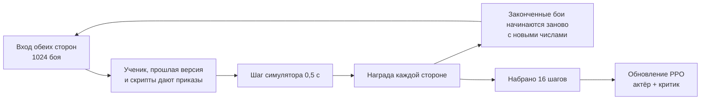

# Обучение сети

[← Назад](README.md) · [Документация](../README.md) › [Данные для обучения](README.md) › Обучение · [English](../../en/training/training.md)

Шаг 3 пути ([модель сети](network.md)): обучение [сети](model.md) методом PPO в
[симуляторе боя](simulator.md). Сделано 30.09.2026, с первым 5-минутным прогоном сети `small`.
Код — `tools/nn/train/` (PyTorch, работает в контейнере `snake-ai-trainer`).

## Как запустить

```bash
bash tools/nn/dock.sh tools.nn.train.run --minutes 5            # обучить, потом проверить и записать бои
bash tools/nn/dock.sh tools.nn.train.run --minutes 60 --no-eval
bash tools/nn/dock.sh tools.nn.train.evaluate --checkpoint build/nn-train/latest.pt
bash tools/nn/dock.sh tools.nn.train.checkpoint                  # записать необученную random.pt
```

Параметры `run`: `--battles` (боёв сразу, 1024), `--steps` (решений между обновлениями, 16),
`--preset` (`small` или `target`), `--limit` (предел времени боя, 900 с), `--lr`,
`--order-cost`, `--eval-per-scene` (512). Первый шаг симулятора компилируется ~45 с; во время
обучения он не входит.

## Что пишет

Всё — в `build/nn-train/` (не в Git):

| Файл | Что |
|---|---|
| `random.pt` | необученная сеть (случайные веса); пишется первой, это необученный противник |
| `latest.pt` | последняя обученная сеть |
| `pool/v*.pt` | прошлые версии: противники в игре с собой |
| `log.jsonl` | строка на обновление: потери, энтропия, KL, награда, доля побед против каждого противника, смены приказов |
| `eval.json` | итоговая проверка: обученная и необученная сеть против каждого противника |
| `replays/*/` | бои итоговой сети, записанные как записи из игры |

**Чекпойнт** (`tools/nn/train/checkpoint.py`) — один файл, словарь, сохранённый `torch.save`:
`format` (2), `kinds` (виды приказов по порядку кодов), `preset`, `config` (размеры сети: по нему
собирается актёр), `actor` (его веса — всё, что нужно игре), `critic` (только для обучения),
`meta` (обновление, бои, секунды). `load_policy(path)` отдаёт актёра, готового играть; так его
загружает [компаньон](../apps/bridge.md).

**Записи боёв** — папки как у записанного прогона: `manifest.json` и `events.jsonl` с `nn_sample`
каждую секунду и `result`. `tools.nn.gamedata.load(папка)` читает их как бой из игры. В
`manifest.json` ещё записано, за какую сторону играла сеть и против кого.

## Как идёт шаг обучения



Модули: `scenes.py` (арены и роли), `league.py` (кто с кем играет, набор прошлых версий),
`opponents.py` (скрипты), `randomise.py`, `reward.py`, `rollout.py` (бои и один шаг), `ppo.py`,
`evaluate.py` (проверка и записи боёв), `checkpoint.py`, `run.py`.

## Решения

**2 решения в секунду** — одно решение на шаг симулятора (0,5 с). Шаг — это такт морали в игре
([симулятор](simulator.md)); решение чаще не увидит ничего нового. Это и ритм в игре: состояние
на такте N, приказ на такте N + 0,5 с. Бой в 10 минут — ~1200 решений.

**Сцены.** Зеркальная арена Империи, Империя против скавенов и скавены против Империи
(`config/nn/arenas.json`); в каждой сторона 1 нападает и защищается, а ученик играет за сторону
1 или 2. Так сеть играет каждой армией в обеих ролях. Генератора армий пока нет.

**Противники.** Из 1024 боёв:

| Противник | Доля | Что делает |
|---|---:|---|
| сама сеть | 20 % | ученик с обеих сторон; обе стороны дают данные для обучения |
| прошлая версия | 30 % | одна сеть из набора, выбирается заново каждые 2 обновления; необученная всегда в наборе |
| `nearest` | 20 % | каждый отряд атакует ближайшего стоящего врага, бегом |
| `hold_shoot` | 20 % | стоит и стреляет; отряд ближнего боя контратакует врага ближе 80 м; если нападает — атакует через 5 минут |
| `hold` | 10 % | стоит (стреляет сам, отбивается) |

ИИ игры в обучении не участвует: он остаётся независимой проверкой ([модель сети](network.md#готовность)).

**Награда** (`reward.py`) стороны:

| Слагаемое | Вес | Зачем |
|---|---:|---|
| победа / поражение | +1 / −1 | цель; по пределу времени побеждает защитник |
| потеря здоровья врага − своя, за шаг, в долях от начального у стороны | 0,5 | ровный сигнал задолго до конца; за бой в сумме −0,5…+0,5, меньше победы |
| каждая настоящая смена приказа отряда, делённая на число отрядов стороны | 0,001 | против дёрганья (ниже) |

Первые два — с нулевой суммой: сторона 2 получает минус награду стороны 1. Наград за стиль пока
нет: характеры фракций — заглушки.

**Приказ «продолжать» (`keep`).** Сеть может не давать отряду нового приказа: `keep` (код вида 4)
оставляет действующий приказ; отряд без приказа стоит. Настоящая смена — новый вид, новая цель
атаки или точка движения дальше 10 м от действующей; `keep` и тот же приказ ещё раз ничего не
стоят. При 0,001 отряд, меняющий приказ каждое решение, стоит своей стороне ~1,2 за 10-минутный
бой — больше победы; одна смена в 5 с — ~0,12. Проверка в игре показала, что необученная сеть
меняет приказы почти каждую секунду и отряды дёргаются.

**PPO** (`ppo.py`) по схеме MAPPO: каждый свой отряд — агент со своим отношением вероятностей;
все отряды стороны делят её преимущество; критик видит всё поле (и в игру не попадает).

| Настройка | Значение | Почему |
|---|---|---|
| дисконт γ | 0,999 за решение | горизонт ~1000 решений (~8 мин), примерно бой; при 0,99 сеть забыла бы победу за 30 с до неё |
| GAE λ | 0,95 | обычно |
| обрезка | 0,2 | обычно |
| шаг обучения | 1e-4, Adam (eps 1e-5) | 3e-4 сдвигал политику слишком сильно за один набор (KL 0,14 на отряд) |
| эпохи × мини-наборы | 2 × 4 | обновление дороже самих боёв: больше эпох — медленнее цикл |
| остановка по KL | 0,05 на отряд | защита от слишком большого шага |
| энтропия | 0,01 | держит выбор открытым в начале |
| потеря ценности | 0,5 | обычно |
| норма градиента | 0,5 | обычно |

- **Память (GRU)** при обновлении не разворачивается во времени: каждый пример хранит память,
  с которой он действовал. Дешевле; память учится по одному шагу.
- **Маски.** Погибшие, бегущие и пустые места не дают ни потерь, ни энтропии; недопустимые
  приказы закрывает сама сеть (атака без видимого врага, приказы отряду, который их не принимает).
- **Предел времени 900 с** (записанные бои в игре тоже шли до 900 с), а не 60 минут игры: бои в
  симуляторе кончаются за 430–720 с, а застрявший бой занимал бы место на 7200 шагов. По пределу
  побеждает защитник, как в игре. Дальше обучение надо вести с полными 60 минутами.
- **Случайные числа боя** (`randomise.py`): в каждом бою урон, скорость и лидерство умножаются на
  1 ± 15 % (одинаково для обеих сторон) и на 1 ± 5 % для каждой стороны; места на старте сдвигаются
  до 5 м. Сеть этих множителей не видит.

**Проверка** (`evaluate.py`): 512 боёв на сцену против каждого противника (сторона ученика
чередуется), бои до конца, числа симулятора без изменений, старт сдвинут до 2 м, приказы
выбираются случайно по вероятностям сети, как в обучении.

## Первый прогон, 30.09.2026

`bash tools/nn/dock.sh tools.nn.train.run --minutes 5`: сеть `small` (0,78 М весов у актёра),
1024 боя сразу, RTX 5070 Ti.

- 5 минут обучения (и 46 с на компиляцию шага симулятора): 138 обновлений, 2,26 М шагов боя
  (~7500 в секунду), 1109 законченных боёв. Бой в симуляторе — 800–1800 решений, поэтому
  большинство боёв кончилось только в последние две минуты, и каждое место сыграло около одного боя.
- Проверка заняла ещё 7 минут для обученной сети и 4 для необученной (3072 боя на противника,
  512 на сцену).

**Доля побед в боях обучения** по минутам (победы / законченные бои):

| Минута | `nearest` | `hold_shoot` | `hold` | прошлые версии | необученная |
|---|---|---|---|---|---|
| 1–2 | 0/71 | 0/1 | 0/1 | — | — |
| 2–3 | 0/81 | 0/30 | — | — | — |
| 3–4 | 0/106 | 0/53 | — | 2/2 | 5/5 |
| 4–5 | 0/29 | 17/122 | 50/101 | 145/298 | 2/2 |

**Итоговая проверка** (`build/nn-train/eval.json`), 3072 целых боя на противника:

| Противник | Необученная: победы | Обученная: победы | Обученная: потеря здоровья своя / врага | Обученная: конец по времени |
|---|---:|---:|---|---:|
| `nearest` | 0,0 % (1) | **4,0 %** (124) | 0,83 / 0,37 | 8 % |
| `hold_shoot` | 6,3 % | **26,8 %** | 0,40 / 0,18 | 77 % |
| `hold` | 50 % | 50 % | 0,00 / 0,00 | 100 % |
| необученная сеть | — | 50 % | 0,36 / 0,55 | 100 % |

Все победы — в защите: нападая, обученная сеть не выиграла ничего; защищаясь, выиграла 100 %
против `hold` и необученной сети (по времени); против `hold_shoot` — 60 % в зеркале, 100 % за
скавенов, 0 % за Империю против скавенов; против `nearest` — 24 % за скавенов и 0 % в остальных. 50 % против `hold` и необученной сети — это ровно «побеждает защитник».

**Смены приказов** на стоящий отряд в минуту: необученная сеть 75,7, обученная 17,8 (29,5 против
`nearest`, 12,9 против `hold_shoot`, 6,6 против `hold`). Доли решений:

| | держать | идти | атаковать | отойти | продолжать |
|---|---:|---:|---:|---:|---:|
| необученная | 0,12 | 0,17 | 0,27 | 0,11 | 0,33 |
| обученная | 0,65 | 0,05 | 0,01 | 0,05 | 0,25 |

**Что делает сеть** (24 записи в `build/nn-train/replays/` и проверка):

- Стоит, где начала: центр армии за первые две минуты сдвигается на 0–7 м (чуть назад). Почти
  никогда не приказывает атаку (1 % решений).
- Стрелки стреляют сами, когда враг входит в дальность; в рукопашной отряды отбиваются, но никто
  не контратакует и не помогает соседу.
- Против `nearest` бежит вся армия (7 из 7 или 11 из 11 отрядов), а враг теряет от четверти до
  половины здоровья.
- Против `hold`, самой себя и необученной сети никто не двигается: бой кончается по времени,
  побеждает защитник.
- Перестала дёргаться: приказы меняются в 4 раза реже, в основном за счёт «держать» (действующее
  «держать» ничего не стоит) и `keep`.

Итак, за 5 минут сеть выучила одно: стоять, стрелять и не тратить приказы. Это лучше случайной
беготни необученной сети (доля побед сдвинулась: 0 → 4 % против `nearest`, 6 → 27 % против
`hold_shoot`), но это пассивная политика. К ней толкают правила: по времени побеждает защитник,
стоять — бесплатно, а атака сначала стоит здоровья. Покажет долгое обучение, перерастёт ли она
это; если нет, нападающему нужно давление (в награде или в наборе противников).

## Чего нет

- Сети `target`, долгих прогонов, полного предела в 60 минут.
- Генератора армий (1–20 отрядов, равный бюджет), других фракций.
- Наград за стиль по характеру фракции; добавок LoRA на фракцию и роль.
- Проверки в игре против ИИ игры.

## Тесты

`tests/tools/test_nn_train.py` (torch; в `.venv` пропускаются, запускаются в контейнере, как
`tests/tools/test_sim.py`): GAE, обрезка, награда, смены приказов, раскладка боёв, случайные
числа (уровень 1); маски, `keep`, симметрия наград между сторонами, перезапуск боёв (уровень 2);
шаг обучения на процессоре, чекпойнты, записи боёв читаются `gamedata`, проверка (уровень 3).
