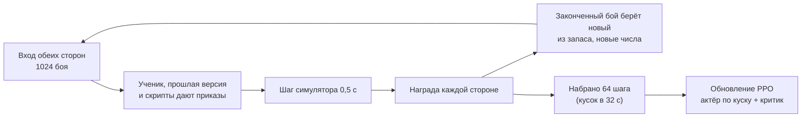

# Обучение сети

[← Назад](README.md) · [Документация](../README.md) › [Данные для обучения](README.md) › Обучение · [English](../../en/training/training.md)

Шаг 3 пути ([модель сети](network.md)): обучение [сети](model.md) методом PPO в
[симуляторе боя](simulator.md). Сделано 30.09.2026; 01.10.2026 переделано, чтобы нападающий
нападал (ниже): разгон копированием скрипта, память, обученная во времени, случайные армии; в тот
же день добавлены противник по образцу ИИ игры и меры против сползания политики в «только атаку»
([ниже](#против-ии-игры-01102026)). Код — `tools/nn/train/` (PyTorch, работает в контейнере
`snake-ai-trainer`).

## Как запустить

```bash
# 1. разгон: копия скриптов `nearest` и `ai_like` (случайные армии до 19 отрядов на сторону)
bash tools/nn/dock.sh tools.nn.train.imitate --minutes 5 --generated 19 --teacher nearest,ai_like \
  --out build/nn-train/runs/bcmix/bc.pt
# 2. PPO от неё на случайных армиях, сначала маленьких; в конце проверка и записи боёв
bash tools/nn/dock.sh tools.nn.train.run --name long_ai --minutes 80 --armies generated \
  --curriculum 5:0.15,10:0.4,19:1 --init build/nn-train/runs/bcmix/bc.pt --critic-warmup 8 \
  --lr 1.5e-4 --entropy 0.005 --entropy-end 0.001 --anchor 0.1 --anchor-end 0 \
  --mix '{"self": 0.1, "past": 0.15, "nearest": 0.2, "hold_shoot": 0.1, "hold": 0.05, "ai_like": 0.4}' \
  --eval-past build/nn-train/runs/long19/latest.pt
# только проверка: постоянные сцены или случайные бои EVAL_SEEDS на каждого противника (парами с обменом
# сторон, с базой скрипта и рейтингом: «Оценка сети: честные метрики» ниже)
bash tools/nn/dock.sh tools.nn.train.evaluate --checkpoint build/nn-train/latest.pt --per-scene 128
bash tools/nn/dock.sh tools.nn.train.evaluate --checkpoint build/nn-train/latest.pt --generated 512 \
  --opponents ai_like,nearest,hold_shoot,past --against build/nn-train/runs/long19/latest.pt
bash tools/nn/dock.sh tools.nn.train.checkpoint                  # записать необученную random.pt
# стандартная проверка изменения (ниже): отчёт о поведении до → после в build/nn-train/test5/<метка>/
DOCK_NAME=t2-test5 bash tools/nn/dock.sh tools.nn.train.test5 --label mychange [-- параметры run.py]
```

Главные параметры `run`: `--name` (папка в `build/nn-train/runs/`), `--init` (начать с
чекпойнта), `--armies` (`scenes` или `generated`), `--curriculum`, `--battles` (боёв сразу,
1024), `--steps` (решений в куске, 64), `--limit` (3600 с), `--lr`, `--anchor` и `--anchor-end`,
`--entropy` и `--entropy-end` (от первого ко второму линейно за прогон), `--critic-warmup`, веса
награды (`--timeout`, `--gold`, `--rout-share`, `--idle`, `--idle-tau`, `--idle-pause`, `--idle-step`,
`--idle-cap`, `--idle-share`, `--idle-rate`, `--idle-window`, `--hp`, `--standing`, `--order-cost`, `--lord`, `--lord-rout`, `--retarget`;
[золото](#потери-в-золоте-и-цена-простоя-нападающего-01102026), [лазейка](#ночь-01100210-почему-без-поводка-сеть-разваливается)), `--adv-norm`, `--reference self` и `--reference-every`, `--critic-init`, оценка каждого отряда (`--unit-credit` и `--unit-credit-end`, `--unit-gold`, `--unit-attrib`, `--shirk`, `--shirk-m`, `--shirk-side`,
`--flanked`, `--missile-melee`, `--crowd`, `--flank-attack`, `--idle-near`, `--unit-idle`, `--lord-exposed`, `--lord-exposed-hp`, `--neighbour`;
[ниже](#оценка-каждого-отряда-01102026)), `--updates` (учиться столько обновлений вместо
`--minutes`; тогда `--minutes` только ограничивает время), `--mix`, `--small доля:отряды` (такая доля каждого
запаса случайных боёв — не больше `отряды` на сторону), `--eval-every` минут / `--eval-opponents` /
`--eval-battles` (проверка на `EVAL_SEEDS` во время прогона, обе роли; лучшая средняя доля побед
сохраняется как `best_eval.pt`, проверки — в `eval_log.jsonl`, их время не идёт в обучение),
`--eval-past` (сеть за «прошлую версию» в итоговой проверке). Первые шаги компилируются
1–3 минуты (секунды, если прогон тех же размеров их уже компилировал: [скорость
обучения](#скорость-обучения)); во время обучения они не входят.

## Что пишет

Всё — в `build/nn-train/` (не в Git):

| Файл | Что |
|---|---|
| `random.pt` | необученная сеть (случайные веса), необученный противник |
| `latest.pt` | сеть последнего прогона (её по умолчанию берёт компаньон) |
| `runs/<имя>/latest.pt`, `best.pt` | последняя сеть прогона; сеть с лучшим окном боёв обучения против скриптов |
| `runs/<имя>/pool/v*.pt` | прошлые версии: противники в игре с собой |
| `runs/<имя>/log.jsonl` | строка на обновление: потери, энтропия, KL, действующие веса энтропии и KL, награда и она же по слагаемым за минуту боя по роли (`reward_parts`), качество критика (`ev`, по ролям), доля побед по противнику и роли, смены приказов, виды приказов, гибель полководцев, смены целей |
| `runs/<имя>/eval.json` | итоговая проверка |
| `runs/<имя>/replays/*/` | бои итоговой сети, записанные как записи из игры |
| `baselines/<противник>_<отряды>u_<предел>s_<версия>.json` | базы скриптов для проверки ([честные метрики](#оценка-сети-честные-метрики)) |

**Чекпойнт** (`tools/nn/train/checkpoint.py`) — один файл, словарь, сохранённый `torch.save`:
`format` (2), `kinds` (виды приказов по порядку кодов), `preset`, `config` (размеры сети: по нему
собирается актёр), `actor` (его веса — всё, что нужно игре), `critic` (только для обучения),
`meta`. `load_policy(path)` отдаёт актёра, готового играть; так его загружает
[компаньон](../apps/bridge.md).

**Записи боёв** — папки как у записанного прогона: `manifest.json` и `events.jsonl` с `nn_sample`
каждую секунду и `result`. `tools.nn.gamedata.load(папка)` читает их как бой из игры. В
`manifest.json` ещё записано, за какую сторону играла сеть и против кого.

## Протокол проверки (`test5`)

`tools/nn/train/test5.py` — стандартная короткая проверка изменения обучения. Ею закрывается каждое
изменение, поэтому проверки можно сравнивать между собой.

1. **До.** Начальная сеть (`--init`, по умолчанию `runs/long_ai/best.pt`, 2 из 4 против ИИ игры)
   играет проверку: 512 боёв случайных армий из `EVAL_SEEDS` (до 19 отрядов на сторону) на
   противника, по 256 в каждой роли, против `ai_like`, `nearest` и `hold_shoot`: 256 зёрен, каждое
   дважды, сеть на каждой из сторон ([пары с обменом сторон](#оценка-сети-честные-метрики)), и базы
   скриптов на тех же боях (из кэша). Все 1536 боёв идут одним набором
   (`evaluate.play(..., together=True)`), каждый раз те же бои.
2. **Обучение.** 36 обновлений PPO (`--updates`; ~5 минут на свободной карте) текущим кодом с
   настройками продолжения `long_ai2` (`test5.PROTOCOL`: случайные армии до 19 отрядов,
   `--small 0.35:6`, KL к `bcmix` 0,06 → 0,03, энтропия 0,003 → 0,001, цена простоя
   нападающего по умолчаниям `run.py`, `long19` среди прошлых версий) и закреплённым `--unit-credit 0` базовой проверки,
   чтобы проверки оставались сравнимыми, когда меняются умолчания `run.py`. Параметры после `--`
   уходят в `run.py` и меняют их: задача передаёт там свои новые настройки (`-- --unit-credit 0.3`);
   `report.json` хранит их все (`protocol`, `options`, `train_args`).
   Число обновлений, а не минуты: на карте, занятой другими задачами, обновление шло до 290 с, и
   5-минутная проверка успевала 1–2 обновления. `build/nn-train/latest.pt` не трогается.
3. **После.** Обученная сеть играет ту же проверку.
4. **Отчёт** — на экран и в `build/nn-train/test5/<метка>/report.json` (и `before.json`,
   `after.json` — проверки целиком): до → после по противнику и роли.
   Прогон тренда (`--updates 0 --minutes M --every K`) проверяет ещё и каждые K минут обучения
   (их время не идёт в обучение), хранит каждую сеть (`m<минута>.pt`) и проверку
   (`eval_m<минута>.json`) и пишет таблицу минута 0 / K / … / M (`trend.md`, `report.json`).
   Под блоком мастерства рядом с общим рейтингом стоит **расстояние от старта**: `start_kl` —
   средняя по отрядам KL (вид приказа и цель) актёра к сети, с которой начался прогон, на одной
   мини-партии обучающей партии каждого обновления (`ppo.distance`, поле `start_kl` в `log.jsonl`;
   среднее и последнее значение обновлений после прошлой точки), средняя KL поводка к его опоре и
   сколько раз `--anchor-roll` обновил опору (`test5.distance`, `distance` в json каждой проверки).
   Расстояние растёт вместе с рейтингом — поиск работает; рейтинг стоит, а расстояние замерло —
   поводок слишком короткий.

| Мера | Что считается (свои отряды ученика; `tools/nn/train/behaviour.py`) |
|---|---|
| мастерство (первый блок) | [честные метрики](#оценка-сети-честные-метрики): рейтинг ± 95 % в целом и по противнику, подогнанные перевес фракции и нападения, счёт пар, перевес над скриптом по паре фракций, запас победы по паре фракций (`skill` в `metrics()`) |
| доля побед | по противнику и роли |
| по фракциям | на противника: доля побед нашей фракции (EMP, SKV) по ролям и каждой пары, наша первой (EMP-EMP, EMP-SKV, SKV-EMP, SKV-SKV), с числом боёв и обменом золотом пары (`factions`, `matchups` оценки; `tools/nn/train/matchups.py`); один блок в `trend.md` |
| золото врага уничтожено, своё золото потеряно / бой; соотношение обмена золотом | золото награды ([ниже](#потери-в-золоте-и-цена-простоя-нападающего-01102026)) в конце боя, среднее на бой; соотношение — уничтожено / потеряно по всем боям клетки |
| свой полководец погиб | доля боёв, кончившихся гибелью своего полководца |
| секунд стрелков в рукопашной на бой, доля времени стрелков в рукопашной | секунды, что стрелки (дальность > 0, не полководец) стоят в рукопашной, на бой и как доля их времени |
| свои в рукопашной под ударом во фланг / тыл | доля своих отрядо-секунд рукопашной, когда отряд бьют во фланг или тыл (`flank_hit` симулятора ≥ 1; в игре удар во фланг стоит защитнику ~×1,74 потерь) |
| решения с кучей | доля решений, в которых больше 2 своих отрядов на одном враге (приказ атаки или враг, с которым дерутся), пока другой враг бьёт свой отряд во фланг или тыл |
| свои удары во фланг / тыл | доля своих отрядо-секунд рукопашной, когда отряд бьёт стоящего врага с его фланга или тыла (угол от его фронта ≥ `contact.front_deg`, 60°) |
| смены цели / мин, смены приказа / мин | на стоящий отряд, по противнику |
| виды приказов | доли решений отрядов ученика |
| способностей за бой | своих способностей начато (поставлена их перезарядка) |
| предел времени | доля боёв, кончившихся по времени |

«До» и «после» идут по ~10 минут (набор идёт, пока не кончится самый долгий бой), обучение ~7:
проверка — около получаса. `--before ПУТЬ` берёт готовую проверку «до» (только пока симулятор не
менялся). Тяжёлые задачи на карте идут по очереди: проверка ждёт, пока есть
`build/gpu-train.lock` (смотрит каждые 30 с), потом держит его (метка и время начала) до конца,
и при ошибке тоже; проверка, начатая меньше чем через 60 с после освобождения
(`build/gpu-train.released`), сначала ждёт эти 60 с, чтобы уже ждущие задачи шли раньше. `DOCK_NAME` даёт имя контейнеру (`dock.sh`). Шум: при 256 боях на роль доля
побед гуляет на ±3 пункта (одна стандартная ошибка); 36 обновлений сдвигают сеть мало, поэтому
проверка показывает, не сломало ли изменение что-то и куда идёт поведение, а не итоговую силу.

**Базовая проверка** (`--label baseline`, обучение до оценки каждого отряда: `--unit-credit 0`;
01.10.2026):

| Мера | `ai_like` нападая / защищаясь | `nearest` нападая / защищаясь | `hold_shoot` нападая / защищаясь |
|---|---|---|---|
| доля побед | 0,543 → 0,543 / 0,676 → 0,625 | 0,434 → 0,418 / 0,469 → 0,398 | 0,590 → 0,609 / 0,504 → 0,504 |
| свой полководец погиб | 0,27 → 0,17 / 0,07 → 0,10 | 0,09 → 0,07 / 0,09 → 0,08 | 0,22 → 0,22 / 0,13 → 0,16 |
| секунд стрелков в рукопашной на бой | 105 → 113 / 94 → 102 | 89 → 95 / 101 → 96 | 158 → 151 / 110 → 123 |
| свои под ударом во фланг / тыл | 0,35 → 0,36 / 0,36 → 0,38 | 0,35 → 0,37 / 0,39 → 0,40 | 0,26 → 0,27 / 0,33 → 0,35 |
| решения с кучей | 0,064 → 0,074 / 0,110 → 0,108 | 0,077 → 0,085 / 0,087 → 0,100 | 0,055 → 0,058 / 0,121 → 0,124 |
| свои удары во фланг / тыл | 0,28 → 0,29 / 0,30 → 0,31 | 0,25 → 0,26 / 0,27 → 0,28 | 0,27 → 0,28 / 0,29 → 0,30 |
| смены цели / мин | 0,66 → 0,96 | 0,76 → 1,13 | 0,69 → 0,97 |
| виды стоять / идти / атака | 0,28 / 0,23 / 0,49 → 0,27 / 0,22 / 0,51 | 0,28 / 0,22 / 0,49 → 0,27 / 0,21 / 0,51 | 0,26 / 0,26 / 0,49 → 0,23 / 0,24 / 0,53 |

`best.pt` треть своего времени в рукопашной получает удары во фланг или тыл, её стрелки стоят в
рукопашной ~100 с за бой, и в 6–12 % решений она сводит больше 2 отрядов на одного врага, пока
другой враг бьёт её во фланг, — то, что видно в игре. Способности (~4 за бой) — это способности
полководца, которые запускает правило ИИ в симуляторе: `scenario.py` по умолчанию отмечает сторону 2
как играемую ИИ игры, и тогда, когда за неё играет ученик (исправлено:
[способности полководца](#способности-полководца-01102026)).

## Оценка сети: честные метрики

Фракции неравны, и это нормально: игра — камень-ножницы-бумага. Но это портит измерения: в боях
Империи со скавенами исход большей частью решает фракция (при равном золоте сеть выигрывала 59–79 %
за скавенов против Империи и 24–50 % за Империю против скавенов; зеркала ~45–55 %), и доля побед
говорит больше о выпавших парах фракций, чем о сети. Проверка (`tools/nn/train/evaluate.py`,
`test5`, [проверка в игре](../launch/gate.md)) добавляет меры, из которых пара фракций
вынесена (`tools/nn/train/skill.py`, только numpy); старые поля остались как были.

| Мера | Как считается |
|---|---|
| **Пары с обменом сторон**, `pairs` | Каждый проверочный бой из генератора играется дважды на тех же армиях: сеть на стороне 1, потом на стороне 2 (противник — на другой). Атакует в обоих одна армия, поэтому роль сети тоже меняется. Пара выиграна целиком / поделена / проиграна целиком; `pair_score` = P(выиграна) − P(проиграна). `generated` боёв на противника — это `generated / 2` зёрен × 2 (`pair_count`: чётное, не меньше 2). Сцены и так играются с обеих сторон: их пары тоже считаются. У `hold` (только защищается) пар нет. |
| **Перевес над скриптом**, `baseline` | Те же бои, сыгранные скриптом противника против самого себя (`ai_like` против `ai_like`, …), — естественный перевес пары фракций. На бой: сеть минус скрипт, те же армии, та же сторона: победа и обмен золотом (`trade` = (уничтожено золота врага − потеряно своего) / бюджет), по паре фракций и в целом (`win_adv`, `gold_adv`, с `win_net`, `win_script`, …). Скрипт играет обе стороны, поэтому оба боя пары — один бой скрипта: по одному на зерно. |
| **Рейтинг**, `skill` | Одна логистическая регрессия с гребнем (Брэдли — Терри) по всем боям проверки: P(победа) = σ(r_противник + перевес(наша, их) + a · (+1 нападение, −1 защита)), r = мастерство сети − мастерство противника в логитах; перевес фракции антисимметричен (EMP-SKV = −SKV-EMP, 0 в зеркале); гауссово априорное с sd 3 на каждый параметр держит «все победы» конечными; интервал 95 % — из обратного гессиана. `overall` — среднее рейтингов по противникам: **одно число тренда**. 0 — наравне с этим противником в зеркале при равных ролях; +0,4 ≈ 60 %. |
| **Запас победы**, `margin` | Доля золота победителя, оставшаяся к концу (золото награды: потерянное здоровье, бегущий отряд — по `rout_share`), + когда побеждаем мы, − когда проигрываем: непрерывная мера; среднее по противнику и по паре фракций (`matchups[...]["margin"]`). |
| **Золото пары**, `pair_gold` | Большинство пар делится 1:1, и это прячет мастерство; золото — нет. В паре сеть играет армией A в одном бою и армией B в другом, противник наоборот, так что обе пары рук получают те же две армии. `pair_gold` = (золото врага, уничтоженное нами в обоих боях − противником в обоих) / бюджет, среднее ± 95 % по парам; оно равно нашему обмену армией минус обмену противника той же армией, для любой из двух. `exchange` — то же множителем: exp(среднее log(уничтожено / потеряно нами армией) − log(того же у противника)) с интервалом 95 % (золото не меньше 1 % бюджета; ×1 — руки наравне). `weak` / `strong`: армия, которой мы сыграли хуже (меньший запас; в поделённой паре — проигравшая оба боя), её уничтожено / потеряно по сумме пар и средний обмен в наших руках и в руках противника (`ratio_net`, `ratio_opp`, `trade_net`, `trade_opp`): насколько каждая пара рук выжимает проигрышную армию. В [проверке в игре](../launch/gate.md) золото — из конечного состояния отрядов (последний `nn_final`, иначе `nn_sample` в `events.jsonl`) × стоимость из паспорта (`config/nn/units.json`), посчитанное как в награде. |

`evaluate.play(..., paired=True, baseline=False)`: пары — по умолчанию для боёв из генератора
(`paired=False`, `--no-pairs`: каждый бой один раз, как раньше); база включена в `test5` и в
`python -m tools.nn.train.evaluate` (`--no-baseline`), выключена в проверках `run.py` и никогда не
считается со `--small` (размеры армий разошлись бы). Результат хранит списки по боям (`battles`:
победа, фракции, роль, сторона, пара, зерно, запас, обмен, уничтожено, потеряно, бюджет) для пересчёта.

**Пары в наборе.** `scenes.Generated` задаёт роль боя (сторона 1 нападает на чётных местах) и его
размер (`small`: первая доля банка) по месту в банке, поэтому набор раскладывается блоками по четыре
боя `[p, q, p, q]` (две пары; сеть на стороне 1, потом на стороне 2), блоки идут по противникам по
кругу (`paired_order`); со `small` банк дополняется в конце, чтобы маленькая доля кончалась на
границе блока (`padded`).

**Кэш базы.** `build/nn-train/baselines/<противник>_<отряды>u_<предел>s_<версия>.json`, на бой: зерно,
победитель, потерянное и начальное золото сторон, бюджет, фракции, нападающий. `версия` — хэш того,
от чего зависит бой скриптов (`evaluate.VERSION_FILES`: симулятор, генератор армий, скрипты,
награда, `config/nn`; и множители бюджета, как они загружены), поэтому изменение там играет базы
заново; файл с большим числом зёрен годится и для меньшего (начало списка). 768 боёв скриптов
(256 зёрен × 3 противника) занимают малую долю времени проверки сети.

**Отчёт.** `evaluate` печатает блок мастерства после своей таблицы; `report.json` `test5` (`before`,
`after`, `trend`: `skill`) и `trend.md` начинаются с него:

```
| skill | min 0 | min 10 |
| rating, overall (logit, ± 95%) | -0.05 ± 0.12 | ... |
| rating, ai_like | +0.25 ± 0.21 | ... |
| faction edge EMP-SKV (fitted) | -0.70 | ... |
| pair score (both/split/neither), ai_like (n 192) | +0.120 (0.21/0.69/0.09) | ... |
| vs script win / gold adv, ai_like EMP-SKV (n 86) | +0.047 / +0.008 | ... |
| margin, ai_like all / EMP-EMP / EMP-SKV / SKV-EMP / SKV-SKV | +0.019 / +0.052 / -0.165 / +0.177 / +0.005 | ... |
```

**Проверка, 02.10.2026.** `build/nn-train/test5/it1/m10.pt`, 384 боя на противника (192 пары)
против `ai_like`, `nearest` и `hold_shoot`, множитель бюджета скавенов 1,0 и 0,9 (подменён в памяти;
`build/eval_fair/`; пулы на 02.10 со щитовыми отрядами Империи):

| | скавены ×1,0 | скавены ×0,9 |
|---|---|---|
| доля побед EMP-SKV / SKV-EMP, `ai_like` | 0,314 / 0,733 | 0,686 / 0,407 |
| доля побед, сеть за Империю / за скавенов (все противники) | 0,419 / 0,558 | 0,581 / 0,407 |
| доля побед, все бои (пары) | 0,488 | 0,495 |
| перевес фракции EMP-SKV (подогнан) | −0,70 | +0,72 |
| **рейтинг в целом** | **−0,05 ± 0,12** | **−0,02 ± 0,12** |
| рейтинг только по боям за Империю / за скавенов | −0,04 ± 0,22 / −0,06 ± 0,23 | +0,00 ± 0,22 / −0,14 ± 0,22 |
| рейтинг `ai_like` / `nearest` / `hold_shoot` | +0,25 / −0,55 / +0,13 (± 0,21) | +0,24 / −0,30 / −0,01 (± 0,21) |
| счёт пар `ai_like` / `nearest` / `hold_shoot` | +0,12 / −0,26 / +0,06 | +0,12 / −0,14 / −0,01 |
| перевес побед над скриптом `ai_like` / `nearest` / `hold_shoot` | +0,06 / −0,13 / +0,03 | +0,06 / −0,07 / −0,00 |

10 % золота скавенов переворачивают перекрёстные пары: доля побед пары фракций сдвигается до 0,37,
доля побед сети за одну фракцию — на 0,16. Подогнанный перевес фракции это забирает
(−0,70 → +0,72); рейтинг в целом сдвигается на 0,03 (его интервал ±0,12), подогнанный только по
боям одной фракции — на 0,04–0,08 (±0,22). Внутри одного прогона доли побед разных смесей (за
Империю, за скавенов, перекрёстные пары, зеркала) — 0,42–0,56, их рейтинги — −0,06…−0,04. Доля побед
по всем боям с парами тоже держится (0,488 → 0,495), потому что пары уравнивают стороны; несбалансированная
смесь — нет. По отдельному противнику меры сдвигаются в пределах ~1,5 своего интервала (`nearest`
−0,55 → −0,30; армии, а значит и бои, в двух прогонах разные). Что это говорит о `m10`: в целом
наравне со скриптами, впереди `ai_like` (+0,25; на 6 пунктов лучше `ai_like` против самого себя),
позади `nearest` (на 13 пунктов хуже `nearest` против самого себя).

### Живость

Отряды, которые слишком часто меняют приказы и цели, выглядят искусственно. Только измеряется (без
награды), по противнику и роли, в каждой проверке (`tools/nn/train/behaviour.py` Tracker; отчёт и
trend.md `test5`, блок «liveliness») и в проверке в игре по записям игры (`tools/nn/gate.py`):

| Число | Что |
|---|---|
| смены приказа / отряд-мин | новый вид, новая цель атаки или точка движения дальше 10 м (как их считает цена приказов); собственное «атака → стоять» симулятора, когда цель погибла, не считается |
| смены цели атаки / отряд-мин | новая цель атаки, пока старая ещё стоит |
| возвраты A→B→A / отряд-мин | смена обратно на приказ до предыдущего в пределах 10 с |
| дрожание точки движения, м | среднее расстояние между соседними точками отряда, который продолжает идти (дальше 5 м: ближе мост не отдаёт); переносы точки за минуту движения |
| смены вне ближнего боя / отряд-мин; «дёргающиеся» отряды | смены стоящего отряда вне ближнего боя; доля отрядов с 30 с и больше вне ближнего боя, меняющих там приказ 6 раз в минуту и чаще |
| смены собственной цели / отряд-мин (1 с) | текущая цель отряда (с кем дерётся или в кого стреляет) меняется между целыми секундами, как её пишет игра; также у отрядов противника: в игре ИИ игры — опорная полоса |

В игре (проверка `it2/m15`, 8 боёв, атака / защита): 15,4 / 16,1 смены приказа на отряд-минуту,
5,8 / 4,9 смены цели атаки, 6,4 / 5,9 возвратов, дрожание точки 18 / 36 м, «дёргаются» все отряды;
смены собственной цели 3,19 на отряд-минуту (бои 0,53–6,84) против 1,26 у ИИ игры (0,38–2,76).
Та же сеть в симуляторе (32 боя на противника, CPU): 5,1–5,9 смены приказа, 0,7–1,4 смены цели,
0,9–1,4 возврата, дрожание 61–89 м, «дёргаются» 43–57 % отрядов, смены собственной цели 0,6–1,1 (у
скриптов 0,5–1,0): в игре она меняет приказы примерно втрое чаще.

### Ёмкость и забывание

Когда расширять сеть (×2): `tools/nn/train/capacity.py`, в конце каждого прогона `test5` (блок
«capacity and forgetting», `capacity` в report.json) или по готовой папке в `.venv`:
`python -m tools.nn.train.capacity build/nn-train/test5/<метка> [--prev <папка или report.json>]`.
Ничего не играется.

- Забывание: итоговая проверка против итоговой у предыдущей итерации (`--prev-report`, иначе папка
  `--init`, иначе метка с номером на один меньше) и против минуты 0 этой: по противнику счёт пар и
  золото пар, по паре фракций доля побед и обмен золота, по нашей фракции и роли доля побед (больше —
  лучше; 5 пунктов = 0,05). Одни и те же бои сопоставляются (противник, зерно, сторона), шум —
  ошибка парной разности; старая проверка без списков боёв сравнивается по своим ошибкам. Падение на
  5 пунктов и больше за пределами 2,58 стандартной ошибки (сравнивается около 40 чисел) — «forgetting»,
  падение на 5+ в пределах шума — «drop?». Против предыдущей итерации считается только при той же
  версии симулятора (имя кэша базы скрипта), иначе «drop?».
- Журнал обучения: объяснённая дисперсия, потери ценности и политики (наклон во второй половине:
  плато, если в пределах 2 ошибок от 0), энтропия, норма градиента (`ppo.update` пишет `grad_norm`,
  норму актёра до обрезки, и `grad_norm_critic`, с 02.10), kl, clip; первая треть → последняя.
- Вердикт: **widen-candidate**, когда старые числа падают за пределы шума, другие растут за пределы
  шума, а рейтинг в целом — нет (вытеснение: новое умение за счёт старого); **watch** — забывание при
  растущем рейтинге (размен), забывание без роста (обучение теряет умение: сначала настройки), падения
  в пределах шума, плато рейтинга и потерь ценности, падающий критик, обвал энтропии, растущая норма
  градиента; иначе **ok**.

На `it2` (02.10): внутри итерации 3 из 51 числа падают за пределы шума (хуже всего `hold_shoot` EMP
защита −15,6 пункта ± 12,4), ничего не растёт, рейтинг −0,06 → −0,16 (± 0,15) — **watch**: обучение
теряет умение, размер — не первый подозреваемый; против `it1` только «drop?» (в его проверке нет
версии симулятора, а бюджет скавенов и армии с тех пор менялись).

## Учения

Учебные бои, каждый учит одному умению (02.10.2026; код `tools/nn/train/drills/`). Учение — это
**рамка**, условие, а каждый бой внутри неё порождается из зерна: случайные составы и типы отрядов,
выполняющие условие, размеры, дистанции, место и поворот всего боя на карте (в пределах 700 м от
центра) и сторона, за которую играем мы (половина — сторона 1, половина — 2). Враг учения — скрипт
(противник лиги `drill_<имя>`); сеть играет с ним только на боях этого учения. Учения меняют лишь то,
*какие бои* играет сеть: подражания нет (учитель — это поводок). У каждого учения есть скрипт
`skilled`, поэтому позже можно добавить затухающее подражание по учению с ним в роли учителя.

**Проверка до того, как учение чему-то учит** (`tools/nn/train/drills/verify.py`): два наших скрипта
играют ≥ 256 порождённых боёв учения против его врага, с разбросом чисел обучения
(`randomise.Spread()`); наивный скрипт должен ясно проиграть (доля побед ≤ 0,25), скрипт с умением —
ясно выиграть (≥ 0,75), иначе рамка перенастраивается. В `drills.READY` (умолчание `--drills`)
только прошедшие учения.

```bash
bash tools/nn/dock.sh tools.nn.train.drills.verify --drill pincer,kiting --battles 256 --show 4
# обучение: 8 % боёв — учения, поровну (или --drill-weights '{"kiting": 2, "defend": 1}')
... tools.nn.train.run ... --armies generated --drills 0.08
```

Как встроено: `league.with_drills` забирает `--drills` смеси у остальных противников пропорционально
и делит по `--drill-weights`; `drills/source.py` `Mixed` строит один банк из порождённых боёв и боёв
каждого учения (`--drill-bank` на учение, обновляется вместе с банком), и строка учения
перезапускается боем своего учения, где наша сторона — та, за которую в этой строке играет ученик.
Бой учения идёт под стандартным лимитом, как любой бой обучения (правило пользователя, 03.10.2026: сеть не видит лимита времени, поэтому учение выигрывается или проигрывается боем; лимиты на учение были костылём: наивная игра в counter проигрывала только по часам 300 с и выигрывала при 900 с). В журнале обучения учения видны как противники
(`drill_pincer/attack` ...). `test5` проверяет каждое прошедшее учение (`--drill-eval`, по 128 боёв
на `DRILL_EVAL_SEEDS`): доля побед и обмен золотом по учению, рядом — два проверочных скрипта на тех
же боях, в отчёте и в `trend.md`, — так тренд показывает, учит ли сеть каждое умение.

| учение | рамка | враг | наивный (победы / обмен золотом) | с умением (победы / обмен золотом) | состояние |
|---|---|---|---|---|---|
| `counter` | Империя против Империи, две пары в случайном порядке вдоль линии, 110–200 м между линиями, 20–60 м между парами: наш X напротив своего контрюнита C (ближайшего врага), наш Z (бьёт C) напротив Y; (X, Z, C, Y): копейщики + флагелланты против флагеллантов + щитовых копейщиков / мечников; щитовые копейщики или мечники + двуручники против двуручников + флагеллантов; копейщики + двуручники против двуручников + мечников (отобраны из всех однофракционных пар, прогнанных 2 на 2 в симуляторе); нападаем мы, стандартный лимит | стоит; отряд, чей противник сломлен, давит ближайшего нашего | `nearest`: 0,215 / +0,06 (X ломается о контрюнит, а тот вступает во второй бой) | каждый отряд — на врага, которого бьёт (таблица по паспортам: самого дефицитного, затем самого опасного): 0,867 / +0,22 | проверено, 256 боёв, исход решает бой (лимитов нет); на проверочных зёрнах скрипт с умением 98 % времени бьёт правильную цель, наивный 53 % (36 % — свой контрюнит), первый правильный приказ 0,5 с против 150 с; в `READY` |
| `pincer` | 2–3 отряда имперских двуручников стоят в 120–180 м друг от друга (у каждого свой бой); на каждый — два наших колонной напротив (второй в 35–55 м позади), в 140–240 м, все имперские мечники или все крысолюды-кланкрысы (с кланкрысами не больше 2 отрядов двуручников); нападаем мы (проверено с лимитом 420 с: перепроверить на стандартном). В лоб двое наших проигрывают отряду двуручников, фронт + фланг побеждают | `hold` | `nearest`: 0,223 / +0,06 (пара наваливается в лоб) | ближний сковывает спереди и ждёт, второй обходит к открытому флангу, затем атакуют оба: 0,922 / +0,40 | нужно правило флангов (`build/sim-pending/flank.json`, в симулятор не взято): на нынешнем симуляторе оба 0,00 (удар во фланг не сильнее фронтального); с правилом флангов 0,281 / 0,922 (256 боёв: наивный выше 0,25, не проходит); не в `READY` |
| `hold_fire` | наш пехотный отряд (копейщики, щитовые копейщики, мечники; копейщики-кланкрысы, кланкрысы) в контакте с вражеским полководцем; 2–3 наших стрелковых отряда в 70–95 м позади — имперские лучники (против 2 свободных врагов), ночные бегуны (1–2) или пращники-рабы (1); свободные враги — стрелки вражеской фракции в 65–95 м за краем линии наших стрелков; нападаем мы, стандартный лимит (900 / 1800 с: наивный 0,10, с умением 0,83, без лимитов). В симуляторе стрельба в схватку вокруг полководца стоит нам в 1,5–3,5 раза больше, чем ему (пращи хуже всего); в схватку с обычным или бронированным отрядом окупается | ближний бой — на ближайшего, стрелки стоят | наши стрелки бьют полководца в схватке: 0,066 / −0,59 | наши стрелки бьют свободных врагов; когда их нет — отходят за дальность от схватки и стоят: 0,848 / +0,37 | проверено, 256 боёв, нынешний симулятор; в `READY` |
| `kiting` | 1–2 отряда ночных бегунов скавенов (бег 5,4 м/с, праща 140 м) против имперской пехоты ближнего боя (бег 3,0 м/с): против одного нашего — мечники; против двух — двое мечников или трое из копейщиков, щитовых копейщиков, мечников; линии друг против друга; нападаем мы (бегство до лимита проигрывает), стандартный лимит | каждый отряд бежит к ближайшему нашему стрелку | `hold`, стоять и стрелять: 0,059 / −0,24 (догоняют и выигрывают рукопашную) | стрелять, пока ближайший преследователь далеко, отбегать, когда он близко, остановиться и стрелять снова (каждая остановка — залп перезарядившихся за это время): 1,000 / +0,86 | проверено, 256 боёв, нынешний симулятор (нужно правило залпа, вошло пакетом); в `READY` |
| `defend` | построено, настраивается | | | | не в `READY` |

`READY` = `kiting`, `counter`, `hold_fire`: `--drills 0.08` даёт каждому ~2,7 % (прогоны цепочки задают свои учения через `--drill-weights`).

## Как идёт шаг обучения



Модули: `scenes.py` (откуда бои: арены или случайные армии, запас готовых начал), `league.py`
(кто с кем играет, набор прошлых версий), `opponents.py` (скрипты, среди них `ai_like`), `randomise.py`, `reward.py`,
`rollout.py` (бои и один шаг), `ppo.py`, `imitate.py` (разгон), `evaluate.py` (проверка и записи
боёв), `checkpoint.py`, `run.py`.

## Скорость обучения

Замерено 02.10.2026 на RTX 5070 Ti с настройками цепочки (`fix45d`: 1024 боя, до 19 отрядов на
сторону, 64 решения на обновление, `--unit-credit 0.3`, KL к опорной сети; скрипты замеров —
`build/speed/`, не в Git):

| | до | после |
|---|---:|---:|
| одно обновление: сбор 64 решений | 3,5 с | 1,4 с |
| одно обновление: PPO (31 мини-набор) | 4,8 с | 4,2–4,4 с |
| шагов боя в секунду | ~7 850 | ~11 300–11 700 |
| обновлений в минуту | 7,2 | ~10,3 |
| разгон (компиляция) прогона | ~100 с | 13 с, если это уже компилировалось (впервые: 160–170 с) |
| стандартная проверка (512 боёв × 3 противника) | 290–400 с | 155 с (с первой компиляцией: 260–270 с) |
| прогон тренда `test5`, 45 минут обучения, 3 проверки | ~69 мин, 274 обновления | ~56 мин и ~460 обновлений; те же 274 обновления — ~37 мин |

Куда уходило время (одно обновление до изменений; участки замерены с синхронизацией каждый): сбор
упирался в запуски операций (карта занята ~45 %): скрипты противников без компиляции 0,88 с,
проходы актёра, критика и прошлой версии 1,3 с, награды и счётчики 0,7 с, выбор действий 0,24 с, а
шаг симулятора (0,23 с) и вход (0,17 с) уже были скомпилированы. Обновление PPO упиралось в саму
карту (~85 %): обратный проход 2,9 с, прямой проход актёра 0,86 с, опорной сети 0,79 с, критика 0,47 с.

Что изменено (числа не меняются, кроме округления; проверка ниже):

- **Компиляция учёта шага** (`rollout.fast()`, только CUDA): скрипты и сборка приказов, цена
  приказов, награды и их счётчики, награда отряда, `reward.measure`, решение актёра (проход, выбор,
  приказы) и ценности критика при сборе, лог-вероятность, учёт поведения в проверке. Внутри
  скомпилированного графа кодировщик и голова способностей берут все слоты и маскируют чужие
  (`torch.compiler.is_compiling()`); без компиляции они по-прежнему выбирают свои слоты через `nonzero`.
- **Без чтения значений с карты в горячем цикле:** `torch.distributions` без проверки аргументов
  (она синхронизировала ~10 раз за решение), счётчики боёв и пределов времени на карте, места
  приказов по заранее сделанным индексам, счёт видов приказов сравнением вместо `bincount` / `one_hot`.
- **Память по куску** (`TokenMemory.scan`): нормировка, маски и остаток GRU считаются сразу на все
  64 шага, по шагам идёт только ячейка; `unbind` вместо `x[t]` (обратный проход каждого `x[t]`
  заполнял нулями тензор всего куска). Числа те же до бита.
- **Смещение внимания** строится один раз в памяти, выровненной для ядра внимания (раньше оно
  копировалось в каждом слое, туда и обратно).
- **Кэш компиляции:** `tools/nn/dock.sh` хранит ядра `torch.compile` в томе Docker
  `tww3-torch-cache` (`TORCHINDUCTOR_CACHE_DIR`, `TRITON_CACHE_DIR`).

Пробовали и не оставили: bf16 (autocast) в обновлении медленнее (5,06 с против 4,62 с) и сдвигает
лог-вероятности от сбора в среднем на ~2·10⁻³ (TF32 — на 2·10⁻⁵), столько же, сколько KL настоящего
обновления; компиляция блоков актёра и критика для обновления ничего не дала (4,60 с); вынос входных
весов GRU из цикла через слитую ячейку оказался медленнее. TF32 в обучении был включён и раньше (`allow_tf32`).

**То же распределение.** Скомпилированные функции против обычных на тех же состояниях (300 решений
512 боёв): награды, цена приказов, счётчики, приказы совпадают до ~10⁻⁴; ценности критика — в
пределах округления TF32. Выбор скомпилированного решения против логитов: вид 0,0408 / 0,9592 при
вероятностях 0,0408 / 0,9592. Короткие прогоны с закреплённым зерном (6 обновлений, зёрна 1–3, старый
код против нового): средняя ценность после 6 обновлений 0,208 / 0,136 / 0,061 против 0,293 / 0,203 /
−0,025, потеря ценности отряда 20–26 против 21–25, остальное так же; два прогона старого кода с одним
зерном расходятся уже после 4 обновлений. Проверка `fix45d/m45` (512 боёв на противника): `ai_like`
0,531 / 0,574 до, 0,547 / 0,551 и 0,512 / 0,551 после; `nearest` 0,457 / 0,395 → 0,438 / 0,426,
0,449 / 0,402; `hold_shoot` 0,547 / 0,449 → 0,570 / 0,426, 0,562 / 0,430 — в пределах шума ±3 пункта.

**Проверка: только идущие бои (02.10.2026).** Проверка идёт, пока не кончится самый долгий бой:
после ~1 600 решений живо меньше 5 % боёв (часто стояние до предела в 60 минут), а каждое решение всё
равно стоило ~22 мс на весь набор. Теперь, когда идущих остаётся не больше 64, набор сжимается до них
(`rollout.Battles.narrow`: состояние, расстановка, память, ждущее наблюдение по каждому бою; добивается
кончившимися боями, они заморожены; `evaluate.BUCKETS` — один постоянный размер, чтобы
скомпилированных графов было немного), а решение сжатого набора проигрывается одним графом CUDA
(`evaluate.Graphed`: при 64 боях решение было ~10 мс запусков ядер, проигрывание — ~2,8 мс). Итоги
читаются по всему набору (`evaluate._Full`); базы скриптов сжимаются так же.
`play(compact=False, cuda_graph=False)` идёт по-старому.

| проверка `test5` (1536 боёв, `it2/m15.pt`, кэш компиляции тёплый, базы из кэша) | время |
|---|---:|
| до: весь набор до конца | 180 с |
| сжатие до 64 | 133 с |
| сжатие до 64 + граф CUDA | 65 с |

Те же зёрна дают те же бои: симулятор детерминирован, кончившийся бой заморожен; проигрывание графа
даёт бит в бит те же бои, что и шаги (и с выбором по вероятностям, и жадно); против всего набора
отличаются только случайные выборы хвоста (их задаёт форма набора): 1533 итога из 1536 те же, доли
побед 0,520 / 0,361 / 0,447 против 0,520 / 0,361 / 0,441. Цена: новая версия кода один раз
компилирует графы на 64 боя (~75–100 с, дальше они в кэше torch). Не вышло: граф на любой размер
набора (`dynamic=True`) не строится — шагу симулятора тогда нужен компилятор C++, которого в
контейнере нет. Фаза всего набора (~35 с, ~22 мс на решение, упирается в карту) не изменилась. В
обновлении главное — 64 шага GRU и обратный проход внимания во float32.

## Решения

**2 решения в секунду** — одно решение на шаг симулятора (0,5 с). Шаг — это такт морали в игре
([симулятор](simulator.md)); решение чаще не увидит ничего нового. Это и ритм в игре: состояние
на такте N, приказ на такте N + 0,5 с. Бой в 10 минут — ~1200 решений.

**Бои.** Два источника, оба — запас готовых начал, из которого законченный бой берёт новый:

- сцены: зеркальная арена Империи, Империя против скавенов и скавены против Империи
  (`config/nn/arenas.json`), в каждой сторона 1 нападает и защищается;
- случайные армии [генератора армий](armies.md) (`tools/nn/armies`): равный бюджет (скавенам 0,8 от него), полководец и
  до `max_units` отрядов на сторону, в половине запаса нападает сторона 1. Только обучающие
  семена; запас обновляется каждые 5 минут; проверка — на `EVAL_SEEDS`, на которых не учились.
  Постепенность: до 5 отрядов на сторону первую четверть времени, до 10 — вторую, потом до 19.

Ученик играет то за сторону 1, то за сторону 2: каждой армией в обеих ролях. Карту сеть видит, как
её показывает игра (рамка миникарты Crossroads, как у компаньона), а не квадрат симулятора.

**Противники** (доли долгого прогона `long_ai`; у `long19` до него: `nearest` 40 %, `hold_shoot` 25 %, `hold` 10 %, без `ai_like`):

| Противник | Доля | Что делает |
|---|---:|---|
| сама сеть | 10 % | ученик с обеих сторон; обе стороны дают данные для обучения |
| прошлая версия | 15 % | одна сеть из набора, выбирается заново каждые 2 обновления; необученная всегда в наборе |
| `ai_like` | 40 % | по образцу ИИ игры ([ниже](#противник-ai_like)): линия идёт вместе бегом, стрелки встают на дальности и бьют сначала по вражескому полководцу, полководец в линии и никогда не первым, удар с 80 м (нападая) или встречный удар со 100 м (защищаясь), свободные отряды — на врагов, уже занятых боем (через их фланг), и на стрелков |
| `nearest` | 20 % | каждый отряд атакует ближайшего стоящего врага, бегом |
| `hold_shoot` | 10 % | стоит и стреляет; отряд ближнего боя контратакует врага ближе 80 м; если нападает — атакует через 5 минут |
| `hold` | 5 % | стоит (стреляет сам, отбивается); только защитником — нападающим он лишь пережидал бы час |

ИИ игры в обучении не участвует: он остаётся независимой проверкой ([модель сети](network.md#готовность)).

**Награда** (`reward.py`) стороны:

| Слагаемое | Вес | Зачем |
|---|---:|---|
| победа / поражение | +1 / −1 | цель |
| предел времени (обе стороны ещё стоят) | защитнику +1, нападающему **−1,5** | хуже проигранного боя: нападающий, который только стоит, должен терять больше того, кто напал и не смог |
| (уничтоженное золото врага − потерянное своё) / бюджет, за шаг ([золото](#потери-в-золоте-и-цена-простоя-нападающего-01102026)) | 1,0 | ровный сигнал задолго до конца, по тому, чего отряды стоят; заменяет два слагаемых ниже |
| потеря здоровья врага − своя, за шаг, в долях от начального у стороны | 0 (было 0,5) | теперь в золоте |
| доля армии врага (по цене), что перестала стоять, − своя, за шаг | 0 (было 0,5) | теперь в золоте (бегущий отряд — половина того, что у него осталось) |
| нападающему — каждое решение, в котором ни один его отряд не дерётся и не стреляет (и на марше) | 0,0002 × m: до его первого урона m = exp(t / 150 с) − 1; после него 0, пока он наносит урон, затем ступень вверх каждые 30 с без урона, m = exp(0,5 k) − 1; m не больше 20 ([ниже](#потери-в-золоте-и-цена-простоя-нападающего-01102026)) | развернуться и дойти почти бесплатно (3 минуты: −0,07), стоять дальше — нет (10 минут без урона: −2,2, больше −1,5 на пределе); пауза в бою дёшева, только пока она короткая |
| каждая настоящая смена приказа отряда, делённая на число отрядов стороны | 0,001 | против дёрганья (ниже) |
| гибель вражеского полководца − гибель своего | 0,3 | правило морали игры делает её решающей (−16, потом −10 очков каждому отряду); одна доля цены полководца (в «перестала стоять») этого не видит; в проверке в игре сеть отправляла полководца в бой одного |
| каждая смена цели атаки на другую, пока прежняя ещё стоит, делённая на число отрядов стороны | 0,003 | гистерезис: в боях проверки отряды меняли цель между двумя врагами каждые 1–2 с |

Победа, золото и полководцы — с нулевой суммой (сторона 2 получает минус награду стороны 1),
кроме предела времени. Формирующие слагаемые — разности потенциала: какой исход лучше, они не
меняют. Наград за стиль пока нет: характеры фракций — заглушки. Кроме награды стороны у каждого
отряда есть своя (`reward.unit_step`, [оценка каждого отряда](#оценка-каждого-отряда-01102026)); в
награду стороны она не входит.

**Приказ «продолжать» (`keep`).** Сеть может не давать отряду нового приказа: `keep` (код вида 4)
оставляет действующий приказ; отряд без приказа стоит. Настоящая смена — новый вид, новая цель
атаки или точка движения дальше 10 м от действующей; `keep` и тот же приказ ещё раз ничего не
стоят. При 0,001 отряд, меняющий приказ каждое решение, стоит своей стороне ~1,2 за 10-минутный
бой — больше победы; одна смена в 5 с — ~0,12.

**Разгон** (`imitate.py`): до PPO сеть копирует скрипты (обучение подражанием) в боях, где каждая
сторона играет случайным скриптом (учителя — 70 % времени); копируются стороны, которыми играет
учитель: вид приказа (стоять, идти, атаковать, отойти), цель, точка движения (ближайшая из ячеек
точки сети) и бег. `long19` копировала один `nearest` (за 6 минут — 100 % видов и 99 % целей);
`long_ai` копирует `nearest` и `ai_like` вместе (за 5 минут — 99 % / 98 %), почему — [ниже](#против-ии-игры-01102026). Со случайных весов PPO за 10 минут не
получил армию, которая дерётся вместе (раунды ниже); копия начинает там, где лучший скрипт. Учитель
— наш скрипт, не ИИ игры, поэтому проверка против игры остаётся независимой. Дальше PPO: первые
8 обновлений учится только критик (он начинает с нуля, а актёр уже играет), а слагаемое KL держит
политику рядом с копией (`--anchor`, 0,1), чтобы шумные шаги PPO её не размыли; в `long_ai` оно
за прогон спадает до 0 (`--anchor-end`), чтобы копия не заперла политику.

**PPO** (`ppo.py`) по схеме MAPPO: каждый свой отряд — агент со своим отношением вероятностей;
все отряды стороны делят её преимущество, и каждый добавляет своё
([оценка каждого отряда](#оценка-каждого-отряда-01102026)); критик видит всё поле (и в игру не
попадает).

| Настройка | Значение | Почему |
|---|---|---|
| дисконт γ | 0,9997 за решение | горизонт ~3300 решений (~28 мин): победа через 10 минут весит ещё 0,7 (при 0,999 — 0,3) |
| GAE λ | 0,95 | обычно |
| обрезка | 0,2 | обычно |
| шаг обучения | 1,5e-4, Adam (eps 1e-5) | от копии бо́льшие шаги без якоря за 15 минут сползали к стоянию |
| эпохи, мини-набор | 1, 4096 решений (целые куски) | обновление дороже самих боёв; память карты 16 ГБ |
| остановка по KL | 0,05 на отряд | защита от слишком большого шага |
| энтропия вида приказа | `long19` 0; `long_ai` 0,005 → 0,001 | при копии одного `nearest` бонус 0,01 сталкивал политику с атаки, и она теряла половину побед; при копии двух скриптов он не даёт угаснуть «стоять / идти / отойти» |
| KL к копии | `long19` 0,1; `long_ai` 0,1 → 0 | см. разгон |
| потеря ценности, норма градиента | 0,5, 0,5 | обычно |

- **Память (GRU) во времени.** Сбор — кусок в 64 решения (32 с боя) каждого боя; обновление
  прогоняет актёра по каждому куску с памяти, сохранённой в его начале, и обнуляет её там, где
  начинается новый бой (PPO с памятью, сохранённое состояние как в R2D2). По шагу идёт только
  GRU; слои до и после неё считаются на весь кусок сразу.
- **События во входе** ([вход](model.md)): у каждого отряда — как давно он дрался в рукопашной и
  бежал (у врага — пока виден); убит ли свой и вражеский полководец и как давно (игра это объявляет).
- **Маски.** Погибшие, бегущие и пустые места не дают потерь; недопустимые приказы закрывает сама
  сеть (атака без видимого врага, приказы отряду, который их не принимает).
- **Предел времени 60 минут**, как в игре: по нему побеждает защитник.
- **Случайные числа боя** (`randomise.py`): в каждом бою урон, скорость и лидерство умножаются на
  1 ± 15 % (одинаково для обеих сторон) и на 1 ± 5 % для каждой стороны; места на старте сдвигаются
  до 5 м. Сеть этих множителей не видит.
- **Скорость.** Вход сети компилируется `torch.compile` (8 мс → 0,6 мс на 1024 боя): одно решение
  1024 боёв за обе стороны вместе с шагом симулятора — ~32 мс.

**Проверка** (`evaluate.py`): целые бои до конца против каждого противника, сторона ученика
чередуется (обе роли), числа симулятора без изменений, старт сдвинут до 2 м, приказы выбираются
случайно по вероятностям сети, как в обучении; `hold` — только защитником. Сцены: `--per-scene`
боёв на сцену; случайные армии: `--generated` боёв из `EVAL_SEEDS`. По противнику и роли ещё доля
боёв, кончившихся гибелью своего / вражеского полководца, виды приказов и смены цели атаки в
минуту.

## Потери в золоте и цена простоя нападающего, 01.10.2026

**Потери по золоту, а не по здоровью** (`reward.gold_lost`, `gold_sides`, `budget`). Отряд стоит своей
`multiplayer_cost` (`config/nn/units.json`); потерянное им золото — эта цена × потерянная доля отряда:

| Отряд | Потерянная доля | Почему |
|---|---|---|
| сражается | потерянное здоровье (`1 − hp_abs / hp0`) | у отряда из многих людей здоровье и люди падают вместе (убитые уходят по мере урона), то есть это примерно потерянные люди, без ступеньки целого человека; у одиночки (полководец, монстр) люди падают 1 → 0 только при гибели, а здоровье показывает урон раньше |
| мёртв, ушёл с карты, рассеян | 1 | он уже не вернётся |
| бежит (не рассеян) | потерянное здоровье + 0,5 × оставшееся (`--rout-share`) | сейчас он вне боя, но может сплотиться; сплочение возвращает половину (слагаемое не обрезано снизу: разность потенциала) |

Слагаемое стороны за шаг: `gold` × (уничтоженное золото врага − потерянное своё) / бюджет, бюджет —
средняя начальная цена двух армий (одна на обе стороны, так что сумма ровно нулевая). Вес 1,0 —
прежние `hp` 0,5 + `standing` 0,5, тот же масштаб: формирование за бой — не больше примерно ±1,
главным сигналом остаётся победа. `hp` и `standing` по умолчанию 0: слагаемое золота держит и
здоровье, и бегство, и с ними одна потеря считалась бы дважды. Слагаемое полководца (0,3) осталось:
это удар по морали от его гибели (−16, потом −10 очков каждому отряду), а не его золото. Слагаемое
отряда (`--unit-credit`) тоже в золоте (`unit_gold`, таблица ниже).
Огонь по своим (02.10.2026, `Weights.friendly_fire` 1): в `unit_gold` золото, которое снаряды отряда
сняли со своей стороны, — потеря стрелка, а не того, в кого попали (симулятор `missile.friendly`:
`ff_dealt` / `ff_taken`); награда стороны платит его в любом случае. Проверка it4: четыре отряда
пращников 119 с стреляли во вражеского Warlord в ближнем бою с нашими копейщиками; ~2 HP своих на
выстрел и в игре, и в симуляторе (игра 2,3 / 1,8, симулятор 2,3 / 1,8 для стрелков ИИ игры и наших).

**Цена простоя нападающему: экспонента по времени, урон её сбрасывает** (`reward.idle_cost`,
`idle_scale`, `struck`). Нападающий платит 0,0002 (`--idle`) × m за каждое решение, в котором ни один
его отряд не дерётся и не стреляет, — и на марше к врагу тоже (утреннее освобождение за сближение,
`reward.closing` и `--close-speed`, убрано; линейный `--idle-ramp` тоже). m:

- до его первого урона: m = exp(t / 150 с) − 1 (`--idle-tau`): почти ничего первые минуты (время
  развернуться и дойти), потом резко больше;
- после него: 0, пока он наносит урон; если урона нет 30 с (`--idle-pause`), k = ⌊секунд с
  последнего урона / 30 с⌋ и m = exp(0,5 k) − 1 (`--idle-step`): ступень вверх каждые 30 с, быстрее
  первой кривой при тех же секундах и без её отсрочки; новый урон сбрасывает в 0;
- не больше 20 (`--idle-cap`): 0,004 за решение, 0,48 в минуту.

Урон — любое здоровье, потерянное защитником за шаг (`reward.struck`, столбец 0 `measure`: его
отнимают только рукопашная, стрелы и способности нападающего). `rollout.Battles.last_hit` [B] хранит
время боя последнего урона нападающего в каждом бою (−1 до первого) и сбрасывается, когда бой
начинается заново. Защитник не платит никогда. Цена, 2 решения в секунду:

| Без урона с начала | за решение | накоплено |
|---|---:|---:|
| 1 мин | 0,0001 | 0,006 |
| 3 мин | 0,0005 | 0,07 |
| 5 мин | 0,0013 | 0,26 |
| 10 мин | 0,004 (потолок с 7,6 мин) | 2,2 |
| 15 мин | 0,004 | 4,6 |

| Пауза после урона | за решение с этого момента | за паузу | первая кривая при тех же секундах |
|---|---:|---:|---:|
| 30 с | 0,00013 | 0,000 | 0,001 |
| 60 с | 0,00034 | 0,008 | 0,006 |
| 90 с | 0,0007 | 0,03 | 0,013 |
| 120 с | 0,0013 | 0,07 | 0,03 |
| 180 с | 0,0038 | 0,28 | 0,07 |

Против исхода (победа +1, поражение −1, нападающий на пределе −1,5): 3 минуты развёртывания и марша
стоят 0,07, четырнадцатую часть поражения (сближение с `nearest` — через ~50–120 с); нападающий, не
нанёсший урона к 10-й минуте, уже заплатил 2,2 — больше самого −1,5 на пределе, так что стоять дальше
хуже, чем напасть и проиграть (−1 и потерянное золото); каждая следующая минута — −0,48. Предел через
час весит 0,9997^7200 ≈ 0,11, а цена простоя платится сейчас. Короткие паузы в бою (перестроение,
откат после натиска) стоят мало (90 с: 0,03), 3 минуты без урона — 0,28. Нападающий, который так и не
бьёт, на потолке видит до 0,004 / (1 − 0,9997) ≈ 13: такой масштаб критик видит только в застрявших
боях. Поздняя цена темпа (`--tempo`, `--tempo-after`: 0,0003 за решение после 600 с, что бы
нападающий ни делал, в `long_ai2` и `test5.PROTOCOL`) убрана: на нападающего давит одна цена простоя.

**Меры** (evaluate, test5): уничтоженное золото врага и потерянное своё на бой (золото награды в конце
боя), их соотношение (по всем боям клетки) и средний размен (уничтожено − потеряно) / бюджет, по
противнику и роли.

**Прогон тренда** (`test5 --updates 0 --minutes 30 --every 10 --eval 256`): от `long_ai/best.pt`,
настройки протокола и новая награда, 30 минут обучения с полной проверкой (256 боёв `EVAL_SEEDS` на
противника, обе роли, против `ai_like`, `nearest`, `hold_shoot`) каждые 10 минут; сети хранятся как
`m10.pt`, `m20.pt`, `m30.pt` в `build/nn-train/test5/<метка>/`.

Прогон `t0_gold30` (01.10.2026; 181 обновление, 12 615 учебных боёв; 256 боёв на противника, по
128 на роль, то есть ±4–5 пунктов на клетку; минута 30 — это `after.json`):

| Мера (нападая / защищаясь) | мин 0 (`best.pt`) | мин 10 | мин 20 | мин 30 |
|---|---|---|---|---|
| доля побед, `ai_like` | 0,52 / 0,59 | 0,57 / 0,41 | 0,48 / 0,66 | 0,51 / 0,58 |
| доля побед, `nearest` | 0,41 / 0,39 | 0,37 / 0,30 | 0,41 / 0,46 | 0,46 / 0,40 |
| доля побед, `hold_shoot` | 0,55 / 0,45 | 0,57 / 0,39 | 0,55 / 0,48 | 0,52 / 0,45 |
| среднее 6 долей побед | 0,487 | 0,435 | **0,504** | 0,487 |
| соотношение обмена золотом, `ai_like` | 1,02 / 1,09 | 1,01 / 0,94 | 0,96 / 1,10 | 1,01 / 1,05 |
| соотношение обмена золотом, `nearest` | 0,97 / 0,96 | 0,94 / 0,88 | 0,94 / 0,99 | 0,98 / 0,94 |
| соотношение обмена золотом, `hold_shoot` | 1,06 / 1,00 | 1,04 / 0,95 | 1,04 / 1,02 | 1,03 / 1,00 |
| средний размен золота / бюджет | +0,014 | −0,024 | +0,013 | +0,008 |
| свой полководец погиб, `ai_like` | 0,30 / 0,10 | 0,29 / 0,26 | 0,27 / 0,07 | 0,36 / 0,18 |
| свой полководец погиб, `hold_shoot` | 0,27 / 0,20 | 0,23 / 0,24 | 0,20 / 0,15 | 0,37 / 0,20 |
| предел времени, нападая на `ai_like` / `hold_shoot` | 0 / 0,01 | 0 / 0,01 | 0 / 0 | 0,04 / 0,06 |
| смен приказа в минуту (`ai_like`) | 3,1 | 5,3 | 4,8 | 4,3 |
| смен цели в минуту (`ai_like`) | 0,66 | 1,21 | 1,01 | 1,03 |
| виды стоять / идти / атака (`ai_like`) | 0,30 / 0,22 / 0,48 | 0,34 / 0,20 / 0,46 | 0,22 / 0,22 / 0,56 | 0,34 / 0,18 / 0,49 |

Ровно: средняя доля побед 0,487 → 0,435 → 0,504 → 0,487, обмен золотом держится около 1,0 (в
среднем 0,96–1,02); провал на 10-й минуте (защита: −18 пунктов против `ai_like`, свой полководец
погибал в четверти защит) к 20-й вернулся. Лучшая сеть — `m20.pt` (обновление 122: 0,504, худшая
клетка 0,41 против 0,39 на минуте 0), в пределах шума от `best.pt`. Что сдвинулось: смены приказов и
целей +40–80 % (цена смены цели 0,003 против слагаемого золота, которое платит за удар по более
дорогому врагу), а на 30-й минуте полководец нападающего гибнул чаще (0,36–0,37) и 4–6 % нападений
на `ai_like` / `hold_shoot` упёрлись в предел времени (раньше — ни одного) — следить: освобождение
марша не должно позволить нападающему ходить, не вступая в бой. 30 минут PPO от `best.pt` с наградой
в золоте измеримо не помогли и не навредили; `long_ai2` со старой наградой тоже шёл ровно или вниз.

## Оценка каждого отряда, 01.10.2026

В игре: 4 отряда пехоты свалились на одного врага, пока 2 отряда пехоты скавенов заходили им во
фланг, а 2 отряда лучников застряли в рукопашной. Все отряды делили преимущество стороны, и ошибка
одного терялась в итоге боя: его градиент был тем же, свалился ли он в кучу или прикрыл фланг.

**Своя награда отряда** (`reward.unit_step`, за решение, на отряд; в награду стороны не входит):

| Слагаемое | Вес | Зачем |
|---|---:|---|
| размен золота: n_своих × (уничтоженное им золото − потерянное им золото) / бюджет (был размен здоровья) | 0,05 | что случилось с самим отрядом; уничтоженное (`--unit-attrib 1`, `reward.attributed`) — потерянное за шаг золото каждого вражеского отряда (здоровье, бегство, разгром, гибель; без огня по своим его же стороны), поделённое между отрядами, которые с ним дерутся или по нему стреляют, по нанесённому каждым HP; потерянное — изменение его потерянного золота (и бегство, и сплочение), огонь по своим — на стрелке. До 02.10 уничтоженное было нанесённым HP × цена HP цели (`--unit-attrib 0`; [почему заменено](#награда-отряда-за-вклад-а-не-за-самосохранение-0210)) |
| под ударом во фланг или тыл в рукопашной | −0,0002 | в игре ~×1,74 потерь; размен видит потери, это — положение до того, как они набегут |
| стрелки в рукопашной | −0,0002 | застрявшие лучники |
| куча: больше 2 своих на одном враге, пока другой враг бьёт свой отряд во фланг или тыл, по доле лишних (n − 2) / n | −0,0002 | вся куча платит за n − 2 отряда: лишние должны повернуть на того, кто заходит во фланг |
| отряд ближнего боя без приказа атаки вне рукопашной, пока товарищ ближе 60 м дерётся (`idle_near`) | 0 | пробовали −0,0004 (ниже): отряды сваливались в кучу |
| отряд ближнего боя (не стрелки, не полководец) не вносит вклада — вне рукопашной, не стреляет и не сближается с врагом (не меньше 1 м/с к ближайшему стоящему врагу или к цели своего приказа атаки: `Weights.shirk_close`, `reward.closing`), пока его сторона дерётся в рукопашной и враг ближе 300 м (`shirk`, `--shirk`, `--shirk-m`; `reward.shirking`) | 0 | стоять в стороне больше не бесплатно ([ниже](#награда-отряда-за-вклад-а-не-за-самосохранение-0210)); до итерации 7 освобождало любое движение, и сеть научилась бродить ([ниже](#итерация-7-вес-отряда-05-уводит-из-боя-0210)) |
| удар стоящему врагу во фланг или тыл | +0,0002 | как штраф: обмен ударом во фланг — нулевая сумма между двумя отрядами |
| + 0,5 × среднее того же у своих отрядов ближе 40 м | | что рядом: отряд, который оставил соседа под ударом во фланг, платит за это |

`behaviour.facts` находит это по состоянию симулятора (так же, как [протокол проверки](#протокол-проверки-test5)).
Пределы: каждое формирующее слагаемое — не больше 0,0002 × 1200 = 0,24 на отряд за 10-минутный бой,
четверть победы, а оценка отряда весит меньше оценки стороны (ниже). В боях `best.pt` против
`ai_like` и `nearest` (256 боёв, 1200 решений) средний размер на отрядо-решение: размен 6,4e-5,
фланг 2,0e-5 (10 % отрядо-решений), удар во фланг 7,7e-6 (8 %), куча 6,2e-6, стрелки в рукопашной
4,2e-6 (2 %) — размен главный, формирующие слагаемые — ~40 % всего.

**У критика** вторая голова (`critic.Critic(..., per_unit=True)`): по токену каждого отряда, видя всё
состояние, — ценность своей награды отряда × 100 (`unit_scale`: около размера стороны, чтобы общие
слои её чувствовали). Её последний слой начинается с нуля, поэтому старый чекпойнт загружается
(`Critic.load`). GAE идёт по каждому отряду на его награде. **Преимущество** отряда i:
A_i = A_стороны + `unit_credit` × A_отряда_i. A_отряда центрируется в каждом решении по отрядам
стороны, которые принимают приказы, — оно говорит только, какой отряд сделал лучше товарищей, и
никогда не толкает всю сторону в одну сторону, — потом оба нормируются по мини-набору (награда
отряда в ~100 раз меньше награды стороны и иначе пропала бы рядом с ней). `--unit-credit` 0,3
оставляет победу и поражение стороны главным сигналом; 0 (пока по умолчанию) — ровно старое
обучение.
Ценность отрядов учится вместе с ценностью стороны (вес потери 0,5); в журнале — `unit_value_loss`
и `unit_adv_share` (доля части отряда в размере преимущества, ~0,27 при 0,3).

**Подбор** ([протокол проверки](#протокол-проверки-test5), по 36 обновлений от `best.pt`; одно и то
же «до» для всех; доли побед после обучения, `ai_like` / `nearest` / `hold_shoot`, нападая / защищаясь):

| Прогон | Настройки | Доли побед после | Вид «стоять» | Кучи, `ai_like` нап. / защ. | Под ударом во фланг, `ai_like` нап. / защ. |
|---|---|---|---|---|---|
| до (`best.pt`) | — | 0,54 / 0,68, 0,43 / 0,47, 0,59 / 0,50 | 0,28 / 0,28 / 0,26 | 0,064 / 0,110 | 0,35 / 0,36 |
| `baseline` | `--unit-credit 0` | 0,54 / 0,63, 0,42 / 0,40, 0,61 / 0,50 | 0,27 / 0,27 / 0,23 | 0,074 / 0,108 | 0,36 / 0,38 |
| `u03` | 0,3, без центрирования, удар во фланг 1e-4 | 0,51 / 0,61, 0,38 / 0,43, 0,57 / 0,50 | 0,31 / 0,27 / 0,28 | 0,076 / 0,120 | 0,35 / 0,37 |
| `u06x2` | 0,6, без центрирования, формирующие × 2 | 0,18 / 0,31, 0,18 / 0,21, 0,09 / 0,20 | **0,73 / 0,52 / 0,84** | 0,016 / 0,044 | 0,45 / 0,46 |
| `u03c` | 0,3, с центрированием (настройки задачи) | 0,51 / 0,65, 0,44 / 0,50, 0,56 / 0,44 | 0,33 / 0,29 / 0,33 | 0,069 / 0,121 | 0,36 / 0,39 |
| `u06c` | 0,6, с центрированием | 0,28 / 0,36, 0,22 / 0,21, 0,19 / 0,29 | **0,70 / 0,46 / 0,85** | 0,026 / 0,066 | 0,41 / 0,46 |
| `u06ci` | 0,6, с центрированием, `--idle-near 4e-4` | 0,48 / 0,58, 0,33 / 0,39, 0,55 / 0,47 | 0,33 / 0,20 / 0,36 | **0,114 / 0,205** | 0,39 / 0,42 |

- **Сильная оценка отряда учит сторону стоять.** При 0,6 политика за 36 обновлений ушла в «стоять»
  (0,7–0,85 решений) и потеряла половину побед (66–77 % её нападений на `hold_shoot` упёрлись в
  предел времени): отряд, который не лезет в бой, не теряет здоровья, не получает удара во фланг и
  не попадает в кучу, поэтому выглядит лучше товарищей, которые дерутся. Кучи стали в 2–4 раза
  реже — но потому, что никто не дерётся. Центрирование по решению (оно не может толкать всю
  сторону) этого не остановило: это выбор отряда против товарищей, а не стороны.
- **Цена за стояние рядом** (`idle_near`: отряд ближнего боя без приказа атаки вне рукопашной, пока
  товарищ ближе 60 м дерётся) останавливает стояние, и отряды сваливаются в кучу: куч вдвое больше
  (0,11–0,23 решений). Слагаемые отряда тянут между «держись в стороне» и «влезай»; без слагаемого,
  которое говорит, *куда* влезать, отряд влезает в ближайшую драку. `idle_near` остаётся в коде с
  весом 0.
- **При 0,3** политика сохраняет виды приказов, а доли побед и поведение остаются в пределах шума
  базовой проверки (36 обновлений сдвигают мало): вреда не видно, пользы пока тоже. «Стоять»
  понемногу растёт (0,28 → 0,33) — первый признак той же тяги. `run.py` пока оставляет 0 по
  умолчанию (test5 его закрепляет); `--unit-credit 0.3` — и следить за долей «стоять» в долгих
  прогонах.

**`task2`** (проверка, которой закрыта задача: `--unit-credit 0.3`, веса выше; своё свежее «до»:
симулятор менялся после базовой проверки — другая работа над рукопашной и полководцами — и доли
побед `best.pt` сдвинулись до 10 пунктов, поэтому сравнивать изменения, а не числа):

| Мера | `ai_like` нападая / защищаясь | `nearest` нападая / защищаясь | `hold_shoot` нападая / защищаясь |
|---|---|---|---|
| доля побед | 0,516 → 0,523 / 0,578 → 0,652 | 0,352 → 0,395 / 0,418 → 0,449 | 0,539 → 0,539 / 0,414 → 0,512 |
| свой полководец погиб | 0,27 → 0,28 / 0,10 → 0,07 | 0,08 → 0,10 / 0,11 → 0,08 | 0,25 → 0,42 / 0,11 → 0,15 |
| доля времени стрелков в рукопашной | 0,068 → 0,043 / 0,086 → 0,084 | 0,087 → 0,083 / 0,087 → 0,089 | 0,080 → 0,044 / 0,087 → 0,079 |
| свои под ударом во фланг / тыл | 0,35 → 0,36 / 0,37 → 0,39 | 0,35 → 0,37 / 0,38 → 0,40 | 0,26 → 0,27 / 0,34 → 0,35 |
| решения с кучей | 0,064 → 0,073 / 0,111 → 0,127 | 0,076 → 0,117 / 0,094 → 0,122 | 0,055 → 0,036 / 0,117 → 0,105 |
| свои удары во фланг / тыл | 0,28 → 0,29 / 0,31 → 0,31 | 0,25 → 0,26 / 0,27 → 0,28 | 0,28 → 0,29 / 0,30 → 0,30 |
| предел времени | 0,012 → 0,066 / 0 → 0,004 | 0 → 0 / 0 → 0 | 0,016 → 0,102 / 0 → 0 |
| виды стоять / идти / атака | 0,28 / 0,23 / 0,49 → 0,37 / 0,18 / 0,45 | 0,29 / 0,22 / 0,50 → 0,27 / 0,19 / 0,54 | 0,25 / 0,26 / 0,49 → 0,39 / 0,20 / 0,40 |
| смены цели / мин | 0,66 → 0,75 | 0,78 → 0,97 | 0,72 → 0,67 |

Доли побед выросли в 4 из 6 пар (противник, роль) на 3–10 пунктов (у базовой — упали в 3, до 7),
каждая в пределах шума, но все в одну сторону; стрелки нападающего проводят в рукопашной вдвое
меньше времени (0,068 → 0,043, 0,080 → 0,044). Кучи и удары во фланг не уменьшились (36 обновлений),
«стоять» выросло до 0,37–0,39 против ждущих противников, нападения на `hold_shoot` чаще упирались в
предел времени (10 %), а свой полководец чаще погибал, нападая на него (0,25 → 0,42). Итак, оценка
каждого отряда при 0,3 за 36 обновлений безвредна и чуть полезна, но ещё не научила пехоту из кучи
поворачивать на фланг; её тягу к стоянию нужно смотреть в долгих прогонах.

### Награда отряда: за вклад, а не за самосохранение, 02.10

Оценка каждого отряда при 0,3 научила отряды ближнего боя стоять в стороне от боя (итерация 3, [ниже](#итерация-3-политика-не-делала-шага--обрезка-градиента-0210)).
**Разбор** (`it5/m20` против `nearest`, 256 боёв, награда каждого отряда по слагаемым; проба
`build/unitrew/measure.py`, не в Git). Преимущество отряда центрируется по отрядам стороны, поэтому
важна награда отряда против среднего его товарищей, на решение (× 1e-5):

| Отряд ближнего боя (не стрелки, не полководец) | старая награда | вклад (`--unit-attrib 1`) | + `--shirk 1e-4` |
|---|---:|---:|---:|
| дерётся в рукопашной | −16,4 | −1,5 | −1,4 |
| идёт вне рукопашной, пока его сторона дерётся | −21,0 | +3,3 | +3,6 |
| стоит на месте вне рукопашной, пока его сторона дерётся, враг ближе 150 м | −15,7 | **+5,0** | −2,4 |

- **Старое «уничтоженное» платило стрелкам в 7,6 раза больше их доли.** Это были убитые залпом
  отряда × HP человека *его цели*, а убитые считают и задетых соседей цели: залп по полководцу или
  чудовищу считал каждого убитого рядом пехотинца по HP человека полководца. Уничтоженное отрядов в
  сумме — 3,6 × настоящей потери врага, у одних стрелков 3,1 × (их доля по вкладу — 0,41). Среднее
  стороны при центрировании стояло высоко, каждый отряд ближнего боя — ниже, и наименее плохим для
  него было стоять (−15,7 против −16,4 в бою).
- **В его потерях были бегство и гибель, в его убийствах — нет.** Потерянное: 88 % здоровье, 12 %
  бегство, разгром, гибель; уничтоженное — только здоровье.
- **И при честном счёте лучше всех выглядит тот, кто ничего не теряет.** В проигрышном размене
  (золото −0,07 против `nearest`) собственный размен дерущегося отряда отрицателен (за бой, отряды в
  бою 40 % времени и больше: уничтожено 0,024 против потерянных 0,042 в единицах награды), у стоящего
  — 0, выше среднего товарищей: +5,0 против −1,5. Оценка отряда платит за самосохранение, если
  стоять в стороне ничего не стоит.

**Исправление** (`tools/nn/train/reward.py`, `run.py`):

- `reward.attributed` (`--unit-attrib 1`, по умолчанию): уничтоженное отряда — потерянное за шаг
  золото каждого вражеского отряда (здоровье, бегство, разгром, гибель, без огня по своим его же
  стороны), поделённое между отрядами, которые с ним дерутся или по нему стреляют, по нанесённому
  каждым HP (для врага, которого он добил на этом шаге, считается его цель до шага). Сумма по отрядам —
  теперь 0,84 потери врага (остальное — бегство, распространившееся по боевому духу, без отряда в
  бою). Куча делит золото одного врага на больше отрядов. Огонь по своим — по-прежнему потеря стрелка.
- `shirk` (`--shirk`, на отряд, при `--unit-credit` > 0) и `shirk_side` (`--shirk-side`, награда
  стороны в любой роли, работает и при `--unit-credit 0`), `reward.shirking`: отряд ближнего боя (не
  стрелки, не полководец) стоит на месте вне рукопашной (не дерётся, не идёт), пока его сторона
  дерётся в рукопашной и стоящий враг ближе `--shirk-m` (300 м: проверка в игре 02.10, `it6/m40`: 37
  из 102 сплотившихся отрядов стояли 30 с и больше в 75–255 м от врага, сеть давала такому отряду HOLD
  с вероятностью 0,999). На отряд — вес за решение; на сторону — вес × доля такой стоящей армии по
  цене. До итерации 7 идущий отряд не платил; с неё освобождён только сближающийся с врагом (марш на
  врага или в обход фланга к своей цели — не стояние, хождение туда-сюда — стояние:
  [итерация 7](#итерация-7-вес-отряда-05-уводит-из-боя-0210)).
- `--unit-credit-end`: `--unit-credit` линейно идёт к нему за прогон («командный дух» OpenAI Five:
  сначала своя оценка отряда, потом — стороны). При центрировании подмешать к награде отряда среднее
  стороны — то же, что уменьшить вес, поэтому расписание — на вес.

**Пробы** (по 25 обновлений от `it5/m20`, остальное — настройки `it6`, seed 0; парная оценка, 256 пар
на противника; стоящие в стороне: доля цены стоящей армии в отрядах ближнего боя, стоящих на месте
вне рукопашной, против `nearest`, 256 боёв):

| Проба | Опции | `nearest` золото пар / победы | `ai_like` золото пар / победы | hold `nearest` / `ai_like` | стоящие в стороне |
|---|---|---|---|---|---:|
| начало (`it5/m20`) | — | −0,139 ± 0,016 / 0,37 | −0,124 ± 0,018 / 0,41 | 0,23 / 0,15 | 0,038 |
| A | `--unit-credit 0` | −0,157 ± 0,018 / 0,38 | −0,106 ± 0,016 / 0,42 | 0,46 / 0,40 | 0,096 |
| B | `--unit-credit 0.3 --unit-attrib 0` (старая награда) | −0,079 ± 0,017 / 0,43 | −0,092 ± 0,015 / 0,42 | 0,23 / 0,18 | 0,089 |
| D | `--unit-credit 0.3 --shirk 2e-4` | −0,122 ± 0,019 / 0,39 | −0,074 ± 0,017 / 0,41 | 0,47 / 0,43 | 0,120 |
| G | D + `--shirk-side 2e-3` | −0,140 ± 0,018 / 0,41 | −0,091 ± 0,016 / 0,44 | 0,51 / 0,45 | 0,115 |
| F | `--unit-credit 0 --shirk-side 2e-3` | −0,116 ± 0,018 / 0,39 | −0,109 ± 0,016 / 0,41 | 0,38 / 0,31 | 0,069 |
| **E** | `--unit-credit 0.5 --unit-credit-end 0 --shirk 2e-4` | **−0,058 ± 0,016 / 0,44** | **−0,051 ± 0,015 / 0,44** | 0,30 / 0,23 | **0,052** |
| H | E + `--shirk-side 2e-3` | −0,124 ± 0,018 / 0,40 | −0,121 ± 0,016 / 0,41 | 0,43 / 0,36 | 0,066 |
| I | `--unit-credit 0.5 --unit-credit-end 0 --unit-attrib 0` (с расписанием, старая награда) | −0,100 ± 0,015 / 0,40 | −0,115 ± 0,015 / 0,41 | 0,27 / 0,23 | 0,067 |

Все пробы стоят больше начала (25 обновлений этих настроек поднимают «стоять» и при весе 0: A). Доля
урона отрядов их не различила: в каждой пробе 93–97 % отрядов нанесли 10 % своей цены и больше, лучший
отряд — 36 % урона стороны. Пробы одного seed: H отличается от E одной опцией и потеряла 0,07 золота
пар на обоих противниках, так что золото пар одной пробы шумно; стоящие в стороне — более устойчивый
признак.

- **С расписанием отряды стоят меньше всего:** 0,052–0,067 (E, H, I) против 0,096 при весе 0 (A) и
  0,115–0,120 при постоянном 0,3 (D, G); E — лучшая проба во всех столбцах.
- **`shirk_side` стороны при весе 0** (F) снизил стоящих 0,096 → 0,069 и hold 0,46 → 0,38; поверх E
  (H) не помог.
- **Пробовали и отвергли:** постоянный `--unit-credit 0.3`, и с наградой за вклад и `--shirk 2e-4`
  (D, G: стоят больше всех, 0,12, hold 0,47–0,51); старое «уничтоженное» (`--unit-attrib 0`: оставлено
  только для сравнения).

Для следующей итерации: `--unit-credit 0.5 --unit-credit-end 0 --shirk 2e-4` вместо `--unit-credit 0`
(`--unit-attrib 1` — по умолчанию); смотреть стоящих в стороне и hold на каждой минуте тренда.
(Отвергнуто итерацией 7, ниже: проба в 25 обновлений с расписанием 0,5 → 0 проводит выше 0,25 ~12
обновлений, 20-минутный прогон — ~70.)

### Итерация 7: вес отряда 0,5 уводит из боя, 02.10

**Прогон** (`it7`, 20 мин от `it6/m40`, `--unit-credit 0.5 --unit-credit-end 0 --shirk 2e-4`): лучшая
проба (E) в полном прогоне развалилась. За 5 минут виды приказов ушли с атаки 63 % / движения 24 % к
движению 41 % (70 % к 10-й минуте), гибель своего полководца 0,32 → 0,60, рейтинг −0,25 → −1,05, золото
пар против `ai_like` −0,06 → −0,22; когда вес ушёл к 0, вернулся к −0,43 (хуже начала).

**Диагноз** (`build/shirkfix/shirkdiag.py`, не в Git: 128 боёв против `ai_like`, каждый отряд
ближнего боя ученика (не полководец), пока его сторона дерётся в рукопашной и враг ближе 300 м;
награда на решение отряда, центрированная по стоящим отрядам стороны, как в PPO, × 1e-5):

| Отряд ближнего боя, сторона дерётся | `it6/m40`: доля | центр. | `it7/m5`: доля | центр. |
|---|---:|---:|---:|---:|
| в рукопашной | 0,70 | −0,5 | 0,59 | −2,7 |
| стоит на месте (платит `--shirk`) | 0,035 | −9,0 | 0,063 | −13,4 |
| идёт, сближаясь с врагом (≥ 1 м/с) | 0,22 | +4,4 | 0,13 | +6,4 |
| идёт, не сближаясь (вбок, прочь) | 0,047 | **+1,9** | **0,21** | +3,9 |

- **Лазейка:** `shirk` брал за «стоит на месте», так что бродить было бесплатно и выгоднее, чем
  драться (+1,9 против −0,5); доля бродящих за 5 минут выросла в 4,5 раза, доля в рукопашной упала
  0,70 → 0,59, приказы движения 0,25 → 0,60 решений.
- **Под ней сам вес отряда платит за то, чтобы не драться:** дерущийся отряд несёт потери, и при
  проигрышном размене его своя награда ниже среднего товарищей (центр. −0,5, через 5 минут −2,7);
  любое бесплатное состояние вне рукопашной — выше. Доля отряда в преимуществе не мала:
  `unit_adv_share` журнала (|вес × A_отряда| / |A|) — 0,40 при весе 0,5 (0,20 при 0,25).

**Исправление** (`reward.shirking`, `reward.closing`, `Weights.shirk_close` = 1 м/с; 0 — старое
правило): платится не «не двигается», а «не вносит вклада» — вне рукопашной, не стреляет и не
сближается с врагом не меньше чем на 1 м/с (к ближайшему стоящему врагу или к цели приказа атаки,
пока она стоит). Марш на врага — не простой; ходьба вбок или прочь — простой. То же определение
служит `shirk_side`.

**Пробы** (по 40 обновлений, 4,5 мин от `it6/m40`, настройки `it7`, новый `shirk`; вес с расписанием,
как в первые 5 минут 25-минутного прогона; парная оценка, 256 пар на противника; виды приказов и
доли из таблицы выше — по оценке против `ai_like`):

| Проба | Опции | золото пар `nearest` / `ai_like` | гибель своего полководца `nearest` / `ai_like` | hold / move / attack (`ai_like`) | в рукопашной / стоит / бродит |
|---|---|---|---|---|---|
| начало (`it6/m40`, минута 0 `it7`) | — | −0,110 / −0,063 | 0,22 / 0,31 | 0,12 / 0,25 / 0,62 | 0,70 / 0,035 / 0,047 |
| `it7` минута 5 (старый `shirk`) | `--unit-credit 0.5 → 0` | −0,232 / −0,216 | 0,50 / 0,55 | 0,19 / 0,60 / 0,20 | 0,59 / 0,063 / 0,21 |
| P1 | `--unit-credit 0.5 --unit-credit-end 0.4 --shirk 2e-4` | **−0,682 / −0,588** | 0,45 / 0,51 | 0,23 / 0,62 / 0,11 | 0,36 / 0,35 / 0,13 |
| P2 | `--unit-credit 0.25 --unit-credit-end 0.2 --shirk 2e-4` | −0,106 / −0,087 | 0,32 / 0,38 | 0,31 / 0,26 / 0,42 | 0,64 / 0,11 / 0,07 |
| **P0** | `--unit-credit 0` | **−0,068 / −0,060** | **0,25 / 0,36** | **0,17 / 0,24 / 0,59** | **0,67 / 0,056 / 0,061** |

(± 0,015–0,022 на золоте пар; одна и та же сеть, оценённая дважды, расходится до 0,04: `it6/m40` в
тренде `it6` была −0,102 / −0,122. Первая P1 прошла на симуляторе с непроверенным изменением стрельбы
и дала −0,31 / −0,23: то же направление.)

- **Исправление закрывает лазейку** (бродить платно: центрированная награда бродящих −8,6…−10,3 во
  всех пробах), **но не тягу из боя**: при весе 0,5 отряды вместо этого стояли и бродили (в рукопашной
  0,36, стоят 0,35, бои не кончились за 13 минут), P1 — худшая проба; при 0,25 hold удвоился
  (0,12 → 0,31), стоящих втрое больше. Порядок следует весу: 0 > 0,25 > 0,5 во всех столбцах.
- **Пробовали и отвергли:** вес отряда в этом виде (центрированная награда отряда, нормированная рядом
  с преимуществом стороны) для следующих прогонов — `--unit-credit 0.5 --unit-credit-end 0`
  (итерация 7: развал в приказы движения, рейтинг −0,25 → −1,05) и 0,5 или 0,25 с исправленным
  `shirk` (P1, P2). Своя награда отряда платит за самосохранение, пока его потери идут ему в минус, а
  его доля победы — нет; исправлять — наградой, в которой нет выгоды держаться вне боя, а не большей
  платой за один из способов держаться вне боя.

Для следующего прогона: `--unit-credit 0` (настройка `it6`) от `it6/m40`.

## Способности полководца, 01.10.2026

Сеть сама решает, когда её полководец применяет способность, как игрок
([модель](model.md#способности-каждый-отряд-каждый-его-слот-способности), [мост](../apps/bridge.md)).
В обучении (`rollout.py`, `ppo.py`):

- ученик и прошлая версия выбирают способности (`heads.sample(..., abilities=True)`); прогон хранит
  `Action.ability`, обновление учитывает его в логарифме вероятности;
- по правилу ИИ игры в симуляторе применяют только полководцы скриптовых соперников:
  `Battles.by_rule` (`tools/nn/sim/abilities.py` `set_rule`), снова после каждого перезапуска, ведь
  бой из запаса приносит умолчание `scenario.build` (сторона 2 по правилу). Раньше у ученика на
  стороне 2 полководец применял по этому правилу (~4 применения за бой в базовой проверке);
- LiveSetup несёт паспорта способностей; сохранённое решение держит только состояние слотов (5 чисел)
  и строку запаса боя, `rollout.full_obs` возвращает паспорта в обновлении (весь вход — ~3 ГБ на
  1024 боя × 64 решения);
- `run.py` пишет `abilities_per_battle` (применения ученика на его законченный бой).

Память: срез сохраняемого состояния должен быть копией (вид держал весь вход каждого шага: сбор
доходил до 9,9 ГБ вместо 6,6), кодировщик и голова способностей считают только слоты, которые есть
/ можно применить. Обновления разогрева критика теперь гонят актёра без графа: они доходили до
13,5 ГБ, оставляли 14 ГБ занятыми на карте в 16 ГБ, и с добавкой способностей обучение вылезало за
память (первый запуск test5: обновления по 146 с; потом 10–14 с). Теперь занято 10,7 ГБ; сбор ~4 с
и обновление ~5,5 с (3,3 / 5,2 с без входа способностей).

Проверка (`test5 --label task1`, 01.10.2026; `long_ai/best.pt`, части способностей у него
новые, поэтому «до» применяет каждую готовую способность наугад; 36 обновлений за 732 с,
замедлены вылезанием за память выше; 512 боёв EVAL_SEEDS на противника):

| мера | ai_like атака | ai_like защита | nearest атака | nearest защита | hold_shoot атака | hold_shoot защита |
|---|---|---|---|---|---|---|
| доля побед | 0,512 → 0,547 | 0,625 → 0,645 | 0,406 → 0,438 | 0,449 → 0,500 | 0,602 → 0,617 | 0,496 → 0,449 |
| свой полководец погиб | 0,336 → 0,238 | 0,102 → 0,094 | 0,121 → 0,102 | 0,109 → 0,113 | 0,285 → 0,148 | 0,160 → 0,137 |
| применений способностей за бой | 11,77 → 11,59 | 11,70 → 11,33 | 10,87 → 10,61 | 11,26 → 11,18 | 14,79 → 14,91 | 13,08 → 13,02 |
| решения с кучей | 0,054 → 0,101 | 0,110 → 0,127 | 0,081 → 0,088 | 0,098 → 0,115 | 0,052 → 0,079 | 0,111 → 0,149 |

Базовая проверка (та же сеть, её полководец на стороне 2 по правилу ИИ, на стороне 1 — никогда):
до — победы 0,54 / 0,68 / 0,43 / 0,47 / 0,59 / 0,50, свой полководец погиб 0,27 / 0,07 / 0,09 /
0,09 / 0,22 / 0,12, ~4 применения за бой. С собственным (пока случайным) выбором сети полководец
применяет втрое больше — каждую способность, как только она готова, — и до обучения чаще гибнет в
атаке (0,34 против 0,27 против `ai_like`); 36 обновлений снижают это до 0,24 (у базовой после —
0,17), а победы — на уровне базовой или выше (5 из 6). Сама голова способностей за 36 обновлений
почти не сдвинулась (11,8 → 11,6 применения): то, чему она учится, требует долгого прогона.

## Против ИИ игры, 01.10.2026

Проверка в игре ([запуск](../launch/gate.md)) с `long19` проиграла ИИ игры 3 боя из 4. Записи
(`build/gate-analysis/`: `timeline.py`, `target_rank.py`, `missile_duty.py`, `lords.py`) показывают
сеть, которая делает только «каждый отряд атакует ближайшего врага»: 100 % приказов — атака,
энтропия вида — ноль; она отправляла полководца в бой одного, выбегала из обороны, бежала 350 м под
подготовленный обстрел, никогда не отходила и не прикрывала стрелков; 21–61 % её атак шли на
вражеского полководца, а отряды меняли цель между двумя врагами каждые 1–2 с. ИИ игры: защитник
ждёт ~60–80 с и стреляет первым (первые залпы со 108–134 м на 63–68 с), его стрелки бьют по
вражескому полководцу, его полководец стоит в линии, встречный удар — со ~100 м, свободные отряды
идут на вражеских стрелков и во фланги; нападающий идёт линией (110 м за первые 30 с, потом 83 м:
линия держится вместе), его стрелки встают на дальности.

### Противник `ai_like`

`tools/nn/train/opponents.py`, числа — в `Line` (из записей, где они это показывают):

| Правило | Число | Откуда |
|---|---|---|
| линия нападающего идёт вместе бегом (точка в 30 м впереди); отряд, ушедший от центра своей линии вперёд больше чем на 15 м, ждёт | бег, 15 м | бой 4: 3,6 м/с, потом 2,8 м/с (пехота симулятора идёт 1,5, бежит 3–3,4) |
| защитник без стрелков тоже идёт вперёд | — | бой 2: 80 м за 30 с |
| нападающий бросается в атаку с | 80 м | бой 4: цели на ~80 м, контакт через 11 с |
| защитник бьёт навстречу с | 100 м | бои 1 и 3: ~100 м, на 78–87 с боя |
| на дрогнувшего врага — с; когда свои уже дерутся, остальные вступают на врагов ближе | 150 м | наше |
| стрелки встают на доле дальности и стреляют; сначала по вражескому полководцу, если он на дальности, и в рукопашной тоже | 0,9 | бои 3–4: первые залпы со 108–134 м; 63 боя сети на воротах: когда наш полководец на дальности, стрелки игры били по нему 89 % своих секунд стрельбы (91 % — пока он в рукопашной, 86 % — свободен). До 02.10.2026 `ai_like` щадил полководца в рукопашной и стрелял по нему 34 % огня, теперь 64 % (ИИ игры 62 %, медиана по боям; сторона 1 — повтор записи, сторона 2 — скрипт, `build/simacc/opp_gap.py`) |
| стрелки отходят на 50 м от вражеского отряда ближнего боя ближе | 40 м | бой 3: пращники отступали назад и в сторону |
| полководец позади центра своей линии, никогда не первым: идёт с линией или на врага ближе 50 м, уже занятого боем; ниже 30 % здоровья отходит | 10 м | бой 4: в линии с самого контакта; 50 м и 30 % — наше |
| цели: ближайший, с притяжением на 30 м к врагам, уже занятым боем, на 25 м — к стрелкам, на 60 м — к врагам у своих стрелков; новая цель должна быть лучше на 15 м | — | смены целей в боях 3–4; гистерезис — наш |
| свободный отряд идёт на уже дерущегося врага через точку в 12 м сбоку от его фланга | 12 м | разбор тактик симулятора |

Скрипты друг против друга (случайные армии `EVAL_SEEDS`, 256 боёв на пару и сторону, победы первого):

| | нападая | защищаясь | гибель своего / вражеского полководца |
|---|---:|---:|---|
| `ai_like` против `nearest` | 31 % | 36 % | 2–3 % / 3–6 % |
| `ai_like` против `hold_shoot` | 48 % | 38 % | 6–8 % / 12–15 % |
| `nearest` против `hold_shoot` | 74 % | 61 % | 4 % / 7–8 % |

Здесь `ai_like` слабее `nearest`, как и всё, что ждёт, в этом симуляторе («Почему не 80 % против
nearest»); варианты ближе к числам игры (полководец позади линии, шаг, встречный удар с большего
расстояния) были ещё слабее. **`long19` против `ai_like`**: 66,0 % нападая, 70,7 % защищаясь (512
боёв `EVAL_SEEDS`), свой полководец погиб в 7 % / 2 %, 100 % приказов — атака.

### Против сползания в «только атаку»

- **Разгон богаче.** `imitate.py` копирует нескольких учителей со всеми частями приказа (вид,
  цель, точка движения, бег); `bcmix` копирует `nearest` и `ai_like` вместе. Копия смеси играет:
  стоять 0,26, идти 0,18, атака 0,55, отход 0,01 — но слабее каждого учителя (31 / 36 % против
  `ai_like`, 28 / 24 % против `nearest`): сеть по своим действующим приказам узнаёт, какой она
  учитель, и два стиля плохо смешиваются.
- **Разведка по виду приказа:** `--entropy` → `--entropy-end` (линейно), только на вид.
- **KL к копии спадает** (`--anchor` → `--anchor-end` 0), копия задаётся `--reference`.
- **Награды:** гибель полководца (0,3) и цена смены цели (0,003), выше.
- **`--kind-temperature`:** один раз делит логиты вида у застывшего актёра (long19 при 4: атака
  0,92, остальные виды по ~2 %).
- `ai_like` — 40 % лиги; `--pool-extra` держит `long19` среди прошлых противников.

Короткие прогоны (9 минут, до 10, потом до 19 отрядов на сторону; окна боёв обучения последних
минут, нападая / защищаясь):

| Прогон | Начало | Настройки | против `ai_like` | против `nearest` | виды в конце (стоять / идти / атака) |
|---|---|---|---|---|---|
| s1 | `long19` | энтропия 0,01 → 0,002, без KL | 0,61 / 0,71 | 0,46 / 0,43 | 0 / 0 / 1,00: градиент энтропии при 1,000 исчезает |
| s3 | `long19`, смягчённая ×4 | энтропия 0,003 → 0,001 | 0,43 / 0,49 | 0,24 / 0,32 | 0,01 / 0,00 / 0,98 за 3 минуты: случайные другие виды проигрывают, PPO снова её сжимает |
| s2 | `bcmix` | энтропия 0,005 → 0,001, KL 0,1 → 0 | 0,42 → 0,46 / 0,41 → 0,53 | 0,30 / 0,39 | 0,44 / 0,18 / 0,39 |

s2 на `EVAL_SEEDS` (256 на противника): `ai_like` 39 / 48 %, `nearest` 25 / 26 %, `hold_shoot`
41 / 35 % (25 % её нападений упёрлись в предел времени), `long19` 31 / 33 %; свой полководец погиб в
27–30 % боёв против `ai_like`. Другие виды приказов сохраняет и против `ai_like` растёт только
начало с копии смеси; от `long19` PPO возвращается к атаке.

### Долгий прогон `long_ai`

От `bcmix`: 21 минута (`--entropy 0.005`, `--anchor 0.1`, до 5, потом до 10 отрядов; к тому времени
в окнах обучения `ai_like` 0,51 / 0,63, `nearest` 0,41 / 0,44), остановлен ради короткого прогона
s3 и продолжен с его чекпойнта на 70 минут (`--anchor 0.075 → 0` к `bcmix`, `--entropy 0.004 →
0.001`, 10, потом 19 отрядов, `long19` в наборе прошлых версий).

В окнах боёв обучения (бои самого ученика, нападая / защищаясь) `ai_like`: 0,43 / 0,51 (первые
7 минут от `bcmix`) → 0,50 / 0,58 (первые 10 минут продолженного прогона) → 0,47–0,52 / 0,57–0,65 при
до 19 отрядах; `nearest` держался на 0,34–0,42 / 0,39–0,44. Виды приказов: стоять 0,22–0,31, идти
0,19–0,23, атака 0,46–0,58, отход и `keep` ~0; свой полководец мёртв в конце 13–17 % боёв
(вражеский — 13–16 %); смен цели атаки 0,65–1,3 в минуту на отряд. В последние ~10 минут (вес KL
около 0) доля «идти» выросла до 0,36, и итоговая сеть стала хуже: на `EVAL_SEEDS` 53–57 % её
нападений на `hold_shoot` и `hold` упёрлись в предел времени. Для проверки в игре — `best.pt`
(обновление 440 из 523, 58-я минута; лучшее худшее окно против скриптов, 0,44).

`EVAL_SEEDS`, до 19 отрядов на сторону, 512 боёв на противника (256 на роль; `hold` — 512 нападая):

| Противник | Роль | `long_ai/best.pt` | `long_ai/latest.pt` | `long19` |
|---|---|---:|---:|---:|
| `ai_like` | нападая / защищаясь | 52,3 / 60,9 % | 35,5 / 47,7 % | 66,0 / 70,7 % |
| `nearest` | нападая / защищаясь | 46,5 / 44,1 % | 31,2 / 30,5 % | 53,1 / 46,5 % |
| `hold_shoot` | нападая / защищаясь | 65,6 / 54,7 % | 23,0 / 35,2 % | 79,3 / 71,1 % |
| `hold` | нападая | 96,3 % | 40,2 % (57 % по времени) | — |
| `long19` | нападая / защищаясь | 47,7 / 44,9 % | 31,6 / 28,9 % | — |
| виды приказов | стоять / идти / атака | 0,25 / 0,22 / 0,52 | 0,16 / 0,54 / 0,30 | 0 / 0 / 1,00 |
| свой полководец погиб против `ai_like` | нападая / защищаясь | 19 / 4 % | 36 / 30 % | 7 / 2 % |
| свой полководец погиб против `nearest` | нападая / защищаясь | 3 / 5 % | 19 / 26 % | 0 / 0 % |

`best.pt` — первая сеть, которая стоит и ходит (по четверти приказов) и не мечется между целями;
с `long19` она играет почти вровень (48 / 45 %), против скриптов слабее `long19` (отдала часть
преимущества скопированного `nearest`), а её полководец чаще гибнет, когда она нападает на
`ai_like` (его стрелки целят в полководца). Прогон записал свою итоговую сеть в
`build/nn-train/latest.pt`; этот файл возвращён к `long19`.

Дальше: держать нижний предел у KL к копии (или останавливать по проверке) — при 0 политика
сползла к хождению; предел времени нападающему слаб при γ = 0,9997 (−1,5 через час весит
0,9997^7200 ≈ 0,11), поэтому нападающий, который ходит и стреляет, не сближаясь, платит мало.

### Проверка в игре и `long_ai2`

В игре (по 4 боя, Normal): `long_ai/best.pt` выиграла 2 из 4 (проиграла нападение 2 на 2 и защиту
6 на 4 скавенами против Империи; выиграла нападение 11 на 10 скавены против скавенов и защиту 19 на
20 Империей против скавенов), `long19` — 1 из 4. Поэтому `long_ai2` продолжил от `best.pt` на
50 минут обучения (59 с проверками): KL к `bcmix` 0,06 → нижний предел 0,03; энтропия 0,003 →
0,001; давление времени на нападающего (цена простоя × (1 + t / 300 с), не больше × 4; 0,0003 за
решение после 600 с); 35 % каждого запаса — не больше 6 отрядов на сторону (`--small 0.35:6`);
`best.pt` и `long19` в наборе прошлых версий; каждые 10 минут проверка против `ai_like` и `nearest`
(по 128 боёв `EVAL_SEEDS`, обе роли), лучшая средняя сохраняется как `best_eval.pt`.

| Проверка (среднее 4 долей побед) | обновление 74 | 136 | 206 | 278 |
|---|---:|---:|---:|---:|
| `ai_like` + `nearest`, нападая и защищаясь | **0,535** | 0,523 | 0,473 | 0,465 |

Окна обучения стояли на месте (`ai_like` 0,52–0,56 / 0,60–0,65, `nearest` 0,38–0,45 / 0,39–0,43;
стоять 0,22–0,27, идти 0,18–0,21, атака 0,52–0,60; свой полководец погиб в 9–14 %); проверки после
первых 10 минут падали. `best_eval.pt` — обновление 74 (копия `best_eval_u74.pt`).

`EVAL_SEEDS`, 512 боёв на противника (256 на роль); маленькие армии — до 6 отрядов на сторону, 256
на противника:

| Противник | Роль | `long_ai2/best_eval_u74.pt` | `long_ai/best.pt` | ≤ 6 отрядов: `u74` | ≤ 6 отрядов: `best.pt` |
|---|---|---:|---:|---:|---:|
| `ai_like` | нападая / защищаясь | 49,6 / 64,5 % | 52,3 / 60,9 % | 57,8 / 68,0 % | 52,3 / 68,8 % |
| `nearest` | нападая / защищаясь | 44,9 / 39,8 % | 46,5 / 44,1 % | 49,2 / 54,7 % | 43,8 / 53,9 % |
| `hold_shoot` | нападая / защищаясь | 72,7 / 54,7 % | 65,6 / 54,7 % | 64,1 / 58,6 % | 65,6 / 55,5 % |
| `hold` | нападая | 97,9 % (без предела времени) | 96,3 % (2 % по времени) | — | — |
| `long19` | нападая / защищаясь | 45,7 / 48,0 % | 47,7 / 44,9 % | 45,3 / 52,3 % | 39,1 / 46,1 % |
| виды приказов | стоять / идти / атака | 0,20 / 0,20 / 0,60 | 0,25 / 0,22 / 0,52 | 0,18 / 0,18 / 0,65 | 0,20 / 0,20 / 0,60 |
| свой полководец погиб против `ai_like` | нападая / защищаясь | 13 / 5 % | 19 / 4 % | 9 / 3 % | 11 / 5 % |

В пределах шума этих чисел (±3–4 пункта при 256 боях) обе сети вровень: `u74` лучше на маленьких
армиях и в нападении на `hold_shoot`, хуже против `nearest`; по оценке отбора (`ai_like` и `nearest`,
512 боёв) 49,7 % против 51,0 % у `best.pt`. `build/nn-train/latest.pt` остаётся `long19`. Ещё PPO от
`best.pt` не дал ничего, что видно в проверке: прибавка, если будет, — от противников и симулятора,
а не от того же обучения дольше.

## Победа нападающего, 01.10.2026

Первый прогон выучил стоять: по пределу времени нападающий получал −1, как за проигранный бой,
поэтому стоять было не хуже неудачной атаки; γ = 0,999 на 1800 решений прятал конец боя; предел был
урезан до 900 с. Что пробовали, по 10–25 минут (доля побед в боях обучения в конце):

| Прогон | Начало | Что изменено | `nearest` | `hold_shoot` | `hold` (атака) |
|---|---|---|---|---|---|
| r1 | случайные веса | новая награда, γ 0,9997, 60 мин, память во времени, lr 2e-4 | 0 % | 0 % | 0 % (по времени) |
| r2 | случайные веса | lr 1e-3 | 0 % | 0 % | ~40 % |
| r3 | копия `nearest` | энтропия 0,01, lr 3e-4 | 52 → 18 → 40 % | 70 → 30 → 60 % | 100 % |
| r4 | копия | энтропия 0,003, lr 3e-4, 20 мин | 50 %, потом 20 % | 80 %, потом 40 % | 100 %, потом 40 % (перестала нападать) |
| r5 | копия | без энтропии, KL к копии 0,3, lr 1e-4, 20 мин | 53 % | 76 % | 100 % |
| long | копия на случайных армиях | KL 0,1, lr 1,5e-4, случайные армии 5 → 10 → 19 отрядов, 29 + 25 мин | 49 % | 72 % | 98 % |

**Что починило атаку:** копия `nearest` (армия, которая бросается в бой вместе) вместе со слагаемым
KL, которое не даёт PPO её размыть. Со случайных весов PPO за 10 минут до этого не дошёл; без KL
политика за 15 минут сползала обратно к стоянию. Изменения награды (−1,5 по времени, цена стояния
нападающему, доля «стоящей» армии) сделали стояние худшим выбором, но сами по себе не научили армию
драться вместе.

**Итоговая сеть** `build/nn-train/runs/long19/latest.pt` (скопирована в `build/nn-train/latest.pt`):
долгий прогон — 29 минут до 5, потом до 10 отрядов на сторону; потом 25 минут до 19 (40 мест) с его
чекпойнта (первый переход к 19 отрядам не влез в память карты и был остановлен; теперь мини-набор
уменьшается с числом мест). ~8 400 шагов боя в секунду при 40 местах (11 500–15 800 при 12–22),
13 088 боёв за последние 25 минут, ни один бой не кончился по времени.

Постоянные сцены, 128 боёв на сцену и противника (768 на противника; `hold` — только защитником):

| Противник | Роль сети | Победы | Потеря здоровья своя / врага | Бой, с |
|---|---|---:|---|---:|
| `nearest` | нападает | 57,8 % | 0,78 / 0,80 | 391 |
| `nearest` | защищается | 52,9 % | 0,79 / 0,80 | 393 |
| `hold_shoot` | нападает | **89,6 %** | 0,75 / 0,84 | 625 |
| `hold_shoot` | защищается | **80,7 %** | 0,74 / 0,83 | 472 |
| `hold` | нападает | **100 %** | 0,64 / 0,83 | 662 |
| необученная сеть | нападает / защищается | 100 % / 100 % | 0,34 / 0,83 | 578 |

По армиям против `nearest`: зеркало 59 % / 59 % (нападение / защита), Империя против скавенов 41 % /
27 %, скавены против Империи 73 % / 72 %.

Случайные армии, `EVAL_SEEDS` (на них не учились), до 19 отрядов на сторону, 512 боёв на противника:

| Противник | Роль | Одна копия | Итоговая сеть |
|---|---|---:|---:|
| `nearest` | нападает / защищается | 45,7 % / 48,4 % | 44,9 % / 48,0 % |
| `hold_shoot` | нападает / защищается | 79,7 % / 67,2 % | 77,7 % / 64,8 % |
| `hold` | нападает | 97,3 % | 96,7 % |
| необученная сеть | нападает / защищается | 99,6 % / 100 % | 100 % / 100 % |

На случайных армиях PPO не добавил к копии ничего заметного; на сценах он прибавил ~10 пунктов
против `hold_shoot`.

**Смены приказов:** 2,0–2,9 на стоящий отряд в минуту (необученная сеть — 75,7). Каждое решение —
атака; сеть повторяет ту же атаку (это бесплатно), а не `keep`.

**Что делает сеть** (48 записей в `build/nn-train/runs/long19/replays/`): вся армия с первой секунды
бежит на ближайшего врага (90–120 м за первые 30 с), стрелки тоже (подходят на дальность и
стреляют); контакт через ~50–60 с против `nearest`, ~80–120 с против стоящего врага. Пока цель
стоит, не меняет её, никогда не отходит и не ждёт.

### Почему не 80 % против `nearest`

В этом симуляторе сторона, которая встречает врага на бегу, 13 с бьёт намного сильнее (удар с
разбега ×(1 + 2,5 × доля скорости)), и его получают все, кто бросается одновременно. Ручные тактики
против `nearest` (48 боёв на армию и роль; победы тактики):

| Тактика | Зеркало | Империя против скавенов | Скавены против Империи |
|---|---:|---:|---:|
| сам `nearest` | 53 % | 50 % | 44 % |
| все отряды на одну цель | 53 % | 7 % | 48 % |
| стрелки стоят и стреляют | 0 % | 2 % | 71 % |
| полководец ждёт 2 минуты | 12 % | 2 % | 74 % |
| атака шагом | 0 % | 0 % | 0 % |
| сначала враги, уже занятые рукопашной | 38 % | 17 % | 24 % |
| запас ждёт, пока враг ввяжется, потом бьёт | 5–7 % | 0 % | 2–3 % |
| `hold_shoot` | 19 % | 4 % | 45 % |

Всё, что оставляет отряд стоять, когда враг бежит на него, проигрывает. Против `nearest` бой решает
расклад армий, и сеть играет его так же, как `nearest`. Для 80 % против него нужна тактика, которую
не нашли ни скрипты, ни 75 минут PPO, или симулятор, где фланг и удар по уже занятому врагу весят
больше (в игре весят). Симулятор менялся во время этой работы (огонь по своим, коэффициент стрел по
полководцу), поэтому числа — на 01.10.2026.

## Первый прогон, 30.09.2026 (старые настройки)

`bash tools/nn/dock.sh tools.nn.train.run --minutes 5`: сеть `small` (0,78 М весов у актёра),
1024 боя сразу, RTX 5070 Ti.

- 5 минут обучения (и 46 с на компиляцию шага симулятора): 138 обновлений, 2,26 М шагов боя
  (~7500 в секунду), 1109 законченных боёв. Бой в симуляторе — 800–1800 решений, поэтому
  большинство боёв кончилось только в последние две минуты, и каждое место сыграло около одного боя.
- Проверка заняла ещё 7 минут для обученной сети и 4 для необученной (3072 боя на противника,
  512 на сцену).

**Доля побед в боях обучения** по минутам (победы / законченные бои):

| Минута | `nearest` | `hold_shoot` | `hold` | прошлые версии | необученная |
|---|---|---|---|---|---|
| 1–2 | 0/71 | 0/1 | 0/1 | — | — |
| 2–3 | 0/81 | 0/30 | — | — | — |
| 3–4 | 0/106 | 0/53 | — | 2/2 | 5/5 |
| 4–5 | 0/29 | 17/122 | 50/101 | 145/298 | 2/2 |

**Итоговая проверка** (`build/nn-train/eval.json`), 3072 целых боя на противника:

| Противник | Необученная: победы | Обученная: победы | Обученная: потеря здоровья своя / врага | Обученная: конец по времени |
|---|---:|---:|---|---:|
| `nearest` | 0,0 % (1) | **4,0 %** (124) | 0,83 / 0,37 | 8 % |
| `hold_shoot` | 6,3 % | **26,8 %** | 0,40 / 0,18 | 77 % |
| `hold` | 50 % | 50 % | 0,00 / 0,00 | 100 % |
| необученная сеть | — | 50 % | 0,36 / 0,55 | 100 % |

Все победы — в защите: нападая, обученная сеть не выиграла ничего; защищаясь, выиграла 100 %
против `hold` и необученной сети (по времени); против `hold_shoot` — 60 % в зеркале, 100 % за
скавенов, 0 % за Империю против скавенов; против `nearest` — 24 % за скавенов и 0 % в остальных. 50 % против `hold` и необученной сети — это ровно «побеждает защитник».

**Смены приказов** на стоящий отряд в минуту: необученная сеть 75,7, обученная 17,8 (29,5 против
`nearest`, 12,9 против `hold_shoot`, 6,6 против `hold`). Доли решений:

| | держать | идти | атаковать | отойти | продолжать |
|---|---:|---:|---:|---:|---:|
| необученная | 0,12 | 0,17 | 0,27 | 0,11 | 0,33 |
| обученная | 0,65 | 0,05 | 0,01 | 0,05 | 0,25 |

**Что делает сеть** (24 записи в `build/nn-train/replays/` и проверка):

- Стоит, где начала: центр армии за первые две минуты сдвигается на 0–7 м (чуть назад). Почти
  никогда не приказывает атаку (1 % решений).
- Стрелки стреляют сами, когда враг входит в дальность; в рукопашной отряды отбиваются, но никто
  не контратакует и не помогает соседу.
- Против `nearest` бежит вся армия (7 из 7 или 11 из 11 отрядов), а враг теряет от четверти до
  половины здоровья.
- Против `hold`, самой себя и необученной сети никто не двигается: бой кончается по времени,
  побеждает защитник.
- Перестала дёргаться: приказы меняются в 4 раза реже, в основном за счёт «держать» (действующее
  «держать» ничего не стоит) и `keep`.

Итак, за 5 минут сеть выучила одно: стоять, стрелять и не тратить приказы. Это лучше случайной
беготни необученной сети (доля побед сдвинулась: 0 → 4 % против `nearest`, 6 → 27 % против
`hold_shoot`), но это пассивная политика. К ней толкают правила: по времени побеждает защитник,
стоять — бесплатно, а атака сначала стоит здоровья. Покажет долгое обучение, перерастёт ли она
это; если нет, нападающему нужно давление (в награде или в наборе противников).

## Ночь 01.10→02.10: почему без поводка сеть разваливается

**Что видно.** Без KL к копии скриптов (`--anchor 0`) сеть каждый раз скатывалась: `noleash10`,
`noleash20`, затем часовой `free60` (test5, 411 обновлений от `test5/noleash20/m10.pt`): доли побед
против `ai_like` 0,44 / 0,50 → 0,07 / 0,16 (нападая / защищаясь), против `nearest` 0,37 / 0,34 →
0,11 / 0,11, против `hold_shoot` 0,46 / 0,41 → 0,14 / 0,07, обмен золотом 0,94 → 0,68, свой полководец
гибнет в 3–4 раза чаще (`build/nn-train/test5/free60/trend.md`). С поводком (0,06 → 0,03 к
`bcmix/bc.pt`) прогоны шли ровно — но и не росли. В журнале обучения
(`runs/test5_free60/log.jsonl`, по 50 обновлений) бои растягивались, ценность критика уходила вниз,
а сеть всё больше стояла:

| Обновления | 0–50 | 100–150 | 200–250 | 400–411 |
|---|---:|---:|---:|---:|
| бой с собой, с | 444 | 1124 | 2304 | 2351 |
| нападая на `hold`, с | 668 | 2074 | 2777 | 2342 |
| нападая на `hold_shoot`, с | 528 | 1628 | 1664 | 1663 |
| средняя ценность критика (обновление 21 / 101 / 201 / 411) | −0,05 | −0,75 | −2,05 | −1,30 |

**Причина 1 — лазейка в цене простоя нападающего.** Цена платилась, только когда *ни один* отряд не
дерётся и не стреляет, а таймер m сбрасывал *любой* урон. Один отряд, перестреливающийся или
дерущийся, пока остальные стоят, держит всю армию без цены; предел времени (−1,5 через час) при
γ 0,9997 почти не виден. Сеть этому и научилась: замеры на процессоре
(`build/nn-train/diag_night/loophole.py`, 128 боёв × 20 минут боя, одни и те же бои, ученик против
смеси обучения), `noleash20/m10.pt` → `free60/m60.pt`:

| Ученик нападает на… | `ai_like` | `hold` | `hold_shoot` | себя |
|---|---|---|---|---|
| доля стоящих отрядов, что дерутся или стреляют | 0,54 → 0,26 | 0,42 → 0,24 | 0,52 → 0,32 | 0,58 → 0,26 |
| решения, где заняты 1–2 отряда из 6 и больше | 0,04 → 0,11 | 0,12 → 0,14 | 0,03 → 0,11 | 0,04 → 0,19 |
| приказы «стоять» | 0,02 → 0,57 | 0,01 → 0,38 | 0,10 → 0,35 | 0,13 → 0,37 |
| решения после 15-й минуты боя | 0,01 → 0,10 | 0,00 → 0,22 | 0,00 → 0,14 | 0,02 → 0,23 |

Защитник стоит почти всегда: «стоять» 0,11 → 0,89 (`ai_like`), 0,11 → 0,88 (себя): нападающий
(в игре с собой и с прошлыми версиями — та же сеть) не нападает, а предел времени — победа защитника.
Награда по слагаемым (`diag.py`, `free60/m45.pt`, 6–9-я минута боя, за минуту, нападая): простой
−0,008…−0,055, золото ±0,01, смены приказов −0,003…−0,008; средняя ценность критика у нападающего
−1,8…−2,3 (у `m10` ≈ 0), у защитника −0,6.

Темп урона (`rate.py`; потерянное защитником золото, доля бюджета в минуту, среднее за 30 с): когда
дерётся армия (заняты ≥ 30 % отрядов) — медиана 0,10–0,19, ≥ 0,05 в 82–95 % решений; перестрелка
`m60` одним-двумя отрядами из 6+ — медиана 0,04, ≥ 0,05 в 39 %. Значит, порог 0,05 в минуту
(весь бюджет за 20 минут) отделяет бой от «царапин».

**Причина 2 — шаг PPO почти весь шум.** `snr.py`: 4 независимых набора по 128 боёв × 64 решения от
`m10`, косинус между градиентами политики разных наборов в среднем 0,065 (γ 0,9997, λ 0,95) — а при
*случайных* преимуществах 0,073, то есть не отличить; при λ 0,99 и 1, γ 0,999 и 0,995, нормировке
по ролям — от −0,05 до +0,05. Объяснённая дисперсия критика 0,97–0,99 говорит мало: это разброс
между боями. Сигнал одного обновления тонет в шуме; без поводка ничто не держит политику, и за сотни
обновлений побеждает постоянный уклон — лазейка выше. У `m45` преимущество нападающего (σ 0,07–0,21)
в 2–3 раза шире, чем у защитника (0,04–0,08): при общей нормировке строки нападающего весят вдвое-втрое.

**Что изменено** (новые параметры; по умолчанию — старое поведение):

| Параметр | Что | Предлагается |
|---|---|---|
| `--idle-share` (`reward.Weights.idle_share`, 0) | 1: нападающий платит × долю своей стоящей армии (по цене), что не дерётся и не стреляет, а не «ни один не занят» | 1 |
| `--idle-rate` (`idle_rate`, 0), `--idle-window` (30 с) | > 0: таймер m сбрасывает только темп урона не меньше этой доли бюджета в минуту (`reward.hit_rate`, экспоненциальное среднее за окно), а не любой урон | 0,05 |
| `--adv-norm` (`PPOConfig.adv_norm`, `batch`) | `role`: преимущество нормируется отдельно по строкам нападения и защиты | `role` |
| `--reference self`, `--reference-every` (10) | KL (`--anchor`) не к копии скриптов, а к собственной копии сети, обновляемой каждые N обновлений: доверительная область, не поводок | `--anchor 0.05 --reference self` |
| `--anchor-roll` (0 с) | скользящий поводок: каждые столько секунд обучения опора KL (`--reference`, иначе `--init`) становится текущим актёром (в консоли «anchor roll», `anchor_rolls` в `log.jsonl`); поводок ограничивает уход в пределах окна, а не за весь прогон. 0: опора неподвижна | `600` (прогон 30–40 минут) |
| `--critic-init` | критик из другого чекпойнта; без критика в `--init` — новый (с предупреждением) | `runs/test5_free60/latest.pt` |

Та же цена простоя на тех же боях (`compare.py`, первые 10 минут, за минуту, ученик нападает):
здоровая `m10` — 0,0003–0,0035 → 0,001–0,004 (почти без изменений); стоящая `m60` — против `hold`
0,010 → 0,096, `hold_shoot` 0,014 → 0,091, `nearest` 0,0016 → 0,019, себя 0,017 → 0,036: полчаса
такой стоянки стоят ~3, больше поражения.

Ещё: `log.jsonl` и печать получили награду по слагаемым за минуту боя по роли ученика
(`reward_parts`: `trade`, `lord`, `end`, `idle`, `orders`; `reward.parts`, `rollout.Battles.reward_parts`)
и качество критика (`ev`, `ev_attack`/`ev_defend`, σ возврата, преимущества и награды по ролям;
`ppo.critic_stats`); `test5` пишет итоговый `m<минута>.pt` вместе с критиком (раньше без него, и
`run.py --init m60.pt` падал). Таймер награды сеть видит: продвижение атакующего в
контексте (`observation.PROGRESS`: темп его урона, достигнут ли порог, секунды с тех пор;
[модель](model.md)), то же правило и в компаньоне.

Следующий прогон цепочки — от последней сети, `free60/m60.pt` (её актёр равен
`runs/test5_free60/latest.pt`, обновление 411; критик — оттуда же); критик учится 10 обновлений
один, потому что ценности старого мира стоянки (−2 у нападающего) с новой ценой не сходятся:

```bash
DOCK_NAME=t0-fix45 bash tools/nn/dock.sh tools.nn.train.test5 --label fix45 --init build/nn-train/test5/free60/m60.pt \
  --updates 0 --minutes 45 --every 15 -- --critic-init build/nn-train/runs/test5_free60/latest.pt \
  --critic-warmup 10 --anchor 0.05 --anchor-end 0.05 --reference self --reference-every 10 --adv-norm role \
  --idle-share 1 --idle-rate 0.05
```

Так и прошёл `fix45` (ниже).

### Прогон `fix45` и почему он не вышел из «стоять», 02.10

`fix45` (45 минут, 275 обновлений от `free60/m60.pt` с параметрами выше) остановил падение, но ничего не
вернул: против `ai_like` 0,09 / 0,15 → 0,10 / 0,15, `nearest` 0,12 / 0,11 → 0,10 / 0,12, `hold_shoot`
0,12 / 0,08 → 0,19 / 0,09, обмен золотом 0,67–0,82; «стоять» 0,84 (`ai_like`), 0,99 (`nearest`), 0,73
(`hold_shoot`); предел времени против `hold_shoot` 0,39 → 0,03. По журналу (`runs/test5_fix45/log.jsonl`):

- награда нападающего за минуту — простой −0,09…−0,18 (новая цена работает и главнее всего), золото
  −0,01, исход −0,03; защитника — золото −0,02, исход −0,05: стоя, проигрывают обе роли;
- энтропия вида приказа 0,004–0,012 (из 1,6): политика детерминирована; KL за обновление
  0,0003–0,006, обрезка 0,2–0,6 %, KL к своей копии 0,0002–0,027 при весе 0,05 — поводок к себе
  почти ничего не держал, шаги малы сами (у почти детерминированной политики градиент вероятностей
  исчезает, а редкий выбор «атаковать» на одно решение следующий «стоять» сразу отменяет);
- доля «стоять» за обновление ходит 0,68–0,88 без тренда; объяснённая дисперсия 0,97–0,99, σ
  преимущества нападающего 0,08–0,12, защитника 0,03–0,05.

**Можно ли выйти из `m45` сдвигом головы вида приказа?** Нет — сломан не только выбор вида. Проверка
на процессоре (`diag_night/probe.py`, 64 боя на роль против `ai_like`, `EVAL_SEEDS`, предел 1800 с):

| Сеть | виды стоять / атака | победы нападая / защищаясь | обмен золотом |
|---|---|---|---|
| `noleash20/m10`, температура вида 3 | 0,03 / 0,84 | 0,44 / 0,39 | 0,95 / 0,90 |
| `fix45/m45` как есть (trend, 256 боёв) | 0,84 / 0,09 | 0,10 / 0,15 | 0,68 / 0,73 |
| `fix45/m45`, температура вида 3 | 0,35 / 0,53 | 0,14 / 0,09 | 0,70 / 0,72 |
| `fix45/m45`, «стоять» − 3 | 0,64 / 0,24 | 0,06 / 0,13 | 0,63 / 0,71 |
| `fix45/m45`, «стоять» − 8 | 0,05 / 0,72 | **0,02 / 0,03** | 0,60 / 0,61 |

Здоровая `m10` с размягчённым видом играет как прежде; `m45`, которую заставили атаковать столько же,
сколько `m10`, проигрывает ещё хуже, чем стоя: её цели, точки и согласованность разучены, а не просто
перевешено «стоять». Вспомнить это PPO не может: шаг почти весь шум (косинус градиентов 0,065 —
как у случайных преимуществ, выше), а у детерминированной политики нет исследования. Поэтому
цепочку стоит продолжать не от `m45`, а от последней здоровой сети линии — `noleash20/m10.pt` (минута 0
`free60`: 0,44 / 0,50, 0,37 / 0,34, 0,46 / 0,41; с критиком).

**Что добавлено:** `--unit-idle` (`reward.Weights.unit_idle`, 0): оценка каждого отряда
(`reward.unit_step`, нужна `--unit-credit` > 0) — каждый стоящий отряд нападающего, который не дерётся и
не стреляет, платит `unit_idle` × m (тот же множитель простоя `idle_scale`, что у цены стороны; в начале
боя ≈ 0). Цена стороны не отличала стоящий отряд от дерущегося; у отряда — его собственная, и
центрирование по отрядам решения прямо говорит, кто стоит зря. Это и противовес прежней тяге оценки
отряда к стоянию (`u06c`, выше).

Следующий прогон — от `m10`, с закрытой лазейкой, ценой простоя отряда, KL к самой `m10` (0,03: шум не
уводит, а настоящий сигнал может сдвинуть) и меньшей долей игры с собой и прошлыми версиями (в них
застаивалось сильнее всего: бои с собой до 2300 с):

```bash
DOCK_NAME=t0-fix45b bash tools/nn/dock.sh tools.nn.train.test5 --label fix45b --init build/nn-train/test5/noleash20/m10.pt \
  --updates 0 --minutes 45 --every 15 -- --critic-warmup 5 --anchor 0.03 --anchor-end 0.03 \
  --reference build/nn-train/test5/noleash20/m10.pt --adv-norm role --idle-share 1 --idle-rate 0.05 \
  --unit-credit 0.3 --unit-idle 1e-4 \
  --mix '{"self": 0.05, "past": 0.1, "nearest": 0.25, "hold_shoot": 0.15, "hold": 0.05, "ai_like": 0.4}'
```

Проверено тестами и коротким прогоном на процессоре (3 обновления от `m10`: доля части отряда в
преимуществе 0,14–0,21, всё конечно), не обучением.

### Проверка в игре `fix45b/m45`: решает полководец, 02.10

Проверка `build/nn-gate/20261002-032919` (Normal, 2 из 4); ход боёв — по `gamedata` и журналам
компаньона (прогоны `build/nn-arena/runs/20261002-03*`):

| Бой | Что решило |
|---|---|
| 1, 2 на 2, Империя против Империи, нападение (полководец + лучники) — проигран, 46 / 86 человек | полководец и лучники шли вместе (приказы «идти») до 50 м от вражеских лучников; наши выстрелили первыми лишь на ≈ 90-й секунде (311 стрел из 1800, враг — 856), и по вражескому полководцу в рукопашной с нашим. Наш полководец ударил в 25 м перед вражескими лучниками, дрался 70 с под их огнём, побежал на 162-й секунде; лучники — на 186-й |
| 2, 7 на 5, рабы скавенов против копейщиков Империи, защита — проигран при 605 / 340 человек | защитник пробежал 185 м вперёд и встретил нападающего в середине карты; полководец на 7 м впереди своей линии при встрече (у ИИ игры — на 12 м позади); пары 1 на 1 и 2 на 1 в лоб, ни одного фланга при 2,2-кратном перевесе в людях. Полководец побежал на 213-й секунде (19 % здоровья), трижды был послан обратно в рукопашную (61 с в рукопашной ниже 40 % здоровья), побежал в третий раз и рассеялся на 365-й секунде: в ту же секунду каждый наш отряд потерял 0,5–0,6 своего лидерства в морали, к 368-й бежали все семь — ни одного стоящего отряда, поражение при любом числе людей |
| 3, 4 — выиграны | вражеский полководец рассеялся на 535-й (конец на 538-й) и 515-й (конец на 515-й) секунде |

Значит, в игре рассеянный полководец кончает бой (3 из 4 — за 3 с), а оставшиеся люди ничего не
значат. Симулятор и награда этого не знают: `sim/battle.py` даёт мораль −16 / −10 только за
мёртвого полководца (`alive` — люди есть и не ушёл), слагаемое `lord` платит только за гибель;
бегущий или рассеянный полководец стоит лишь своё золото. «Атака 82 %» видна в игре так: полководец
ведёт (на 7–15 м впереди своей линии при встрече во всех четырёх боях) и возвращается в бой слабым,
а защитник уходит с места (на 185 м и 146 м вперёд в боях 2 и 4); доля «атаковать» в игре 0,46 /
0,74 / 0,68 / 0,83.

**Добавлено** (по умолчанию выключено):

| Параметр | Что | Предлагается |
|---|---|---|
| `--lord-rout` (`reward.Weights.lord_rout`, 0) | слагаемое `lord` считает рассеянного полководца мёртвым, а бегущего — этой долей гибели, возвращаемой при сплочении (столбец 4 `measure()`; статистика «полководец мёртв» по-прежнему только гибель) | 0,5 |
| `--lord-exposed`, `--lord-exposed-hp` (`lord_exposed` 0, `lord_exposed_hp` 0,5) | оценка отряда (`unit_step`, нужна `--unit-credit`): полководец в рукопашной ниже этой доли здоровья платит столько за решение | 5e-4, 0,5 |

Не сделано (симулятор): рассеянный полководец должен считаться мёртвым для морали (`lord_dead_s`), как в игре.

### Итерация 1: почему обучение стоит, 02.10

`it1` (10 минут, 95 обновлений от `fix45d/m45.pt`, KL 0,03 к ней же): против `ai_like` 0,51 / 0,55 →
0,50 / 0,56, `nearest` 0,43 / 0,41 → 0,45 / 0,38, `hold_shoot` 0,57 / 0,43 → 0,56 / 0,44; игра 2 из 4.
Разбор (`runs/test5_it1/log.jsonl` и замеры на карте; скрипты в `build/nn-train/diag_it1/`, не в Git):

- **Политика детерминирована.** Энтропия вида 0,0004–0,027 из 1,61; у 87–99,7 % решений отрядов
  вероятность выбранного вида больше 0,99, у цели (атака) энтропия 0,004–0,1. Градиент бонуса энтропии
  при весе 0,003 — 10⁻⁴…10⁻² градиента политики: исследования нет.
- **Шаг — шум.** KL за обновление 0,0002–0,0008, обрезка 0,1–0,35 %; косинус градиента политики с
  градиентом прошлого обновления от −0,47 до +0,56, в среднем около 0 (как `snr.py` раньше).
- **Поводок не тормоз.** Градиент KL к опорной (× 0,03) в ~10 раз меньше градиента политики (0,01–0,05
  против 0,13–0,44), но постоянен; KL к опорной за ~30 обновлений выходит на 0,007 и стоит: он держит
  случайное блуждание, а не сигнал — сигнала нет.
- **Критик в порядке:** объяснённая дисперсия 0,98–0,99 по ролям, σ преимущества ~0,1 при σ возврата
  ~1; награда за минуту: исход ±0,05, полководец ±0,01, золото ±0,005, простой нападающего −0,007,
  приказы −0,0035.

**Проигранные бои игры** (`build/nn-arena/runs/20261002-091548`, `-091736`) — тот же рисунок: в 2 на 2
наш полководец на 45 м впереди своих лучников рубится с вражеским под огнём и бежит на 200-й секунде;
в 7 на 5 наш полководец на 10–23 м впереди центра своих отрядов (у ИИ игры — на 3 м позади), в
рукопашной с 59-й секунды до здоровья 0,25, бежит на 274-й и рассеивается на 282-й — за 4 с бегут
все шесть отрядов при 685 против 399 бойцов; защитник снова ушёл с места на 193 м.

**Симулятор этого не учит** (`sim_lord.py`, 512 боёв против `ai_like`): полководец `ai_like` в бою так
же впереди, как наш (34 м от центра своих, впереди больше 10 м — 0,67–0,72 решений, в рукопашной
0,76), рассеивается так же часто (0,33 / 0,40 против наших 0,39 / 0,30). Отличаются только: наш
полководец в атаке входит в рукопашную раньше армии в 29 % боёв (`ai_like` — 0), и наш защитник до
встречи уходит на 164 м (`ai_like` — 24 м), в симуляторе без вреда (0,55 побед).

**Добавлено** (по умолчанию выключено):

| Параметр | Что | Для итерации 2 |
|---|---|---|
| `--entropy-target`, `--entropy-max` (0,1), `--entropy-rate` (1,25) | порог энтропии вида: вес бонуса × rate за обновление, пока энтропия ниже порога, и обратно к расписанию выше (`ppo.entropy_weight`) | 0,1, 0,1 |
| `--kind-temperature` | теперь смягчает и опорную сеть `--reference` (иначе KL сразу тянет мягкий вид назад к резкому) | 2 |
| `--lord-lead`, `--lord-lead-m` (10), `--lord-lead-near` (100) | оценка отряда: полководец дальше m впереди центра своих стоящих отрядов (к центру врага), пока враг ближе `near`, платит вес × (вынос − m) / m, не больше веса (`reward.lord_lead`) | 2e-4 |

Короткий прогон на карте (26 обновлений от `it1/m10`, всё вместе): энтропия вида 0,03 → 0,1–0,21 за
~17 обновлений (вес 0,003 → 0,085 и обратно к 0,011), решений с вероятностью > 0,99 — 13–30 % вместо
87–99 %; смен приказов в минуту 2,9 → 10 (цена исследования, её платит цена приказов); KL к опорной
0,03–0,04; оценка отряда с `lord_lead` 2e-4 — σ 0,0012–0,0034 за шаг (порядок прочих слагаемых); доли
побед в обучении на прежнем уровне. Обучением не проверено.

### Итерация 2: порог энтропии и полководец, 02.10

`it2` (15 минут, 137 обновлений от `it1/m10.pt`, настройки итерации 2 выше, в пулах два новых отряда
Империи; `build/nn-train/test5/it2/`, 512 боёв на противника):

- **Рейтинг** −0,06 → −0,28 → −0,13 → −0,16 (± 0,11; минуты 0/5/10/15): прироста нет. `ai_like` +0,20 →
  +0,17, `nearest` −0,46 → −0,59, `hold_shoot` +0,07 → −0,05; перевес нападения +0,14 → +0,28 (защита
  стала хуже: против `hold_shoot` 0,44 → 0,36, за Империю 0,39 → 0,24).
- **Порог работает, исследования нет.** Энтропия вида 0,009 → 0,10 за ~20 обновлений (вес потом
  0,009–0,017), но нового вида сеть не выучила: стоять, отходить, держать — ≤ 0,01, идти 0,14 → 0,06,
  атака 0,86 → 0,93. Случайность ушла в дёрганье: смен приказов в минуту 2,6 → 5,2–6,8, смен цели 0,86 →
  1,01, удары во фланг/тыл 0,42 → 0,47, цена приказов в минуту −0,0035 → −0,006 на роль. Проверка
  выбирает приказы случайно (не жадно), поэтому платит за этот шум и она.
- Награда в минуту (трети прогона): нападение `end` −0,002 → +0,008, `idle` −0,003 → −0,008; защита
  `end` −0,002 → −0,003; полководец ±0,002. Объяснённая дисперсия 0,98–0,99; KL за шаг 0,0004–0,0017.
- Гибель своего полководца (`ai_like`, нападение / защита) 0,29 / 0,26 → 0,26 / 0,24 (в пределах шума).

**Проверка в игре** (`build/nn-gate/20261002-105113`, 4 пары с обменом сторон): **3 из 8**, счёт пар
−0,25, обмен золота 0,77. Наш полководец бежал или сломлен в 4 из 5 поражений (на 179–372 с, в пятом на
736 с) и ни в одной из 3 побед, где бежал полководец врага (205–280 с); он дрался в рукопашной во всех 8
(114–600 с), из них 38–273 с ниже половины здоровья (`lord_exposed` 5e-4 этого не остановил), на нём
0,9–4 врага. Вынос перед строем — медиана 6–58 м (у ИИ игры −3–50 м), больше 10 м в 0,24–0,97 времени
рядом с врагом: сам вынос поражения не предсказывает. В защите наша армия прошла до сшибки 160–275 м,
нападающий 59–155 м (it1 139–197 м), в 2 победах так же, как в 2 поражениях. Стрелки стреляли 0,30–0,71
времени, в рукопашной 27–262 с. Новые отряды (Империя 18 на 20, нападение, победа; 2 на 2, защита,
победа): приказы атаки 0,7–0,9, в рукопашной 0,6–0,8 времени, мечники на полководце врага 141–162 с;
3 из 5 бежали поздно (500–533 с).

**Добавлено** (по умолчанию выключено):

| Параметр | Что | Для итерации 3 |
|---|---|---|
| `--lord-fall` | оценка отряда: полководец платит вес × своё падение за шаг (`reward.lord_up`: 1 стоит, 1 − `--lord-rout` (0,5 при 0) бежит, 0 сломлен, мёртв или ушёл; сплочение возвращает): цена его бегства для армии — на его собственную оценку, где было только его золото (~0,06 за целого полководца в армии из 19 отрядов) против ~0,2 за убитое им золото | 0,2 |

### Итерация 3: политика не делала шага — обрезка градиента, 02.10

`it3` (10 минут от `it2/m15`, `--unit-credit 0.3`) стояла: рейтинг −0,12 → −0,13, против `nearest`
парное золото −0,14 ± 0,02 на каждой минуте, KL за обновление 0,0002, KL к якорю ~0,007. Зонд на
настройках `it3` (`build/analyst/probe.py`, не в Git; нормы градиента по слагаемым на одном минибатче, 6 обновлений):

- **Причина.** `ppo.update` обрезал градиенты актёра и критика *вместе* до нормы 0,5. Потеря ценности
  отряда (цели × `unit_scale` 100, потеря 20–50) давала норму 200–900 (всего 400–2000), актёр
  (политика 0,16–0,5, якорь 0,01–0,07, энтропия 0,003) — 0,2–0,5. Обрезка умножала всё на
  0,0006–0,0025: градиент актёра на параметр ~1e-8, √v Adam у всех параметров актёра ниже его eps 1e-5,
  шаг ~lr × g / eps ≈ 0: параметры актёра сдвигались на 6e-5–1,4e-4 (относительно) за обновление, полный
  KL обновления ≤ 3e-5 (вид) и 2e-4–2e-3 (цель). Итерации 1–3 («шаг — шум», «сигнала нет») учили только
  критика, а все слагаемые оценки отряда (`lord_lead`, `lord_fall`, `lord_exposed`, ...) до политики не доходили.
- **Исправление** (`tools/nn/train/ppo.py`): актёр и критик обрезаются раздельно (каждый до `max_grad`), у
  потери ценности отряда свой вес `unit_value` 1e-3 (`--unit-value`) рядом с ценностью стороны, чтобы её
  градиент (~0,5–1) не топил ценность стороны (0,1–0,7) внутри критика. `grad_norm` теперь норма актёра,
  `grad_norm_critic` — критика. После него (3-минутные прогоны от `it3/m10`, 23–27 обновлений): KL за
  обновление 0,004–0,011, доля обрезки 0,012–0,019, норма актёра 0,3–1,1, критика 0,3–1,1, объяснённая
  дисперсия 0,985–0,99, KL к якорю 0,005 → 0,06–0,08: политика движется в обычном для PPO темпе.

**Оценка отряда тянет стоять, как только политика может двигаться.** Те же 3 минуты, парная оценка
(256 пар на противника, один симулятор; парное золото ± ст. ош.):

| Сеть | `nearest` парное золото / победы | `ai_like` парное золото / победы | вид hold | стоящие без дела отряды ближнего боя (доля стоимости армии, против `nearest`) |
|---|---|---|---|---|
| `it3/m10` (старт) | −0,146 ± 0,014 / 0,39 | +0,008 ± 0,014 / 0,54 | 0,01 | 0,008 |
| + исправление, `--unit-credit 0.3` | −0,183 ± 0,014 / 0,34 | −0,030 ± 0,014 / 0,49 | 0,03–0,06 | 0,107 |
| + исправление, `--unit-credit 0` | **−0,114 ± 0,013** / 0,40 | **+0,028 ± 0,014** / 0,55 | 0,01–0,02 | 0,014 |

При 0,3 отряды ближнего боя учатся стоять вне боя (не воюющий отряд выглядит лучше товарищей, что
меняются в минус, как `u06c` выше); без неё учат победа и золото стороны. Для итерации 4:
`--unit-credit 0` (слагаемые полководца в оценке отряда тогда выключены; слагаемое `lord` стороны с
`--lord-rout 0.5` остаётся), больше `nearest` в смеси (0,35, `ai_like` 0,3): это самая слабая пара.

**Против `nearest`** (`build/analyst/battles.py`, 256 битв, `it3/m10`, наша сторона против его в тех же
битвах): потери идут вровень 2 минуты (доля потерянной армии 0,32 / 0,31 на 120 с), потом наши обгоняют
(0,78 / 0,71 на 300 с; в наших проигранных битвах 0,84 / 0,65). В рукопашной наши отряды в меньшинстве
(двое и больше врагов на одном) в 23 % отрядо-шагов против его 14 %, в большинстве в 39 % против 51 %,
получают удары во фланг или тыл в 57 % против 45 %; 7 % стоимости нашей армии стоит без дела (стрелки с
боеприпасами и без) против его 1 %; наш полководец стоит в 28 м впереди своей линии (его 19 м) и в
рукопашной 62 % времени (его 56 %). `nearest` выигрывает тем, что вводит всё сразу и создаёт местный
перевес; наша армия расползается и оставляет часть сил вне боя.

## Неудачный опыт: две сети, нападение и защита, 01.10.2026

Пробовали вместо одной общей сети две — нападения и защиты, каждая вдвое шире (`wide`,
3.2 млн весов против 0.84 млн). Код **удалён** (решение автора); прогоны остались в
`build/nn-train/runs/t4b/`, `test5_t4b_pair10/`, `pair40/` (не в Git).

- **Размер не нужен.** Маленькая сеть копирует обоих учителей (`nearest` + `ai_like`) так же
  точно, как вдвое шире: вид приказа 98.5%, цель 98%.
- **Сеть нападения** — на уровне `long_ai/best.pt` (против `ai_like` 44–54%, против `nearest`
  28–42%), не лучше; 98% приказов «атаковать», толпа втрое чаще.
- **Сеть защиты** провалилась: после разгона копированием скриптов 25/16% (против `ai_like` /
  `nearest`), после 10/20/30 минут PPO 22/17 → 34/28 → 14/6% на отложенных армиях; у
  `best.pt` 64/42%. Растёт на своих боях, но не переносится на новые армии.
- **Единственный плюс:** утечка давления нападающего в защиту исчезла (у `best.pt` в защите
  приказов «атаковать» больше, чем в нападении: 0.54 против 0.44).
- **Вывод:** основа — одна сеть (`long_ai/best.pt`). Сравнение было нечестным (у `best.pt`
  ~80 мин практики, у защиты — слабый старт со скриптов); роли разводить добавками LoRA на
  одной сети, а не двумя сетями.

## Чего нет

- Способа обойти скрипт `nearest` (см. «Почему не 80 % против nearest»); в симуляторе теперь есть
  фланги, упор и медленный поворот в рукопашной, и скрипт с обходом во фланг обыгрывает `nearest`
  в зеркале ([симулятор](simulator.md#фланг-тыл-и-натиск-в-целых-боях)).
- `ai_like` в симуляторе слабее `nearest` (ниже), а ИИ игры выиграл 3 из 4 боёв проверки: то, что
  он в игре делает лучше, либо не вошло в скрипт, либо нет в симуляторе.
- Сети `target`, долгих прогонов.
- Сигнала отряду, *куда* вступать в бой (на того, кто заходит во фланг, а не в кучу): одна оценка
  отряда уводит отряды из боя или в ближайшую драку ([выше](#оценка-каждого-отряда-01102026)).
- Других фракций и видов отрядов в генераторе армий.
- Наград за стиль по характеру фракции; добавок LoRA на фракцию и роль.
- Проверки в игре против ИИ игры (`tools/launcher/gate.ps1`).

## Тесты

Честные метрики: `tests/tools/test_nn_skill.py` (numpy): пары (выиграна целиком / поделена /
проиграна целиком, счёт, неполные пары; перевес фракции, решающий отдельные бои, оставляет одни
поделённые пары), запас победы, перевес над скриптом по паре фракций, рейтинг на искусственных боях
с известными рейтингом, перевесом фракции и роли (они восстанавливаются; рейтинг стоит, когда смесь
пар фракций двигает долю побед; по противнику и их среднее; все победы дают конечное число), строки
отчёта; `tests/tools/test_nn_eval_pairs.py` (torch, в контейнере): раскладка пар (один бой банка,
обе стороны, та же роль), маленькая доля, дополненная до блока, проверка с парами (пары, обмен
армий и ролей, `hold` без пар, запасы, базы и их кэш, рейтинг), взгляд скрипта со стороны сети, хэш
версии, блок мастерства в отчёте и тренде `test5`, сжатый набор (`Battles.narrow`) играет свои бои
так же, как весь, бои скриптов в сжимающемся наборе кончаются так же; `tests/tools/test_nn_gate.py`: пары проверки в
игре, `--army-swap`, итоги пар.

Ёмкость и живость: `tests/tools/test_nn_capacity.py` (numpy): парное падение за пределами шума —
забывание, малое — нет, старая проверка по своей сводке и строкам сцен, плато / обвал энтропии /
норма градиента из журнала, вердикт (вытеснение, размен, потеря умения), предыдущая итерация
находится и берётся под сомнение при другом симуляторе; `tests/tools/test_nn_gate.py`
`TestLiveliness`: наши приказы и цели обеих сторон из записи, сводка по ролям и полоса ИИ игры; в
`test_nn_train.py` смены, смены цели, возвраты, дрожание и смены собственной цели у Tracker и блок
живости в тренде.

`tests/tools/test_nn_train.py` (torch; в `.venv` пропускаются, запускаются в контейнере, как
`tests/tools/test_sim.py`): GAE, обрезка, награда (предел времени, стоящий нападающий, гибель
полководца), смены приказов и смены цели, расписания, точка движения, переведённая обратно в свою
ячейку, раскладка боёв (`hold` только защищается, `ai_like` — в обеих ролях), случайные числа
(уровень 1); память по куску равна пошаговой, маски, `keep`, симметрия наград между сторонами,
перезапуск боёв, случайные армии и вход, идущий за новой армией, `ai_like` (нападающий идёт линией,
полководец позади, защитник стоит, бьёт навстречу близким врагам и стреляет по полководцу на
дальности, полководец впереди возвращается к линии) (уровень 2); шаг обучения на процессоре,
обучение подражанием одному и двум учителям, чекпойнты, записи боёв читаются `gamedata`, проверка
(уровень 3). Оценка каждого отряда и протокол: `behaviour.facts` видит удар в тыл, отряд под ударом во
фланг, кучу (и не видит её без флангового врага) и стрелков в рукопашной; `unit_step` считает
потери самого отряда, формирующие слагаемые и соседей; GAE по отряду останавливается в конце боя;
преимущества отрядов доходят до потери политики; критик загружает чекпойнт без головы отрядов;
сбор даёт награду и ценность отрядов; несколько противников в одном наборе проверки считаются
порознь, с мерами поведения; блокировка карты держится, ждётся, отдаётся при ошибке и пропускает
вперёд очередь; таблица отчёта. Способности: по правилу ИИ применяют только стороны скриптов, и
после перезапуска; сохранённое решение держит только состояние слотов, а `full_obs` возвращает вход;
полководец сети применяет по приказу, и PPO учит голову. Золото и цена простоя: потерянное золото —
цена × потерянное здоровье, бегущий отряд при половине здоровья — 0,75, рассеянный, ушедший или
мёртвый — целиком, пустые слоты — ничего; бюджет — среднее двух армий; слагаемое золота — с нулевой
суммой, и сплочение возвращает его; `hp` и `standing` по умолчанию выключены; цена простоя
нападающего до первого урона — экспонента по времени (≈ 0 в начале, растёт, с потолком); после урона
0 на 30 с, затем ступень вверх каждые 30 с, быстрее первой кривой, с потолком, и новый урон
сбрасывает её в 0; нападающий на марше платит (и в симулированном бою); поздно в бою нет цены,
кроме цены простоя; защитник не платит никогда, в обеих ролях; `struck` — падение здоровья
защитника; `Battles` хранит последний урон в каждом бою и сбрасывает его при перезапуске; проверка
даёт меры золота; в таблице тренда по столбцу на минуту. Ночь 01.10→02.10: слагаемые награды складываются в шаг, и записанные по ролям — в награду сбора; с `idle_share` один стреляющий отряд больше не снимает цену простоя (платится доля незанятой армии по цене); темп урона — потерянное защитником золото, доля бюджета в минуту, сплочение — не урон; с `idle_rate` царапина не сбрасывает таймер, а настоящий удар — да; нормировка по ролям; прогон с `--reference self`, `--adv-norm role`, новой ценой простоя и критиком из другого чекпойнта (`--critic-init`, `--init` без критика); `unit_idle` берёт с каждого стоящего отряда нападающего множитель простоя, со стреляющего и с защитника — ничего. Итерация 1: порог энтропии поднимает вес ниже порога и опускает выше, в пределах расписания и потолка; `lord_lead` — 1 полководцу на 2 m и дальше впереди центра своих при враге рядом, доля между m и 2 m, 0 без врага рядом и прочим отрядам. Итерация 2: `lord_fall` берёт с полководца половину веса, когда он бежит, вторую — когда сломлен, весь вес, когда гибнет стоя, возвращает при сплочении и никогда не берёт с других отрядов. Вклад отряда: потеря золота врага (и его бегство) делится между отрядами, которые с ним в бою, по нанесённому HP, добивание — отрядам, чьей целью он был до шага (старый счёт его не видел); `shirking` отмечает отряды ближнего боя, стоящие на месте или идущие не к врагу, пока их сторона дерётся и враг в досягаемости (не сближающиеся с ближайшим врагом или целью атаки и не тогда, когда никто не дерётся), `shirk` берёт с них на отряд, а `shirk_side` — с любой стороны по доле таких по цене. `tests/tools/test_nn_observation.py`:
полководец известен по паспорту; гибель вражеского известна без взгляда и тускнеет; рукопашная и
бегство врага учитываются, только пока он виден.
