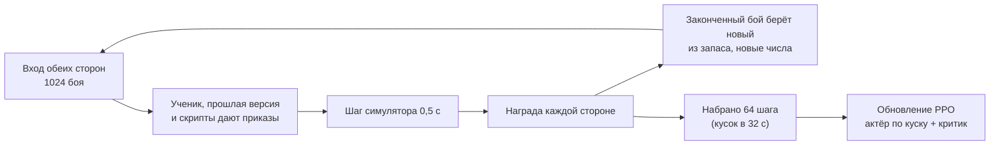

# Обучение сети

[← Назад](README.md) · [Документация](../README.md) › [Данные для обучения](README.md) › Обучение · [English](../../en/training/training.md)

Шаг 3 пути ([модель сети](network.md)): обучение [сети](model.md) методом PPO в
[симуляторе боя](simulator.md). Сделано 30.09.2026; 01.10.2026 переделано, чтобы нападающий
нападал (ниже): разгон копированием скрипта, память, обученная во времени, случайные армии; в тот
же день добавлены противник по образцу ИИ игры и меры против сползания политики в «только атаку»
([ниже](#против-ии-игры-01102026)). Код — `tools/nn/train/` (PyTorch, работает в контейнере
`snake-ai-trainer`).

## Как запустить

```bash
# 1. разгон: копия скриптов `nearest` и `ai_like` (случайные армии до 19 отрядов на сторону)
bash tools/nn/dock.sh tools.nn.train.imitate --minutes 5 --generated 19 --teacher nearest,ai_like \
  --out build/nn-train/runs/bcmix/bc.pt
# 2. PPO от неё на случайных армиях, сначала маленьких; в конце проверка и записи боёв
bash tools/nn/dock.sh tools.nn.train.run --name long_ai --minutes 80 --armies generated \
  --curriculum 5:0.15,10:0.4,19:1 --init build/nn-train/runs/bcmix/bc.pt --critic-warmup 8 \
  --lr 1.5e-4 --entropy 0.005 --entropy-end 0.001 --anchor 0.1 --anchor-end 0 \
  --mix '{"self": 0.1, "past": 0.15, "nearest": 0.2, "hold_shoot": 0.1, "hold": 0.05, "ai_like": 0.4}' \
  --eval-past build/nn-train/runs/long19/latest.pt
# только проверка: постоянные сцены или случайные бои EVAL_SEEDS на каждого противника
bash tools/nn/dock.sh tools.nn.train.evaluate --checkpoint build/nn-train/latest.pt --per-scene 128
bash tools/nn/dock.sh tools.nn.train.evaluate --checkpoint build/nn-train/latest.pt --generated 512 \
  --opponents ai_like,nearest,hold_shoot,past --against build/nn-train/runs/long19/latest.pt
bash tools/nn/dock.sh tools.nn.train.checkpoint                  # записать необученную random.pt
# стандартная проверка изменения (ниже): отчёт о поведении до → после в build/nn-train/test5/<метка>/
DOCK_NAME=t2-test5 bash tools/nn/dock.sh tools.nn.train.test5 --label mychange [-- параметры run.py]
```

Главные параметры `run`: `--name` (папка в `build/nn-train/runs/`), `--init` (начать с
чекпойнта), `--armies` (`scenes` или `generated`), `--curriculum`, `--battles` (боёв сразу,
1024), `--steps` (решений в куске, 64), `--limit` (3600 с), `--lr`, `--anchor` и `--anchor-end`,
`--entropy` и `--entropy-end` (от первого ко второму линейно за прогон), `--critic-warmup`, веса
награды (`--timeout`, `--idle`, `--hp`, `--standing`, `--order-cost`, `--lord`, `--retarget`,
`--idle-ramp`, `--tempo`, `--tempo-after`), оценка каждого отряда (`--unit-credit`, `--unit-hp`,
`--flanked`, `--missile-melee`, `--crowd`, `--flank-attack`, `--idle-near`, `--neighbour`;
[ниже](#оценка-каждого-отряда-01102026)), `--updates` (учиться столько обновлений вместо
`--minutes`; тогда `--minutes` только ограничивает время), `--mix`, `--small доля:отряды` (такая доля каждого
запаса случайных боёв — не больше `отряды` на сторону), `--eval-every` минут / `--eval-opponents` /
`--eval-battles` (проверка на `EVAL_SEEDS` во время прогона, обе роли; лучшая средняя доля побед
сохраняется как `best_eval.pt`, проверки — в `eval_log.jsonl`, их время не идёт в обучение),
`--eval-past` (сеть за «прошлую версию» в итоговой проверке). Первые шаги компилируются
1–3 минуты; во время обучения они не входят.

## Что пишет

Всё — в `build/nn-train/` (не в Git):

| Файл | Что |
|---|---|
| `random.pt` | необученная сеть (случайные веса), необученный противник |
| `latest.pt` | сеть последнего прогона (её по умолчанию берёт компаньон) |
| `runs/<имя>/latest.pt`, `best.pt` | последняя сеть прогона; сеть с лучшим окном боёв обучения против скриптов |
| `runs/<имя>/pool/v*.pt` | прошлые версии: противники в игре с собой |
| `runs/<имя>/log.jsonl` | строка на обновление: потери, энтропия, KL, действующие веса энтропии и KL, награда, доля побед по противнику и роли, смены приказов, виды приказов, гибель полководцев, смены целей |
| `runs/<имя>/eval.json` | итоговая проверка |
| `runs/<имя>/replays/*/` | бои итоговой сети, записанные как записи из игры |

**Чекпойнт** (`tools/nn/train/checkpoint.py`) — один файл, словарь, сохранённый `torch.save`:
`format` (2), `kinds` (виды приказов по порядку кодов), `preset`, `config` (размеры сети: по нему
собирается актёр), `actor` (его веса — всё, что нужно игре), `critic` (только для обучения),
`meta`. `load_policy(path)` отдаёт актёра, готового играть; так его загружает
[компаньон](../apps/bridge.md).

**Записи боёв** — папки как у записанного прогона: `manifest.json` и `events.jsonl` с `nn_sample`
каждую секунду и `result`. `tools.nn.gamedata.load(папка)` читает их как бой из игры. В
`manifest.json` ещё записано, за какую сторону играла сеть и против кого.

## Протокол проверки (`test5`)

`tools/nn/train/test5.py` — стандартная короткая проверка изменения обучения. Ею закрывается каждое
изменение, поэтому проверки можно сравнивать между собой.

1. **До.** Начальная сеть (`--init`, по умолчанию `runs/long_ai/best.pt`, 2 из 4 против ИИ игры)
   играет проверку: 512 боёв случайных армий из `EVAL_SEEDS` (до 19 отрядов на сторону) на
   противника, по 256 в каждой роли, против `ai_like`, `nearest` и `hold_shoot`. Все 1536 боёв идут
   одним набором (`evaluate.play(..., together=True)`), каждый раз те же бои.
2. **Обучение.** 36 обновлений PPO (`--updates`; ~5 минут на свободной карте) текущим кодом с
   настройками продолжения `long_ai2` (`test5.PROTOCOL`: случайные армии до 19 отрядов,
   `--small 0.35:6`, KL к `bcmix` 0,06 → 0,03, энтропия 0,003 → 0,001, давление времени на
   нападающего, `long19` среди прошлых версий) и закреплённым `--unit-credit 0` базовой проверки,
   чтобы проверки оставались сравнимыми, когда меняются умолчания `run.py`. Параметры после `--`
   уходят в `run.py` и меняют их: задача передаёт там свои новые настройки (`-- --unit-credit 0.3`);
   `report.json` хранит их все (`protocol`, `options`, `train_args`).
   Число обновлений, а не минуты: на карте, занятой другими задачами, обновление шло до 290 с, и
   5-минутная проверка успевала 1–2 обновления. `build/nn-train/latest.pt` не трогается.
3. **После.** Обученная сеть играет ту же проверку.
4. **Отчёт** — на экран и в `build/nn-train/test5/<метка>/report.json` (и `before.json`,
   `after.json` — проверки целиком): до → после по противнику и роли.

| Мера | Что считается (свои отряды ученика; `tools/nn/train/behaviour.py`) |
|---|---|
| доля побед | по противнику и роли |
| свой полководец погиб | доля боёв, кончившихся гибелью своего полководца |
| секунд стрелков в рукопашной на бой, доля времени стрелков в рукопашной | секунды, что стрелки (дальность > 0, не полководец) стоят в рукопашной, на бой и как доля их времени |
| свои в рукопашной под ударом во фланг / тыл | доля своих отрядо-секунд рукопашной, когда отряд бьют во фланг или тыл (`flank_hit` симулятора ≥ 1; в игре удар во фланг стоит защитнику ~×1,74 потерь) |
| решения с кучей | доля решений, в которых больше 2 своих отрядов на одном враге (приказ атаки или враг, с которым дерутся), пока другой враг бьёт свой отряд во фланг или тыл |
| свои удары во фланг / тыл | доля своих отрядо-секунд рукопашной, когда отряд бьёт стоящего врага с его фланга или тыла (угол от его фронта ≥ `contact.front_deg`, 60°) |
| смены цели / мин, смены приказа / мин | на стоящий отряд, по противнику |
| виды приказов | доли решений отрядов ученика |
| способностей за бой | своих способностей начато (поставлена их перезарядка) |
| предел времени | доля боёв, кончившихся по времени |

«До» и «после» идут по ~10 минут (набор идёт, пока не кончится самый долгий бой), обучение ~7:
проверка — около получаса. `--before ПУТЬ` берёт готовую проверку «до» (только пока симулятор не
менялся). Тяжёлые задачи на карте идут по очереди: проверка ждёт, пока есть
`build/gpu-train.lock` (смотрит каждые 30 с), потом держит его (метка и время начала) до конца,
и при ошибке тоже; проверка, начатая меньше чем через 60 с после освобождения
(`build/gpu-train.released`), сначала ждёт эти 60 с, чтобы уже ждущие задачи шли раньше. `DOCK_NAME` даёт имя контейнеру (`dock.sh`). Шум: при 256 боях на роль доля
побед гуляет на ±3 пункта (одна стандартная ошибка); 36 обновлений сдвигают сеть мало, поэтому
проверка показывает, не сломало ли изменение что-то и куда идёт поведение, а не итоговую силу.

**Базовая проверка** (`--label baseline`, обучение до оценки каждого отряда: `--unit-credit 0`;
01.10.2026):

| Мера | `ai_like` нападая / защищаясь | `nearest` нападая / защищаясь | `hold_shoot` нападая / защищаясь |
|---|---|---|---|
| доля побед | 0,543 → 0,543 / 0,676 → 0,625 | 0,434 → 0,418 / 0,469 → 0,398 | 0,590 → 0,609 / 0,504 → 0,504 |
| свой полководец погиб | 0,27 → 0,17 / 0,07 → 0,10 | 0,09 → 0,07 / 0,09 → 0,08 | 0,22 → 0,22 / 0,13 → 0,16 |
| секунд стрелков в рукопашной на бой | 105 → 113 / 94 → 102 | 89 → 95 / 101 → 96 | 158 → 151 / 110 → 123 |
| свои под ударом во фланг / тыл | 0,35 → 0,36 / 0,36 → 0,38 | 0,35 → 0,37 / 0,39 → 0,40 | 0,26 → 0,27 / 0,33 → 0,35 |
| решения с кучей | 0,064 → 0,074 / 0,110 → 0,108 | 0,077 → 0,085 / 0,087 → 0,100 | 0,055 → 0,058 / 0,121 → 0,124 |
| свои удары во фланг / тыл | 0,28 → 0,29 / 0,30 → 0,31 | 0,25 → 0,26 / 0,27 → 0,28 | 0,27 → 0,28 / 0,29 → 0,30 |
| смены цели / мин | 0,66 → 0,96 | 0,76 → 1,13 | 0,69 → 0,97 |
| виды стоять / идти / атака | 0,28 / 0,23 / 0,49 → 0,27 / 0,22 / 0,51 | 0,28 / 0,22 / 0,49 → 0,27 / 0,21 / 0,51 | 0,26 / 0,26 / 0,49 → 0,23 / 0,24 / 0,53 |

`best.pt` треть своего времени в рукопашной получает удары во фланг или тыл, её стрелки стоят в
рукопашной ~100 с за бой, и в 6–12 % решений она сводит больше 2 отрядов на одного врага, пока
другой враг бьёт её во фланг, — то, что видно в игре. Способности (~4 за бой) — это способности
полководца, которые запускает правило ИИ в симуляторе: `scenario.py` по умолчанию отмечает сторону 2
как играемую ИИ игры, и тогда, когда за неё играет ученик (исправлено:
[способности полководца](#способности-полководца-01102026)).

## Как идёт шаг обучения



Модули: `scenes.py` (откуда бои: арены или случайные армии, запас готовых начал), `league.py`
(кто с кем играет, набор прошлых версий), `opponents.py` (скрипты, среди них `ai_like`), `randomise.py`, `reward.py`,
`rollout.py` (бои и один шаг), `ppo.py`, `imitate.py` (разгон), `evaluate.py` (проверка и записи
боёв), `checkpoint.py`, `run.py`.

## Решения

**2 решения в секунду** — одно решение на шаг симулятора (0,5 с). Шаг — это такт морали в игре
([симулятор](simulator.md)); решение чаще не увидит ничего нового. Это и ритм в игре: состояние
на такте N, приказ на такте N + 0,5 с. Бой в 10 минут — ~1200 решений.

**Бои.** Два источника, оба — запас готовых начал, из которого законченный бой берёт новый:

- сцены: зеркальная арена Империи, Империя против скавенов и скавены против Империи
  (`config/nn/arenas.json`), в каждой сторона 1 нападает и защищается;
- случайные армии [генератора армий](armies.md) (`tools/nn/armies`): равный бюджет, полководец и
  до `max_units` отрядов на сторону, в половине запаса нападает сторона 1. Только обучающие
  семена; запас обновляется каждые 5 минут; проверка — на `EVAL_SEEDS`, на которых не учились.
  Постепенность: до 5 отрядов на сторону первую четверть времени, до 10 — вторую, потом до 19.

Ученик играет то за сторону 1, то за сторону 2: каждой армией в обеих ролях. Карту сеть видит, как
её показывает игра (рамка миникарты Crossroads, как у компаньона), а не квадрат симулятора.

**Противники** (доли долгого прогона `long_ai`; у `long19` до него: `nearest` 40 %, `hold_shoot` 25 %, `hold` 10 %, без `ai_like`):

| Противник | Доля | Что делает |
|---|---:|---|
| сама сеть | 10 % | ученик с обеих сторон; обе стороны дают данные для обучения |
| прошлая версия | 15 % | одна сеть из набора, выбирается заново каждые 2 обновления; необученная всегда в наборе |
| `ai_like` | 40 % | по образцу ИИ игры ([ниже](#противник-ai_like)): линия идёт вместе бегом, стрелки встают на дальности и бьют сначала по вражескому полководцу, полководец в линии и никогда не первым, удар с 80 м (нападая) или встречный удар со 100 м (защищаясь), свободные отряды — на врагов, уже занятых боем (через их фланг), и на стрелков |
| `nearest` | 20 % | каждый отряд атакует ближайшего стоящего врага, бегом |
| `hold_shoot` | 10 % | стоит и стреляет; отряд ближнего боя контратакует врага ближе 80 м; если нападает — атакует через 5 минут |
| `hold` | 5 % | стоит (стреляет сам, отбивается); только защитником — нападающим он лишь пережидал бы час |

ИИ игры в обучении не участвует: он остаётся независимой проверкой ([модель сети](network.md#готовность)).

**Награда** (`reward.py`) стороны:

| Слагаемое | Вес | Зачем |
|---|---:|---|
| победа / поражение | +1 / −1 | цель |
| предел времени (обе стороны ещё стоят) | защитнику +1, нападающему **−1,5** | хуже проигранного боя: нападающий, который только стоит, должен терять больше того, кто напал и не смог |
| потеря здоровья врага − своя, за шаг, в долях от начального у стороны | 0,5 | ровный сигнал задолго до конца |
| доля армии врага (по цене), что перестала стоять, − своя, за шаг | 0,5 | бои решает бегство, а не здоровье; сплочение возвращает её |
| нападающему — каждое решение, в котором ни один его отряд не дерётся и не стреляет | 0,0002 (`long_ai2`: × (1 + t / 300 с), не больше × 4) | у стояния есть цена с первой секунды, а не только на пределе через час (час стояния: −1,44) |
| нападающему — каждое решение, когда бою больше 600 с (`long_ai2`) | 0,0003 | −1,5 на пределе через час весит 0,9997^7200 ≈ 0,11 и почти не видно; эта цена видна каждый шаг (ещё 10 минут: −0,36) |
| каждая настоящая смена приказа отряда, делённая на число отрядов стороны | 0,001 | против дёрганья (ниже) |
| гибель вражеского полководца − гибель своего | 0,3 | правило морали игры делает её решающей (−16, потом −10 очков каждому отряду); одна доля цены полководца (в «перестала стоять») этого не видит; в проверке в игре сеть отправляла полководца в бой одного |
| каждая смена цели атаки на другую, пока прежняя ещё стоит, делённая на число отрядов стороны | 0,003 | гистерезис: в боях проверки отряды меняли цель между двумя врагами каждые 1–2 с |

Победа, здоровье, «стоящая» армия и полководцы — с нулевой суммой (сторона 2 получает минус награду стороны 1),
кроме предела времени. Оба формирующих слагаемых — разности потенциала: какой исход лучше, они не
меняют. Наград за стиль пока нет: характеры фракций — заглушки. Кроме награды стороны у каждого
отряда есть своя (`reward.unit_step`, [оценка каждого отряда](#оценка-каждого-отряда-01102026)); в
награду стороны она не входит.

**Приказ «продолжать» (`keep`).** Сеть может не давать отряду нового приказа: `keep` (код вида 4)
оставляет действующий приказ; отряд без приказа стоит. Настоящая смена — новый вид, новая цель
атаки или точка движения дальше 10 м от действующей; `keep` и тот же приказ ещё раз ничего не
стоят. При 0,001 отряд, меняющий приказ каждое решение, стоит своей стороне ~1,2 за 10-минутный
бой — больше победы; одна смена в 5 с — ~0,12.

**Разгон** (`imitate.py`): до PPO сеть копирует скрипты (обучение подражанием) в боях, где каждая
сторона играет случайным скриптом (учителя — 70 % времени); копируются стороны, которыми играет
учитель: вид приказа (стоять, идти, атаковать, отойти), цель, точка движения (ближайшая из ячеек
точки сети) и бег. `long19` копировала один `nearest` (за 6 минут — 100 % видов и 99 % целей);
`long_ai` копирует `nearest` и `ai_like` вместе (за 5 минут — 99 % / 98 %), почему — [ниже](#против-ии-игры-01102026). Со случайных весов PPO за 10 минут не
получил армию, которая дерётся вместе (раунды ниже); копия начинает там, где лучший скрипт. Учитель
— наш скрипт, не ИИ игры, поэтому проверка против игры остаётся независимой. Дальше PPO: первые
8 обновлений учится только критик (он начинает с нуля, а актёр уже играет), а слагаемое KL держит
политику рядом с копией (`--anchor`, 0,1), чтобы шумные шаги PPO её не размыли; в `long_ai` оно
за прогон спадает до 0 (`--anchor-end`), чтобы копия не заперла политику.

**PPO** (`ppo.py`) по схеме MAPPO: каждый свой отряд — агент со своим отношением вероятностей;
все отряды стороны делят её преимущество, и каждый добавляет своё
([оценка каждого отряда](#оценка-каждого-отряда-01102026)); критик видит всё поле (и в игру не
попадает).

| Настройка | Значение | Почему |
|---|---|---|
| дисконт γ | 0,9997 за решение | горизонт ~3300 решений (~28 мин): победа через 10 минут весит ещё 0,7 (при 0,999 — 0,3) |
| GAE λ | 0,95 | обычно |
| обрезка | 0,2 | обычно |
| шаг обучения | 1,5e-4, Adam (eps 1e-5) | от копии бо́льшие шаги без якоря за 15 минут сползали к стоянию |
| эпохи, мини-набор | 1, 4096 решений (целые куски) | обновление дороже самих боёв; память карты 16 ГБ |
| остановка по KL | 0,05 на отряд | защита от слишком большого шага |
| энтропия вида приказа | `long19` 0; `long_ai` 0,005 → 0,001 | при копии одного `nearest` бонус 0,01 сталкивал политику с атаки, и она теряла половину побед; при копии двух скриптов он не даёт угаснуть «стоять / идти / отойти» |
| KL к копии | `long19` 0,1; `long_ai` 0,1 → 0 | см. разгон |
| потеря ценности, норма градиента | 0,5, 0,5 | обычно |

- **Память (GRU) во времени.** Сбор — кусок в 64 решения (32 с боя) каждого боя; обновление
  прогоняет актёра по каждому куску с памяти, сохранённой в его начале, и обнуляет её там, где
  начинается новый бой (PPO с памятью, сохранённое состояние как в R2D2). По шагу идёт только
  GRU; слои до и после неё считаются на весь кусок сразу.
- **События во входе** ([вход](model.md)): у каждого отряда — как давно он дрался в рукопашной и
  бежал (у врага — пока виден); убит ли свой и вражеский полководец и как давно (игра это объявляет).
- **Маски.** Погибшие, бегущие и пустые места не дают потерь; недопустимые приказы закрывает сама
  сеть (атака без видимого врага, приказы отряду, который их не принимает).
- **Предел времени 60 минут**, как в игре: по нему побеждает защитник.
- **Случайные числа боя** (`randomise.py`): в каждом бою урон, скорость и лидерство умножаются на
  1 ± 15 % (одинаково для обеих сторон) и на 1 ± 5 % для каждой стороны; места на старте сдвигаются
  до 5 м. Сеть этих множителей не видит.
- **Скорость.** Вход сети компилируется `torch.compile` (8 мс → 0,6 мс на 1024 боя): одно решение
  1024 боёв за обе стороны вместе с шагом симулятора — ~32 мс.

**Проверка** (`evaluate.py`): целые бои до конца против каждого противника, сторона ученика
чередуется (обе роли), числа симулятора без изменений, старт сдвинут до 2 м, приказы выбираются
случайно по вероятностям сети, как в обучении; `hold` — только защитником. Сцены: `--per-scene`
боёв на сцену; случайные армии: `--generated` боёв из `EVAL_SEEDS`. По противнику и роли ещё доля
боёв, кончившихся гибелью своего / вражеского полководца, виды приказов и смены цели атаки в
минуту.

## Оценка каждого отряда, 01.10.2026

В игре: 4 отряда пехоты свалились на одного врага, пока 2 отряда пехоты скавенов заходили им во
фланг, а 2 отряда лучников застряли в рукопашной. Все отряды делили преимущество стороны, и ошибка
одного терялась в итоге боя: его градиент был тем же, свалился ли он в кучу или прикрыл фланг.

**Своя награда отряда** (`reward.unit_step`, за решение, на отряд; в награду стороны не входит):

| Слагаемое | Вес | Зачем |
|---|---:|---|
| размен здоровья: n_своих × (нанесённое им HP / начальное HP врага − потерянное им HP / начальное HP своей стороны) | 0,05 | что случилось с самим отрядом; в сумме по стороне — 0,05 × n_своих × размен стороны, около слагаемого `hp` стороны (0,5 при 10 отрядах); нанесённое — HP рукопашной из `dealt` симулятора, стрелами — убитые × HP человека цели |
| под ударом во фланг или тыл в рукопашной | −0,0002 | в игре ~×1,74 потерь; размен видит потери, это — положение до того, как они набегут |
| стрелки в рукопашной | −0,0002 | застрявшие лучники |
| куча: больше 2 своих на одном враге, пока другой враг бьёт свой отряд во фланг или тыл, по доле лишних (n − 2) / n | −0,0002 | вся куча платит за n − 2 отряда: лишние должны повернуть на того, кто заходит во фланг |
| отряд ближнего боя без приказа атаки вне рукопашной, пока товарищ ближе 60 м дерётся (`idle_near`) | 0 | пробовали −0,0004 (ниже): отряды сваливались в кучу |
| удар стоящему врагу во фланг или тыл | +0,0002 | как штраф: обмен ударом во фланг — нулевая сумма между двумя отрядами |
| + 0,5 × среднее того же у своих отрядов ближе 40 м | | что рядом: отряд, который оставил соседа под ударом во фланг, платит за это |

`behaviour.facts` находит это по состоянию симулятора (так же, как [протокол проверки](#протокол-проверки-test5)).
Пределы: каждое формирующее слагаемое — не больше 0,0002 × 1200 = 0,24 на отряд за 10-минутный бой,
четверть победы, а оценка отряда весит меньше оценки стороны (ниже). В боях `best.pt` против
`ai_like` и `nearest` (256 боёв, 1200 решений) средний размер на отрядо-решение: размен 6,4e-5,
фланг 2,0e-5 (10 % отрядо-решений), удар во фланг 7,7e-6 (8 %), куча 6,2e-6, стрелки в рукопашной
4,2e-6 (2 %) — размен главный, формирующие слагаемые — ~40 % всего.

**У критика** вторая голова (`critic.Critic(..., per_unit=True)`): по токену каждого отряда, видя всё
состояние, — ценность своей награды отряда × 100 (`unit_scale`: около размера стороны, чтобы общие
слои её чувствовали). Её последний слой начинается с нуля, поэтому старый чекпойнт загружается
(`Critic.load`). GAE идёт по каждому отряду на его награде. **Преимущество** отряда i:
A_i = A_стороны + `unit_credit` × A_отряда_i. A_отряда центрируется в каждом решении по отрядам
стороны, которые принимают приказы, — оно говорит только, какой отряд сделал лучше товарищей, и
никогда не толкает всю сторону в одну сторону, — потом оба нормируются по мини-набору (награда
отряда в ~100 раз меньше награды стороны и иначе пропала бы рядом с ней). `--unit-credit` 0,3
оставляет победу и поражение стороны главным сигналом; 0 (пока по умолчанию) — ровно старое
обучение.
Ценность отрядов учится вместе с ценностью стороны (вес потери 0,5); в журнале — `unit_value_loss`
и `unit_adv_share` (доля части отряда в размере преимущества, ~0,27 при 0,3).

**Подбор** ([протокол проверки](#протокол-проверки-test5), по 36 обновлений от `best.pt`; одно и то
же «до» для всех; доли побед после обучения, `ai_like` / `nearest` / `hold_shoot`, нападая / защищаясь):

| Прогон | Настройки | Доли побед после | Вид «стоять» | Кучи, `ai_like` нап. / защ. | Под ударом во фланг, `ai_like` нап. / защ. |
|---|---|---|---|---|---|
| до (`best.pt`) | — | 0,54 / 0,68, 0,43 / 0,47, 0,59 / 0,50 | 0,28 / 0,28 / 0,26 | 0,064 / 0,110 | 0,35 / 0,36 |
| `baseline` | `--unit-credit 0` | 0,54 / 0,63, 0,42 / 0,40, 0,61 / 0,50 | 0,27 / 0,27 / 0,23 | 0,074 / 0,108 | 0,36 / 0,38 |
| `u03` | 0,3, без центрирования, удар во фланг 1e-4 | 0,51 / 0,61, 0,38 / 0,43, 0,57 / 0,50 | 0,31 / 0,27 / 0,28 | 0,076 / 0,120 | 0,35 / 0,37 |
| `u06x2` | 0,6, без центрирования, формирующие × 2 | 0,18 / 0,31, 0,18 / 0,21, 0,09 / 0,20 | **0,73 / 0,52 / 0,84** | 0,016 / 0,044 | 0,45 / 0,46 |
| `u03c` | 0,3, с центрированием (настройки задачи) | 0,51 / 0,65, 0,44 / 0,50, 0,56 / 0,44 | 0,33 / 0,29 / 0,33 | 0,069 / 0,121 | 0,36 / 0,39 |
| `u06c` | 0,6, с центрированием | 0,28 / 0,36, 0,22 / 0,21, 0,19 / 0,29 | **0,70 / 0,46 / 0,85** | 0,026 / 0,066 | 0,41 / 0,46 |
| `u06ci` | 0,6, с центрированием, `--idle-near 4e-4` | 0,48 / 0,58, 0,33 / 0,39, 0,55 / 0,47 | 0,33 / 0,20 / 0,36 | **0,114 / 0,205** | 0,39 / 0,42 |

- **Сильная оценка отряда учит сторону стоять.** При 0,6 политика за 36 обновлений ушла в «стоять»
  (0,7–0,85 решений) и потеряла половину побед (66–77 % её нападений на `hold_shoot` упёрлись в
  предел времени): отряд, который не лезет в бой, не теряет здоровья, не получает удара во фланг и
  не попадает в кучу, поэтому выглядит лучше товарищей, которые дерутся. Кучи стали в 2–4 раза
  реже — но потому, что никто не дерётся. Центрирование по решению (оно не может толкать всю
  сторону) этого не остановило: это выбор отряда против товарищей, а не стороны.
- **Цена за стояние рядом** (`idle_near`: отряд ближнего боя без приказа атаки вне рукопашной, пока
  товарищ ближе 60 м дерётся) останавливает стояние, и отряды сваливаются в кучу: куч вдвое больше
  (0,11–0,23 решений). Слагаемые отряда тянут между «держись в стороне» и «влезай»; без слагаемого,
  которое говорит, *куда* влезать, отряд влезает в ближайшую драку. `idle_near` остаётся в коде с
  весом 0.
- **При 0,3** политика сохраняет виды приказов, а доли побед и поведение остаются в пределах шума
  базовой проверки (36 обновлений сдвигают мало): вреда не видно, пользы пока тоже. «Стоять»
  понемногу растёт (0,28 → 0,33) — первый признак той же тяги. `run.py` пока оставляет 0 по
  умолчанию (test5 его закрепляет); `--unit-credit 0.3` — и следить за долей «стоять» в долгих
  прогонах.

**`task2`** (проверка, которой закрыта задача: `--unit-credit 0.3`, веса выше; своё свежее «до»:
симулятор менялся после базовой проверки — другая работа над рукопашной и полководцами — и доли
побед `best.pt` сдвинулись до 10 пунктов, поэтому сравнивать изменения, а не числа):

| Мера | `ai_like` нападая / защищаясь | `nearest` нападая / защищаясь | `hold_shoot` нападая / защищаясь |
|---|---|---|---|
| доля побед | 0,516 → 0,523 / 0,578 → 0,652 | 0,352 → 0,395 / 0,418 → 0,449 | 0,539 → 0,539 / 0,414 → 0,512 |
| свой полководец погиб | 0,27 → 0,28 / 0,10 → 0,07 | 0,08 → 0,10 / 0,11 → 0,08 | 0,25 → 0,42 / 0,11 → 0,15 |
| доля времени стрелков в рукопашной | 0,068 → 0,043 / 0,086 → 0,084 | 0,087 → 0,083 / 0,087 → 0,089 | 0,080 → 0,044 / 0,087 → 0,079 |
| свои под ударом во фланг / тыл | 0,35 → 0,36 / 0,37 → 0,39 | 0,35 → 0,37 / 0,38 → 0,40 | 0,26 → 0,27 / 0,34 → 0,35 |
| решения с кучей | 0,064 → 0,073 / 0,111 → 0,127 | 0,076 → 0,117 / 0,094 → 0,122 | 0,055 → 0,036 / 0,117 → 0,105 |
| свои удары во фланг / тыл | 0,28 → 0,29 / 0,31 → 0,31 | 0,25 → 0,26 / 0,27 → 0,28 | 0,28 → 0,29 / 0,30 → 0,30 |
| предел времени | 0,012 → 0,066 / 0 → 0,004 | 0 → 0 / 0 → 0 | 0,016 → 0,102 / 0 → 0 |
| виды стоять / идти / атака | 0,28 / 0,23 / 0,49 → 0,37 / 0,18 / 0,45 | 0,29 / 0,22 / 0,50 → 0,27 / 0,19 / 0,54 | 0,25 / 0,26 / 0,49 → 0,39 / 0,20 / 0,40 |
| смены цели / мин | 0,66 → 0,75 | 0,78 → 0,97 | 0,72 → 0,67 |

Доли побед выросли в 4 из 6 пар (противник, роль) на 3–10 пунктов (у базовой — упали в 3, до 7),
каждая в пределах шума, но все в одну сторону; стрелки нападающего проводят в рукопашной вдвое
меньше времени (0,068 → 0,043, 0,080 → 0,044). Кучи и удары во фланг не уменьшились (36 обновлений),
«стоять» выросло до 0,37–0,39 против ждущих противников, нападения на `hold_shoot` чаще упирались в
предел времени (10 %), а свой полководец чаще погибал, нападая на него (0,25 → 0,42). Итак, оценка
каждого отряда при 0,3 за 36 обновлений безвредна и чуть полезна, но ещё не научила пехоту из кучи
поворачивать на фланг; её тягу к стоянию нужно смотреть в долгих прогонах.

## Способности полководца, 01.10.2026

Сеть сама решает, когда её полководец применяет способность, как игрок
([модель](model.md#способности-каждый-отряд-каждый-его-слот-способности), [мост](../apps/bridge.md)).
В обучении (`rollout.py`, `ppo.py`):

- ученик и прошлая версия выбирают способности (`heads.sample(..., abilities=True)`); прогон хранит
  `Action.ability`, обновление учитывает его в логарифме вероятности;
- по правилу ИИ игры в симуляторе применяют только полководцы скриптовых соперников:
  `Battles.by_rule` (`tools/nn/sim/abilities.py` `set_rule`), снова после каждого перезапуска, ведь
  бой из запаса приносит умолчание `scenario.build` (сторона 2 по правилу). Раньше у ученика на
  стороне 2 полководец применял по этому правилу (~4 применения за бой в базовой проверке);
- LiveSetup несёт паспорта способностей; сохранённое решение держит только состояние слотов (5 чисел)
  и строку запаса боя, `rollout.full_obs` возвращает паспорта в обновлении (весь вход — ~3 ГБ на
  1024 боя × 64 решения);
- `run.py` пишет `abilities_per_battle` (применения ученика на его законченный бой).

Память: срез сохраняемого состояния должен быть копией (вид держал весь вход каждого шага: сбор
доходил до 9,9 ГБ вместо 6,6), кодировщик и голова способностей считают только слоты, которые есть
/ можно применить. Обновления разогрева критика теперь гонят актёра без графа: они доходили до
13,5 ГБ, оставляли 14 ГБ занятыми на карте в 16 ГБ, и с добавкой способностей обучение вылезало за
память (первый запуск test5: обновления по 146 с; потом 10–14 с). Теперь занято 10,7 ГБ; сбор ~4 с
и обновление ~5,5 с (3,3 / 5,2 с без входа способностей).

Проверка (`test5 --label task1`, 01.10.2026; `long_ai/best.pt`, части способностей у него
новые, поэтому «до» применяет каждую готовую способность наугад; 36 обновлений за 732 с,
замедлены вылезанием за память выше; 512 боёв EVAL_SEEDS на противника):

| мера | ai_like атака | ai_like защита | nearest атака | nearest защита | hold_shoot атака | hold_shoot защита |
|---|---|---|---|---|---|---|
| доля побед | 0,512 → 0,547 | 0,625 → 0,645 | 0,406 → 0,438 | 0,449 → 0,500 | 0,602 → 0,617 | 0,496 → 0,449 |
| свой полководец погиб | 0,336 → 0,238 | 0,102 → 0,094 | 0,121 → 0,102 | 0,109 → 0,113 | 0,285 → 0,148 | 0,160 → 0,137 |
| применений способностей за бой | 11,77 → 11,59 | 11,70 → 11,33 | 10,87 → 10,61 | 11,26 → 11,18 | 14,79 → 14,91 | 13,08 → 13,02 |
| решения с кучей | 0,054 → 0,101 | 0,110 → 0,127 | 0,081 → 0,088 | 0,098 → 0,115 | 0,052 → 0,079 | 0,111 → 0,149 |

Базовая проверка (та же сеть, её полководец на стороне 2 по правилу ИИ, на стороне 1 — никогда):
до — победы 0,54 / 0,68 / 0,43 / 0,47 / 0,59 / 0,50, свой полководец погиб 0,27 / 0,07 / 0,09 /
0,09 / 0,22 / 0,12, ~4 применения за бой. С собственным (пока случайным) выбором сети полководец
применяет втрое больше — каждую способность, как только она готова, — и до обучения чаще гибнет в
атаке (0,34 против 0,27 против `ai_like`); 36 обновлений снижают это до 0,24 (у базовой после —
0,17), а победы — на уровне базовой или выше (5 из 6). Сама голова способностей за 36 обновлений
почти не сдвинулась (11,8 → 11,6 применения): то, чему она учится, требует долгого прогона.

## Против ИИ игры, 01.10.2026

Проверка в игре ([запуск](../launch/gate.md)) с `long19` проиграла ИИ игры 3 боя из 4. Записи
(`build/gate-analysis/`: `timeline.py`, `target_rank.py`, `missile_duty.py`, `lords.py`) показывают
сеть, которая делает только «каждый отряд атакует ближайшего врага»: 100 % приказов — атака,
энтропия вида — ноль; она отправляла полководца в бой одного, выбегала из обороны, бежала 350 м под
подготовленный обстрел, никогда не отходила и не прикрывала стрелков; 21–61 % её атак шли на
вражеского полководца, а отряды меняли цель между двумя врагами каждые 1–2 с. ИИ игры: защитник
ждёт ~60–80 с и стреляет первым (первые залпы со 108–134 м на 63–68 с), его стрелки бьют по
вражескому полководцу, его полководец стоит в линии, встречный удар — со ~100 м, свободные отряды
идут на вражеских стрелков и во фланги; нападающий идёт линией (110 м за первые 30 с, потом 83 м:
линия держится вместе), его стрелки встают на дальности.

### Противник `ai_like`

`tools/nn/train/opponents.py`, числа — в `Line` (из записей, где они это показывают):

| Правило | Число | Откуда |
|---|---|---|
| линия нападающего идёт вместе бегом (точка в 30 м впереди); отряд, ушедший от центра своей линии вперёд больше чем на 15 м, ждёт | бег, 15 м | бой 4: 3,6 м/с, потом 2,8 м/с (пехота симулятора идёт 1,5, бежит 3–3,4) |
| защитник без стрелков тоже идёт вперёд | — | бой 2: 80 м за 30 с |
| нападающий бросается в атаку с | 80 м | бой 4: цели на ~80 м, контакт через 11 с |
| защитник бьёт навстречу с | 100 м | бои 1 и 3: ~100 м, на 78–87 с боя |
| на дрогнувшего врага — с; когда свои уже дерутся, остальные вступают на врагов ближе | 150 м | наше |
| стрелки встают на доле дальности и стреляют; сначала по вражескому полководцу, если он на дальности и не в рукопашной | 0,9 | бои 3–4: первые залпы со 108–134 м; бои 1–3: пращники и лучники по полководцу (не в рукопашной — огонь по своим, наше) |
| стрелки отходят на 50 м от вражеского отряда ближнего боя ближе | 40 м | бой 3: пращники отступали назад и в сторону |
| полководец позади центра своей линии, никогда не первым: идёт с линией или на врага ближе 50 м, уже занятого боем; ниже 30 % здоровья отходит | 10 м | бой 4: в линии с самого контакта; 50 м и 30 % — наше |
| цели: ближайший, с притяжением на 30 м к врагам, уже занятым боем, на 25 м — к стрелкам, на 60 м — к врагам у своих стрелков; новая цель должна быть лучше на 15 м | — | смены целей в боях 3–4; гистерезис — наш |
| свободный отряд идёт на уже дерущегося врага через точку в 12 м сбоку от его фланга | 12 м | разбор тактик симулятора |

Скрипты друг против друга (случайные армии `EVAL_SEEDS`, 256 боёв на пару и сторону, победы первого):

| | нападая | защищаясь | гибель своего / вражеского полководца |
|---|---:|---:|---|
| `ai_like` против `nearest` | 31 % | 36 % | 2–3 % / 3–6 % |
| `ai_like` против `hold_shoot` | 48 % | 38 % | 6–8 % / 12–15 % |
| `nearest` против `hold_shoot` | 74 % | 61 % | 4 % / 7–8 % |

Здесь `ai_like` слабее `nearest`, как и всё, что ждёт, в этом симуляторе («Почему не 80 % против
nearest»); варианты ближе к числам игры (полководец позади линии, шаг, встречный удар с большего
расстояния) были ещё слабее. **`long19` против `ai_like`**: 66,0 % нападая, 70,7 % защищаясь (512
боёв `EVAL_SEEDS`), свой полководец погиб в 7 % / 2 %, 100 % приказов — атака.

### Против сползания в «только атаку»

- **Разгон богаче.** `imitate.py` копирует нескольких учителей со всеми частями приказа (вид,
  цель, точка движения, бег); `bcmix` копирует `nearest` и `ai_like` вместе. Копия смеси играет:
  стоять 0,26, идти 0,18, атака 0,55, отход 0,01 — но слабее каждого учителя (31 / 36 % против
  `ai_like`, 28 / 24 % против `nearest`): сеть по своим действующим приказам узнаёт, какой она
  учитель, и два стиля плохо смешиваются.
- **Разведка по виду приказа:** `--entropy` → `--entropy-end` (линейно), только на вид.
- **KL к копии спадает** (`--anchor` → `--anchor-end` 0), копия задаётся `--reference`.
- **Награды:** гибель полководца (0,3) и цена смены цели (0,003), выше.
- **`--kind-temperature`:** один раз делит логиты вида у застывшего актёра (long19 при 4: атака
  0,92, остальные виды по ~2 %).
- `ai_like` — 40 % лиги; `--pool-extra` держит `long19` среди прошлых противников.

Короткие прогоны (9 минут, до 10, потом до 19 отрядов на сторону; окна боёв обучения последних
минут, нападая / защищаясь):

| Прогон | Начало | Настройки | против `ai_like` | против `nearest` | виды в конце (стоять / идти / атака) |
|---|---|---|---|---|---|
| s1 | `long19` | энтропия 0,01 → 0,002, без KL | 0,61 / 0,71 | 0,46 / 0,43 | 0 / 0 / 1,00: градиент энтропии при 1,000 исчезает |
| s3 | `long19`, смягчённая ×4 | энтропия 0,003 → 0,001 | 0,43 / 0,49 | 0,24 / 0,32 | 0,01 / 0,00 / 0,98 за 3 минуты: случайные другие виды проигрывают, PPO снова её сжимает |
| s2 | `bcmix` | энтропия 0,005 → 0,001, KL 0,1 → 0 | 0,42 → 0,46 / 0,41 → 0,53 | 0,30 / 0,39 | 0,44 / 0,18 / 0,39 |

s2 на `EVAL_SEEDS` (256 на противника): `ai_like` 39 / 48 %, `nearest` 25 / 26 %, `hold_shoot`
41 / 35 % (25 % её нападений упёрлись в предел времени), `long19` 31 / 33 %; свой полководец погиб в
27–30 % боёв против `ai_like`. Другие виды приказов сохраняет и против `ai_like` растёт только
начало с копии смеси; от `long19` PPO возвращается к атаке.

### Долгий прогон `long_ai`

От `bcmix`: 21 минута (`--entropy 0.005`, `--anchor 0.1`, до 5, потом до 10 отрядов; к тому времени
в окнах обучения `ai_like` 0,51 / 0,63, `nearest` 0,41 / 0,44), остановлен ради короткого прогона
s3 и продолжен с его чекпойнта на 70 минут (`--anchor 0.075 → 0` к `bcmix`, `--entropy 0.004 →
0.001`, 10, потом 19 отрядов, `long19` в наборе прошлых версий).

В окнах боёв обучения (бои самого ученика, нападая / защищаясь) `ai_like`: 0,43 / 0,51 (первые
7 минут от `bcmix`) → 0,50 / 0,58 (первые 10 минут продолженного прогона) → 0,47–0,52 / 0,57–0,65 при
до 19 отрядах; `nearest` держался на 0,34–0,42 / 0,39–0,44. Виды приказов: стоять 0,22–0,31, идти
0,19–0,23, атака 0,46–0,58, отход и `keep` ~0; свой полководец мёртв в конце 13–17 % боёв
(вражеский — 13–16 %); смен цели атаки 0,65–1,3 в минуту на отряд. В последние ~10 минут (вес KL
около 0) доля «идти» выросла до 0,36, и итоговая сеть стала хуже: на `EVAL_SEEDS` 53–57 % её
нападений на `hold_shoot` и `hold` упёрлись в предел времени. Для проверки в игре — `best.pt`
(обновление 440 из 523, 58-я минута; лучшее худшее окно против скриптов, 0,44).

`EVAL_SEEDS`, до 19 отрядов на сторону, 512 боёв на противника (256 на роль; `hold` — 512 нападая):

| Противник | Роль | `long_ai/best.pt` | `long_ai/latest.pt` | `long19` |
|---|---|---:|---:|---:|
| `ai_like` | нападая / защищаясь | 52,3 / 60,9 % | 35,5 / 47,7 % | 66,0 / 70,7 % |
| `nearest` | нападая / защищаясь | 46,5 / 44,1 % | 31,2 / 30,5 % | 53,1 / 46,5 % |
| `hold_shoot` | нападая / защищаясь | 65,6 / 54,7 % | 23,0 / 35,2 % | 79,3 / 71,1 % |
| `hold` | нападая | 96,3 % | 40,2 % (57 % по времени) | — |
| `long19` | нападая / защищаясь | 47,7 / 44,9 % | 31,6 / 28,9 % | — |
| виды приказов | стоять / идти / атака | 0,25 / 0,22 / 0,52 | 0,16 / 0,54 / 0,30 | 0 / 0 / 1,00 |
| свой полководец погиб против `ai_like` | нападая / защищаясь | 19 / 4 % | 36 / 30 % | 7 / 2 % |
| свой полководец погиб против `nearest` | нападая / защищаясь | 3 / 5 % | 19 / 26 % | 0 / 0 % |

`best.pt` — первая сеть, которая стоит и ходит (по четверти приказов) и не мечется между целями;
с `long19` она играет почти вровень (48 / 45 %), против скриптов слабее `long19` (отдала часть
преимущества скопированного `nearest`), а её полководец чаще гибнет, когда она нападает на
`ai_like` (его стрелки целят в полководца). Прогон записал свою итоговую сеть в
`build/nn-train/latest.pt`; этот файл возвращён к `long19`.

Дальше: держать нижний предел у KL к копии (или останавливать по проверке) — при 0 политика
сползла к хождению; предел времени нападающему слаб при γ = 0,9997 (−1,5 через час весит
0,9997^7200 ≈ 0,11), поэтому нападающий, который ходит и стреляет, не сближаясь, платит мало.

### Проверка в игре и `long_ai2`

В игре (по 4 боя, Normal): `long_ai/best.pt` выиграла 2 из 4 (проиграла нападение 2 на 2 и защиту
6 на 4 скавенами против Империи; выиграла нападение 11 на 10 скавены против скавенов и защиту 19 на
20 Империей против скавенов), `long19` — 1 из 4. Поэтому `long_ai2` продолжил от `best.pt` на
50 минут обучения (59 с проверками): KL к `bcmix` 0,06 → нижний предел 0,03; энтропия 0,003 →
0,001; давление времени на нападающего (цена простоя × (1 + t / 300 с), не больше × 4; 0,0003 за
решение после 600 с); 35 % каждого запаса — не больше 6 отрядов на сторону (`--small 0.35:6`);
`best.pt` и `long19` в наборе прошлых версий; каждые 10 минут проверка против `ai_like` и `nearest`
(по 128 боёв `EVAL_SEEDS`, обе роли), лучшая средняя сохраняется как `best_eval.pt`.

| Проверка (среднее 4 долей побед) | обновление 74 | 136 | 206 | 278 |
|---|---:|---:|---:|---:|
| `ai_like` + `nearest`, нападая и защищаясь | **0,535** | 0,523 | 0,473 | 0,465 |

Окна обучения стояли на месте (`ai_like` 0,52–0,56 / 0,60–0,65, `nearest` 0,38–0,45 / 0,39–0,43;
стоять 0,22–0,27, идти 0,18–0,21, атака 0,52–0,60; свой полководец погиб в 9–14 %); проверки после
первых 10 минут падали. `best_eval.pt` — обновление 74 (копия `best_eval_u74.pt`).

`EVAL_SEEDS`, 512 боёв на противника (256 на роль); маленькие армии — до 6 отрядов на сторону, 256
на противника:

| Противник | Роль | `long_ai2/best_eval_u74.pt` | `long_ai/best.pt` | ≤ 6 отрядов: `u74` | ≤ 6 отрядов: `best.pt` |
|---|---|---:|---:|---:|---:|
| `ai_like` | нападая / защищаясь | 49,6 / 64,5 % | 52,3 / 60,9 % | 57,8 / 68,0 % | 52,3 / 68,8 % |
| `nearest` | нападая / защищаясь | 44,9 / 39,8 % | 46,5 / 44,1 % | 49,2 / 54,7 % | 43,8 / 53,9 % |
| `hold_shoot` | нападая / защищаясь | 72,7 / 54,7 % | 65,6 / 54,7 % | 64,1 / 58,6 % | 65,6 / 55,5 % |
| `hold` | нападая | 97,9 % (без предела времени) | 96,3 % (2 % по времени) | — | — |
| `long19` | нападая / защищаясь | 45,7 / 48,0 % | 47,7 / 44,9 % | 45,3 / 52,3 % | 39,1 / 46,1 % |
| виды приказов | стоять / идти / атака | 0,20 / 0,20 / 0,60 | 0,25 / 0,22 / 0,52 | 0,18 / 0,18 / 0,65 | 0,20 / 0,20 / 0,60 |
| свой полководец погиб против `ai_like` | нападая / защищаясь | 13 / 5 % | 19 / 4 % | 9 / 3 % | 11 / 5 % |

В пределах шума этих чисел (±3–4 пункта при 256 боях) обе сети вровень: `u74` лучше на маленьких
армиях и в нападении на `hold_shoot`, хуже против `nearest`; по оценке отбора (`ai_like` и `nearest`,
512 боёв) 49,7 % против 51,0 % у `best.pt`. `build/nn-train/latest.pt` остаётся `long19`. Ещё PPO от
`best.pt` не дал ничего, что видно в проверке: прибавка, если будет, — от противников и симулятора,
а не от того же обучения дольше.

## Победа нападающего, 01.10.2026

Первый прогон выучил стоять: по пределу времени нападающий получал −1, как за проигранный бой,
поэтому стоять было не хуже неудачной атаки; γ = 0,999 на 1800 решений прятал конец боя; предел был
урезан до 900 с. Что пробовали, по 10–25 минут (доля побед в боях обучения в конце):

| Прогон | Начало | Что изменено | `nearest` | `hold_shoot` | `hold` (атака) |
|---|---|---|---|---|---|
| r1 | случайные веса | новая награда, γ 0,9997, 60 мин, память во времени, lr 2e-4 | 0 % | 0 % | 0 % (по времени) |
| r2 | случайные веса | lr 1e-3 | 0 % | 0 % | ~40 % |
| r3 | копия `nearest` | энтропия 0,01, lr 3e-4 | 52 → 18 → 40 % | 70 → 30 → 60 % | 100 % |
| r4 | копия | энтропия 0,003, lr 3e-4, 20 мин | 50 %, потом 20 % | 80 %, потом 40 % | 100 %, потом 40 % (перестала нападать) |
| r5 | копия | без энтропии, KL к копии 0,3, lr 1e-4, 20 мин | 53 % | 76 % | 100 % |
| long | копия на случайных армиях | KL 0,1, lr 1,5e-4, случайные армии 5 → 10 → 19 отрядов, 29 + 25 мин | 49 % | 72 % | 98 % |

**Что починило атаку:** копия `nearest` (армия, которая бросается в бой вместе) вместе со слагаемым
KL, которое не даёт PPO её размыть. Со случайных весов PPO за 10 минут до этого не дошёл; без KL
политика за 15 минут сползала обратно к стоянию. Изменения награды (−1,5 по времени, цена стояния
нападающему, доля «стоящей» армии) сделали стояние худшим выбором, но сами по себе не научили армию
драться вместе.

**Итоговая сеть** `build/nn-train/runs/long19/latest.pt` (скопирована в `build/nn-train/latest.pt`):
долгий прогон — 29 минут до 5, потом до 10 отрядов на сторону; потом 25 минут до 19 (40 мест) с его
чекпойнта (первый переход к 19 отрядам не влез в память карты и был остановлен; теперь мини-набор
уменьшается с числом мест). ~8 400 шагов боя в секунду при 40 местах (11 500–15 800 при 12–22),
13 088 боёв за последние 25 минут, ни один бой не кончился по времени.

Постоянные сцены, 128 боёв на сцену и противника (768 на противника; `hold` — только защитником):

| Противник | Роль сети | Победы | Потеря здоровья своя / врага | Бой, с |
|---|---|---:|---|---:|
| `nearest` | нападает | 57,8 % | 0,78 / 0,80 | 391 |
| `nearest` | защищается | 52,9 % | 0,79 / 0,80 | 393 |
| `hold_shoot` | нападает | **89,6 %** | 0,75 / 0,84 | 625 |
| `hold_shoot` | защищается | **80,7 %** | 0,74 / 0,83 | 472 |
| `hold` | нападает | **100 %** | 0,64 / 0,83 | 662 |
| необученная сеть | нападает / защищается | 100 % / 100 % | 0,34 / 0,83 | 578 |

По армиям против `nearest`: зеркало 59 % / 59 % (нападение / защита), Империя против скавенов 41 % /
27 %, скавены против Империи 73 % / 72 %.

Случайные армии, `EVAL_SEEDS` (на них не учились), до 19 отрядов на сторону, 512 боёв на противника:

| Противник | Роль | Одна копия | Итоговая сеть |
|---|---|---:|---:|
| `nearest` | нападает / защищается | 45,7 % / 48,4 % | 44,9 % / 48,0 % |
| `hold_shoot` | нападает / защищается | 79,7 % / 67,2 % | 77,7 % / 64,8 % |
| `hold` | нападает | 97,3 % | 96,7 % |
| необученная сеть | нападает / защищается | 99,6 % / 100 % | 100 % / 100 % |

На случайных армиях PPO не добавил к копии ничего заметного; на сценах он прибавил ~10 пунктов
против `hold_shoot`.

**Смены приказов:** 2,0–2,9 на стоящий отряд в минуту (необученная сеть — 75,7). Каждое решение —
атака; сеть повторяет ту же атаку (это бесплатно), а не `keep`.

**Что делает сеть** (48 записей в `build/nn-train/runs/long19/replays/`): вся армия с первой секунды
бежит на ближайшего врага (90–120 м за первые 30 с), стрелки тоже (подходят на дальность и
стреляют); контакт через ~50–60 с против `nearest`, ~80–120 с против стоящего врага. Пока цель
стоит, не меняет её, никогда не отходит и не ждёт.

### Почему не 80 % против `nearest`

В этом симуляторе сторона, которая встречает врага на бегу, 13 с бьёт намного сильнее (удар с
разбега ×(1 + 2,5 × доля скорости)), и его получают все, кто бросается одновременно. Ручные тактики
против `nearest` (48 боёв на армию и роль; победы тактики):

| Тактика | Зеркало | Империя против скавенов | Скавены против Империи |
|---|---:|---:|---:|
| сам `nearest` | 53 % | 50 % | 44 % |
| все отряды на одну цель | 53 % | 7 % | 48 % |
| стрелки стоят и стреляют | 0 % | 2 % | 71 % |
| полководец ждёт 2 минуты | 12 % | 2 % | 74 % |
| атака шагом | 0 % | 0 % | 0 % |
| сначала враги, уже занятые рукопашной | 38 % | 17 % | 24 % |
| запас ждёт, пока враг ввяжется, потом бьёт | 5–7 % | 0 % | 2–3 % |
| `hold_shoot` | 19 % | 4 % | 45 % |

Всё, что оставляет отряд стоять, когда враг бежит на него, проигрывает. Против `nearest` бой решает
расклад армий, и сеть играет его так же, как `nearest`. Для 80 % против него нужна тактика, которую
не нашли ни скрипты, ни 75 минут PPO, или симулятор, где фланг и удар по уже занятому врагу весят
больше (в игре весят). Симулятор менялся во время этой работы (огонь по своим, коэффициент стрел по
полководцу), поэтому числа — на 01.10.2026.

## Первый прогон, 30.09.2026 (старые настройки)

`bash tools/nn/dock.sh tools.nn.train.run --minutes 5`: сеть `small` (0,78 М весов у актёра),
1024 боя сразу, RTX 5070 Ti.

- 5 минут обучения (и 46 с на компиляцию шага симулятора): 138 обновлений, 2,26 М шагов боя
  (~7500 в секунду), 1109 законченных боёв. Бой в симуляторе — 800–1800 решений, поэтому
  большинство боёв кончилось только в последние две минуты, и каждое место сыграло около одного боя.
- Проверка заняла ещё 7 минут для обученной сети и 4 для необученной (3072 боя на противника,
  512 на сцену).

**Доля побед в боях обучения** по минутам (победы / законченные бои):

| Минута | `nearest` | `hold_shoot` | `hold` | прошлые версии | необученная |
|---|---|---|---|---|---|
| 1–2 | 0/71 | 0/1 | 0/1 | — | — |
| 2–3 | 0/81 | 0/30 | — | — | — |
| 3–4 | 0/106 | 0/53 | — | 2/2 | 5/5 |
| 4–5 | 0/29 | 17/122 | 50/101 | 145/298 | 2/2 |

**Итоговая проверка** (`build/nn-train/eval.json`), 3072 целых боя на противника:

| Противник | Необученная: победы | Обученная: победы | Обученная: потеря здоровья своя / врага | Обученная: конец по времени |
|---|---:|---:|---|---:|
| `nearest` | 0,0 % (1) | **4,0 %** (124) | 0,83 / 0,37 | 8 % |
| `hold_shoot` | 6,3 % | **26,8 %** | 0,40 / 0,18 | 77 % |
| `hold` | 50 % | 50 % | 0,00 / 0,00 | 100 % |
| необученная сеть | — | 50 % | 0,36 / 0,55 | 100 % |

Все победы — в защите: нападая, обученная сеть не выиграла ничего; защищаясь, выиграла 100 %
против `hold` и необученной сети (по времени); против `hold_shoot` — 60 % в зеркале, 100 % за
скавенов, 0 % за Империю против скавенов; против `nearest` — 24 % за скавенов и 0 % в остальных. 50 % против `hold` и необученной сети — это ровно «побеждает защитник».

**Смены приказов** на стоящий отряд в минуту: необученная сеть 75,7, обученная 17,8 (29,5 против
`nearest`, 12,9 против `hold_shoot`, 6,6 против `hold`). Доли решений:

| | держать | идти | атаковать | отойти | продолжать |
|---|---:|---:|---:|---:|---:|
| необученная | 0,12 | 0,17 | 0,27 | 0,11 | 0,33 |
| обученная | 0,65 | 0,05 | 0,01 | 0,05 | 0,25 |

**Что делает сеть** (24 записи в `build/nn-train/replays/` и проверка):

- Стоит, где начала: центр армии за первые две минуты сдвигается на 0–7 м (чуть назад). Почти
  никогда не приказывает атаку (1 % решений).
- Стрелки стреляют сами, когда враг входит в дальность; в рукопашной отряды отбиваются, но никто
  не контратакует и не помогает соседу.
- Против `nearest` бежит вся армия (7 из 7 или 11 из 11 отрядов), а враг теряет от четверти до
  половины здоровья.
- Против `hold`, самой себя и необученной сети никто не двигается: бой кончается по времени,
  побеждает защитник.
- Перестала дёргаться: приказы меняются в 4 раза реже, в основном за счёт «держать» (действующее
  «держать» ничего не стоит) и `keep`.

Итак, за 5 минут сеть выучила одно: стоять, стрелять и не тратить приказы. Это лучше случайной
беготни необученной сети (доля побед сдвинулась: 0 → 4 % против `nearest`, 6 → 27 % против
`hold_shoot`), но это пассивная политика. К ней толкают правила: по времени побеждает защитник,
стоять — бесплатно, а атака сначала стоит здоровья. Покажет долгое обучение, перерастёт ли она
это; если нет, нападающему нужно давление (в награде или в наборе противников).

## Неудачный опыт: две сети, нападение и защита, 01.10.2026

Пробовали вместо одной общей сети две — нападения и защиты, каждая вдвое шире (`wide`,
3.2 млн весов против 0.84 млн). Код **удалён** (решение автора); прогоны остались в
`build/nn-train/runs/t4b/`, `test5_t4b_pair10/`, `pair40/` (не в Git).

- **Размер не нужен.** Маленькая сеть копирует обоих учителей (`nearest` + `ai_like`) так же
  точно, как вдвое шире: вид приказа 98.5%, цель 98%.
- **Сеть нападения** — на уровне `long_ai/best.pt` (против `ai_like` 44–54%, против `nearest`
  28–42%), не лучше; 98% приказов «атаковать», толпа втрое чаще.
- **Сеть защиты** провалилась: после разгона копированием скриптов 25/16% (против `ai_like` /
  `nearest`), после 10/20/30 минут PPO 22/17 → 34/28 → 14/6% на отложенных армиях; у
  `best.pt` 64/42%. Растёт на своих боях, но не переносится на новые армии.
- **Единственный плюс:** утечка давления нападающего в защиту исчезла (у `best.pt` в защите
  приказов «атаковать» больше, чем в нападении: 0.54 против 0.44).
- **Вывод:** основа — одна сеть (`long_ai/best.pt`). Сравнение было нечестным (у `best.pt`
  ~80 мин практики, у защиты — слабый старт со скриптов); роли разводить добавками LoRA на
  одной сети, а не двумя сетями.

## Чего нет

- Способа обойти скрипт `nearest` (см. «Почему не 80 % против nearest»); в симуляторе теперь есть
  фланги, упор и медленный поворот в рукопашной, и скрипт с обходом во фланг обыгрывает `nearest`
  в зеркале ([симулятор](simulator.md#фланг-тыл-и-натиск-в-целых-боях)).
- `ai_like` в симуляторе слабее `nearest` (ниже), а ИИ игры выиграл 3 из 4 боёв проверки: то, что
  он в игре делает лучше, либо не вошло в скрипт, либо нет в симуляторе.
- Сети `target`, долгих прогонов.
- Сигнала отряду, *куда* вступать в бой (на того, кто заходит во фланг, а не в кучу): одна оценка
  отряда уводит отряды из боя или в ближайшую драку ([выше](#оценка-каждого-отряда-01102026)).
- Других фракций и видов отрядов в генераторе армий.
- Наград за стиль по характеру фракции; добавок LoRA на фракцию и роль.
- Проверки в игре против ИИ игры (`tools/launcher/gate.ps1`).

## Тесты

`tests/tools/test_nn_train.py` (torch; в `.venv` пропускаются, запускаются в контейнере, как
`tests/tools/test_sim.py`): GAE, обрезка, награда (предел времени, стоящий нападающий, гибель
полководца), смены приказов и смены цели, расписания, точка движения, переведённая обратно в свою
ячейку, раскладка боёв (`hold` только защищается, `ai_like` — в обеих ролях), случайные числа
(уровень 1); память по куску равна пошаговой, маски, `keep`, симметрия наград между сторонами,
перезапуск боёв, случайные армии и вход, идущий за новой армией, `ai_like` (нападающий идёт линией,
полководец позади, защитник стоит, бьёт навстречу близким врагам и стреляет по полководцу на
дальности, полководец впереди возвращается к линии) (уровень 2); шаг обучения на процессоре,
обучение подражанием одному и двум учителям, чекпойнты, записи боёв читаются `gamedata`, проверка
(уровень 3). Оценка каждого отряда и протокол: `behaviour.facts` видит удар в тыл, отряд под ударом во
фланг, кучу (и не видит её без флангового врага) и стрелков в рукопашной; `unit_step` считает
потери самого отряда, формирующие слагаемые и соседей; GAE по отряду останавливается в конце боя;
преимущества отрядов доходят до потери политики; критик загружает чекпойнт без головы отрядов;
сбор даёт награду и ценность отрядов; несколько противников в одном наборе проверки считаются
порознь, с мерами поведения; блокировка карты держится, ждётся, отдаётся при ошибке и пропускает
вперёд очередь; таблица отчёта. Способности: по правилу ИИ применяют только стороны скриптов, и
после перезапуска; сохранённое решение держит только состояние слотов, а `full_obs` возвращает вход;
полководец сети применяет по приказу, и PPO учит голову. `tests/tools/test_nn_observation.py`:
полководец известен по паспорту; гибель вражеского известна без взгляда и тускнеет; рукопашная и
бегство врага учитываются, только пока он виден.
