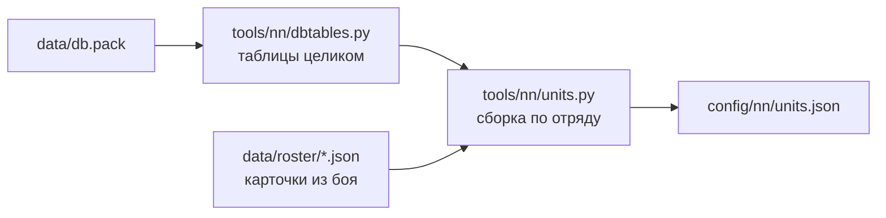

# Паспорта отрядов

[← Назад](README.md) · [Документация](../README.md) › [Данные для обучения](README.md) › Паспорта отрядов · [English](../../en/training/units.md)

Паспорт отряда — всё, что решает схватку, из базы самой игры: бойцы, здоровье,
масса, скорость, атака, защита, оружие, броня, щит, лидерство, стрельба, цена.
Это шаг 1 симулятора боя ([модель сети](network.md)): паспорта читают и
симулятор, и вход сети. Один файл на все отряды — `config/nn/units.json`.

## Как получить

```bash
py -3.14 -m tools.nn.units                  # отряды из UNITS (tools/nn/units.py)
py -3.14 -m tools.nn.units --units k1,k2    # другие отряды
```



- `tools/nn/dbtables.py` читает таблицы базы **целиком**, до последнего байта.
  Если после обновления игры таблица изменится, чтение остановится с ошибкой, а
  не прочитает сдвинутые числа. Как устроены таблицы — [база игры](../game/database.md).
- `tools/nn/units.py` собирает паспорт по ключу отряда (`main_units`) и
  сверяет его с карточкой из боя, если она есть ([ростер](../game/units/roster.md)).
  При любом расхождении файл не пишется.
- В файле: `units` — паспорта; `_fields` — откуда каждое поле и с чем сверено;
  `_missing` — чего нет и почему; `_source` — прочитанный `db.pack`.
- Нужен Python 3.14 (`compression.zstd`). Тесты: `tests/tools/test_units.py`.

## Что в паспорте

«Карточка» — поле совпало с карточкой отряда в бою. «Наше» — смысл столбца
мы вывели по значениям сами (см. [ниже](#что-выведено-нами)).

| Поле | Что | Откуда | Сверка |
|---|---|---|---|
| `men` | бойцов (размер Ultra) | `main_units.num_men` | карточка |
| `mount`, `num_mounts`, `engine` | верховое животное, их число, машина; у всех семи нет — один боец = одна фигура | `land_units` | — |
| `hp_per_man`, `hp_total` | здоровье бойца и отряда | `battle_entities.hit_points` + `land_units.bonus_hit_points` | карточка |
| `mass` | масса бойца | `battle_entities.mass` | карточка |
| `size` | класс размера: `small`, `large`… | `battle_entities` | наше |
| `height_m`, `radius_m` | рост и радиус бойца | `battle_entities` | наше |
| `speed.walk`, `speed.run` | шаг и бег, м/с | `battle_entities` | карточка (скорость на карточке = бег × 10) |
| `speed.charge`, `acceleration`, `deceleration` | натиск, разгон, торможение | `battle_entities` | наше |
| `melee.attack`, `defence`, `charge_bonus` | атака, защита, натиск | `land_units` | карточка |
| `melee.damage`, `ap_damage` | урон оружия: обычный и пробивающий броню | `melee_weapons` | карточка (сумма) |
| `melee.bonus_v_large`, `bonus_v_infantry` | бонус против больших и против пехоты | `melee_weapons` | наше |
| `melee.attack_interval_s` | время между ударами бойца, с | `melee_weapons` | наше |
| `melee.splash_*` | удар по нескольким: размер целей, сколько, множитель | `melee_weapons` | наше |
| `armour` | броня | `unit_armour_types` по `land_units.armour` | карточка |
| `shield` | щит и шанс отбить стрелу, % | `unit_shield_types` по `land_units.shield` | наше (шанс) |
| `leadership` | лидерство | `land_units.morale` | нет (на карточке мораль 0) |
| `damage_resist` | защита от урона: всего, физического, стрел, магии, огня, % | `land_units.damage_mod_*` | — |
| `attributes` | свойства: `expendable`, `encourages`… | `unit_attributes_to_groups_junctions` | — |
| `abilities` | способности (только ключи) | `land_units_to_unit_abilites_junctions` | карточка |
| `multiplayer_cost` | цена в сетевой игре | `main_units` | — |
| `missile.ammo`, `range_m` | снарядов у бойца, дальность | `land_units.primary_ammo`, `projectiles` | карточка |
| `missile.damage`, `ap_damage`, `reload_s` | урон снаряда и перезарядка, с | `projectiles` | карточка: (урон + пробивающий) × 10 / перезарядка |
| `missile.accuracy` | меткость | `land_units.accuracy` | — |
| `missile.trajectory`, `muzzle_velocity`, `max_elevation`, `calibration_*`, `penetration`, `projectile_number`, `shots_per_volley`, `explosion` | полёт снаряда | `projectiles` | наше |

Опыт отряда не в паспорте: что даёт ранг, одинаково для всех —
`config/nn/game_rules.json` (`experience_bonus`, `experience_levels`).

## Семь отрядов v1

| | Генерал Империи | Копейщики | Лучники | Вождь скавенов | Кланокрысы с копьями | Копейщики-рабы | Пращники-рабы |
|---|---:|---:|---:|---:|---:|---:|---:|
| Ключ | `wh_main_emp_cha_general_0` | `wh_main_emp_inf_spearmen_0` | `wh2_dlc13_emp_inf_archers_0` | `wh2_main_skv_cha_warlord_0` | `wh2_main_skv_inf_clanrat_spearmen_0` | `wh2_main_skv_inf_skavenslave_spearmen_0` | `wh2_main_skv_inf_skavenslave_slingers_0` |
| Бойцов | 1 | 120 | 90 | 1 | 160 | 180 | 140 |
| Здоровье бойца / отряда | 4068 / 4068 | 69 / 8280 | 69 / 6210 | 4068 / 4068 | 60 / 9600 | 50 / 9000 | 48 / 6720 |
| Масса | 600 | 100 | 90 | 650 | 100 | 90 | 90 |
| Шаг / бег / натиск, м/с | 1,5 / 3,4 / 4,1 | 1,5 / 3,0 / 3,8 | 1,5 / 3,3 / 4,0 | 1,5 / 4,0 / 4,7 | 1,5 / 4,2 / 4,8 | 1,5 / 4,2 / 4,8 | 1,5 / 4,2 / 4,8 |
| Атака / защита | 55 / 45 | 20 / 34 | 14 / 17 | 50 / 55 | 18 / 24 | 9 / 16 | 6 / 7 |
| Натиск | 40 | 4 | 4 | 35 | 6 | 3 | 4 |
| Урон: обычный + пробивающий | 290 + 140 | 19 + 6 | 21 + 3 | 280 + 120 | 18 + 5 | 12 + 4 | 14 + 4 |
| Бонус против больших | 0 | 15 | 0 | 0 | 9 | 6 | 0 |
| Удар по нескольким | до 4 | — | — | до 4 | — | — | — |
| Броня | 85 | 30 | 20 | 90 | 25 | 0 | 0 |
| Щит, отбивает стрел | 55 % | нет | нет | 35 % | нет | нет | нет |
| Лидерство | 70 | 60 | 50 | 60 | 45 | 35 | 33 |
| Защита от стрел | 15 % | — | — | 15 % | — | — | — |
| Стрельба: дальность, снарядов, урон, перезарядка | — | — | 130 м, 20, 17 + 2, 10 с | — | — | — | 120 м, 22, 7 + 1, 9 с |
| Свойства | encourages | charge_defense_vs_large, charge_reflection | — | encourages | charge_defense_vs_large, charge_reflection | expendable | expendable |
| Цена (сетевая) | 600 | 300 | 350 | 525 | 325 | 150 | 200 |

У всех семи ещё свойство `hide_forest` (прячутся в лесу). Размер у всех
`small`. Способности лордов и скавенов — в файле.

## Копейщики со щитами и мечники

Добавлены 02.10.2026 в пул Империи: щиты отбивают пули пращников и стрелы с
фронта — ответ Империи скавенам при равном золоте ([армии](armies.md)).
Бойцы те же, что у копейщиков без щитов (здоровье, масса, скорость, броня,
лидерство); отличаются щит, оружие, атака и защита.

| | Копейщики | Копейщики со щитами | Мечники |
|---|---:|---:|---:|
| Ключ | `wh_main_emp_inf_spearmen_0` | `wh_main_emp_inf_spearmen_1` | `wh_main_emp_inf_swordsmen` |
| Бойцов; здоровье бойца / отряда | 120; 69 / 8280 | 120; 69 / 8280 | 120; 69 / 8280 |
| Шаг / бег / натиск, м/с | 1,5 / 3,0 / 3,8 | 1,5 / 3,0 / 3,8 | 1,5 / 3,0 / 3,8 |
| Атака / защита | 20 / 34 | 20 / **42** | **32 / 32** |
| Натиск | 4 | 4 | **14** |
| Урон: обычный + пробивающий | 19 + 6 | 19 + 6 | **21 + 7** |
| Бонус против больших / против пехоты | 15 / 0 | 15 / 0 | **0** / 0 |
| Время между ударами, с | 5,7 (`wh_main_emp_spear_0`) | **4,4** (`wh_main_emp_spear`) | **4,3** (`wh_main_emp_sword`) |
| Броня | 30 | 30 | 30 |
| Щит, отбивает стрел | нет | **35 %** (`wh_missile_block_35_metal`) | **35 %** (тот же) |
| Лидерство | 60 | 60 | 60 |
| Свойства | charge_defense_vs_large, charge_reflection, hide_forest | те же | только hide_forest |
| Цена (сетевая) | 300 | **350** | **375** |

У мечников в базе нет бонуса против пехоты (`bonus_v_infantry` 0): их перевес над
копейщиками против пехоты — атака 32, удар тяжелее и чаще и натиск. Симулятор берёт
всё это из паспорта: нового правила не нужно.

Карточки сняли 02.10.2026 (игра v9.0.1, сборка 50381; в каждом прогоне — только
генерал и отряд): копейщиков со щитами — по списку `config/roster/capture_emp_shields.json`
(прогон `20261002T094315-roster-372`), мечников — по `config/roster/capture_emp_swords.json`
(прогон `20261002T095749-roster-373`). Обе совпали с паспортами. Алебардщики и штурмкрысы
пробы роя на лорда тоже есть в файле, без карточек.

## Сверка с карточками

Все семь паспортов совпали с карточками из боя по всем сверяемым полям
(таблица выше, столбец «Сверка»). Карточку пращников сняли 30.09.2026 (игра
v9.0.1, сборка 50381; список `config/roster/capture_skaven.json`, в прогоне —
только вождь и пращники). Карточка кланокрысов с копьями — от 27.09.2026 (та же
версия игры, прогон `20260927T212729-roster-56`). Столбцы `land_units` и `main_units` трёх отрядов
Империи ещё совпали, все 60 + 45 столбцов, с прежней расшифровкой по схеме от
26.09.2026 (локальный архив `research/evidence/units/empire-20260926`).

- **Перезарядка.** На карточке «урон стрелами» пращников 8,89, а не 7 + 1 = 8:
  карточка показывает урон за 10 с. 8 × 10 / 9 = 8,89 — отсюда перезарядка
  пращи 9 с. У лучников 19 × 10 / 10 = 19.
- **Лидерство** на карточке в расстановке — 0, сверить нельзя; берём из базы.

## Щиты

Три отряда копейщиков v1 **без щита** (`shield` = `none`), лучники и пращники
тоже. Щит есть у лордов: у генерала — металлический, отбивает 55 % стрел,
у вождя — деревянный, 35 %. С 02.10.2026 в пуле Империи ещё копейщики со щитами
и мечники (металл, 35 % у обоих). Щит прикрывает 60° от фронта
([урон стрелами](../game/units/missile-damage.md)); симулятор отбивает эту долю
попаданий, когда стрелок стоит в пределах 60° от фронта цели, у лордов и пехоты одинаково.

## Чего нет и почему

- **Бонус снарядов против больших и пехоты.** Столбца не нашли: строка
  «стрела против больших» лучников совпадает с обычной стрелой во всех полях.
- **Стреляет ли поверх своих.** Отдельного столбца нет. Возможно, это
  `trajectory` (`dual_low_fixed` у стрелы и пращи) — не проверено.
- **Усталость по отряду.** В `land_units` и `battle_entities` нет; правила
  усталости общие (`config/nn/game_rules.json`, `fatigue`).
- **Аура лорда по отряду.** Своего радиуса у лорда в таблицах нет. Аура общая:
  `general_aura_radius` 70 м и `general_inspire_effect_amount_*` в
  `_kv_morale_tables` ([мораль](../game/units/morale.md)). Лорда отличает
  свойство `encourages`.
- **Что делают способности и свойства.** Только ключи; их числа в таблицах
  `special_ability_*`, которые мы не разбирали.

## Что выведено нами

Названия этих столбцов дали мы, по значениям во всей таблице:

- `bonus_v_large` — ненулевой у копий и алебард; `bonus_v_infantry` — у парных
  мечей и колесниц.
- `melee_attack_interval` — 3,2–6 с, чаще всего 4,0 (как `melee_attack_interval`
  4 в `_kv_rules_tables`); у копья Империи 5,7, у копья кланокрысов 4,3. Так ли это в бою, не проверено.
- `splash_*` — у героев «до 4 целей размера `medium`», у пехоты 1.
- `charge_speed` у всех семи выше бега; `acceleration`, `deceleration`,
  `radius`, `height` — по порядку величин.
- `missile_block_chance` — число в ключе щита (`wh_missile_block_55_metal` → 55).
- В `projectiles`: `minimum_range`, `max_elevation` (88°), `muzzle_velocity`
  (45 м/с стрела, 50 праща), `calibration_distance` и `calibration_area`
  (95 м и 3,7 м у стрелы), `penetration` (`very_low`), `trajectory`,
  `projectile_number`, `shots_per_volley` (по 1).

Их надо проверить замером в бою, прежде чем симулятор будет на них
опираться.
