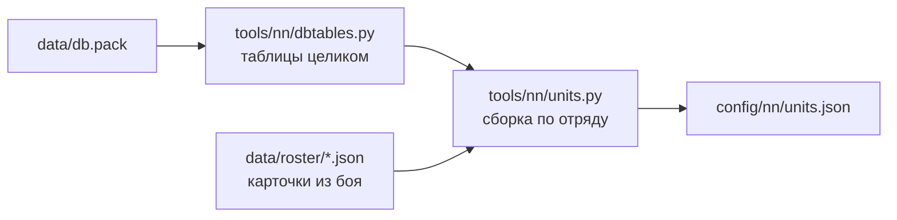

# Паспорта отрядов

[← Назад](README.md) · [Документация](../README.md) › [Данные для обучения](README.md) › Паспорта отрядов · [English](../../en/training/units.md)

Паспорт отряда — всё, что решает схватку, из базы самой игры: бойцы, здоровье,
масса, скорость, атака, защита, оружие, броня, щит, лидерство, стрельба, цена.
Это шаг 1 симулятора боя ([модель сети](network.md)): паспорта читают и
симулятор, и вход сети. Один файл на все отряды — `config/nn/units.json`.

## Как получить

```bash
py -3.14 -m tools.nn.units                  # отряды из UNITS (tools/nn/units.py)
py -3.14 -m tools.nn.units --units k1,k2    # другие отряды
```



- `tools/nn/dbtables.py` читает таблицы базы **целиком**, до последнего байта.
  Если после обновления игры таблица изменится, чтение остановится с ошибкой, а
  не прочитает сдвинутые числа. Как устроены таблицы — [база игры](../game/database.md).
- `tools/nn/units.py` собирает паспорт по ключу отряда (`main_units`) и
  сверяет его с карточкой из боя, если она есть ([ростер](../game/units/roster.md)).
  При любом расхождении файл не пишется.
- В файле: `units` — паспорта; `_fields` — откуда каждое поле и с чем сверено;
  `_missing` — чего нет и почему; `_source` — прочитанный `db.pack`.
- Нужен Python 3.14 (`compression.zstd`). Тесты: `tests/tools/test_units.py`.

## Что в паспорте

«Карточка» — поле совпало с карточкой отряда в бою. «Наше» — смысл столбца
мы вывели по значениям сами (см. [ниже](#что-выведено-нами)).

| Поле | Что | Откуда | Сверка |
|---|---|---|---|
| `men` | бойцов (размер Ultra) | `main_units.num_men` | карточка |
| `mount`, `num_mounts`, `engine` | верховое животное, их число, машина; у всех семи нет — один боец = одна фигура | `land_units` | — |
| `hp_per_man`, `hp_total` | здоровье бойца и отряда | `battle_entities.hit_points` + `land_units.bonus_hit_points` | карточка |
| `mass` | масса бойца | `battle_entities.mass` | карточка |
| `size` | класс размера: `small`, `large`… | `battle_entities` | наше |
| `height_m`, `radius_m` | рост и радиус бойца | `battle_entities` | наше |
| `speed.walk`, `speed.run` | шаг и бег, м/с | `battle_entities` | карточка (скорость на карточке = бег × 10) |
| `speed.charge`, `acceleration`, `deceleration` | натиск, разгон, торможение | `battle_entities` | наше |
| `melee.attack`, `defence`, `charge_bonus` | атака, защита, натиск | `land_units` | карточка |
| `melee.damage`, `ap_damage` | урон оружия: обычный и пробивающий броню | `melee_weapons` | карточка (сумма) |
| `melee.bonus_v_large`, `bonus_v_infantry` | бонус против больших и против пехоты | `melee_weapons` | наше |
| `melee.attack_interval_s` | время между ударами бойца, с | `melee_weapons` | наше |
| `melee.splash_*` | удар по нескольким: размер целей, сколько, множитель | `melee_weapons` | наше |
| `armour` | броня | `unit_armour_types` по `land_units.armour` | карточка |
| `shield` | щит и шанс отбить стрелу, % | `unit_shield_types` по `land_units.shield` | наше (шанс) |
| `leadership` | лидерство | `land_units.morale` | нет (на карточке мораль 0) |
| `damage_resist` | защита от урона: всего, физического, стрел, магии, огня, % | `land_units.damage_mod_*` | — |
| `attributes` | свойства: `expendable`, `encourages`… | `unit_attributes_to_groups_junctions` | — |
| `abilities` | способности (только ключи) | `land_units_to_unit_abilites_junctions` | карточка |
| `multiplayer_cost` | цена в сетевой игре | `main_units` | — |
| `missile.ammo`, `range_m` | снарядов у бойца, дальность | `land_units.primary_ammo`, `projectiles` | карточка |
| `missile.damage`, `ap_damage`, `reload_s` | урон снаряда и перезарядка, с | `projectiles` | карточка: (урон + пробивающий) × 10 / перезарядка |
| `missile.accuracy` | меткость | `land_units.accuracy` | — |
| `missile.direct` | настильный (прямой) огонь: траектория `low`, нужна чистая линия мимо своих | `projectiles.trajectory` | наше |
| `missile.trajectory`, `muzzle_velocity`, `max_elevation`, `calibration_*`, `penetration`, `projectile_number`, `shots_per_volley`, `explosion` | полёт снаряда | `projectiles` | наше |

Опыт отряда не в паспорте: что даёт ранг, одинаково для всех —
`config/nn/game_rules.json` (`experience_bonus`, `experience_levels`).

## Семь отрядов v1

| | Генерал Империи | Копейщики | Лучники | Вождь скавенов | Кланокрысы с копьями | Копейщики-рабы | Пращники-рабы |
|---|---:|---:|---:|---:|---:|---:|---:|
| Ключ | `wh_main_emp_cha_general_0` | `wh_main_emp_inf_spearmen_0` | `wh2_dlc13_emp_inf_archers_0` | `wh2_main_skv_cha_warlord_0` | `wh2_main_skv_inf_clanrat_spearmen_0` | `wh2_main_skv_inf_skavenslave_spearmen_0` | `wh2_main_skv_inf_skavenslave_slingers_0` |
| Бойцов | 1 | 120 | 90 | 1 | 160 | 180 | 140 |
| Здоровье бойца / отряда | 4068 / 4068 | 69 / 8280 | 69 / 6210 | 4068 / 4068 | 60 / 9600 | 50 / 9000 | 48 / 6720 |
| Масса | 600 | 100 | 90 | 650 | 100 | 90 | 90 |
| Шаг / бег / натиск, м/с | 1,5 / 3,4 / 4,1 | 1,5 / 3,0 / 3,8 | 1,5 / 3,3 / 4,0 | 1,5 / 4,0 / 4,7 | 1,5 / 4,2 / 4,8 | 1,5 / 4,2 / 4,8 | 1,5 / 4,2 / 4,8 |
| Атака / защита | 55 / 45 | 20 / 34 | 14 / 17 | 50 / 55 | 18 / 24 | 9 / 16 | 6 / 7 |
| Натиск | 40 | 4 | 4 | 35 | 6 | 3 | 4 |
| Урон: обычный + пробивающий | 290 + 140 | 19 + 6 | 21 + 3 | 280 + 120 | 18 + 5 | 12 + 4 | 14 + 4 |
| Бонус против больших | 0 | 15 | 0 | 0 | 9 | 6 | 0 |
| Удар по нескольким | до 4 | — | — | до 4 | — | — | — |
| Броня | 85 | 30 | 20 | 90 | 25 | 0 | 0 |
| Щит, отбивает стрел | 55 % | нет | нет | 35 % | нет | нет | нет |
| Лидерство | 70 | 60 | 50 | 60 | 45 | 35 | 33 |
| Защита от стрел | 15 % | — | — | 15 % | — | — | — |
| Стрельба: дальность, снарядов, урон, перезарядка | — | — | 130 м, 20, 17 + 2, 10 с | — | — | — | 120 м, 22, 7 + 1, 9 с |
| Свойства | encourages | charge_defense_vs_large, charge_reflection | — | encourages | charge_defense_vs_large, charge_reflection | expendable | expendable |
| Цена (сетевая) | 600 | 300 | 350 | 525 | 325 | 150 | 200 |

У всех семи ещё свойство `hide_forest` (прячутся в лесу). Размер у всех
`small`. Способности лордов и скавенов — в файле.

## Копейщики со щитами и мечники

Добавлены 02.10.2026 в пул Империи: щиты отбивают пули пращников и стрелы с
фронта — ответ Империи скавенам при равном золоте ([армии](armies.md)).
Бойцы те же, что у копейщиков без щитов (здоровье, масса, скорость, броня,
лидерство); отличаются щит, оружие, атака и защита.

| | Копейщики | Копейщики со щитами | Мечники |
|---|---:|---:|---:|
| Ключ | `wh_main_emp_inf_spearmen_0` | `wh_main_emp_inf_spearmen_1` | `wh_main_emp_inf_swordsmen` |
| Бойцов; здоровье бойца / отряда | 120; 69 / 8280 | 120; 69 / 8280 | 120; 69 / 8280 |
| Шаг / бег / натиск, м/с | 1,5 / 3,0 / 3,8 | 1,5 / 3,0 / 3,8 | 1,5 / 3,0 / 3,8 |
| Атака / защита | 20 / 34 | 20 / **42** | **32 / 32** |
| Натиск | 4 | 4 | **14** |
| Урон: обычный + пробивающий | 19 + 6 | 19 + 6 | **21 + 7** |
| Бонус против больших / против пехоты | 15 / 0 | 15 / 0 | **0** / 0 |
| Время между ударами, с | 5,7 (`wh_main_emp_spear_0`) | **4,4** (`wh_main_emp_spear`) | **4,3** (`wh_main_emp_sword`) |
| Броня | 30 | 30 | 30 |
| Щит, отбивает стрел | нет | **35 %** (`wh_missile_block_35_metal`) | **35 %** (тот же) |
| Лидерство | 60 | 60 | 60 |
| Свойства | charge_defense_vs_large, charge_reflection, hide_forest | те же | только hide_forest |
| Цена (сетевая) | 300 | **350** | **375** |

У мечников в базе нет бонуса против пехоты (`bonus_v_infantry` 0): их перевес над
копейщиками против пехоты — атака 32, удар тяжелее и чаще и натиск. Симулятор берёт
всё это из паспорта: нового правила не нужно.

Карточки сняли 02.10.2026 (игра v9.0.1, сборка 50381; в каждом прогоне — только
генерал и отряд): копейщиков со щитами — по списку `config/roster/capture_emp_shields.json`
(прогон `20261002T094315-roster-372`), мечников — по `config/roster/capture_emp_swords.json`
(прогон `20261002T095749-roster-373`). Обе совпали с паспортами. Алебардщики и штурмкрысы
пробы роя на лорда тоже есть в файле, без карточек.

## Флагелланты, двуручники, ополчение Free Company

Добавлены 02.10.2026 в пул Империи (вторая волна): дешёвый «заслон», который никогда не бежит,
тяжёлая бронебойная пехота и первые стрелки **настильного (прямого) огня**. Паспорта из базы;
карточек из боя пока нет (список `config/roster/capture_emp_wave2.json`, см. «Нужные записи»).

| | Флагелланты | Двуручники | Ополчение Free Company |
|---|---:|---:|---:|
| Ключ | `wh_dlc04_emp_inf_flagellants_0` | `wh_main_emp_inf_greatswords` | `wh_dlc04_emp_inf_free_company_militia_0` |
| Людей; здоровье человека / отряда | 120; 73 / 8760 | 120; 76 / 9120 | 120; 61 / 7320 |
| Масса; бег / натиск, м/с | 100; 3,6 / 4,0 | **120**; **2,8** / 3,5 | 90; 3,6 / 4,0 |
| Атака / защита | 32 / **12** | 32 / 30 | 28 / 25 |
| Натиск | **28** | 18 | 14 |
| Урон: обычный + бронебойный | 25 + 8 (булава) | **10 + 25** (двуручный меч) | 21 + 7 (меч) |
| Бонус против больших / пехоты | 0 / 0 | 0 / **14** | 0 / 0 |
| Время между ударами, с | 4,5 | 4,3 | 4,2 |
| Броня; щит | **0**; нет | **95** (латы); нет | 25 (кожа); нет |
| Лидерство | **100** | 75 | 55 |
| Свойства | **unbreakable**, hide_forest | hide_forest | **mounted_fire_move**, guerrilla_deploy, hide_forest |
| Способности | Frenzy, Strength of the Penitent | — | — |
| Стрельба | — | — | пистоль: **настильно** (траектория `low`), 90 м, 18 выстрелов, 12 + 2, перезарядка 9 с, 90 м/с, калибровка 2,0 м на 65 м, пробитие low |
| Цена (сетевая) | 600 | 850 | 450 |

### Что делает каждая особенность и откуда она

| Отряд | Особенность | Что делает | Источник | Симулятор | Сеть |
|---|---|---|---|---|---|
| Флагелланты | Несокрушимые (Unbreakable) | не теряют лидерства, никогда не бегут (и при разгроме армии) | свойство БД `unbreakable`; [умения](../game/mechanics/abilities.md), [мораль](../game/mechanics/morale.md) | очки морали не ниже лидерства: не колеблются и не бегут (`morale.py`) | свойство паспорта `unbreakable` (вход уже был) |
| Флагелланты | Frenzy (пассивное) | +10 к атаке, ×1,1 урон, бронебойность и натиск, Immune to Psychology; выключено, пока мораль ниже половины лидерства | БД: `special_ability_phase_stat_effects`, `_attribute_effects`, `special_ability_to_auto_deactivate_flags` (`morale_is_lower_than_half_of_base_morale`); база знаний | моделируется (`sim.json` abilities.model); у несокрушимых не выключается; Immune to Psychology не на что действовать (страха и ужаса в симуляторе нет) | слот умения: эффекты, `immune_to_psychology`, `off_morale_below_half` |
| Флагелланты | Strength of the Penitent (пассивное с временем) — то самое «чем хуже, тем лучше защищаются» | игра сама включает его, когда отряд в рукопашной **и проигрывает её**: 20 с **+14 к защите, +15 % к физической стойкости**, сразу кончается вне рукопашной, снова готово через 3 с | БД: `unit_special_abilities` (20 с, 3 с), `special_ability_to_recharge_contexts` (`losing_melee_combat`), выключение `out_of_melee`, эффекты фазы. В вики fandom 15 с (старый патч): верна база | моделируется для обеих сторон; «проигрывает» = получил урона ≥ 1,5 × нанесённого за последнее время (порог правила морали, наше); физическая стойкость в правиле урона рукопашной (предел 90 %) | слот умения: `auto`, `when_losing_melee`, `off_out_of_melee`, эффекты; приказать нельзя |
| Флагелланты | Очень низкая защита, без брони | весь обычный урон каждого удара доходит, от стрел и пращей тоже | паспорт | правило удара с бронёй 0 | паспорт |
| Флагелланты | «Заслон» | дёшевы и не бегут: держат врага на месте | следует из выше | (из чисел) | — |
| Двуручники | Броня 95, бронебойный двуручный меч, бонус 14 против пехоты | большая часть урона игнорирует броню; их броня гасит в среднем 71 % обычного урона | паспорт (в вики 32 / 23 бронебойного / бонус 10 — старые; в БД 35 / 25 / 14); Stubborn или другого особого свойства в базе WH3 нет | уже моделируется (доля бронебойного, бонус против пехоты к атаке и урону, броня); тест: бронированных штурмкрыс валят быстрее мечников более чем в 1,5 раза | паспорт |
| Двуручники | Медленные (бег 2,8), тяжёлые (масса 120) | медленно перестраиваются | паспорт | скорость из паспорта (массу симулятор не использует) | паспорт |
| Ополчение | Настильный огонь | плоские пули с постоянной скоростью: нельзя стрелять сквозь своих и поверх них; 75 % людей перекрыто — по этой цели не стреляет | БД: `projectiles.trajectory` `low`, `unit_firing_line_of_sight_considered_obstructed_ratio` 0,75, `projectile_friendly_fire_man_radius_coefficient` 2,2; [стрельба](../game/mechanics/missiles.md) | линия огня (`missile.py` clear_shot, [симулятор](simulator.md)) | паспорт `direct` |
| Ополчение | Меткость, разброс | зона калибровки 2,0 м на 65 м (у стрелы 3,7 м на 95 м): кучнее, но ближе | БД `projectiles` | попадание 0,5 на краю дальности — **оценка** (`sim.json` missile.musket_why) | паспорт `spread` (зона калибровки / дистанция × 20), `muzzle_velocity` |
| Ополчение | Стрельба на ходу | стреляет на ходу | свойство БД `mounted_fire_move`; в вики так же | целится и стреляет в движении | свойство паспорта |
| Ополчение | Сносная рукопашная (28 / 25, меч 21 + 7) | может держать строй или добивать бегущих | паспорт | из паспорта | паспорт |
| Ополчение | Авангардное развёртывание | может встать впереди зоны развёртывания | свойство БД `guerrilla_deploy`; вики | не моделируется (места даёт генератор армий) | свойство паспорта |

Мосту для них ничего не нужно: перекрытый стрелок с приказом атаковать стоит без дела и через 4
решения отпускается стрелять по своему выбору (`services.missile_duty`), как любой стрелок;
Penitent никогда не приказывается (не `self_cast`). В игре компаньон не может считать таймеры
Penitent (мост знает только умения, которые применил сам), так что там сеть видит его выключенным.

### Нужные записи

1. **Карточки**: `python -m tools.build roster-capture --capture config/roster/capture_emp_wave2.json`,
   запуск, `python -m tools.roster update …/events.jsonl`, затем `py -3.14 -m tools.nn.units` (сверка с
   карточкой) и `py -3.14 -m tools.nn.abilities` (Frenzy и Penitent должны быть в списке пассивных).
2. **Попадания, перезарядка, первый выстрел пистолей**: стрельбище лучников (`--range-mode damage`) со 120
   ополченцами вместо лучников по стоящим клановым крысам на 60, 75 и 90 м, по 3 прогона.
3. **Линия огня**: ополчение, свой отряд копейщиков в 20 м перед ним поперёк всей линии, крысы в 80 м,
   огонь по своему выбору, 60 с; затем копейщики сдвинуты вбок на половину ширины (ожидаем: нет
   выстрелов, затем около половины).
4. **Penitent**: флагелланты против штурмкрыс (проигрывают), `ActiveEffectList` моста каждую секунду:
   когда фаза включается (полученный урон против нанесённого) и сколько держится.
5. **Стрельба на ходу**: ополчение идёт мимо стоящего вражеского отряда в 70 м: выстрелы на ходу.

## Как добавить отряд

Постоянный порядок (пользователь, 02.10.2026). Пример — флагелланты, двуручники и ополчение выше.

1. **Ключ и паспорт.** Найти ключ отряда (`main_units`), добавить в `UNITS` в `tools/nn/units.py`,
   `py -3.14 -m tools.nn.units`; его способности: `py -3.14 -m tools.nn.abilities`.
2. **Изучить каждую особенность.** Свойства (`attributes` паспорта), способности (эффекты, `auto`,
   `auto_when` — когда игра включает сама, `off_when` — когда выключено), снаряд (траектория,
   калибровка, пробитие) и описание в игре; затем веб (страницы отрядов WH3 на honga.net, вики
   fandom, гайды; числа старых патчей расходятся — верна база) и база знаний
   `docs/ru/game/mechanics/`. Искать условные бонусы («чем хуже, тем лучше защищается»),
   иммунитеты, правила развёртывания и движения.
3. **Записать каждую особенность** в таблицу отряда на этой странице: что делает, источник, как её
   моделирует симулятор (или почему нет) и как её видит сеть.
4. **Смоделировать всё, что меняет исход боя**: в симуляторе (число в `sim.json` с `why`; оценка
   так и называется и указывает запись, которая её измерит) и во входе сети — признак паспорта
   (`tools/nn/model/passport.py`) или поле умения (`tools/nn/model/abilities.py`). Новые входы — только
   **в конец** признаков паспорта или умения: тогда старые чекпойнты грузятся с нулевыми весами для
   них (`encoder.pad_inputs`) и действуют как раньше.
5. **Карточка из боя**: список `config/roster/capture_<имя>.json` (генерал и до 4 отрядов), съёмка
   ростера, `tools.roster update`, пересборка паспортов (должны совпасть с карточкой).
6. **Пул**: `config/nn/pools.json` (ключ, слот, ширина), затем `py -3.14 -m tools.nn.armies.templates`
   ([армии](armies.md)).
7. **Тесты**: паспорт (`tests/tools/test_units.py`), каждая новая механика симулятора
   (`tests/tools/test_sim.py`), прямой и обратный проход сети и загрузка старого чекпойнта через
   преобразование (`tests/tools/test_nn_model.py`).
8. **Документация** на обоих языках: эта страница, [симулятор](simulator.md), [армии](armies.md).

## Сверка с карточками

Все семь паспортов совпали с карточками из боя по всем сверяемым полям
(таблица выше, столбец «Сверка»). Карточку пращников сняли 30.09.2026 (игра
v9.0.1, сборка 50381; список `config/roster/capture_skaven.json`, в прогоне —
только вождь и пращники). Карточка кланокрысов с копьями — от 27.09.2026 (та же
версия игры, прогон `20260927T212729-roster-56`). Столбцы `land_units` и `main_units` трёх отрядов
Империи ещё совпали, все 60 + 45 столбцов, с прежней расшифровкой по схеме от
26.09.2026 (локальный архив `research/evidence/units/empire-20260926`).

- **Перезарядка.** На карточке «урон стрелами» пращников 8,89, а не 7 + 1 = 8:
  карточка показывает урон за 10 с. 8 × 10 / 9 = 8,89 — отсюда перезарядка
  пращи 9 с. У лучников 19 × 10 / 10 = 19.
- **Лидерство** на карточке в расстановке — 0, сверить нельзя; берём из базы.

## Щиты

Три отряда копейщиков v1 **без щита** (`shield` = `none`), лучники и пращники
тоже. Щит есть у лордов: у генерала — металлический, отбивает 55 % стрел,
у вождя — деревянный, 35 %. С 02.10.2026 в пуле Империи ещё копейщики со щитами
и мечники (металл, 35 % у обоих). Щит прикрывает 60° от фронта
([урон стрелами](../game/units/missile-damage.md)); симулятор отбивает эту долю
попаданий, когда стрелок стоит в пределах 60° от фронта цели, у лордов и пехоты одинаково.

## Чего нет и почему

- **Бонус снарядов против больших и пехоты.** Столбца не нашли: строка
  «стрела против больших» лучников совпадает с обычной стрелой во всех полях.
- **Стреляет ли поверх своих.** Отдельного столбца нет: `missile.direct` (траектория `low`,
  пистоли ополчения) — нет; `dual_low_fixed` (стрела, праща) бьёт навесом поверх своих (база
  знаний, не замерено).
- **Усталость по отряду.** В `land_units` и `battle_entities` нет; правила
  усталости общие (`config/nn/game_rules.json`, `fatigue`).
- **Аура лорда по отряду.** Своего радиуса у лорда в таблицах нет. Аура общая:
  `general_aura_radius` 70 м и `general_inspire_effect_amount_*` в
  `_kv_morale_tables` ([мораль](../game/units/morale.md)). Лорда отличает
  свойство `encourages`.
- **Что делают свойства.** Только ключи. Способности: их числа, когда игра включает их сама и
  когда они выключены — в паспортах способностей (`config/nn/abilities.json`).

## Что выведено нами

Названия этих столбцов дали мы, по значениям во всей таблице:

- `bonus_v_large` — ненулевой у копий и алебард; `bonus_v_infantry` — у парных
  мечей и колесниц.
- `melee_attack_interval` — 3,2–6 с, чаще всего 4,0 (как `melee_attack_interval`
  4 в `_kv_rules_tables`); у копья Империи 5,7, у копья кланокрысов 4,3. Так ли это в бою, не проверено.
- `splash_*` — у героев «до 4 целей размера `medium`», у пехоты 1.
- `charge_speed` у всех семи выше бега; `acceleration`, `deceleration`,
  `radius`, `height` — по порядку величин.
- `missile_block_chance` — число в ключе щита (`wh_missile_block_55_metal` → 55).
- В `projectiles`: `minimum_range`, `max_elevation` (88°), `muzzle_velocity`
  (45 м/с стрела, 50 праща), `calibration_distance` и `calibration_area`
  (95 м и 3,7 м у стрелы), `penetration` (`very_low`), `trajectory`,
  `projectile_number`, `shots_per_volley` (по 1).

Их надо проверить замером в бою, прежде чем симулятор будет на них
опираться.
