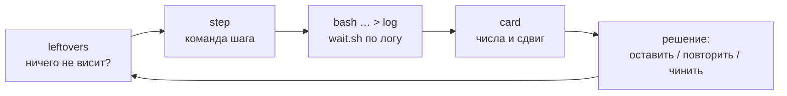

# Рабочий процесс: шаг цепочки, карточка прогона, остатки

[← Назад](README.md) · [Документация](../README.md) › [Данные для обучения](README.md) › Рабочий процесс · [English](../../en/training/workflow.md)

Как запускается и оценивается шаг цепочки обучения и какие маленькие инструменты снимают
рутину (`tools/ops`). Постоянные правила для каждого агента — в `CLAUDE.md` в корне
репозитория; задание добавляет только саму задачу.

## Один цикл

| Что | Как | Вместо |
|---|---|---|
| Что-то осталось от прошлого шага? | `.venv/Scripts/python -m tools.ops.leftovers` — наши контейнеры, замок видеокарты, циклы ожидания, игра, загрузка GPU; код выхода 1, если что-то висит; `--kill` завершает циклы ожидания старше 10 мин, `--unlock` снимает устаревший замок, `--stop NAME` останавливает наш контейнер | `docker ps`, `ls build/*.lock`, `ps` вручную — и промахи: девять контейнеров сразу (обучение в 2 раза медленнее), trap, удаливший чужой замок |
| Команда следующего шага | `.venv/Scripts/python -m tools.ops.step --label n4 --from n3_consolidate [--minutes 25] [--set drills=0.1] [--drop teach-normal] [--write build/steps/n4.sh] [-- опции run.py]` | правка прошлого скрипта через sed (неверный критик или reference никто не замечает) |
| Ожидание прогона или теста | `bash tools/ops/wait.sh -t 5400 build/steps/n4.log '^written:\|Traceback'` — таймаут, без учёта регистра, код 2 по времени | `until grep …; do sleep 60; done` — висел часами, когда `FAILED` пришёл заглавными |
| Оценка шага | `.venv/Scripts/python -m tools.ops.card build/nn-train/test5/n4 --prev build/nn-train/test5/n3_consolidate` | чтение ~200 строк `trend.md` ради десяти чисел |

## Шаг цепочки (`tools/ops/step.py`)

Шаг берёт метку предыдущего и выводит то, что нужно цепочке
([настройки цепочки](training.md#настройки-цепочки)): его последняя `m<минута>.pt` (или
названная: `--from n3/m15`) — это `--init` и `--reference`, `runs/test5_<метка>/latest.pt` его прогона —
`--critic-init`; постоянные опции — из `config/train-chain.json` (`--set ключ=значение` меняет
одну, `--drop ключ` убирает, опции после `--` добавляются как есть; `run.py` берёт последнее
значение повторённой опции). Контейнер — `orch-<метка>`; `--gpu-duty 0.9` лежит в файле опций.
Инструмент печатает скрипт из двух строк (или пишет его с `--write`), выбранные init и критик,
попадёт ли кэш баз и ожидаемое реальное время: обучение + (точки + 2) проверки по ~3,3 мин
(+ ~25 мин при промахе кэша без канарейки). Сам он ничего не запускает: оркестратор стартует
скрипт в фоне и ждёт по его логу.

Файл опций нарочно вне `config/nn`: эта папка входит в версию симулятора (ниже), и правка там
обрушила бы кэш баз.

## Карточка прогона (`tools/ops/card.py`)

Одна таблица на шаг, столбец на точку проверки: рейтинг (логит, больше — лучше), золото пар по
противникам (наше минус противника на тех же армиях, / бюджет; плюс — мы меняемся лучше), обмен
против `ai_like`, победы в каждом учении рядом с умелым скриптом, перенос каждого учения в обычные
бои (доля ПРИМЕНЕНИЯ — больше лучше; доля ОШИБКИ — меньше лучше; сеть / `ai_like`), доли учителей,
гибель своего полководца, доли приказов hold / move / attack, время стрелков в рукопашной,
таймауты, секунды проверки (промах кэша виден здесь: 1400–1800 с вместо ~190), расстояние KL от
старта. Последний столбец — сдвиг от первой точки к последней, помечен `*`, если за пределами шума
(две стандартные ошибки, где число их несёт: рейтинг, золото пар, победы в учениях, гибель
полководца; иначе |сдвиг| ≥ 0,05). Ниже — аномалии (падение рейтинга за шум между точками, доля
move или гибель полководца ×1,5, таймауты выше 5 %, падение побед учения ≥ 0,15), вердикт ёмкости,
минуты и шаги обучения. `--prev` добавляет конечную точку прошлого шага и сдвиг от неё; `--json` —
данные.

Читает `report.json`; пока прогон идёт — `before.json` и уже записанные `eval_m<минута>.json`
(честные метрики считает `skill.py`, numpy), так что карточка идущего шага — одна команда.

## Кэш баз и канарейка

Честные метрики сравнивают сеть со скриптом, играющим против себя на тех же боях
([протокол проверки](training.md#протокол-проверки-test5)); эти бои скриптов кэшируются в
`build/nn-train/baselines/<противник>_19u_3600s_<версия>.json`, версия — хэш файлов, от которых
зависит бой скриптов (`tools/nn/train/version.py` `VERSION_FILES`: симулятор, армии, скрипты,
награда, модель, `config/nn`). Любая правка там промахивает кэш, и следующая проверка «до» играет
256 пар × 3 скрипта заново: 1384–1843 с вместо 194 с.

Замер за 02–04.10: 20 версий, то есть 20 пересчётов, из них лишь 10 дали разные числа — половина
промахов (≈ 10 × 20–25 мин) пришлась на правки, которые бой скриптов тронуть не могут (сеть,
слагаемое награды, учение). Канарейка (`test5 --baseline-canary 32`, по умолчанию в цепочке): при
промахе скрипты играют первые 32 пары; если они совпали во всех полях (победитель, потерянное
золото, старт, бюджет, фракции, нападающий) с файлом старой версии, тот файл принимается под новой
версией (~3 мин вместо ~25); если ни один не совпал — вся база играется как раньше.
`python -m tools.nn.train.version` печатает текущую версию и есть ли её файлы. Проверка идёт на
хосте без torch и даёт тот же хэш, что контейнер.

## Пробовали и отказались

- Пока ничего; отвергнутые подходы к процессу записываются сюда с числами.
