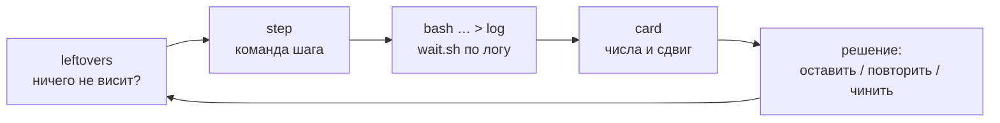

# Рабочий процесс: шаг цепочки, карточка прогона, профили метрик, карточка разрыва, остатки

[← Назад](README.md) · [Документация](../README.md) › [Данные для обучения](README.md) › Рабочий процесс · [English](../../en/training/workflow.md)

Как запускается и оценивается шаг цепочки обучения и какие маленькие инструменты снимают
рутину (`tools/ops`). Постоянные правила для каждого агента — в `CLAUDE.md` в корне
репозитория; задание добавляет только саму задачу.

## Один цикл

| Что | Как | Вместо |
|---|---|---|
| Что-то осталось от прошлого шага? | `.venv/Scripts/python -m tools.ops.leftovers` — наши контейнеры, замок видеокарты, циклы ожидания, игра, загрузка GPU; код выхода 1, если что-то висит; `--kill` завершает циклы ожидания старше 10 мин, `--unlock` снимает устаревший замок, `--stop NAME` останавливает наш контейнер | `docker ps`, `ls build/*.lock`, `ps` вручную — и промахи: девять контейнеров сразу (обучение в 2 раза медленнее), trap, удаливший чужой замок |
| Команда следующего шага | `.venv/Scripts/python -m tools.ops.step --label n4 --from n3_consolidate [--minutes 25] [--set drills=0.1] [--drop teach-normal] [--write build/steps/n4.sh] [-- опции run.py]` | правка прошлого скрипта через sed (неверный критик или reference никто не замечает) |
| Ожидание прогона или теста | `bash tools/ops/wait.sh -t 5400 build/steps/n4.log '^written:\|Traceback'` — таймаут, без учёта регистра, код 2 по времени | `until grep …; do sleep 60; done` — висел часами, когда `FAILED` пришёл заглавными |
| Правка симулятора или учений готова, прошлый шаг ещё учится | `.venv/Scripts/python -m tools.ops.baselines --build <основная папка>/build --run` из копии с правкой — опорные бои новой версии на процессоре, ~8 мин ([кэш баз](#кэш-баз-и-канарейка)) | шаг ждал их 25–50 мин в начале проверки «до» |
| Оценка шага | `.venv/Scripts/python -m tools.ops.card build/nn-train/test5/n4 --prev build/nn-train/test5/n3_consolidate` | чтение ~200 строк `trend.md` ради десяти чисел |
| Считать только нужное | `--profile drills,transfer` у `tools.ops.step`, `test5` и `tools.nn.gate summary` ([профили метрик](#профили-метрик)) | каждая проверка считала всё: учения, перенос, живость, ёмкость |
| Где после ворот симулятор расходится с игрой | `DOCK_NAME=agent-gap bash tools/nn/dock.sh tools.ops.gapcard build/nn-gate/<время>` ([карточка разрыва](#карточка-разрыва-игра--симулятор-toolsopsgapcardpy)) | разовые скрипты повтора в `build/…` под каждый вопрос |

## Шаг цепочки (`tools/ops/step.py`)

Шаг берёт метку предыдущего и выводит то, что нужно цепочке
([настройки цепочки](training.md#настройки-цепочки)): его последняя `m<минута>.pt` (или
названная: `--from n3/m15`) — это `--init` и `--reference`, `runs/test5_<метка>/latest.pt` его прогона —
`--critic-init`; постоянные опции — из `config/train-chain.json` (`--set ключ=значение` меняет
одну, `--drop ключ` убирает, опции после `--` добавляются как есть; `run.py` берёт последнее
значение повторённой опции). Контейнер — `orch-<метка>`; `--gpu-duty 0.9` лежит в файле опций.
Инструмент печатает скрипт из двух строк (или пишет его с `--write`), выбранные init и критик,
попадёт ли кэш опорных боёв (базы скриптов и проверочные скрипты учений) и ожидаемое реальное время:
обучение + (точки + 2) проверки по ~3,3 мин (+ ~10 мин при промахе кэша; заранее —
[`tools.ops.baselines`](#кэш-баз-и-канарейка)). Сам он ничего не запускает: оркестратор стартует
скрипт в фоне и ждёт по его логу. `--profile` (по умолчанию `test5.profile` из файла опций, иначе
`full`) передаётся в `test5` — какие метрики считать в каждой проверке ([профили метрик](#профили-метрик)).

Файл опций нарочно вне `config/nn`: эта папка входит в версию симулятора (ниже), и правка там
обрушила бы кэш баз.

## Карточка прогона (`tools/ops/card.py`)

Одна таблица на шаг, столбец на точку проверки: рейтинг (логит, больше — лучше), золото пар по
противникам (наше минус противника на тех же армиях, / бюджет; плюс — мы меняемся лучше), обмен
против `ai_like`, победы в каждом учении рядом с умелым скриптом, перенос каждого учения в обычные
бои (доля ПРИМЕНЕНИЯ — больше лучше; доля ОШИБКИ — меньше лучше; сеть / `ai_like`), доли учителей,
гибель своего полководца, доли приказов hold / move / attack, время стрелков в рукопашной,
таймауты, секунды проверки (промах кэша виден здесь: ~500–600 с вместо ~190), расстояние KL от
старта. Последний столбец — сдвиг от первой точки к последней, помечен `*`, если за пределами шума
(две стандартные ошибки, где число их несёт: рейтинг, золото пар, победы в учениях, гибель
полководца; иначе |сдвиг| ≥ 0,05). Ниже — аномалии (падение рейтинга за шум между точками, доля
move или гибель полководца ×1,5, таймауты выше 5 %, падение побед учения ≥ 0,15), вердикт ёмкости,
минуты и шаги обучения. `--prev` добавляет конечную точку прошлого шага и сдвиг от неё; `--json` —
данные.

Строка `computed:` под таблицей называет профили метрик каждой точки (у старых проверок — `full`):
«-» в строке, которую профиль не считал, значит «не считали», а не ноль. Строка «own unit-time
exhausted» — доля времени своих отрядов в измождении, «own moves running far from the fight» — доля бега
в приказах движения вдали от боя (профиль `fatigue`; в играх ворот ~100 %).

Читает `report.json`; пока прогон идёт — `before.json` и уже записанные `eval_m<минута>.json`
(честные метрики считает `skill.py`, numpy), так что карточка идущего шага — одна команда.

## Профили метрик

Каждая проверка раньше считала всё. Теперь всегда считается маленький **обязательный набор**, а
остальное — по профилям, выбранным под вопрос прогона (`tools/nn/train/profiles.py`). Смысл
метрики от профиля не зависит: профиль решает только, считать её или нет.

| Где | Обязательно всегда | Профили (`--profile a,b`; `full` — все, `mandatory` — ни одного) |
|---|---|---|
| `test5` (и `tools.ops.step --profile`) | рейтинг, золото пар против каждого скрипта (с базами скриптов), гибель своего полководца, победы и золото, доли приказов | `behaviour` (он же `shooters`: стрелки в рукопашной, фланги, кучи, способности), `liveliness`, `fatigue` (доля времени своих отрядов по состояниям усталости; доля бега в приказах движения вдали от боя), `transfer`, `drills`, `capacity`; по умолчанию `full` |
| `python -m tools.nn.gate summary <папка> --profile …` | исходы, пары, золото пар, гибель своего полководца (по записям) | `liveliness` (по умолчанию), `routs`, `lords`, `fatigue`, `activity`, `shooters` — числа каждой записи (как в карточке разрыва) |
| `tools.ops.gapcard` | победа, обмен, потерянное золото своих и врага, гибель своего полководца, длина боя | `routs`, `lords`, `fatigue`, `activity`, `shooters`; по умолчанию `full` |

Учителя сами добавляют то, что читают: `--drill-teach auto` — `drills`, адаптивный `--teach-normal` —
`transfer` (`test5` печатает, что добавил). В цепочке сейчас оба учителя включены, поэтому
`--profile mandatory` там даёт `mandatory+transfer+drills`. Каждая проверка хранит свой
`profile`, `report.json` — тоже; карточка прогона его показывает.

Цена одной проверки (процессор, 8 ядер, `s6_fatigue/m20`, 64 боя на противника = 192 боя сети, 32 боя на
учение; опорные бои скриптов не считались — в настоящем прогоне это чтение файла из кэша):
`mandatory` — 470 с, `full` — 1888 с, в 4 раза дольше. Разница — бои учений и счётчики поведения,
живости и переноса на каждом шаге симулятора. На видеокарте счётчики скомпилированы, и доля их
меньше (`full` там ~200 с на 512 боёв на противника); там не мерили, видеокарта занята обучением.

## Карточка разрыва «игра — симулятор» (`tools/ops/gapcard.py`)

После ворот одна команда отвечает, где симулятор расходится с игрой на тех же боях:

    DOCK_NAME=agent-gap bash tools/nn/dock.sh tools.ops.gapcard build/nn-gate/<время> [--profile fatigue,lords] [--copies 8]
    .venv/Scripts/python -m tools.ops.gapcard build/nn-gate/<время> --from-json [--profile routs]   # перепечатать без симулятора

Каждый бой ворот начинается в симуляторе с записанного старта (места, направления, бойцы, ширина
строя, фракции — `scenario.from_recording`): сторона 1 — чекпойнт ворот (живой, с выбором приказов,
если ворота играли так), сторона 2 — скрипт `ai_like`, в ритме игры (решение раз в секунду, приказ
доходит через ~0,36 с), `--copies` копий (по умолчанию 8; копии различает сдвиг старта до 2 м и
выбор приказов). Каждая копия записывается раз в секунду, как игра (`check.Recorder`), и запись игры,
и копии меряет один и тот же код (`tools/nn/battle_metrics.py`) до времени конца боя в игре (результат
и длина — по всему бою). Повтор — `tools/nn/train/gapsim.py` (замкнутый цикл из разборов
`build/fat/opus/gate_check`, `build/pos/opus`, `build/gap4/astra`; их пробы — подмена чисел, повтор
записанных приказов, правка наблюдения — остались там).

Таблица: строка на метрику, столбец на бой «игра / симулятор (среднее копий)», затем по всем боям
среднее игры / симулятора и разница. Метка, когда разница за пределами шума: в одном бою `!` — если
|игра − симулятор| > max(2 × разброс копий × √(1 + 1/n), порог); по всем боям `*` — если |разница
средних| > max(2 × √Σ(разброс² × (1 + 1/n)) / k, порог). Разброс копий — шум одного боя, им же
мерится единственный бой игры. Порог — наименьшая разница, которая что-то значит (доля и обмен 0,05,
победа 0,25, длина 30 с, бегства 0,15 на отряд, способности 0,5, первая способность 30 с, потеря
здоровья полководца 0,002 в секунду). Под таблицей помеченные строки словами. Числа боёв
пишутся в `<папка ворот>/gapcard.json`.

| Профиль | Что меряется |
|---|---|
| обязательно | победа (1 / 0); обмен = (золото врага − наше) / бюджет; потерянное золото своих и врага / цена армии (как в воротах: погибший, рассеянный, ушедший — целиком, бегущий — половина остатка); гибель своего полководца (здоровье или бойцы 0, или рассеян); длина боя |
| `routs` | начала бегства на отряд, свои / враг |
| `lords` | потеря здоровья полководца в секунду его рукопашной: свой («потерял») и вражеский («нанесли»); гибель вражеского; применения способностей своим полководцем (число, время первого; в игре — события моста `nn_ability`) |
| `fatigue` | доля отрядов на поле в состоянии «устал» и хуже по отрезкам 0–120 / 120–240 / 240–360 / 360+ с; доля «измождён» за всё окно; свои / враг. Доля бега: из времени своих отрядов под приказом move / withdraw вдали от боя (до первой рукопашной в бою и ни одного стоящего врага ближе 150 м — примерно дальность лука) — доля с бегом (приказы в силе: в игре — отданные приказы моста `nn_orders`, в симуляторе — `order_kind` / `order_run`; в `test5` то же правило в `behaviour.Fatigue`) |
| `activity` | доля времени стоящих отрядов: рукопашная / стрельба / движение / стоит; свои / враг |
| `shooters` | доля времени стрелков (не полководца) в рукопашной, свои / враг |

Ворота `20261005-161910` (`s6_fatigue/m20`, 4 боя, 8 копий, 246 с симулятора на 8 ядрах, ~4,5 мин с
контейнером), среднее игры / симулятора, помечены за шумом: победы 0,00 / 0,78; обмен −0,39 / +0,10;
своё потерянное золото 0,96 / 0,67 армии, вражеское 0,57 / 0,76; свой полководец погиб 0,75 / 0,25;
бегства на отряд свои 1,52 / 0,92, врага 0,58 / 1,24; время своих в рукопашной 0,50 / 0,38; стрелки в
рукопашной свои 0,25 / 0,10, врага 0,19 / 0,02; «устал и хуже» на 240–360 с 0,97 / 0,80 (свои) и
0,96 / 0,79 (враг); «измождён» свои 0,20 / 0,14. Совпадают: потеря здоровья полководцев в секунду
рукопашной (0,0056 / 0,0059 свой, 0,0034 / 0,0036 вражеский), способности (2,75 / 2,50 за бой, первая
на 171 / 151 с), доли стрельбы и движения, бег вдали от боя (1,00 / 1,00). То есть в симуляторе враг
бежит вдвое чаще, а стрелки почти не попадают в рукопашную.

## Кэш баз и канарейка

Честные метрики сравнивают сеть со скриптом, играющим против себя на тех же боях
([протокол проверки](training.md#протокол-проверки-test5)), а оценка учений — с двумя
проверочными скриптами учения (naive и skilled). Эти бои скриптов («опорные») кэшируются в
`build/nn-train/baselines/`:

| Файл | Что | Версия — хэш |
|---|---|---|
| `<противник>_19u_3600s_<версия>.json` | `ai_like`, `nearest`, `hold_shoot` против себя, по 256 пар | файлов боя скриптов: `tools/nn/train/version.py` `VERSION_FILES` (симулятор, армии, скрипты, награда, модель, `config/nn`) |
| `drill_<учение>_128_broad<доля>[_embed<доля>]_<версия>.json` | `kiting`, `counter`, `hold_fire`: naive и skilled, по 128 боёв | версии симулятора и `tools/nn/train/drills` (`version.drill_version`) |

Правка любого из этих файлов промахивает кэш.

**Промах закрывается на процессоре.** Перед первой проверкой `test5` запускает недостающие файлы
(`tools/nn/train/refs.py`): каждая база скрипта и каждый проверочный скрипт учения — отдельный процесс
в один поток (9 задач, длинные первыми), пока видеокарта играет бои самой сети; проверка ждёт файлы
там, где их читает. Бои идут сжатым пакетом — шагают только те, что ещё не кончились: на процессоре
цена шага пропорциональна числу боёв, а бои сильно разной длины (kiting: медиана ~600 с, 10 % до
предела 3600 с). Замер на версии `080d6157e23f`, 8 ядер: 8 мин 6 с от старта контейнера (ai_like 461 с,
hold_shoot 408, kiting 410 + 477, hold_fire 389 + 325, nearest 212, counter 38 + 43). В игровом режиме
(5 ядер) — оценка ~10 мин.

**Заранее — обучение не ждёт.** `.venv/Scripts/python -m tools.ops.baselines` печатает версии и чего не
хватает; `--run` играет недостающее в контейнере `orch-baselines` (8 ядер, без видеокарты; ждать:
`bash tools/ops/wait.sh` по его логу). Когда правка симулятора готова в копии агента, а прошлый шаг
ещё учится, из этой копии: `.venv/Scripts/python -m tools.ops.baselines --build <основная папка>/build --run`
— файлы ложатся под новой версией (версия — хэш содержимого файлов, коммит даст ту же), и следующий шаг
их находит. `tools.ops.step` говорит, промахнётся ли кэш (с учениями), и напоминает эту команду.

**Канарейка** (`test5 --baseline-canary 32`, по умолчанию в цепочке; `refs.py` так же): при промахе база
скрипта сначала играет первые 32 пары; если они совпали во всех полях (победитель, потерянное золото,
старт, бюджет, фракции, нападающий) с файлом старой версии, тот файл принимается под новой — правка,
которая не трогает бой скриптов (сеть, слагаемое награды), стоит ~1 мин (ai_like: 59 с вместо 461).
32 пары берутся из пакета всей базы (`script_battles(first=…)`): разброс стартовых мест тянется по всему
пакету (`randomise.apply`), и те же пары отдельным пакетом — другие бои. Процессор повторяет себя
точно (два прогона — одни и те же числа), так что канарейка сравнивает файлы, сделанные на процессоре;
файлы видеокарты прошлых версий она не примет. У учений канарейки нет.
`python -m tools.nn.train.version` печатает версию симулятора и есть ли её файлы (на хосте без torch, тот
же хэш, что в контейнере).

**Шум от пересчёта.** Рейтинг и золото пар базы не используют. База скрипта входит только в перевес
сети над скриптом (`baseline`: `gold_adv`, `win_adv`). В общей ячейке каждая пара — бой скрипта с обеих
сторон, он в сумме даёт ровно 0 обмена и 0,5 побед, так что общая ячейка от файла базы не зависит
(процессор и видеокарта: одинаково до 4 знаков на `s6_fatigue/before.json`). Ячейки по ролям и
фракциям зависят от просчёта: процессор вместо видеокарты (те же армии, 83 % тех же победителей, ни
одного боя точно такого же) сдвинул их на 0,2–0,8 стандартной ошибки по медиане, максимум 2,2
(`nearest`, нападение: 0,106 → 0,079 при ошибке 0,014). Это шум самой базы, не больше прежнего:
разброс обмена скрипта по боям 0,35 / 0,30 / 0,27 против 0,34 / 0,30 / 0,28 на видеокарте; любой
пересчёт после правки симулятора сдвигает эти ячейки так же. Проверочные скрипты учений, процессор
против видеокарты: kiting naive 0,742 / 0,672 побед, skilled 0,828 / 0,805; hold_fire 0,203 / 0,164 и
0,867 / 0,844; counter 1,0 / 1,0 и 0,992 / 1,0; обмен — в пределах 0,02. Учитель учений берёт разрыв
skilled − сеть, так что его доля сдвигается на ~0,01.

## Пробовали и отказались

- Опорные бои на видеокарте внутри проверки «до»: базы ~5 мин, проверочные скрипты учений ~25–37 мин
  (без компиляции и без сжатия: пакет из 128 боёв шагал, пока не кончится последний); «до» с промахом —
  1858–3112 с вместо ~200, и обучение ждало.
- Канарейка на отдельном пакете из первых 32 пар: разброс стартовых мест берётся по всему пакету, и в
  пакете из 32 это другие бои — канарейка не совпала ни разу (6 промахов из 6, каждый ~25–50 мин).
- Процесс на учение (naive и skilled в одном): 12 мин 49 с на всё, kiting один — 762 с. Отдельный процесс
  на каждый скрипт учения — 8 мин 6 с.
