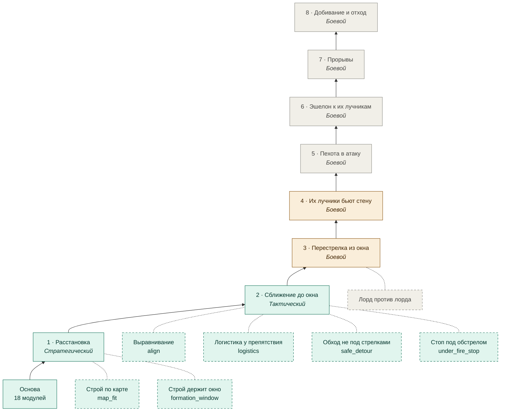
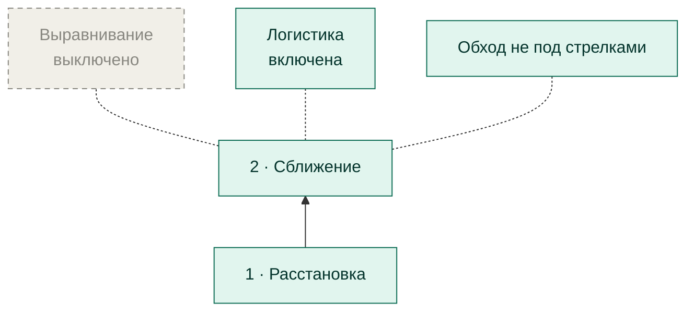
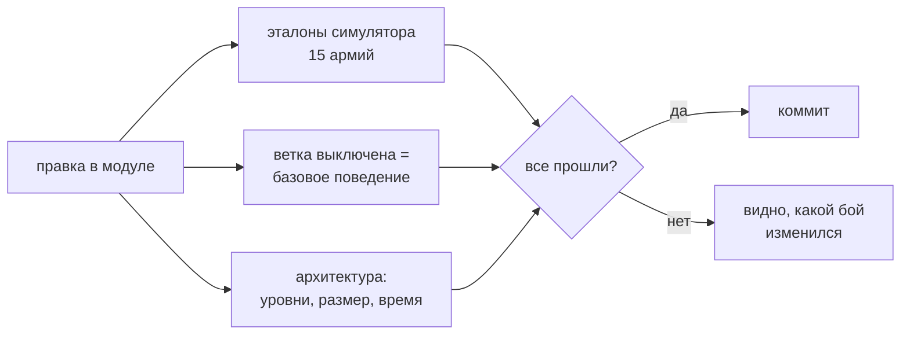

# Дерево ИИ

[← Назад](../README.md) · [Документация](../README.md) › Дерево ИИ · [English](../../en/tree/README.md)

Всё, что делает наш боевой ИИ, — одно дерево. **Ствол** — фазы боя по порядку:
следующая начинается, когда выполнено её условие. **Ветки** — улучшения фаз: у
каждой описано, что будет без неё, и её можно выключить, не ломая ствол.
Читается **снизу вверх**: от основы (движок и данные) к бою.

## Всё дерево

<!-- generated:tree:diagram -->

<!-- /generated -->

Зелёный — готово, жёлтый — начато, серый — не начато. Сплошная стрелка вверх —
следующая фаза ствола; пунктир — ветка (пунктирная рамка — её можно выключить).
Фазы 3–8 и «лорд против лорда» — из [теории боя](../architecture/battle-theory.md).

## Все узлы

<!-- generated:tree:table -->
| Узел | Вид | Уровень | Статус | Переключатель | Без него | Модули |
|---|---|---|---|---|---|---|
| [Расстановка](deploy.md) | фаза | Стратегический | готово | — | корень дерева, не выключается | [plan](../apps/plan.md), [assessment](../apps/assessment.md), [strategy](../apps/strategy.md), [formation](../apps/formation.md) |
| [Строй по карте](map_fit.md) | ветка | Стратегический | готово | `map_fit` (вкл) | строй встаёт ровно в заданную точку, карта не учитывается | [formation](../apps/formation.md), [mask](../apps/mask.md) |
| [Строй держит окно](formation_window.md) | ветка | Стратегический | готово | `formation_window` (вкл) | самая толстая стена, окно не проверяется | [formation](../apps/formation.md), [reach](../apps/reach.md) |
| [Сближение до окна](approach.md) | фаза | Тактический | готово | `approach` (вкл) | армия стоит, где расставлена | [tactics](../apps/tactics.md), [approach](../apps/approach.md), [reach](../apps/reach.md), [battlefield](../apps/battlefield.md), [vision](../apps/vision.md), [mask](../apps/mask.md) |
| [Выравнивание](align.md) | ветка | Тактический | готово | `align` (вкл) | не выравниваться, идти вдоль своего направления | [alignment](../apps/alignment.md), [battlefield](../apps/battlefield.md), [vision](../apps/vision.md) |
| [Логистика у препятствия](logistics.md) | ветка | Тактический | готово | `logistics` (выкл) | обход препятствия делает движок | [logistics](../apps/logistics.md), [mask](../apps/mask.md) |
| [Обход не под стрелками](safe_detour.md) | ветка | Тактический | готово | `safe_detour` (вкл) | место ищется до 20 м от их фронта | [tactics](../apps/tactics.md), [approach](../apps/approach.md), [reach](../apps/reach.md) |
| [Стоп под обстрелом](under_fire_stop.md) | ветка | Тактический | готово | `under_fire_stop` (вкл) | «одно действие за раз» и под обстрелом | [tactics](../apps/tactics.md), [approach](../apps/approach.md) |
| [Перестрелка из окна](combat.md#3) | фаза | Боевой | начато | появится с узлом | — | [missile](../apps/missile.md), [reach](../apps/reach.md) |
| [Их лучники бьют стену](combat.md#4) | фаза | Боевой | начато | появится с узлом | — | [tactics](../apps/tactics.md) |
| [Пехота в атаку](combat.md#5) | фаза | Боевой | не начато | появится с узлом | — | — |
| [Эшелон к их лучникам](combat.md#6) | фаза | Боевой | не начато | появится с узлом | — | — |
| [Прорывы](combat.md#7) | фаза | Боевой | не начато | появится с узлом | — | — |
| [Добивание и отход](combat.md#8) | фаза | Боевой | не начато | появится с узлом | — | — |
| [Лорд против лорда](combat.md#lord) | параллельная ветка | Боевой | не начато | появится с узлом | — | — |
<!-- /generated -->

## Как включать и выключать

Поле `tree` в конфиге армии (`config/armies/*.json`). Выключенный узел выключает
всё, что из него растёт, и все следующие фазы; родитель делает то, что написано в
столбце «Без него».

```json
{"tree": {"align": false, "logistics": true}}
```



Пример: `{"approach": false}` — армия расставляется и стоит; выравнивание,
логистика и всё, что после фазы 2, не работает. Первую фазу выключить нельзя.

## Как проверено, что дерево не ломается



Подробно — [тесты](../testing/tests.md); модули по уровням — [карта модулей](modules.md);
как вести эту документацию — [правила](../architecture/documentation.md).

## Страницы раздела

<!-- generated:docs:index -->
- [Фаза 1 · Расстановка](deploy.md) — Первая фаза и корень дерева: из состава армий выбрать стратегию и поставить строй
- [Строй по карте](map_fit.md) — Ветка расстановки: строй не встаёт на камни
- [Строй держит окно](formation_window.md) — Ветка расстановки: стена не толще, чем позволяет окно
- [Фаза 2 · Сближение до окна](approach.md) — Подойти скачками и встать в **окне**: наш первый эшелон достаёт их пехоту, их лучники нашу стену — нет
- [Выравнивание](align.md) — Ветка сближения: встать ровно напротив основной группы врага, чтобы стена смотрела на их фронт
- [Логистика у препятствия](logistics.md) — Ветка сближения: когда скачок идёт в обход препятствия, отряды проходят его очередями, а не толпой
- [Обход не под стрелками](safe_detour.md) — Ветка сближения: если строй не помещается в конце скачка, место за препятствием ищется **только там, куда их стрелки не достают**
- [Стоп под обстрелом](under_fire_stop.md) — Ветка сближения: единственное исключение из «одного действия за раз»
- [Боевой уровень · фазы 3–8](combat.md) — Фазы после того, как мы встали в окне
- [Карта модулей](modules.md) — Какие модули кода по каким уровням лежат и кто кем пользуется
<!-- /generated -->
