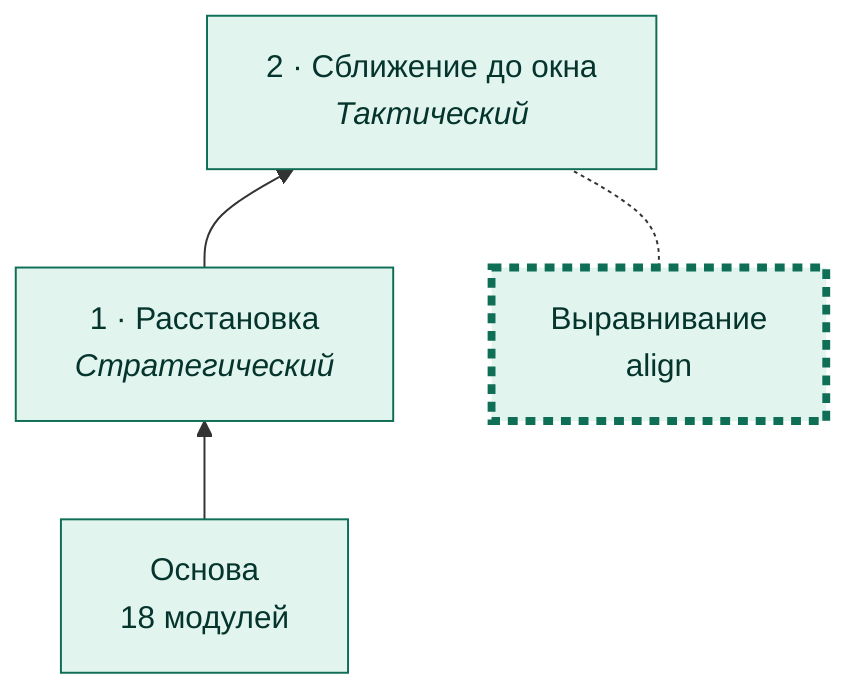
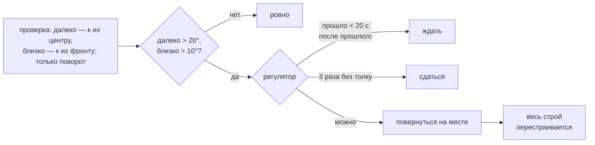

# Выравнивание

[← Назад](README.md) · [Документация](../README.md) › [Дерево ИИ](README.md) › Выравнивание · [English](../../en/tree/align.md)

Ветка сближения: встать ровно напротив основной группы врага, чтобы стена
смотрела на их фронт. Правило пользователя: выравнивание важнее сближения.

## Где в дереве

<!-- generated:tree:here:align -->

<!-- /generated -->

## Карточка

<!-- generated:tree:card:align -->
| | |
|---|---|
| Что делает | Повернуться к врагу на месте, без сдвига вбок: издалека — на его центр (допуск 20°), ближе 270 м — параллельно его фронту (10°) |
| Когда начинается | перекос больше допуска |
| Без него | не выравниваться, идти вдоль своего направления |
| Переключатель | `align` (вкл) |
| Вид, уровень | ветка, Тактический |
| Растёт из | [Сближение до окна](approach.md) |
| Модули | [alignment](../apps/alignment.md), [battlefield](../apps/battlefield.md), [vision](../apps/vision.md) |
| Статус | готово |
<!-- /generated -->

## Как работает

## Как ровняемся (с 28.09.2026, задача № 26)

Раньше армия вставала на линию, куда **смотрит** враг: поворачивалась и уходила вбок. Против штатного ИИ
это оказалось каруселью. Он сам разворачивается к нашей армии рывками по 6–15°, а его центр почти не
двигается (0,1–3,4 м). Мы сдвигались вбок, он поворачивался к нам, мы снова «стояли криво». В 2 боях
из 4 армию так увело на скалы. Разбор — в [карточке](../architecture/tasks/align-chase.md).

Теперь (`apps.alignment`, `line = 'front'`) — **только поворот на месте, без сдвига вбок**:

| Где мы | На что ровняемся | Допуск |
|---|---|---|
| дальше 270 м от их центра | на их центр | 20°: узкий проход идём вдоль, а не наискосок |
| ближе 270 м | параллельно их фронту: окну нужна наша линия вдоль их | 10° |
| марш к точке (врага нет) | на ось поля, с поворотом и сдвигом, как раньше | 10° и 15 м |

Раз наш центр не уходит вбок, штатный ИИ не начинает крутиться. Старое выравнивание — параметр
`line = 'enemy_facing'`.

| Бой `window_game`, игра, x20 | До | После |
|---|---|---|
| Уход вбок на расстановке | 245–344 м | 0 |
| Выравниваний до рубежа | 5–6 | 1 (поворот на 209 м) |
| «Места нет» | 2 боя из 4 | 0 |
| До рубежа | 595–620 с | 384–398 с (4 боя) |

## Пример

`first_attack_crooked` (армия поставлена криво нарочно): выравнивание
разворачивает её напротив врага до сближения; с `{"align": false}` армия идёт вдоль
своего направления.

## Проверки

- `tests/apps/alignment/` — проверка, цель, регулятор;
- ветка выключена = без выравнивания: `tests/tools/test_tree_branches.py`;
- карусель против поворачивающегося врага и путь только поворотом: `tests/tools/test_align_chase.py`;
- игра 27.09.2026: армия выровнялась и держалась, регулятор не метался; 28.09.2026 — карусель, исправлено
  (выше).

Модули: [alignment](../apps/alignment.md) · [battlefield](../apps/battlefield.md) · [vision](../apps/vision.md).
