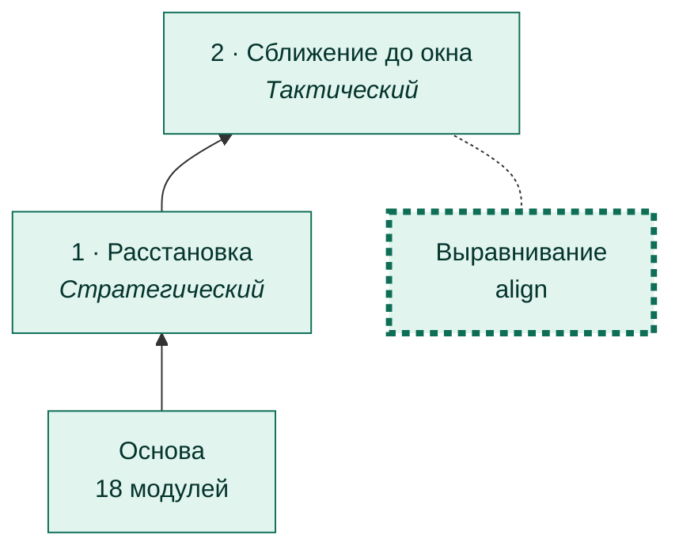
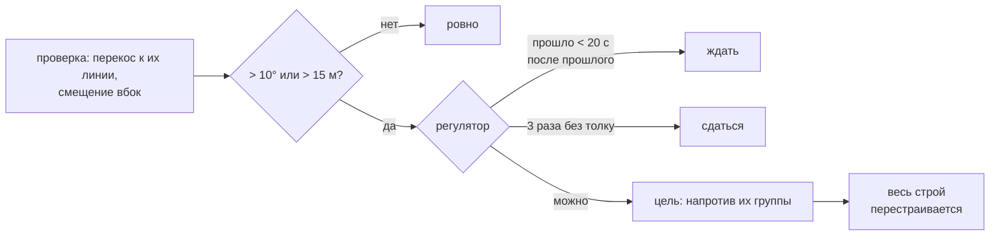

# Выравнивание

[← Назад](README.md) · [Документация](../README.md) › [Дерево ИИ](README.md) › Выравнивание · [English](../../en/tree/align.md)

Ветка сближения: встать ровно напротив основной группы врага, чтобы стена
смотрела на их фронт. Правило пользователя: выравнивание важнее сближения.

## Где в дереве

<!-- generated:tree:here:align -->

<!-- /generated -->

## Карточка

<!-- generated:tree:card:align -->
| | |
|---|---|
| Что делает | Встать ровно напротив основной группы врага: перекос ≤ 10°, вбок ≤ 15 м |
| Когда начинается | перекос или смещение больше допуска |
| Без него | не выравниваться, идти вдоль своего направления |
| Переключатель | `align` (вкл) |
| Вид, уровень | ветка, Тактический |
| Растёт из | [Сближение до окна](approach.md) |
| Модули | [alignment](../apps/alignment.md), [battlefield](../apps/battlefield.md), [vision](../apps/vision.md) |
| Статус | готово |
<!-- /generated -->

## Как работает

## Известная проблема (28.09.2026)

Против штатного ИИ выравнивание **гоняется за перестроениями врага**. Сразу после
расстановки враг стоит криво и в стороне — мы поворачиваемся на 32° и уходим вбок
на 350 м, враг перестраивается — поворачиваемся обратно на 40°. В 2 из 4 боёв новая
ось увела армию на скалы, и сближение встало («места нет»).

| Решение | Перекос | Вбок |
|---|---|---|
| сразу после расстановки | 32° | −350 м |
| следующее (500 м до врага) | −40° | +245 м |
| дальше | 5–11° | 23–70 м |

Предложено: не выравниваться, пока враг перестраивается; далеко от врага допуски
грубые, точно — перед окном; при «места нет» вернуться к прошлому направлению.

## Пример

`first_attack_crooked` (армия поставлена криво нарочно): выравнивание
разворачивает её напротив врага до сближения; с `{"align": false}` армия идёт вдоль
своего направления.

## Проверки

- `tests/apps/alignment/` — проверка, цель, регулятор;
- ветка выключена = без выравнивания: `tests/tools/test_tree_branches.py`;
- игра 27.09.2026: армия выровнялась и держалась, регулятор не метался; 28.09.2026 —
  проблема выше.

Модули: [alignment](../apps/alignment.md) · [battlefield](../apps/battlefield.md) · [vision](../apps/vision.md).
