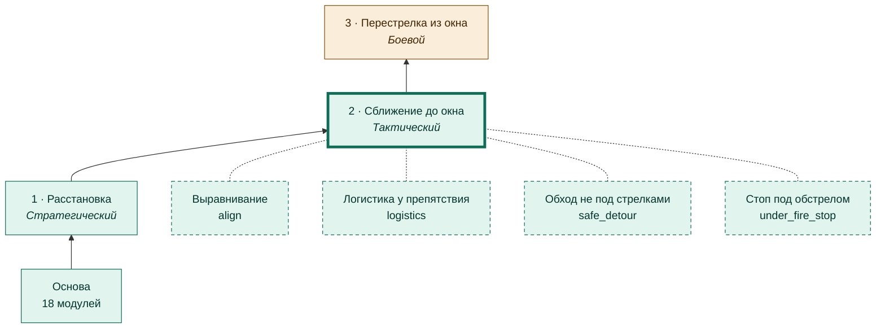
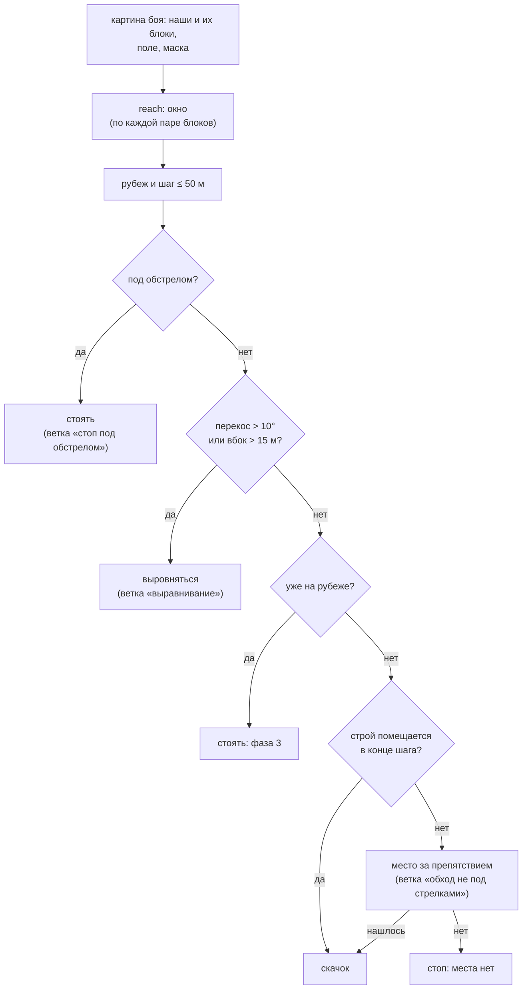
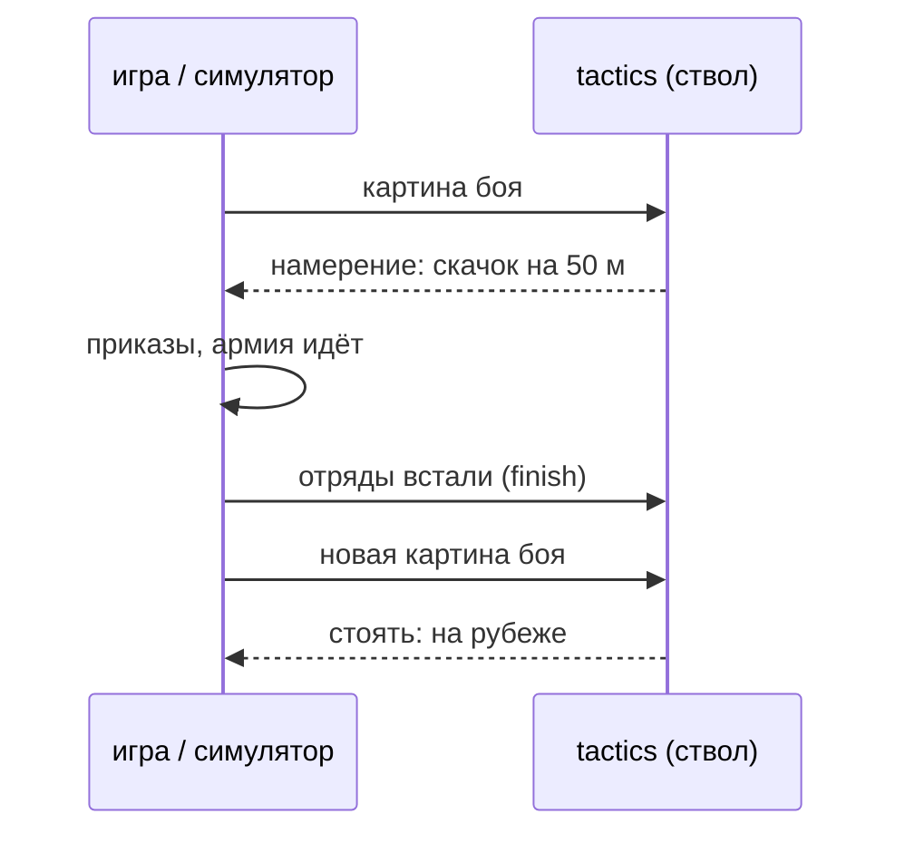
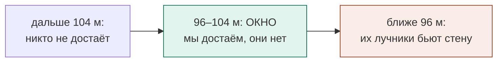

# Фаза 2 · Сближение до окна

[← Назад](README.md) · [Документация](../README.md) › [Дерево ИИ](README.md) › Сближение до окна · [English](../../en/tree/approach.md)

Подойти скачками и встать в **окне**: наш первый эшелон достаёт их пехоту, их
лучники нашу стену — нет. Решения принимает ствол `tactics` — один и тот же в
игре и в симуляции.

## Где в дереве

<!-- generated:tree:here:approach -->

<!-- /generated -->

## Карточка

<!-- generated:tree:card:approach -->
| | |
|---|---|
| Что делает | Скачками по 50 м к окну: наши лучники достают их, их — нас нет; одно действие за раз; строй переносится целиком, мешает скала — шаг вбок |
| Когда начинается | армия расставлена, враг виден |
| Без него | армия стоит, где расставлена |
| Переключатель | `approach` (вкл) |
| Вид, уровень | фаза, Тактический |
| Растёт из | [Расстановка](deploy.md) |
| Модули | [tactics](../apps/tactics.md), [approach](../apps/approach.md), [reach](../apps/reach.md), [battlefield](../apps/battlefield.md), [vision](../apps/vision.md), [mask](../apps/mask.md) |
| Статус | готово |
<!-- /generated -->

## Как работает

Одно решение (каждый раз, когда прошлый манёвр кончился):

Кто что делает во время скачка:

**Окно** — где встать (от переднего края нашей стены до их фронта):

## Пример

Симуляция тестовых армий в поле (враг стоит как штатный ИИ в тестовой битве):
8 скачков, стоим на 100,7 м между фронтами, окно 96,7–104,7 м; 60 с перестрелки —
мы 0, они −254.

В игре (x20): окно по настоящим блокам — наши достают со 100 м, их лучники с 95 м;
в окне за 59 с — мы 0, они −96…−149. Штатный ИИ не стоит на месте: при нашем
подходе он перестраивается, через ≈ 100 с его копейщики идут в атаку — это уже
фазы 3–5.

Посмотреть этот бой в движении, игру и симуляцию рядом: [проигрыватель боя](../launch/viewer.md).

## Проверки

- `tests/apps/reach/`, `tests/apps/approach/`, `tests/apps/tactics/`;
- эталоны симулятора (15 армий) — одни решения до и после переноса в `tactics`;
- ветка выключена = армия стоит, где расставлена: `tests/tools/test_tree_branches.py`;
- игра: `window_game` (4 боя 28.09.2026).

Модули: [tactics](../apps/tactics.md) · [approach](../apps/approach.md) · [reach](../apps/reach.md) · [battlefield](../apps/battlefield.md) · [vision](../apps/vision.md) · [mask](../apps/mask.md).
