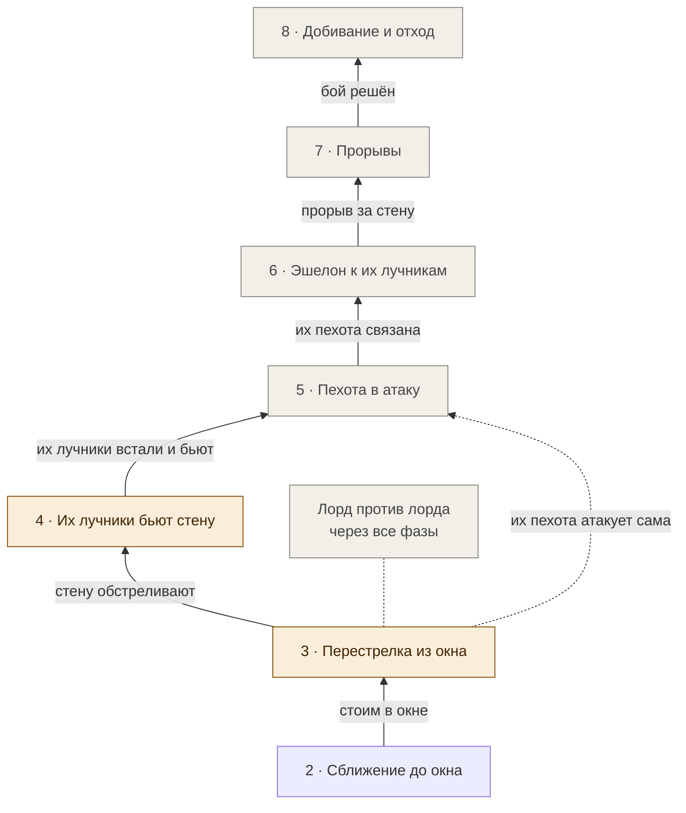

# Боевой уровень · фазы 3–8

[← Назад](README.md) · [Документация](../README.md) › [Дерево ИИ](README.md) › Боевой уровень · [English](../../en/tree/combat.md)

Фазы после того, как мы встали в окне. Пока в основном план из [теории боя](../architecture/battle-theory.md);
у каждой фазы — условие начала и что уже известно из игры.

## 3 · Перестрелка из окна

<!-- generated:tree:card:fire -->
| | |
|---|---|
| Что делает | Первый эшелон бьёт их пехоту, второй молчит, стена стоит; ждём, пока враг изменит расклад |
| Когда начинается | стоим в окне |
| Без него | — |
| Переключатель | появится с узлом |
| Вид, уровень | фаза, Боевой |
| Растёт из | [Сближение до окна](approach.md) |
| Модули | [missile](../apps/missile.md), [reach](../apps/reach.md) |
| Статус | начато |
<!-- /generated -->

Первый эшелон бьёт их переднюю пехоту, второй (≈ 77 м досягаемости) молчит, стена
стоит; ждём, пока враг изменит расклад. **Из игры** (4 боя, 28.09.2026):

| Что делает штатный ИИ | Когда |
|---|---|
| перестраивается: часть отрядов на 16–23 м вперёд, часть на 14–28 м назад | фронты в 189–196 м друг от друга |
| первый отряд копейщиков идёт в атаку | через 102–104 с |
| ещё 2–3 отряда и лорд | через 156–190 с |

В окне за 59 с они теряют 96–149 бойцов, мы — 0. Симуляция даёт 254 — урон в ней
пока завышен в 1,7–2,6 раза ([модель урона](../apps/missile.md)).

## 4 · Их лучники бьют стену

<!-- generated:tree:card:their_archers -->
| | |
|---|---|
| Что делает | Их лучники подошли и бьют нашу пехоту, наш первый эшелон их не достаёт |
| Когда начинается | стену обстреливают |
| Без него | — |
| Переключатель | появится с узлом |
| Вид, уровень | фаза, Боевой |
| Растёт из | [Перестрелка из окна](combat.md#3) |
| Модули | [tactics](../apps/tactics.md) |
| Статус | начато |
<!-- /generated -->

Их лучники остановятся там, где достают нашу стену (≈ 125 м), а наш первый эшелон
достаёт их только с ≈ 112 м — ждать нельзя. Уже есть: [стоп под обстрелом](under_fire_stop.md).

## 5 · Пехота в атаку

<!-- generated:tree:card:infantry_attack -->
| | |
|---|---|
| Что делает | Стена идёт на их пехоту или встречает её атаку, освобождая место за собой |
| Когда начинается | их лучники встали и бьют |
| Без него | — |
| Переключатель | появится с узлом |
| Вид, уровень | фаза, Боевой |
| Растёт из | [Их лучники бьют стену](combat.md#4) |
| Модули | — |
| Статус | не начато |
<!-- /generated -->

Стена идёт на их пехоту, чтобы не терять людей под стрелами и освободить место
для эшелона. Если их пехота атакует сама — встречный удар: встреча на полпути,
начинать при их фронте в 40–50 м.

## 6 · Эшелон к их лучникам

<!-- generated:tree:card:echelon_step -->
| | |
|---|---|
| Что делает | Первый эшелон шагает ≈ 13 м вперёд и бьёт их лучников |
| Когда начинается | их пехота связана боем |
| Без него | — |
| Переключатель | появится с узлом |
| Вид, уровень | фаза, Боевой |
| Растёт из | [Пехота в атаку](combat.md#5) |
| Модули | — |
| Статус | не начато |
<!-- /generated -->

## 7 · Прорывы

<!-- generated:tree:card:breakthroughs -->
| | |
|---|---|
| Что делает | Второй эшелон разворачивается к прорыву за нашу стену |
| Когда начинается | прорыв за нашу стену |
| Без него | — |
| Переключатель | появится с узлом |
| Вид, уровень | фаза, Боевой |
| Растёт из | [Эшелон к их лучникам](combat.md#6) |
| Модули | — |
| Статус | не начато |
<!-- /generated -->

## 8 · Добивание и отход

<!-- generated:tree:card:finish -->
| | |
|---|---|
| Что делает | Позже |
| Когда начинается | бой решён |
| Без него | — |
| Переключатель | появится с узлом |
| Вид, уровень | фаза, Боевой |
| Растёт из | [Прорывы](combat.md#7) |
| Модули | — |
| Статус | не начато |
<!-- /generated -->

## Лорд против лорда

<!-- generated:tree:card:lord_vs_lord -->
| | |
|---|---|
| Что делает | Наш лорд из центра связывает их бронированного лорда — через все боевые фазы |
| Когда начинается | их лорд вступил в бой |
| Без него | — |
| Переключатель | появится с узлом |
| Вид, уровень | параллельная ветка, Боевой |
| Растёт из | [Перестрелка из окна](combat.md#3) |
| Модули | — |
| Статус | не начато |
<!-- /generated -->

Их лорд бронирован, бронебойных у нас нет — убивать его нечем; наш лорд из центра
выходит и связывает его боем. Пока их лорд не вступил — наш стоит в центре.
