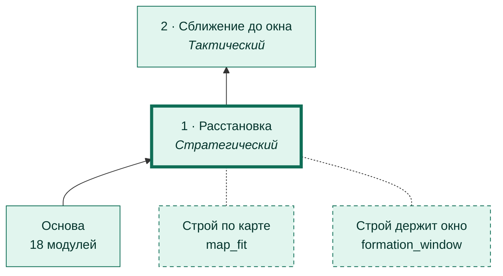
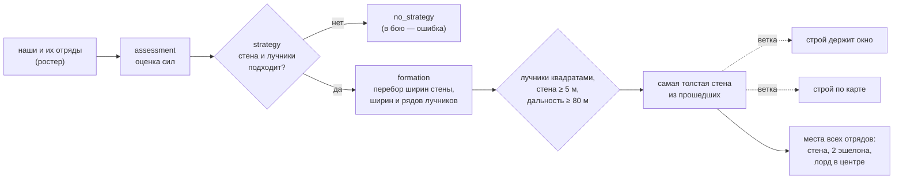
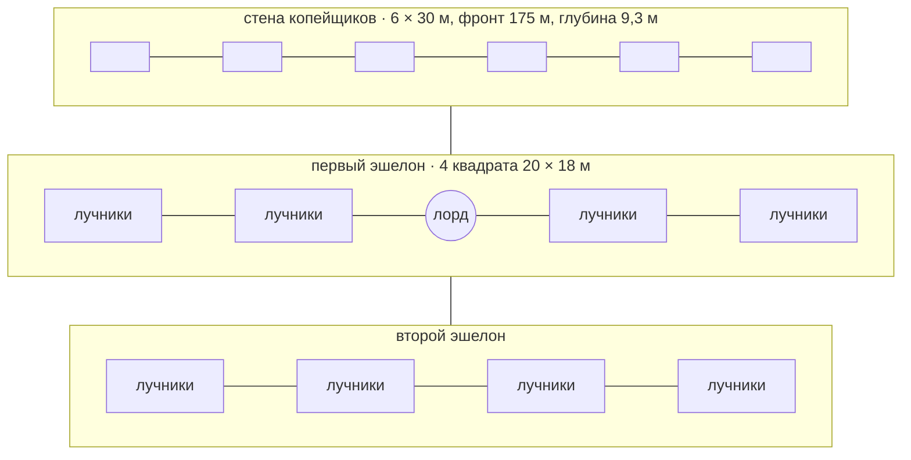

# Фаза 1 · Расстановка

[← Назад](README.md) · [Документация](../README.md) › [Дерево ИИ](README.md) › Расстановка · [English](../../en/tree/deploy.md)

Первая фаза и корень дерева: из состава армий выбрать стратегию и поставить строй.

## Где в дереве

<!-- generated:tree:here:deploy -->

<!-- /generated -->

## Карточка

<!-- generated:tree:card:deploy -->
| | |
|---|---|
| Что делает | Оценивает силы, выбирает стратегию и ставит строй: стена копейщиков, лучники двумя эшелонами, лорд в центре |
| Когда начинается | начало боя |
| Без него | корень дерева, не выключается |
| Переключатель | — |
| Вид, уровень | фаза, Стратегический |
| Растёт из | — |
| Модули | [plan](../apps/plan.md), [assessment](../apps/assessment.md), [strategy](../apps/strategy.md), [formation](../apps/formation.md) |
| Статус | готово |
<!-- /generated -->

## Как работает

Лорд стоит в центре, в проходе 10 м между половинами первого ряда лучников:
его задача — связать бронированного лорда врага, а из центра до любого фланга
ближе ([теория боя](../architecture/battle-theory.md#1-расстановка)).

## Пример

Тестовая армия (лорд, 6 копейщиков, 8 лучников) на карте тестовой битвы:

| Что | Число |
|---|---|
| Стена | 6 × 30 м: фронт 175 м, глубина 9,3 м |
| Первый эшелон | середина в 21,3 м за передним краем стены |
| Проход лорда | 10 м по плану, 11,7 м по бойцам в игре |
| Лорд | 0,1 м от плана в игре; путь к флангу 101 м, свободен |

## Проверки

- `tests/apps/formation/` — 565 составов от 2 до 20 отрядов: без пересечений, лорд в
  проходе, путь к флангам свободен; `tests/apps/strategy/`, `tests/apps/plan/`;
- эталоны симулятора (`tests/golden/`);
- игра 28.09.2026: все 15 отрядов в 0,5–2,4 м от плана, строй простоял 60 с.

Модули: [plan](../apps/plan.md) · [assessment](../apps/assessment.md) · [strategy](../apps/strategy.md) · [formation](../apps/formation.md).
