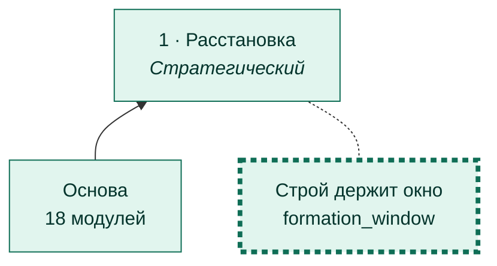
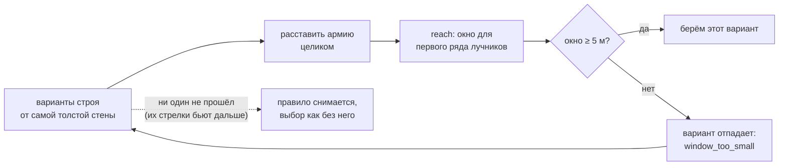
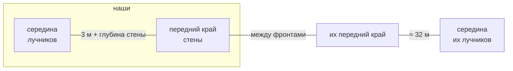

# Строй держит окно

[← Назад](README.md) · [Документация](../README.md) › [Дерево ИИ](README.md) › Строй держит окно · [English](../../en/tree/formation_window.md)

Ветка расстановки: стена не толще, чем позволяет окно. Толстая стена отодвигает
наших лучников от фронта, а их стрелки достают нашу стену с того же расстояния.

## Где в дереве

<!-- generated:tree:here:formation_window -->

<!-- /generated -->

## Карточка

<!-- generated:tree:card:formation_window -->
| | |
|---|---|
| Что делает | Стена не толще, чем позволяет окно против видимого врага (≥ 5 м) |
| Когда начинается | враг виден |
| Без него | самая толстая стена, окно не проверяется |
| Переключатель | `formation_window` (вкл) |
| Вид, уровень | ветка, Стратегический |
| Растёт из | [Расстановка](deploy.md) |
| Модули | [formation](../apps/formation.md), [reach](../apps/reach.md) |
| Статус | готово |
<!-- /generated -->

## Как работает

Почему глубина стены съедает окно (от середины блока лучников до цели ≤ 125 м):

| Ширина копейщиков | Стена (фронт × глубина) | Наши достают с | Их лучники с | Окно |
|---|---|---|---|---|
| 15 м | 91 × 18,7 м | 94,3 м | 95,6 м | нет |
| 20 м | 115 × 14,9 м | 98,1 м | 95,6 м | 2,5 м |
| **30 м** | **175 × 9,3 м** | **103,7 м** | **95,6 м** | **8,1 м** |
| 40 м | 237 × 7,7 м | 105,3 м | 95,6 м | 9,7 м |

Против штатного ИИ тестовой битвы (их лучники в ≈ 32 м за фронтом). Против
крупной армии штатного ИИ (лучники в 54 м) окно широкое при любой стене — остаётся
самая толстая.

## Пример

6 копейщиков и 4 лучника: без ветки — стена 15 м и окна нет; с веткой — стена 30 м,
окно 8 м.

## Проверки

- `tests/apps/formation/test_services.py` — окно против видимого врага, глубокий
  враг, окно невозможно;
- ветка выключена = самая толстая стена: `tests/tools/test_tree_branches.py`;
- игра 28.09.2026 (`window_game_few`): строй перестроился на 30 м, как только враг
  встал линиями; стоим в окне, 59 с — мы −12, они −55.

Модули: [formation](../apps/formation.md) · [reach](../apps/reach.md).
