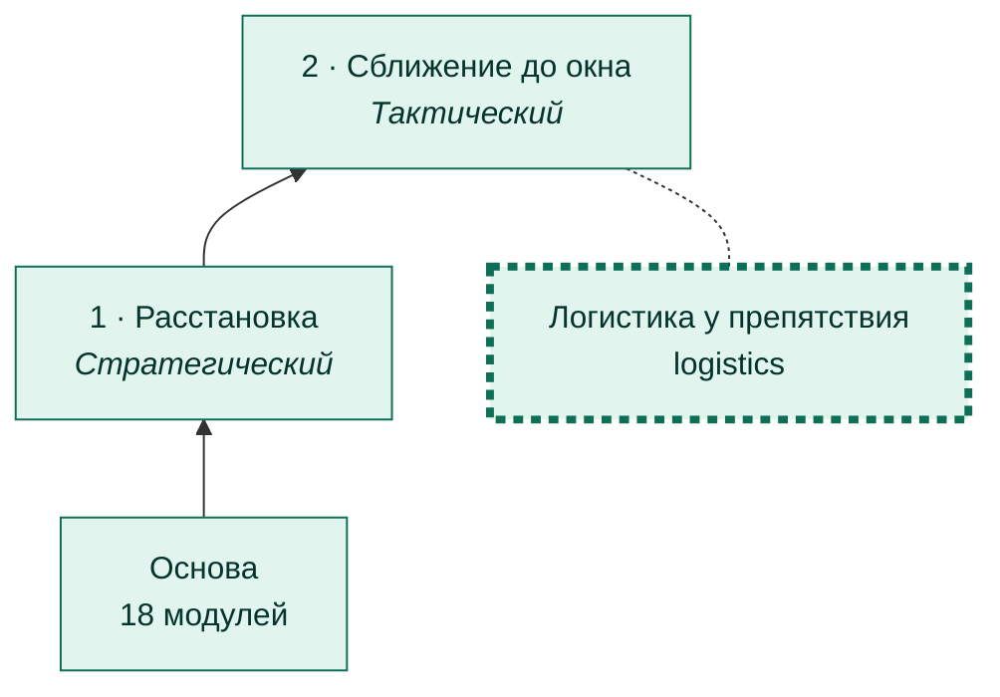
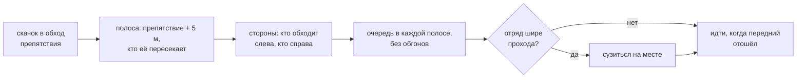

# Логистика у препятствия

[← Назад](README.md) · [Документация](../README.md) › [Дерево ИИ](README.md) › Логистика · [English](../../en/tree/logistics.md)

Ветка сближения: когда скачок идёт в обход препятствия, отряды проходят его
очередями, а не толпой. По умолчанию **выключена** — обход делает движок.

## Где в дереве

<!-- generated:tree:here:logistics -->

<!-- /generated -->

## Карточка

<!-- generated:tree:card:logistics -->
| | |
|---|---|
| Что делает | Очереди у препятствия: кто обходит, какой стороной, в каком порядке и ширине |
| Когда начинается | скачок идёт в обход препятствия |
| Без него | обход препятствия делает движок |
| Переключатель | `logistics` (выкл) |
| Вид, уровень | ветка, Тактический |
| Растёт из | [Сближение до окна](approach.md) |
| Модули | [logistics](../apps/logistics.md), [mask](../apps/mask.md) |
| Статус | готово |
<!-- /generated -->

## Как работает

## Пример

Длинная стена у скалы (16 отрядов): очереди с обеих сторон, без давки.

В движении, с очередью и все сразу рядом: `python -m tools.viewer logistics rock_march_wide` — [проигрыватель боя](../launch/viewer.md#обход-препятствия-очередями).

## Проверки

- `tests/apps/logistics/` — полоса, стороны, очереди, сужение;
- игра 27.09.2026: 5 местностей, в том числе скавены; задача доработки — № 18.

Модули: [logistics](../apps/logistics.md) · [mask](../apps/mask.md).
