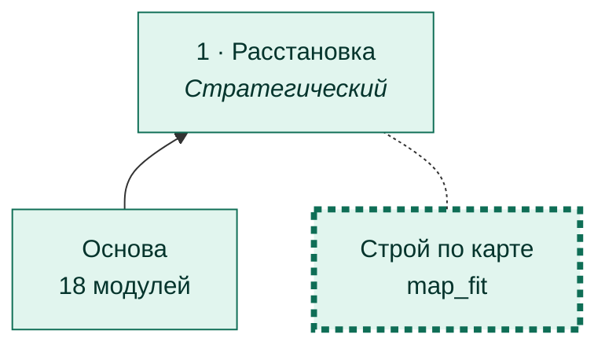
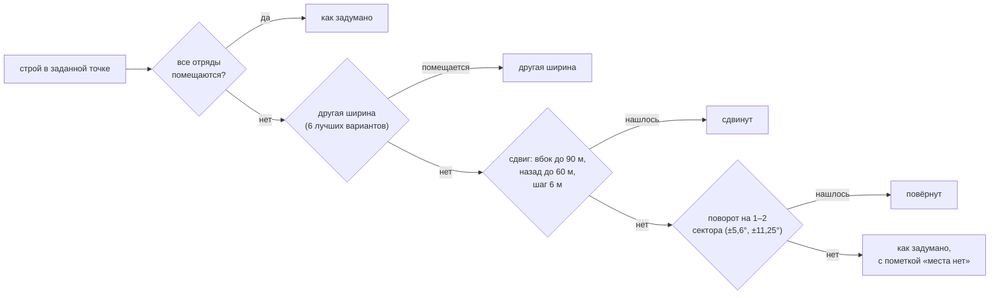

# Строй по карте

[← Назад](README.md) · [Документация](../README.md) › [Дерево ИИ](README.md) › Строй по карте · [English](../../en/tree/map_fit.md)

Ветка расстановки: строй не встаёт на камни. На камне движок ставит отряд криво
(сдвиг до 18 м, направление 172° вместо 90° — замер 28.09.2026).

## Где в дереве

<!-- generated:tree:here:map_fit -->

<!-- /generated -->

## Карточка

<!-- generated:tree:card:map_fit -->
| | |
|---|---|
| Что делает | Если строй не встаёт на камни — другая ширина, сдвиг вбок и назад, поворот на сектор |
| Когда начинается | есть снятая карта (маска) |
| Без него | строй встаёт ровно в заданную точку, карта не учитывается |
| Переключатель | `map_fit` (вкл) |
| Вид, уровень | ветка, Стратегический |
| Растёт из | [Расстановка](deploy.md) |
| Модули | [formation](../apps/formation.md), [mask](../apps/mask.md) |
| Статус | готово |
<!-- /generated -->

## Как работает

Маска «можно ли тут встать» (клетка 3 м) строится вокруг армии; каждый отряд
проверяется по своему прямоугольнику. Уступки — по порядку, ближайшая первой:

## Пример

Тестовая битва: в заданной точке часть строя легла бы на скалу — строй сдвинут
на 18 м назад и встал целиком.

## Проверки

- `tests/apps/formation/test_fit.py` — камень под стеной, под лучниками, нет места;
- ветка выключена = строй без карты: `tests/tools/test_tree_branches.py`;
- игра 28.09.2026: 15 отрядов в 0,5–1,0 м от плана, ни одного на камне.

Модули: [formation](../apps/formation.md) · [mask](../apps/mask.md).
