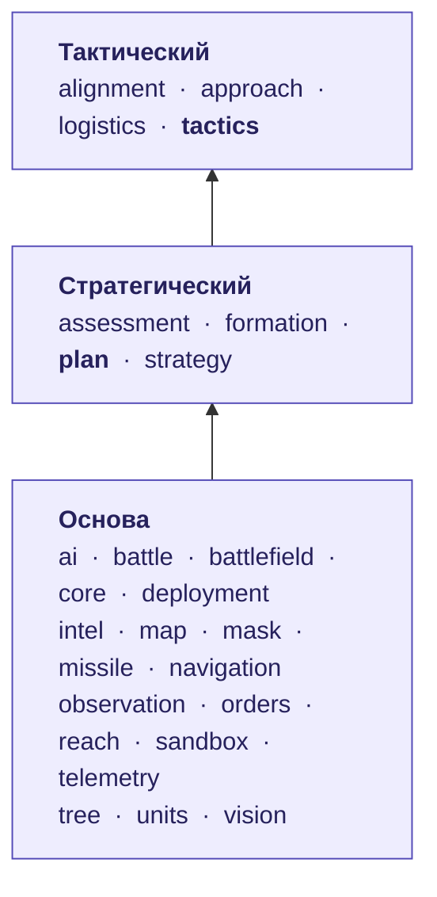

# Карта модулей

[← Назад](README.md) · [Документация](../README.md) › [Дерево ИИ](README.md) › Карта модулей · [English](../../en/tree/modules.md)

Какие модули кода по каким уровням лежат и кто кем пользуется. Стрелка идёт
вверх — от модуля, которым пользуются, к тому, кто им пользуется.

<!-- generated:tree:modules -->

| Модуль | Уровень | Пользуется | Им пользуются |
|---|---|---|---|
| [ai](../apps/ai.md) | Основа | — | sandbox |
| [battle](../apps/battle.md) | Основа | — | — |
| [battlefield](../apps/battlefield.md) | Основа | — | alignment, logistics, mask |
| [core](../apps/core.md) | Основа | — | все |
| [deployment](../apps/deployment.md) | Основа | orders, units | — |
| [intel](../apps/intel.md) | Основа | — | observation |
| [map](../apps/map.md) | Основа | — | mask, navigation |
| [mask](../apps/mask.md) | Основа | battlefield, map | tactics |
| [missile](../apps/missile.md) | Основа | reach | — |
| [navigation](../apps/navigation.md) | Основа | map | — |
| [observation](../apps/observation.md) | Основа | intel, units | — |
| [orders](../apps/orders.md) | Основа | units | deployment, plan, sandbox |
| [reach](../apps/reach.md) | Основа | — | formation, missile, tactics |
| [sandbox](../apps/sandbox.md) | Основа | ai, orders | — |
| [telemetry](../apps/telemetry.md) | Основа | — | — |
| [tree](../apps/tree.md) | Основа | — | plan, tactics |
| [units](../apps/units.md) | Основа | — | deployment, observation, orders |
| [vision](../apps/vision.md) | Основа | — | — |
| [assessment](../apps/assessment.md) | Стратегический | — | plan |
| [formation](../apps/formation.md) | Стратегический | reach | plan |
| **[plan](../apps/plan.md)** (ствол уровня) | Стратегический | assessment, formation, orders, strategy, tree | — |
| [strategy](../apps/strategy.md) | Стратегический | — | plan |
| [alignment](../apps/alignment.md) | Тактический | battlefield | tactics |
| [approach](../apps/approach.md) | Тактический | — | tactics |
| [logistics](../apps/logistics.md) | Тактический | battlefield | — |
| **[tactics](../apps/tactics.md)** (ствол уровня) | Тактический | alignment, approach, mask, reach, tree | — |
<!-- /generated -->

## Правила уровней

| Уровень | Что там | Кто может звать |
|---|---|---|
| Основа | движок, данные, правила игры: `orders`, `units`, `map`, `mask`, `vision`, `reach`, `missile`, `tree`… | всё, что выше |
| Стратегический | фаза 1: `assessment`, `strategy`, `formation`; ствол — `plan` | тактический и боевой |
| Тактический | фаза 2: `alignment`, `approach`, `logistics`; ствол — `tactics` | боевой |
| Боевой | фазы 3–8 (впереди) | — |

- **Зависимости только вниз.** Модуль не зовёт модуль уровнем выше.
- **На одном уровне** узлы зовёт только **ствол уровня** (`plan`, `tactics`): так
  узлы не связаны между собой и выключаются по одному.
- **Чистый код** (`services`, `contract`, `data`) не трогает игру; игру трогают только `adapter`.
- **Ключи отрядов и замеры** — только в модулях данных (`data.lua`, `data/`).

Всё это проверяет `tests/architecture/`; уровни записаны в `tools/architecture.py`.
Описание каждого модуля — [модули](../apps/README.md).
