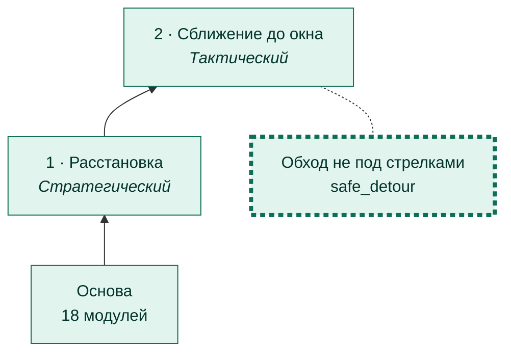
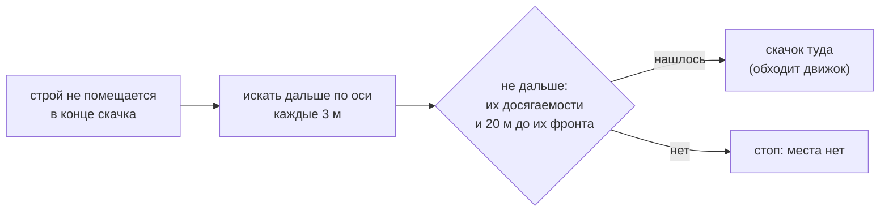
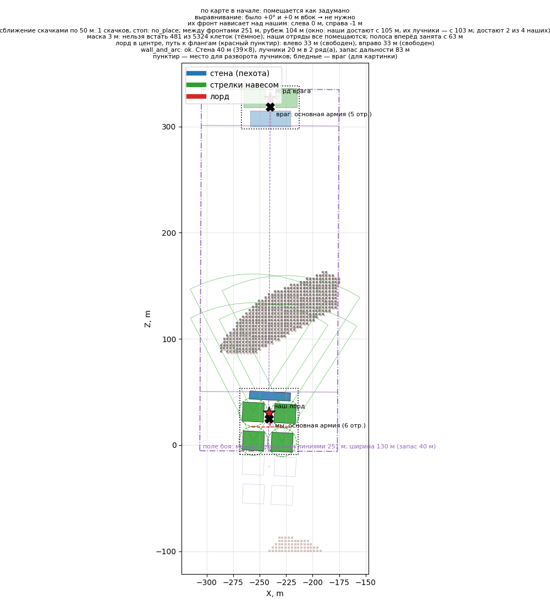
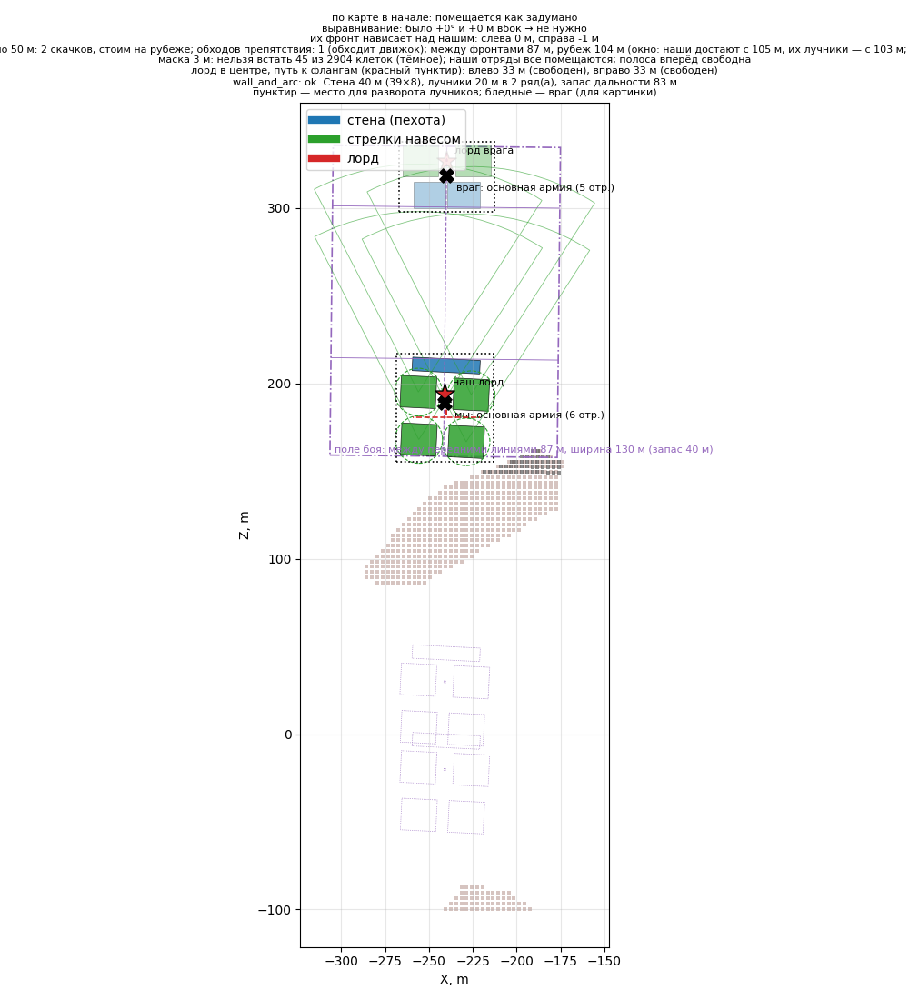

# Обход не под стрелками

[← Назад](README.md) · [Документация](../README.md) › [Дерево ИИ](README.md) › Обход не под стрелками · [English](../../en/tree/safe_detour.md)

Ветка сближения: если строй не помещается в конце скачка, место за препятствием
ищется **только там, куда их стрелки не достают**.

## Где в дереве

<!-- generated:tree:here:safe_detour -->

<!-- /generated -->

## Карточка

<!-- generated:tree:card:safe_detour -->
| | |
|---|---|
| Что делает | Место за препятствием ищется только вне досягаемости их стрелков |
| Когда начинается | строй не помещается на месте скачка |
| Без него | место ищется до 20 м от их фронта |
| Переключатель | `safe_detour` (вкл) |
| Вид, уровень | ветка, Тактический |
| Растёт из | [Сближение до окна](approach.md) |
| Модули | [tactics](../apps/tactics.md), [approach](../apps/approach.md), [reach](../apps/reach.md) |
| Статус | готово |
<!-- /generated -->

## Как работает

Без ветки поиск идёт до 20 м от их фронта — и место за препятствием может оказаться
прямо под их лучниками.

## Пример

Скала на пути, близко к их строю (`rock_attack`):

| С веткой: стоп перед скалой | Без ветки: встали за скалой, под их лучниками |
|---|---|
|  |  |

## Проверки

- ветка выключена = старое поведение (за скалой): `tests/tools/test_tree_branches.py`;
- эталоны `rock_attack`, `rock_attack_wide`.

Модули: [tactics](../apps/tactics.md) · [approach](../apps/approach.md) · [reach](../apps/reach.md).
