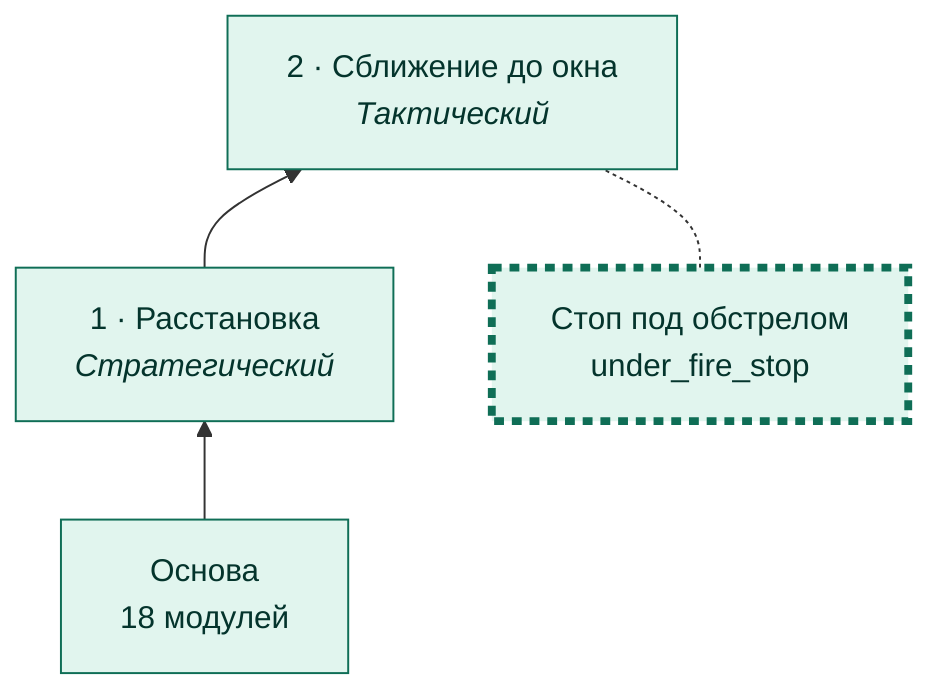
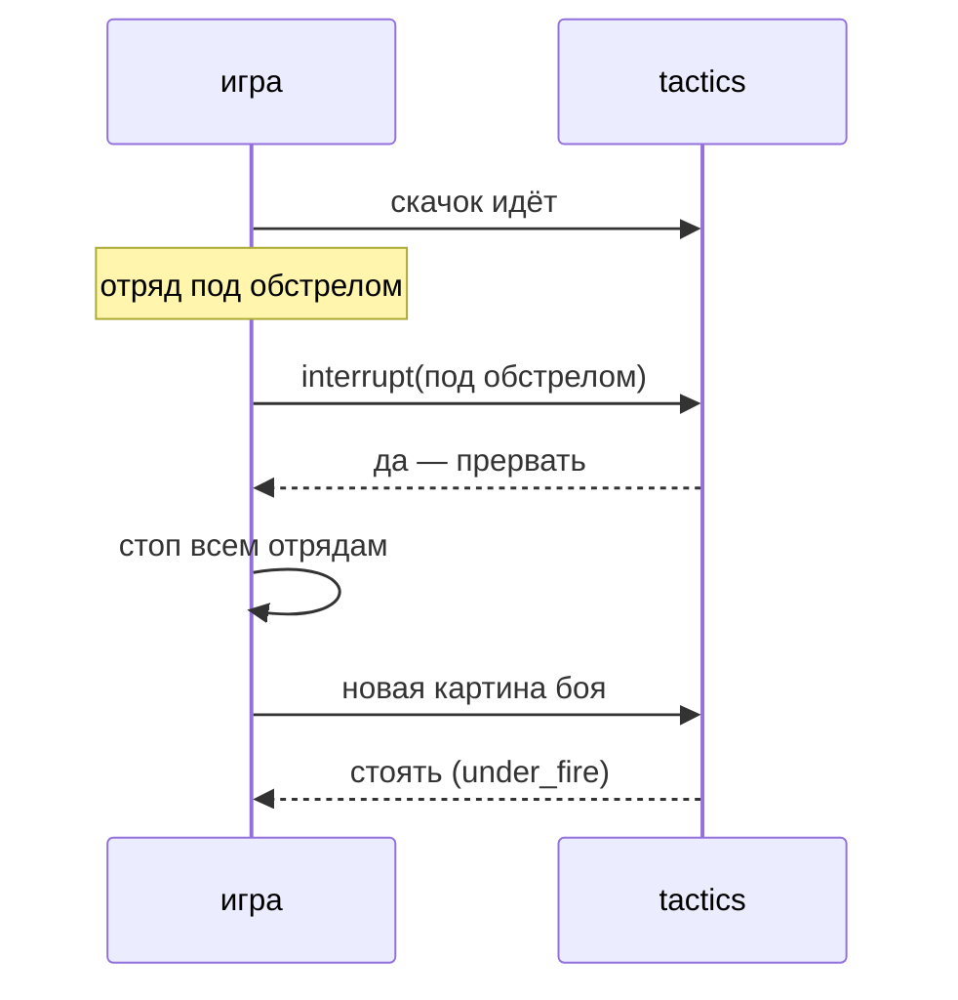

# Стоп под обстрелом

[← Назад](README.md) · [Документация](../README.md) › [Дерево ИИ](README.md) › Стоп под обстрелом · [English](../../en/tree/under_fire_stop.md)

Ветка сближения: единственное исключение из «одного действия за раз». Если наш
отряд под обстрелом, манёвр прерывается и ничего нового не начинается — дальше
решают фазы боя.

## Где в дереве

<!-- generated:tree:here:under_fire_stop -->

<!-- /generated -->

## Карточка

<!-- generated:tree:card:under_fire_stop -->
| | |
|---|---|
| Что делает | Под обстрелом манёвр прерывается и ничего нового не начинается |
| Когда начинается | наш отряд под обстрелом |
| Без него | «одно действие за раз» и под обстрелом |
| Переключатель | `under_fire_stop` (вкл) |
| Вид, уровень | ветка, Тактический |
| Растёт из | [Сближение до окна](approach.md) |
| Модули | [tactics](../apps/tactics.md), [approach](../apps/approach.md) |
| Статус | готово |
<!-- /generated -->

## Как работает

## Пример

Без ветки (первый бой 28.09.2026): выравнивание началось под обстрелом и шло 6
минут — скрипт ждал, армию разбили. С веткой: манёвр прерван сразу, 59 с на месте —
мы −26, они −75.

| | Без ветки | С веткой |
|---|---|---|
| Манёвр под обстрелом | ждали конца 6 мин | прерван сразу |
| Итог | армия разбита | мы −26, они −75 за 59 с |

## Проверки

- `tests/apps/approach/` — командир под обстрелом ничего не начинает;
  `tests/apps/tactics/` — прерывание только с веткой;
- ветка выключена = «одно действие за раз»: `tests/tools/test_tree_branches.py`.

Модули: [tactics](../apps/tactics.md) · [approach](../apps/approach.md).
