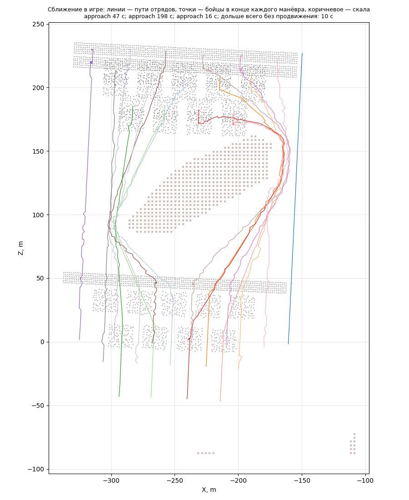

# Сближение в игре: длинная стена в обход скалы

Модуль [approach](../../../docs/ru/apps/approach.md) в бою: прогон `formation-probe`
с армией `rock_march_wide` — 16 отрядов (лорд, 6 копейщиков, 9 лучников) идут к
точке за скалой; **простой вариант без учёта вражеской армии** (решение
пользователя): точка цели стоит вместо основной группы врага, враг держится далеко.
Наша сторона врага за скалой всё равно бы не увидела: гряда выше линии взгляда на 3–15 м.

```bash
.venv/Scripts/python -m tools.build formation-probe --army rock_march_wide
```

```bash
powershell -NoProfile -ExecutionPolicy Bypass -File tools/launcher/launch.ps1 -Target formation-probe
```

```bash
.venv/Scripts/python -m tools.analysis.approach_game build/formation-probe/runs/<время> --map moorlands-route --out research/analysis/approach
```



## Результаты (27.09.2026)

| Решение ИИ | Манёвр | Как прошёл |
|---|---|---|
| выровняться (армия смотрела на далёкого врага, поворот на 122°) | 16 приказов | ≈ 105 с |
| скачок 50 м | 16 приказов | 47 с |
| 170 м — первое место, где весь строй помещается за скалой (по прямой не пройти) | 16 приказов | 198 с: движок **разделил стену** — левые отряды обошли скалу с запада, правые с востока — и **собрал её заново** за скалой |
| доводка 11 м | 16 приказов | 16 с |
| стоять: в 18 м от цели | — | минута стояния — «не метаться» PASS |

- Новое решение — только после конца прошлого манёвра (одно действие за раз).
- Застреваний нет: дольше всего без продвижения один отряд — ровно 10 с (граница
  нашего определения «застрял», ожидание в очереди на обходе).
- В конце бойцы разных отрядов не ближе 1,2 м (плановый зазор в линии).
- Путь самого дальнего отряда в обход — 254 м вместо 170 м по прямой.
