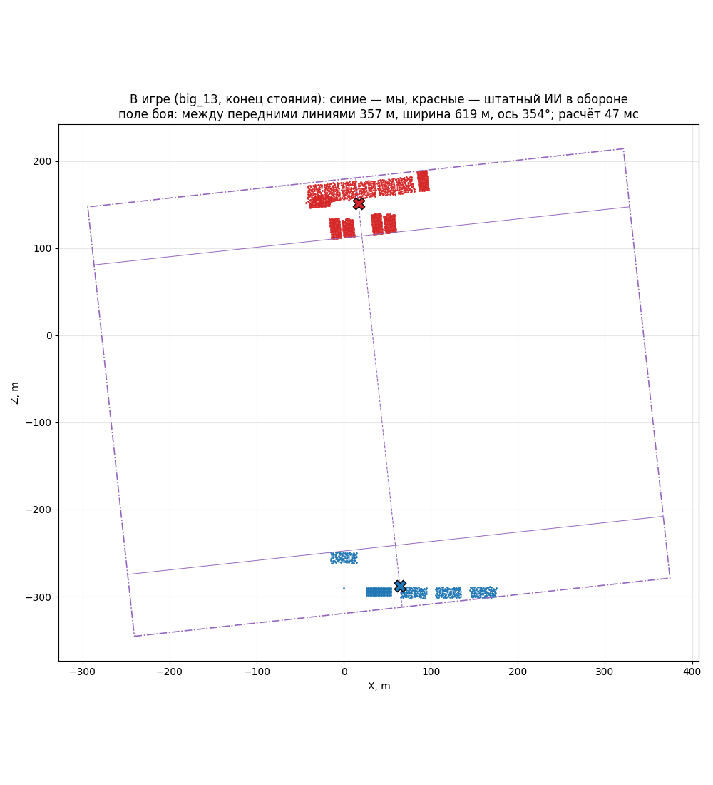

# Поле боя в игре

Модули [vision](../../../docs/ru/apps/vision.md) и
[battlefield](../../../docs/ru/apps/battlefield.md) в бою на настоящих данных:
прогон `enemy-layout` (состав `big_13`: штатный ИИ в обороне, 13 отрядов; наша
армия из 6 отрядов стоит). Каждые 5 с игры модули строят группы и поле боя
**только по тому, что видит наша сторона** — событие `battlefield`.

```bash
.venv/Scripts/python -m tools.build enemy-layout --layout big_13
```

```bash
powershell -NoProfile -ExecutionPolicy Bypass -File tools/launcher/launch.ps1 -Target enemy-layout
```

```bash
.venv/Scripts/python -m tools.analysis.battlefield_game build/enemy-layout/runs/<время> --out research/analysis/battlefield
```



## Результаты (27.09.2026)

- Наша сторона — **одна группа из 6 отрядов**, враг — **одна группа из 13**,
  видны все 13 все 90 с.
- **Ось** 353,5–354,5° (армии стоят чуть наискосок, и прямоугольник повернулся
  вместе с ними). **Между передними линиями** 301 м в начале и 350–358 м после
  того, как штатный ИИ встал (с 20-й секунды); **ширина поля** 619 м (запас 200 м
  с каждой стороны).
- **Расчёт** (чтение всех бойцов ≈ 2000 обращений + группы + поле) — 41–47 мс;
  раз в 5 с это незаметно.

Этот прогон шёл с запасом 200 м; потом запас уменьшен до 40 м (решение
пользователя) — ось, передние линии и зазор от запаса не зависят, меняется только ширина поля.
