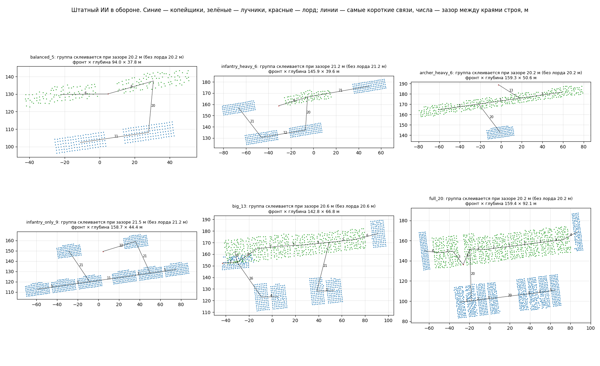

# Как штатный ИИ стоит в обороне

Задача: [оценка позиции врага](../../../docs/ru/architecture/tasks/backlog.md#12-оценка-позиции-и-стратегии-врага),
первый шаг — область основной армии. Нужно было понять, при каком расстоянии
считать отряды одной «группой».

Прогон `enemy-layout`: наша армия стоит на юге, враг — штатный ИИ в своей зоне
на севере, после расстановки получает задачу «оборонять место, где встал»
(`script_ai_planner:defend_position`, радиус 80 м), и 90 с игры записываются все
его бойцы. Шесть составов из `config/armies/defender_layouts.json`.

```bash
.venv/Scripts/python -m tools.build enemy-layout --layout balanced_5
```

```bash
powershell -NoProfile -ExecutionPolicy Bypass -File tools/launcher/launch.ps1 -Target enemy-layout
```

```bash
.venv/Scripts/python -m tools.analysis.enemy_layout <папки прогонов> --out research/analysis/enemy-layout
```



## Результаты (27.09.2026)

| Состав | Отрядов | Группа склеивается при зазоре между краями строя | Лорд от армии | Фронт × глубина |
|---|---|---|---|---|
| лорд + 2 копейщика + 2 лучника | 5 | 20,2 м | 5,9 м | 94 × 38 м |
| лорд + 4 копейщика + 1 лучник | 6 | 21,2 м | 6,4 м | 146 × 40 м |
| лорд + 1 копейщик + 4 лучника | 6 | 20,2 м | 12,9 м | 159 × 51 м |
| лорд + 8 копейщиков | 9 | 21,5 м | 21,5 м | 159 × 44 м |
| лорд + 6 + 6 | 13 | 20,6 м | 1,0 м | 143 × 67 м |
| лорд + 10 + 9 | 20 | 20,2 м | 2,6 м | 159 × 92 м |

**Как стоит штатный ИИ.** Очень правильно и одинаково при любом составе:

- **линии:** отряды одной линии стоят бок о бок с зазором 2–6 м (изредка 11–12 м);
- **между линиями ≈ 20 м** (20,2–21,5 м во всех шести составах): копейщики
  впереди, лучники во второй линии; при избытке пехоты часть копейщиков уходит
  во вторую линию или на фланги, развернувшись боком;
- **лорд** — между линиями или рядом с ними, до 21,5 м от ближайшего отряда;
- после задачи «обороняй» армия выходит вперёд на ≈ 35 м и стоит; большие
  армии ещё поправляют строй до конца записи (90 с).

**Порог группы — 30 м между краями строя** (наибольший наблюдённый зазор 21,5 м
плюс запас; пользователь расширил с предложенных 25 м до 30 м). Модуль —
[vision](../../../docs/ru/apps/vision.md). Расстояние между серединами отрядов для этого не годится: оно
зависит от ширины отрядов и прыгает от 30 до 56 м.

**Прочее.**

- Наша сторона видела весь вражеский строй всё время (открытое поле, ≈ 300 м).
- Бойцы врага (`ManList`) совпадают с позицией его отрядов с точностью до 2 м —
  данные не устаревшие.
- В наших XML-боях движок считает нападающими **обе** стороны; без задачи
  «обороняй» штатный ИИ идёт в атаку.
