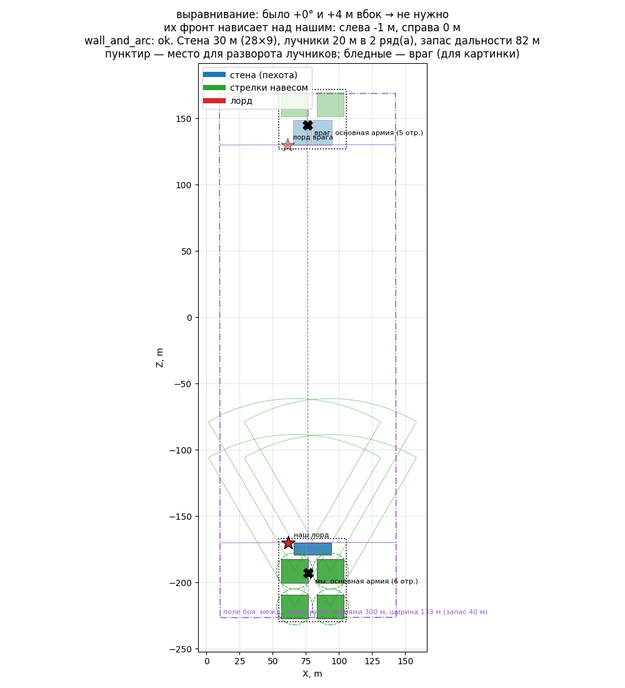
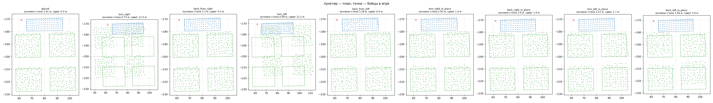
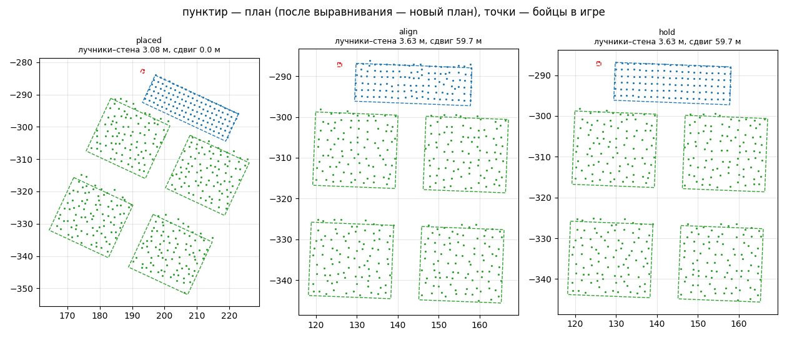
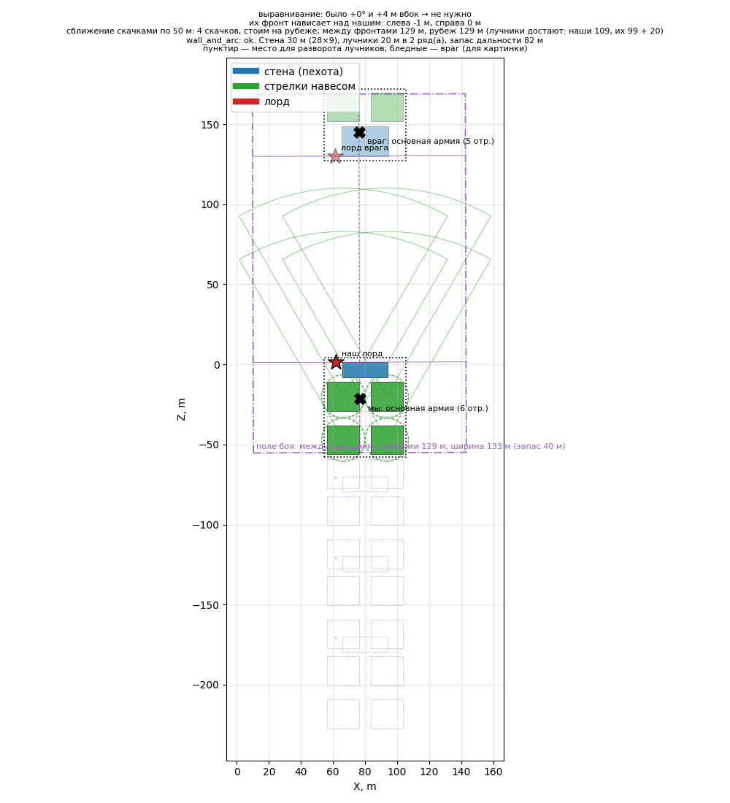
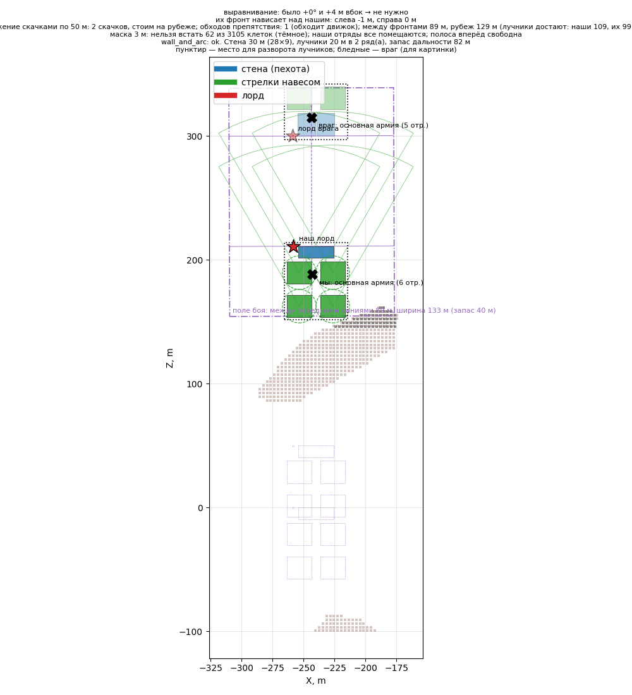
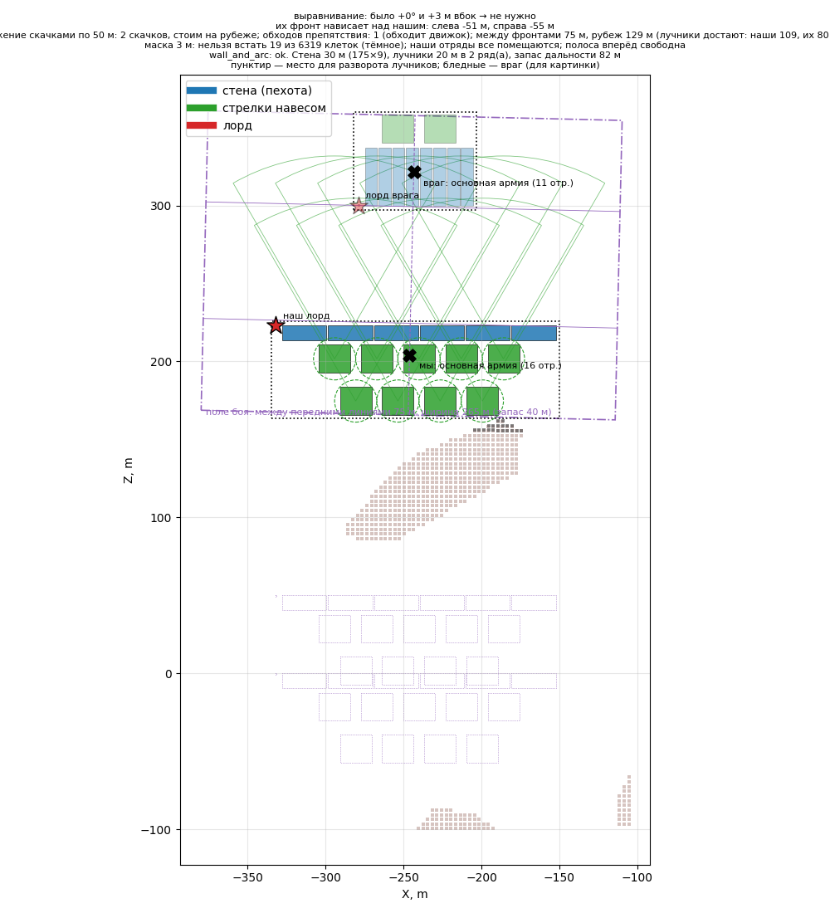

# Симуляция строя

Стратегия [«Стена и навес»](../../../docs/ru/architecture/strategies.md#wall_and_arc),
модуль [formation](../../../docs/ru/apps/formation.md), данные — [ростер](../../../docs/ru/game/units/roster.md).
Армии — `config/armies/<имя>.json`.

```bash
.venv/Scripts/python -m tools.sim.formation first_attack
```

## first_attack (27.09.2026)

Мы: лорд, 1 отряд копейщиков, 4 отряда лучников. Враг: лорд, 2 отряда
копейщиков, 2 отряда лучников (враг нарисован тем же кодом для картинки).



Выбор ИИ по правилам пользователя:

- **стена как можно толще** (как фаланга), пока каждый лучник бьёт не меньше
  чем на 80 м за неё;
- **лучники квадратами** с местом для разворота между ними: развернувшись вправо
  или влево, отряды не перекроют друг друга; немного выходить за стену можно.

Итог: **стена 30 м — 28 × 9,3 м (≈ 6 шеренг); лучники 20 м — квадраты 19 × 18 м,
2 ряда по 2, промежуток сбоку 7 м, между рядами 9 м**; крайние выходят за стену
на ≈ 9,5 м с каждой стороны; запас дальности 82 м; пересечений нет. Наш лорд — на
левом фланге стены, со стороны вражеского лорда.

История выбора: сначала (1 м стены = 5 м дальности, колонны разрешены) — стена
80 м в 3 шеренги и 4 колонны 14 × 26 м; затем «чем толще, тем лучше» — стена 60 м
в 4 шеренги и 4 колонны 10 × 36 м; колонны пользователь отверг — их нельзя развернуть.

## Проверка в игре (27.09.2026)

Прогон `formation-probe` (тот же код строя ставит армию в бою, враг поставлен по
симуляции и стоит), разбор `tools/analysis/formation_probe.py`:

```bash
.venv/Scripts/python -m tools.build formation-probe --army first_attack
```

```bash
powershell -NoProfile -ExecutionPolicy Bypass -File tools/launcher/launch.ps1 -Target formation-probe
```

```bash
.venv/Scripts/python -m tools.analysis.formation_probe build/formation-probe/runs/<время>/events.jsonl research/analysis/formation/first_attack/game
```

- **Строй встал как в симуляции:** первая шеренга каждого отряда в 0,2–2 м от
  плана, фронт и глубина совпали (стена 28,2 × 8,3 при плане 28,4 × 9,3;
  лучники 19–20 × 18–19). Направление на врага посчитано по 3 видимым вражеским
  отрядам из 5.
- **Лучники друг друга при поворотах не задевают:** между отрядами ≥ 7 м.
- **Движковый поворот (`rotate`) идёт вокруг первой шеренги**: квадрат съезжает
  на 12 м, передние лучники влезают в свою пехоту (0,7–1,0 м), 14–17 с.
- **Наш поворот на месте** (приказ встать с новым направлением вокруг середины):
  сдвиг 1,4–1,7 м, до пехоты 2–3 м, 7–8 с. После четырёх поворотов подряд сдвиг
  накопился до 3,9 м — надо считать от запомненного места отряда, а не от текущего.



### Не метаться (27.09.2026)

Обычная проверка строя теперь: расстановка → **минута стояния** без приказов.
Повороты лучников — только с `--turn-test`. Вердикт в `summary.json` → `stability`:

| Условие | Итог |
|---|---|
| Наших приказов после расстановки | 0 |
| Заданные точки отрядов изменились | нет (0 м) |
| Тиков, когда отряд двигался | 0 у всех |
| Середина бойцов сдвинулась | 0–0,27 м (порог 0,5 м) |
| **Вердикт** | **PASS** |

`unit:position()` за это время прыгал на 1–2 м без движения бойцов — поэтому
неподвижность судим по бойцам.

## Выравнивание в игре (27.09.2026)

Армия `first_attack_crooked`: наша армия поставлена криво — повёрнута и сдвинута
вбок от линии, вдоль которой смотрит враг. Этапы: расстановка → выравнивание
(видение → поле боя → выравнивание с регулятором; отряды идут приказами, не
телепортом) → минута стояния (регулятор каждые 5 с только отвечает).

```bash
.venv/Scripts/python -m tools.build formation-probe --army first_attack_crooked
```

| | До | После |
|---|---|---|
| Угол к линии врага | 22,8° | 1,1° |
| Сдвиг вбок | 66,1 м | −3,2 м (в допуске 15 м) |
| Приказов | — | 6 (по одному на отряд), шли 49 с |
| Отряды от нового плана | — | 0,7–1,1 м |
| Регулятор во время стояния | — | «выровнено» 12 раз из 12 |
| «Не метаться» | — | PASS: 0 приказов, середины бойцов сдвинулись ≤ 0,2 м |



**Находка про обзор.** Сначала пример стоял у тех же точек, что `first_attack`, и
враг ни разу не был виден: между армиями гряда на 3,5–9 м выше линии взгляда
(с кривой позиции — 7–9 м). Движок честно прячет врага за холмом, ИИ честно
ждёт (событие `alignment` → `enemy_not_seen`). Пример перенесён туда, где обзор
открыт (местность ≥ 2 м ниже линии взгляда по сетке 3 м).

## Сближение в симуляции (27.09.2026)

[approach](../../../docs/ru/apps/approach.md): одно действие за раз, выравнивание
прежде сближения, скачки по 50 м до рубежа (20 м раньше первой досягаемости
стрелков), каждый скачок — через [маску](../../../docs/ru/apps/mask.md).

```bash
.venv/Scripts/python -m tools.sim.formation first_attack_approach
```

```bash
.venv/Scripts/python -m tools.sim.formation rock_attack
```

| Пример | Решения | Итог |
|---|---|---|
| открытое поле | скачок 50, 50, 50, 21 м | стоим на рубеже: 129 м между фронтами |
| скала на пути (6 отрядов) | скачок 50 м, затем 161 м за скалу | первое место, где строй помещается целиком; обходит движок |
| длинная стена у скалы (16 отрядов) | скачок 50 м, затем 173 м за скалу | то же, пересечений нет |







**Что проверить в бою.** Выдержит ли стена 28 × 9 двух вражеских копейщиков, пока
лучники стреляют; хватает ли места для разворота; стреляет ли задний ряд лучников
через передний так же хорошо.
