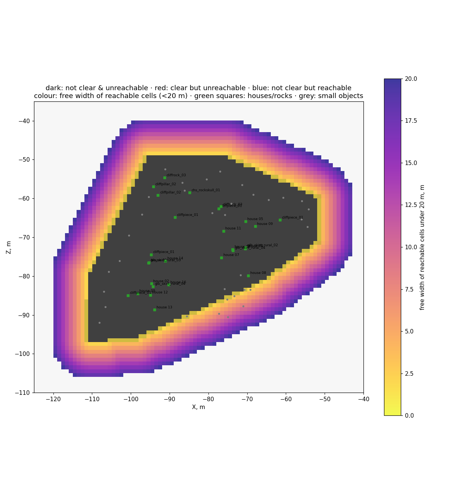
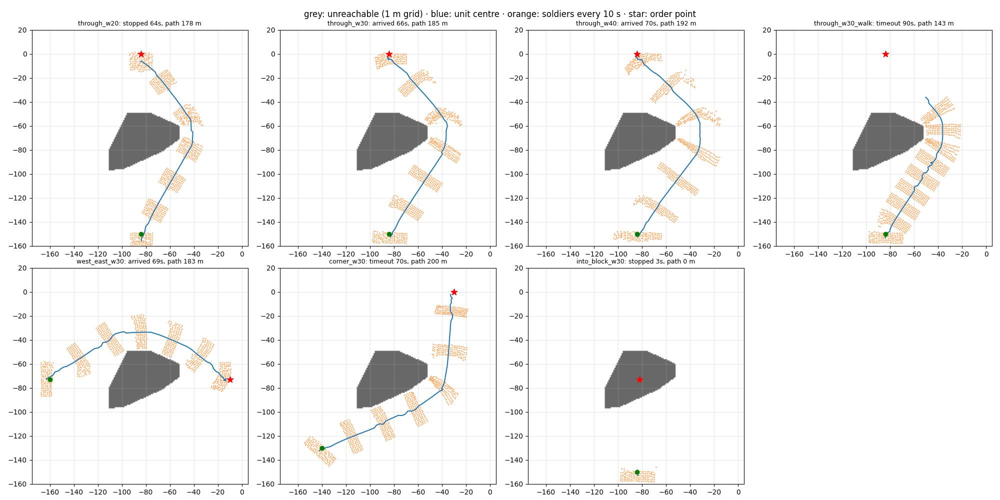
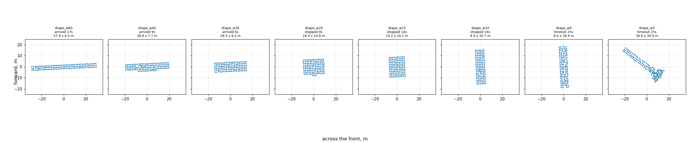

# Moorlands Route: хутор (−84; −71)

Задача: [обход препятствий](../../../docs/ru/architecture/tasks/obstacles.md), этап 2 —
данные для одного отряда пехоты. Сырые данные — локальный архив
`research/evidence/maps/moorlands-route/hamlet-1m-20260927` (сетка) и
`research/evidence/units/move-probe-20260927` (движение).

## Сетка 1 м и достижимость

Снять (игра, ≈ 6 мин вместе с загрузкой):

```bash
.venv/Scripts/python -m tools.build map-capture --step 1 --features --scenario hamlet_capture.xml --window -160 -30 -130 20
```

```bash
powershell -NoProfile -ExecutionPolicy Bypass -File tools/launcher/launch.ps1 -Target map-capture -TimeoutSeconds 400
```

Разобрать (`arrays.npz` — в локальный архив рядом с сеткой):

```bash
.venv/Scripts/python -m tools.analysis.passability research/evidence/maps/moorlands-route/hamlet-1m-20260927/tww3_bai_map_capture_grid.csv research/analysis/hamlet --objects research/evidence/maps/moorlands-route/capture-20260926/objects.json --focus -125 -40 -110 -35 --arrays research/evidence/maps/moorlands-route/hamlet-1m-20260927/arrays.npz
```

Файлы: `summary.json`, `passability.png` (всё окно), `lanes.png` (хутор крупно).

Выводы (27.09.2026):

1. **Весь хутор — одно сплошное выпуклое препятствие** ≈ 58 × 47 м
   (x −110,5…−52,5, z −96,5…−49,5): 1880 клеток по 1 м², выпуклая оболочка
   1837 м². Улочек между домами для движка нет.
2. «Свободна ли площадка» (`is_area_clear`) и «можно ли дойти»
   (`can_reach_position`) совпадают: 0 клеток «свободно, но недостижимо»,
   110 клеток «занято, но достижимо» — только кромка в 1 м от блока.
3. Высота внутри блока 522–532 м, вокруг 521–531 м: крутизна не причина.



## Движение одного отряда

Копейщики Империи, 120 бойцов. План — `config/move-plans/hamlet.json`
(8 перестроений на месте и 7 наивных приказов).

```bash
.venv/Scripts/python -m tools.build move-probe --plan hamlet
```

```bash
powershell -NoProfile -ExecutionPolicy Bypass -File tools/launcher/launch.ps1 -Target move-probe
```

```bash
.venv/Scripts/python -m tools.analysis.move_probe research/evidence/units/move-probe-20260927/events.jsonl research/analysis/hamlet/moves --grid research/evidence/maps/moorlands-route/hamlet-1m-20260927/arrays.npz
```

Файлы: `moves/summary.json`, `moves/shapes.png`, `moves/traverses.png`.
Прогон занял 32 с реального времени на x20 (593 с игры) и завершился сам.

Выводы (27.09.2026):

1. **Наивный приказ обходит хутор без застреваний** во всех 6 попытках с
   целью снаружи. Путь длиннее прямой в 1,18–1,28 раза, бойцы не ближе 2 м к блоку.
2. **Приказ в точку внутри блока молча отбрасывается**: заданная позиция не
   меняется, отряд стоит `is_idle`, ошибки нет.
3. **Точка приказа — центр первой шеренги**, `unit:position()` — середина
   бойцов. У строя 10 м в ширину середина отстаёт от точки приказа на ≈ 15 м.
4. Строй: фронт ≈ приказ − 1…2 м, площадь ≈ 2,5 м² на бойца. Сужение до 10 м
   занимает 22 с, до 8 м и 5 м — дольше 25 с.
5. Шагом 1,5 м/с, бегом 3 м/с.

Таблицы — в [карточке задачи](../../../docs/ru/architecture/tasks/obstacles.md).




