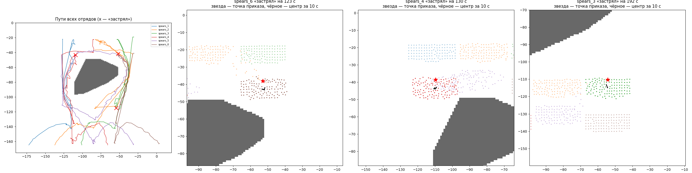

# Moorlands Route: хутор (−84; −71)

Как движок ведёт отряд пехоты мимо плотной застройки. Хутор — препятствие 5 на
[анализе препятствий карты](../moorlands-obstacles/README.md): 14 деревенских домов
двумя кварталами, между ними скальные куски и щебень, к северу прилавки, телеги и
бочки. Проверялась гипотеза, что между домами есть узкие улочки, которых сетка 3 м
не видит, и отряд застревает в них. Окно анализа: x −160…−30, z −130…20.
Сырые данные — локальный архив
`research/evidence/maps/moorlands-route/hamlet-1m-20260927` (сетка) и
`research/evidence/units/move-probe-20260927` (движение).

## Сетка 1 м и достижимость

Снять (игра, ≈ 6 мин вместе с загрузкой):

```bash
.venv/Scripts/python -m tools.build map-capture --step 1 --features --scenario hamlet_capture.xml --window -160 -30 -130 20
```

```bash
powershell -NoProfile -ExecutionPolicy Bypass -File tools/launcher/launch.ps1 -Target map-capture -TimeoutSeconds 400
```

Разобрать (`arrays.npz` — в локальный архив рядом с сеткой):

```bash
.venv/Scripts/python -m tools.analysis.passability research/evidence/maps/moorlands-route/hamlet-1m-20260927/tww3_bai_map_capture_grid.csv research/analysis/hamlet --objects research/evidence/maps/moorlands-route/capture-20260926/objects.json --focus -125 -40 -110 -35 --arrays research/evidence/maps/moorlands-route/hamlet-1m-20260927/arrays.npz
```

Файлы: `summary.json`, `passability.png` (всё окно), `lanes.png` (хутор крупно).

Выводы (27.09.2026):

1. **Весь хутор — одно сплошное выпуклое препятствие** ≈ 58 × 47 м
   (x −110,5…−52,5, z −96,5…−49,5): 1880 клеток по 1 м², выпуклая оболочка
   1837 м². Улочек между домами для движка нет.
2. «Свободна ли площадка» (`is_area_clear`) и «можно ли дойти»
   (`can_reach_position`) совпадают: 0 клеток «свободно, но недостижимо»,
   110 клеток «занято, но достижимо» — только кромка в 1 м от блока.
3. Высота внутри блока 522–532 м, вокруг 521–531 м: крутизна не причина.


## Движение одного отряда

Копейщики Империи, 120 бойцов. План — `config/move-plans/hamlet.json`
(8 перестроений на месте и 7 наивных приказов).

```bash
.venv/Scripts/python -m tools.build move-probe --plan hamlet
```

```bash
powershell -NoProfile -ExecutionPolicy Bypass -File tools/launcher/launch.ps1 -Target move-probe
```

```bash
.venv/Scripts/python -m tools.analysis.move_probe research/evidence/units/move-probe-20260927/events.jsonl research/analysis/hamlet/moves --grid research/evidence/maps/moorlands-route/hamlet-1m-20260927/arrays.npz
```

Файлы: `moves/summary.json`, `moves/shapes.png`, `moves/traverses.png`.
Прогон занял 32 с реального времени на x20 (593 с игры) и завершился сам.

Выводы (27.09.2026):

1. **Наивный приказ обходит хутор без застреваний** во всех 6 попытках с
   целью снаружи. Путь длиннее прямой в 1,18–1,28 раза, бойцы не ближе 2 м к блоку.
2. **Приказ в точку внутри блока молча отбрасывается**: заданная позиция не
   меняется, отряд стоит `is_idle`, ошибки нет.
3. **Точка приказа — центр первой шеренги**, `unit:position()` — середина
   бойцов. У строя 10 м в ширину середина отстаёт от точки приказа на ≈ 15 м.
4. Строй: фронт ≈ приказ − 1…2 м, площадь ≈ 2,5 м² на бойца. Сужение до 10 м
   занимает 22 с, до 8 м и 5 м — дольше 25 с.
5. Шагом 1,5 м/с, бегом 3 м/с (`slow_speed` / `fast_speed`, подтверждено треком).
6. `ManList.At(i).Position` своего отряда совпадает с `unit:position()` (середина
   бойцов в пределах 1 м) даже на x20.

Строй копейщиков (120 бойцов) по ширине:

| Приказанная ширина, м | Факт: фронт × глубина, м | Перестроение из 30 м, с |
|---|---|---|
| 60 | 57,9 × 6,0 | 15 |
| 40 | 38,6 × 7,7 | 7 |
| 30 | 28,5 × 9,3 | 4 |
| 20 | 18,9 × 14,8 | 7 |
| 15 | 14,2 × 18,2 | 12 |
| 10 | 8,9 × 30,7 | 22 |
| 8 | 8,0 × 36,9 | > 25 (ещё шло) |
| 5 | не успел за 25 с (ушёл вбок, повернулся на 52°) | > 25 |

Площадь строя ≈ 270–330 м². Полный ростер отрядов по ширине —
[ростер](../../../docs/ru/game/units/roster.md).

Наивный приказ (бегом, кроме одного):

| Попытка | Итог | Время, с | Путь / по прямой, м | Ближе всего боец к блоку, м |
|---|---|---|---|---|
| юг→север, 20 м | дошёл (фронт в 1,8 м) | 64 | 178 / 150 | 2,0 |
| юг→север, 30 м | дошёл | 66 | 185 / 150 | 2,2 |
| юг→север, 40 м | дошёл | 70 | 192 / 150 | 2,0 |
| юг→север, 30 м шагом | не успел за 90 с (нужно ≈ 125) | — | 143 за 90 с | 2,0 |
| запад→восток, 30 м | дошёл | 69 | 183 / 150 | 2,0 |
| по диагонали через угол, 30 м | дошёл (фронт в 1,4 м, встал на 70-й с) | 70 | 200 / 170 | 2,0 |
| **цель внутри хутора** | **приказ молча отброшен**: заданная позиция не изменилась, отряд стоит | — | 0 | — |

Застреванием считается «меньше 2 м за 10 с»; таких нет. Движок сам ведёт центр в
обход выпуклого блока, держит бойцов в 2 м от него, строй по дороге
поворачивается, но не рвётся. Если точка приказа попадает внутрь блока, отряд не
двигается и ошибки нет: перед приказом нужна проверка `can_reach_position`, после —
что `ordered_position` сменился ([команды](../../../docs/ru/game/units/commands.md#точка-приказа-и-недостижимые-точки)).

Пробелы: одна попытка на случай; один тип отряда; нет соседних отрядов и врага;
шагом пройдено не до конца; минимальная ширина строя не найдена (5 м не сложилась
за 25 с).


## Ручной бой: 6 отрядов копейщиков

Пользователь вёл шесть отрядов копейщиков у хутора сам (`python -m tools.build manual`,
точка входа `entries.manual_record`, скрипт только записывает): на север, обратно на
юг и снова на север другим способом.

| Прогон | Как | Время | Бойцов вплотную (< 1,5 м) к чужому отряду | «Застрял» |
|---|---|---|---|---|
| 1 | все 6 одним приказом сразу, по 3 с каждой стороны хутора | ≈ 70 с | в среднем 133, до 275; 60 с из 70 | 2 |
| 2 | по одному–двум, сначала на бок хутора, потом на север | ≈ 140 с* | 0 | 0 |

- Стороны обхода в обоих прогонах одни и те же; к стене хутора подходили ≤ 2 бойцов.
- Оба «застревания» — у своей точки, в 4–5 м от неё: строй не может собраться,
  потому что через его место проходит или на нём стоит соседний отряд
  (`spears_4`: 49 бойцов вплотную к `spears_5`).
- **Затор создаёт толпа своих отрядов, а не сам хутор.** Хутор только сужает
  дорогу. Разведение по времени и промежуточные точки убирают затор.
- \* Время второго прогона нельзя сравнивать с первым: в него входят паузы игрока,
  который отдавал приказы по одному, не стараясь двигаться быстро.


