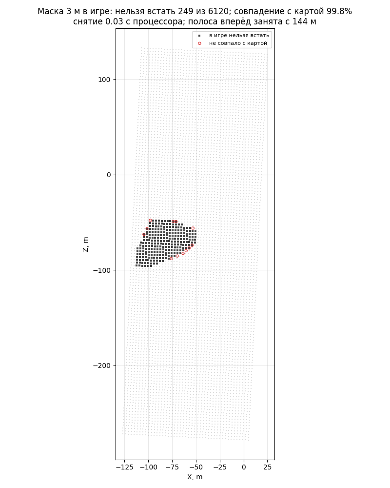

# Маска «можно ли тут встать» в игре

Модуль [mask](../../../docs/ru/apps/mask.md) в бою: прогон `formation-probe` с
армией `hamlet_attack` (хутор внутри поля боя, западнее оси). После выравнивания
ИИ снимает маску поля боя из движка пачками по 500 клеток (`is_area_clear` +
`can_reach_position` нашего отряда копейщиков) — событие `mask`. Разбор
сравнивает каждую клетку со снятой картой `data/maps/moorlands-route/grid-3m.npz`.

```bash
.venv/Scripts/python -m tools.build formation-probe --army hamlet_attack
```

```bash
powershell -NoProfile -ExecutionPolicy Bypass -File tools/launcher/launch.ps1 -Target formation-probe
```

```bash
.venv/Scripts/python -m tools.analysis.mask_game build/formation-probe/runs/<время> --map moorlands-route --out research/analysis/mask
```



## Результаты (27.09.2026)

| | Симуляция (снятая карта) | Игра |
|---|---|---|
| Клеток | 6120 | 6120 |
| Нельзя встать | 241 | 249 |
| Совпадение с картой | — | 99,8% (12 клеток, все по краю хутора) |
| Наши отряды помещаются | все | все |
| Полоса вперёд (ширина нашего фронта с лордом) | занята со 149 м | занята со 144 м |
| Время снятия | — | 0,03 с процессора на всю маску |

Выравнивание в этом прогоне тоже сработало (армия встала прямо на врага и чуть
довернулась), «не метаться» — PASS.
